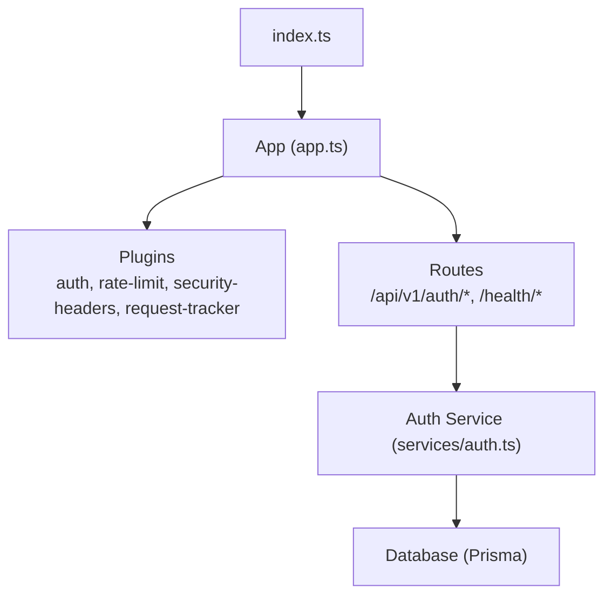
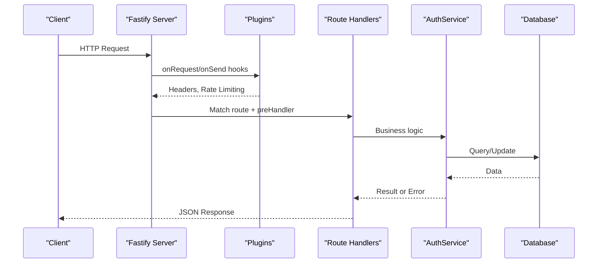
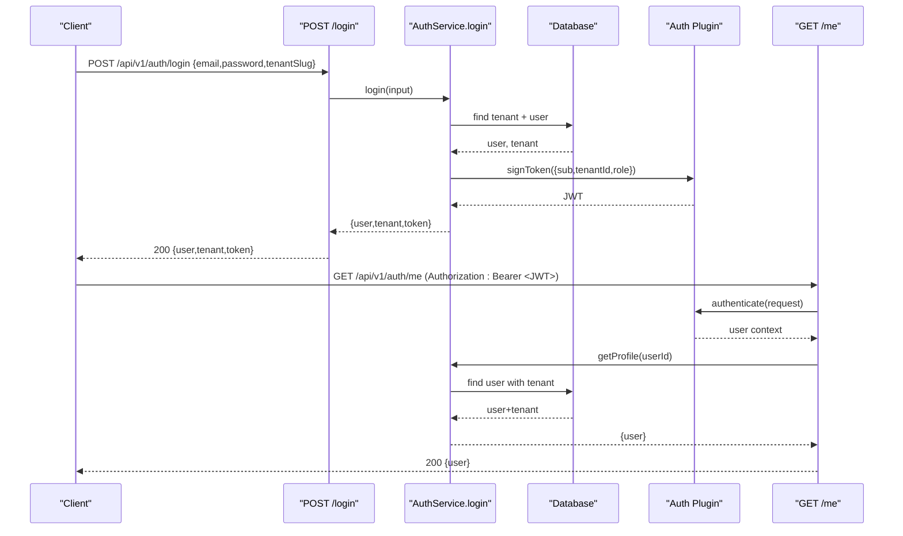
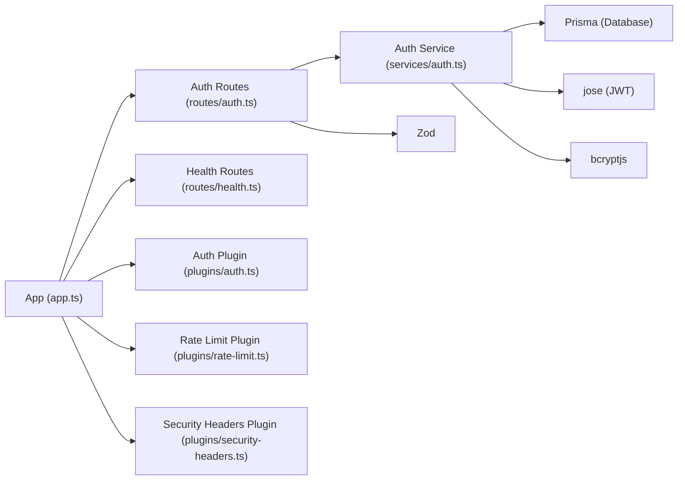

# API Reference

<cite>
**Referenced Files in This Document**
- [app.ts](file://apps/api/src/app.ts)
- [index.ts](file://apps/api/src/index.ts)
- [auth.ts](file://apps/api/src/routes/auth.ts)
- [health.ts](file://apps/api/src/routes/health.ts)
- [auth.ts](file://apps/api/src/plugins/auth.ts)
- [rate-limit.ts](file://apps/api/src/plugins/rate-limit.ts)
- [security-headers.ts](file://apps/api/src/plugins/security-headers.ts)
- [auth.ts](file://apps/api/src/services/auth.ts)
- [auth.test.ts](file://apps/api/test/integration/auth.test.ts)
- [health.test.ts](file://apps/api/test/integration/health.test.ts)
</cite>

## Table of Contents
1. [Introduction](#introduction)
2. [Project Structure](#project-structure)
3. [Core Components](#core-components)
4. [Architecture Overview](#architecture-overview)
5. [Detailed Component Analysis](#detailed-component-analysis)
6. [Dependency Analysis](#dependency-analysis)
7. [Performance Considerations](#performance-considerations)
8. [Troubleshooting Guide](#troubleshooting-guide)
9. [Conclusion](#conclusion)
10. [Appendices](#appendices)

## Introduction
This document provides comprehensive API documentation for Exosquad’s REST endpoints, focusing on authentication and health monitoring. It covers:
- Authentication endpoints: signup, login, and profile retrieval
- Health check endpoints: liveness and readiness probes
- Security headers and rate limiting behavior
- Request/response schemas, status codes, and error handling patterns
- Authentication flow examples and multi-tenant request patterns
- Client integration guidelines

The API is implemented with Fastify, uses Zod for input validation, JWT for authentication, and Prisma for data access.

## Project Structure
The API application registers plugins for authentication, rate limiting, security headers, and request tracking. Routes are grouped under versioned prefixes. The entry point initializes the server, handles graceful shutdown, and exposes the Fastify instance for testing.

**Diagram sources**
- [index.ts:4-16](file://apps/api/src/index.ts#L4-L16)
- [app.ts:12-37](file://apps/api/src/app.ts#L12-L37)
- [auth.ts](file://apps/api/src/services/auth.ts)

**Section sources**
- [index.ts:1-23](file://apps/api/src/index.ts#L1-L23)
- [app.ts:1-96](file://apps/api/src/app.ts#L1-L96)

## Core Components
- Authentication plugin: validates Bearer tokens, decodes JWTs, and attaches user context to requests.
- Rate limiter: per-IP in-memory sliding window with standard rate limit response headers.
- Security headers: sets common security headers on every response; enables HSTS in production.
- Auth routes: signup, login, and profile endpoints with Zod validation and service-layer logic.
- Health routes: liveness (/) and readiness (/ready) endpoints with dependency checks.
- Auth service: tenant/user creation, password hashing, token signing, and profile retrieval.

**Section sources**
- [auth.ts](file://apps/api/src/plugins/auth.ts)
- [rate-limit.ts](file://apps/api/src/plugins/rate-limit.ts)
- [security-headers.ts](file://apps/api/src/plugins/security-headers.ts)
- [auth.ts](file://apps/api/src/routes/auth.ts)
- [health.ts](file://apps/api/src/routes/health.ts)
- [auth.ts](file://apps/api/src/services/auth.ts)

## Architecture Overview
The API follows a layered architecture:
- Entry point bootstraps the server and registers plugins and routes.
- Plugins provide cross-cutting concerns: auth, rate limiting, security headers, and request tracking.
- Route handlers validate inputs, delegate to services, and return standardized responses.
- Services encapsulate business logic and interact with the database via Prisma.

**Diagram sources**
- [app.ts:27-37](file://apps/api/src/app.ts#L27-L37)
- [auth.ts](file://apps/api/src/plugins/auth.ts)
- [rate-limit.ts](file://apps/api/src/plugins/rate-limit.ts)
- [security-headers.ts](file://apps/api/src/plugins/security-headers.ts)
- [auth.ts](file://apps/api/src/routes/auth.ts)
- [auth.ts](file://apps/api/src/services/auth.ts)

## Detailed Component Analysis

### Authentication Endpoints

#### POST /api/v1/auth/signup
Registers a new tenant and an owner user, then returns a JWT.

- Method: POST
- Path: /api/v1/auth/signup
- Authentication: None
- Request body schema:
  - email: string, valid email format
  - password: string, length between 8 and 128
  - name: string, optional, length between 1 and 255
  - tenantName: string, length between 1 and 255
  - tenantSlug: string, lowercase alphanumeric with hyphens, length between 2 and 63, must start and end with alphanumeric
- Success response: 201 Created
  - user: object with id, email, name (nullable), role
  - tenant: object with id, name, slug
  - token: string (JWT)
- Error responses:
  - 400 Validation error: code VALIDATION_ERROR, message, details array
  - 409 Conflict: code CONFLICT, message indicating tenant slug already exists
  - 500 Internal error: code INTERNAL_ERROR

Example request:
- POST /api/v1/auth/signup
- Body: { "email": "user@example.com", "password": "securepass123", "name": "Alice", "tenantName": "Acme Corp", "tenantSlug": "acme-corp" }

Example success response:
- Status: 201
- Body: { "user": { "id": "...", "email": "user@example.com", "name": "Alice", "role": "owner" }, "tenant": { "id": "...", "name": "Acme Corp", "slug": "acme-corp" }, "token": "eyJ..." }

Error example:
- Status: 409
- Body: { "error": { "code": "CONFLICT", "message": "Tenant slug already exists" } }

Notes:
- Passwords are hashed before storage.
- Tenant and user are created atomically.
- JWT includes sub (userId), tenantId, and role.

**Section sources**
- [auth.ts](file://apps/api/src/routes/auth.ts)
- [auth.ts](file://apps/api/src/services/auth.ts)
- [auth.ts](file://apps/api/src/plugins/auth.ts)

#### POST /api/v1/auth/login
Authenticates a user within a tenant and returns a JWT.

- Method: POST
- Path: /api/v1/auth/login
- Authentication: None
- Request body schema:
  - email: string, valid email format
  - password: string, minimum length 1
  - tenantSlug: string, minimum length 1
- Success response: 200 OK
  - user: object with id, email, name (nullable), role
  - tenant: object with id, name, slug
  - token: string (JWT)
- Error responses:
  - 400 Validation error: code VALIDATION_ERROR, message, details array
  - 401 Unauthorized: code UNAUTHORIZED, message indicating invalid credentials or disabled account
  - 500 Internal error: code INTERNAL_ERROR

Example request:
- POST /api/v1/auth/login
- Body: { "email": "user@example.com", "password": "securepass123", "tenantSlug": "acme-corp" }

Example success response:
- Status: 200
- Body: { "user": { "id": "...", "email": "user@example.com", "name": "Alice", "role": "member" }, "tenant": { "id": "...", "name": "Acme Corp", "slug": "acme-corp" }, "token": "eyJ..." }

Error example:
- Status: 401
- Body: { "error": { "code": "UNAUTHORIZED", "message": "Invalid email or password" } }

Notes:
- Account status is checked; disabled accounts receive unauthorized errors.
- Last login timestamp is updated asynchronously.

**Section sources**
- [auth.ts](file://apps/api/src/routes/auth.ts)
- [auth.ts](file://apps/api/src/services/auth.ts)

#### GET /api/v1/auth/me
Retrieves the authenticated user’s profile including tenant information.

- Method: GET
- Path: /api/v1/auth/me
- Authentication: Required (Bearer token)
- Authorization header: Authorization: Bearer <JWT>
- Success response: 200 OK
  - user: object with id, email, name (nullable), role, tenant (object with id, name, slug)
- Error responses:
  - 401 Unauthorized: missing or invalid authorization header, or invalid/expired token
  - 404 Not Found: user not found
  - 500 Internal error: code INTERNAL_ERROR

Example request:
- GET /api/v1/auth/me
- Header: Authorization: Bearer eyJ...

Example success response:
- Status: 200
- Body: { "user": { "id": "...", "email": "user@example.com", "name": "Alice", "role": "owner", "tenant": { "id": "...", "name": "Acme Corp", "slug": "acme-corp" } } }

Error example:
- Status: 401
- Body: { "error": { "code": "UNAUTHORIZED", "message": "Missing or invalid authorization header" } }

Authentication flow example:
1. Client calls POST /api/v1/auth/login with email, password, and tenantSlug.
2. Server validates input, verifies credentials, and signs a JWT containing userId, tenantId, and role.
3. Client stores the token and includes it in subsequent requests via Authorization: Bearer <JWT>.
4. Server’s auth plugin verifies the token and attaches user context to the request.
5. Protected routes like GET /api/v1/auth/me use the user context to fetch profile data.

**Diagram sources**
- [auth.ts](file://apps/api/src/routes/auth.ts)
- [auth.ts](file://apps/api/src/services/auth.ts)
- [auth.ts](file://apps/api/src/plugins/auth.ts)

**Section sources**
- [auth.ts](file://apps/api/src/routes/auth.ts)
- [auth.ts](file://apps/api/src/services/auth.ts)
- [auth.ts](file://apps/api/src/plugins/auth.ts)

### Health Check Endpoints

#### GET /health
Basic liveness probe that always returns 200 if the process is running.

- Method: GET
- Path: /health
- Authentication: None
- Success response: 200 OK
  - status: "ok"
  - service: "exosquad-api"
  - timestamp: ISO 8601 string

Example request:
- GET /health

Example success response:
- Status: 200
- Body: { "status": "ok", "service": "exosquad-api", "timestamp": "2024-01-01T00:00:00.000Z" }

**Section sources**
- [health.ts](file://apps/api/src/routes/health.ts)

#### GET /health/ready
Readiness probe that checks dependency connectivity (e.g., database).

- Method: GET
- Path: /health/ready
- Authentication: None
- Success response: 200 OK when all dependencies are healthy
  - status: "ok"
  - service: "exosquad-api"
  - timestamp: ISO 8601 string
  - checks: object with dependency statuses and optional latencyMs
- Degraded response: 503 Service Unavailable when any dependency fails
  - status: "degraded"
  - service: "exosquad-api"
  - timestamp: ISO 8601 string
  - checks: object with dependency statuses

Example request:
- GET /health/ready

Example degraded response:
- Status: 503
- Body: { "status": "degraded", "service": "exosquad-api", "timestamp": "2024-01-01T00:00:00.000Z", "checks": { "database": { "status": "error" } } }

**Section sources**
- [health.ts](file://apps/api/src/routes/health.ts)

### Security Headers
Every response includes standard security headers:
- X-Content-Type-Options: nosniff
- X-Frame-Options: DENY
- X-XSS-Protection: 0
- Referrer-Policy: strict-origin-when-cross-origin
- Permissions-Policy: camera=(), microphone=(), geolocation()
- Strict-Transport-Security: enabled in production (max-age=31536000; includeSubDomains)

These headers are set via the security headers plugin on every response.

**Section sources**
- [security-headers.ts](file://apps/api/src/plugins/security-headers.ts)

### Rate Limiting
Rate limiting is applied globally using an in-memory store keyed by client IP.

- Window: 60 seconds
- Max requests per window: 100
- Headers included on every response:
  - X-RateLimit-Limit: maximum requests allowed
  - X-RateLimit-Remaining: remaining requests in current window
  - X-RateLimit-Reset: Unix timestamp when the window resets
- When exceeded:
  - Status: 429 Too Many Requests
  - Retry-After: seconds until reset
  - Body: { "error": { "code": "RATE_LIMITED", "message": "Too many requests" } }

Note: In production, replace with Redis-backed rate limiting for distributed environments.

**Section sources**
- [rate-limit.ts](file://apps/api/src/plugins/rate-limit.ts)

### Multi-Tenant Request Patterns
- Signup and login require tenantSlug to scope operations to a specific tenant.
- JWT payload includes tenantId to enforce tenant isolation at the application layer.
- Profile retrieval returns tenant information alongside user data.

Guidelines:
- Always include tenantSlug in signup and login requests.
- Use the returned tenantId from the JWT to scope downstream requests where applicable.
- Avoid sharing tokens across tenants; each tenant should have its own users and tokens.

**Section sources**
- [auth.ts](file://apps/api/src/routes/auth.ts)
- [auth.ts](file://apps/api/src/services/auth.ts)
- [auth.ts](file://apps/api/src/plugins/auth.ts)

### Client Integration Guidelines
- Base URL: configure your client to target the API host and port.
- Authentication:
  - Obtain a JWT via POST /api/v1/auth/login.
  - Include Authorization: Bearer <JWT> on protected endpoints.
- Input validation:
  - Follow the schemas documented above; invalid payloads will result in 400 errors with detailed messages.
- Error handling:
  - Handle 400 (validation), 401 (unauthorized), 404 (not found), 409 (conflict), 429 (rate limited), and 500 (internal) responses.
  - Inspect error.code and error.message for user-friendly messaging.
- Rate limiting:
  - Respect X-RateLimit-Remaining and Retry-After headers; back off when receiving 429.
- Health checks:
  - Use GET /health for liveness and GET /health/ready for readiness in orchestration systems.

**Section sources**
- [auth.ts](file://apps/api/src/routes/auth.ts)
- [rate-limit.ts](file://apps/api/src/plugins/rate-limit.ts)
- [security-headers.ts](file://apps/api/src/plugins/security-headers.ts)
- [health.ts](file://apps/api/src/routes/health.ts)

## Dependency Analysis
The API depends on several internal modules and external libraries:
- Fastify for routing and middleware
- Zod for schema validation
- jose for JWT verification and signing
- bcryptjs for password hashing
- Prisma for database access
- Custom packages: @exosquad/config, @exosquad/logger, @exosquad/common

**Diagram sources**
- [app.ts:27-37](file://apps/api/src/app.ts#L27-L37)
- [auth.ts](file://apps/api/src/routes/auth.ts)
- [auth.ts](file://apps/api/src/services/auth.ts)
- [auth.ts](file://apps/api/src/plugins/auth.ts)
- [rate-limit.ts](file://apps/api/src/plugins/rate-limit.ts)
- [security-headers.ts](file://apps/api/src/plugins/security-headers.ts)

**Section sources**
- [app.ts:1-96](file://apps/api/src/app.ts#L1-L96)
- [auth.ts](file://apps/api/src/routes/auth.ts)
- [auth.ts](file://apps/api/src/services/auth.ts)
- [auth.ts](file://apps/api/src/plugins/auth.ts)
- [rate-limit.ts](file://apps/api/src/plugins/rate-limit.ts)
- [security-headers.ts](file://apps/api/src/plugins/security-headers.ts)

## Performance Considerations
- Database queries:
  - Use indexed fields (e.g., tenant slug, user email) to optimize lookups.
  - Avoid N+1 queries by leveraging Prisma’s include relations.
- Token operations:
  - JWT signing/verification is CPU-bound; ensure adequate CPU resources.
- Rate limiting:
  - In-memory store is suitable for single-instance deployments; migrate to Redis for horizontal scaling.
- Logging:
  - Keep logs concise and structured; avoid logging sensitive data like passwords or tokens.

[No sources needed since this section provides general guidance]

## Troubleshooting Guide
Common issues and resolutions:
- Validation errors (400):
  - Ensure request bodies conform to the documented schemas.
  - Inspect error.details for field-level validation failures.
- Unauthorized (401):
  - Verify Authorization header format: "Bearer <JWT>".
  - Confirm token has not expired and belongs to the correct tenant.
- Conflict (409):
  - Choose a unique tenantSlug during signup.
- Not Found (404):
  - Ensure the user ID exists and belongs to the authenticated tenant.
- Rate Limited (429):
  - Implement exponential backoff and respect Retry-After.
- Internal Error (500):
  - Check server logs for stack traces; do not expose internals to clients.

**Section sources**
- [app.ts:39-71](file://apps/api/src/app.ts#L39-L71)
- [auth.ts](file://apps/api/src/plugins/auth.ts)
- [rate-limit.ts](file://apps/api/src/plugins/rate-limit.ts)

## Conclusion
Exosquad’s API provides secure, multi-tenant authentication and robust health monitoring. Clients should follow the documented schemas, handle errors gracefully, and respect rate limits and security headers. For production deployments, consider replacing in-memory components with scalable alternatives and tuning performance based on workload characteristics.

[No sources needed since this section summarizes without analyzing specific files]

## Appendices

### Error Codes Summary
- VALIDATION_ERROR: 400 Bad Request
- UNAUTHORIZED: 401 Unauthorized
- NOT_FOUND: 404 Not Found
- CONFLICT: 409 Conflict
- RATE_LIMITED: 429 Too Many Requests
- INTERNAL_ERROR: 500 Internal Server Error

**Section sources**
- [app.ts:39-71](file://apps/api/src/app.ts#L39-L71)
- [rate-limit.ts:50-58](file://apps/api/src/plugins/rate-limit.ts#L50-L58)

### Test Coverage Notes
- Integration tests verify:
  - Input validation for signup and login
  - Authentication requirement for profile endpoint
  - Liveness and readiness endpoints’ response shapes

**Section sources**
- [auth.test.ts:20-47](file://apps/api/test/integration/auth.test.ts#L20-L47)
- [health.test.ts:18-43](file://apps/api/test/integration/health.test.ts#L18-L43)