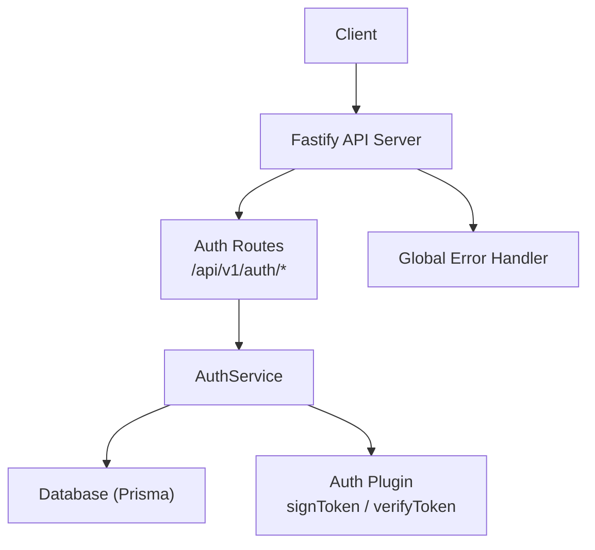
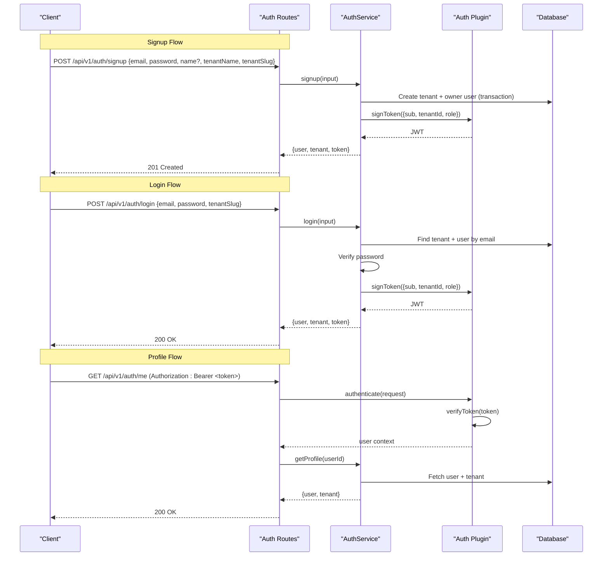
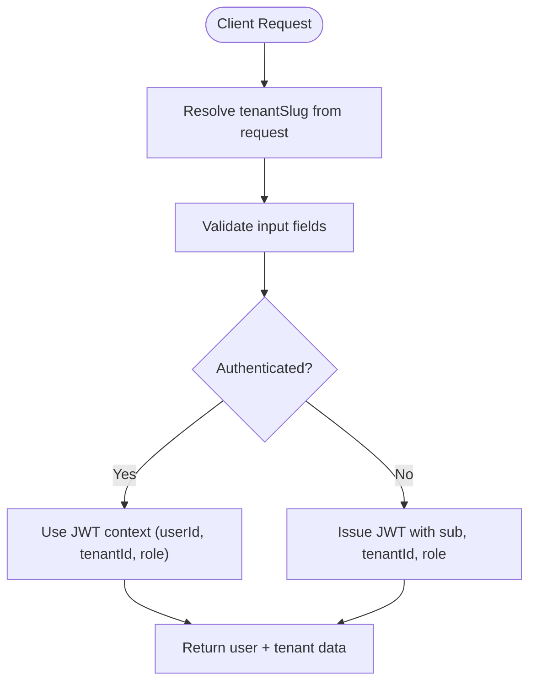
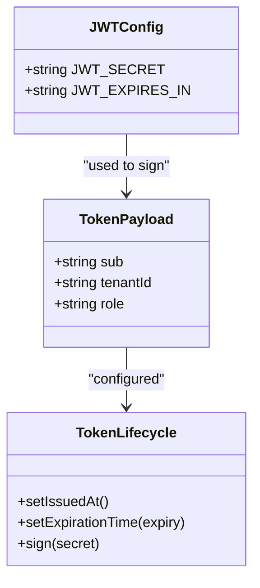
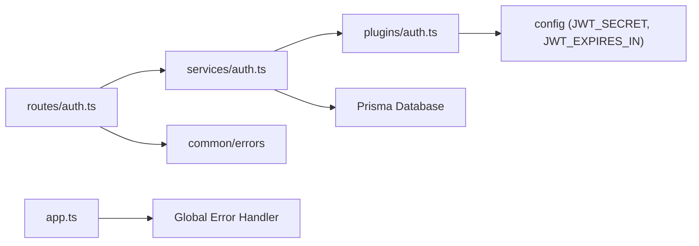

# Authentication Endpoints

<cite>
**Referenced Files in This Document**
- [auth.ts](file://apps/api/src/routes/auth.ts)
- [auth.ts](file://apps/api/src/services/auth.ts)
- [auth.ts](file://apps/api/src/plugins/auth.ts)
- [app.ts](file://apps/api/src/app.ts)
- [index.ts](file://packages/config/src/index.ts)
- [index.ts](file://packages/common/src/index.ts)
- [auth.test.ts](file://apps/api/test/integration/auth.test.ts)
</cite>

## Table of Contents
1. [Introduction](#introduction)
2. [Project Structure](#project-structure)
3. [Core Components](#core-components)
4. [Architecture Overview](#architecture-overview)
5. [Detailed Component Analysis](#detailed-component-analysis)
6. [Dependency Analysis](#dependency-analysis)
7. [Performance Considerations](#performance-considerations)
8. [Troubleshooting Guide](#troubleshooting-guide)
9. [Conclusion](#conclusion)

## Introduction
This document provides detailed API documentation for the authentication endpoints, including multi-tenant signup and login flows, profile retrieval, request validation rules, error responses, and JWT usage patterns. The authentication system is built on Fastify with Zod-based input validation, bcrypt password hashing, and HS256-signed JSON Web Tokens (JWT).

## Project Structure
The authentication feature spans routes, services, plugins, configuration, and shared error types:
- Routes define HTTP endpoints and validate requests using Zod schemas.
- Services implement business logic for user/tenant registration, authentication, and profile retrieval.
- The auth plugin handles JWT signing, verification, and route protection via a preHandler.
- Configuration defines JWT secret and expiration settings.
- Shared errors provide consistent error shapes and status codes.

**Diagram sources**
- [auth.ts:1-68](file://apps/api/src/routes/auth.ts#L1-L68)
- [auth.ts:1-190](file://apps/api/src/services/auth.ts#L1-L190)
- [auth.ts:1-101](file://apps/api/src/plugins/auth.ts#L1-L101)
- [app.ts:1-96](file://apps/api/src/app.ts#L1-L96)

**Section sources**
- [auth.ts:1-68](file://apps/api/src/routes/auth.ts#L1-L68)
- [auth.ts:1-190](file://apps/api/src/services/auth.ts#L1-L190)
- [auth.ts:1-101](file://apps/api/src/plugins/auth.ts#L1-L101)
- [app.ts:1-96](file://apps/api/src/app.ts#L1-L96)

## Core Components
- Signup endpoint: POST /api/v1/auth/signup
  - Validates email, password, name (optional), tenantName, and tenantSlug.
  - Creates a new tenant and an owner user atomically.
  - Returns 201 Created with user, tenant, and JWT token.
- Login endpoint: POST /api/v1/auth/login
  - Validates email, password, and tenantSlug.
  - Authenticates user within the specified tenant.
  - Returns 200 OK with user, tenant, and JWT token.
- Profile endpoint: GET /api/v1/auth/me
  - Requires a valid Bearer JWT.
  - Returns authenticated user information including tenant context.

Request/response examples and status codes are provided in the Detailed Component Analysis section.

**Section sources**
- [auth.ts:23-67](file://apps/api/src/routes/auth.ts#L23-L67)
- [auth.ts:26-188](file://apps/api/src/services/auth.ts#L26-L188)

## Architecture Overview
Authentication flow overview:
- Clients call signup or login to obtain a JWT.
- Subsequent protected requests include Authorization: Bearer <token>.
- The auth plugin verifies the token and attaches user context to the request.
- Protected routes use this context to fetch user-specific data.

**Diagram sources**
- [auth.ts:23-67](file://apps/api/src/routes/auth.ts#L23-L67)
- [auth.ts:26-188](file://apps/api/src/services/auth.ts#L26-L188)
- [auth.ts:20-90](file://apps/api/src/plugins/auth.ts#L20-L90)

## Detailed Component Analysis

### Endpoint: POST /api/v1/auth/signup
Purpose: Register a new tenant and its owner user, then issue a JWT.

Request schema validation (Zod):
- email: string, must be a valid email format.
- password: string, length between 8 and 128 characters.
- name: optional string, length between 1 and 255 characters.
- tenantName: string, length between 1 and 255 characters.
- tenantSlug: string, length between 2 and 63 characters, lowercase alphanumeric with hyphens allowed; must start and end with alphanumeric characters.

Business logic:
- Checks if tenant slug already exists; throws conflict if taken.
- Hashes password using bcrypt with configured rounds.
- Creates tenant and owner user atomically in a single transaction.
- Signs a JWT containing user ID (sub), tenant ID, and role.

Response (201 Created):
- user: object with id, email, name (nullable), role ("owner").
- tenant: object with id, name, slug.
- token: JWT string.

Error responses:
- 409 Conflict: Tenant slug already exists.
- 400 Validation Error: Invalid request body fields.
- 500 Internal Error: Unexpected server-side failure.

Example request:
{
  "email": "admin@example.com",
  "password": "SecurePass123!",
  "name": "Admin User",
  "tenantName": "Acme Corp",
  "tenantSlug": "acme-corp"
}

Example response (201):
{
  "user": {
    "id": "<uuid>",
    "email": "admin@example.com",
    "name": "Admin User",
    "role": "owner"
  },
  "tenant": {
    "id": "<uuid>",
    "name": "Acme Corp",
    "slug": "acme-corp"
  },
  "token": "<jwt>"
}

**Section sources**
- [auth.ts:5-39](file://apps/api/src/routes/auth.ts#L5-L39)
- [auth.ts:26-87](file://apps/api/src/services/auth.ts#L26-L87)

### Endpoint: POST /api/v1/auth/login
Purpose: Authenticate a user within a specific tenant and issue a JWT.

Request schema validation (Zod):
- email: string, must be a valid email format.
- password: string, minimum length 1.
- tenantSlug: string, minimum length 1.

Business logic:
- Finds tenant by slug and associated user by normalized email.
- Ensures account status is active.
- Compares provided password against stored hash.
- Updates last login timestamp (non-blocking).
- Signs a JWT containing user ID (sub), tenant ID, and role.

Response (200 OK):
- user: object with id, email, name (nullable), role.
- tenant: object with id, name, slug.
- token: JWT string.

Error responses:
- 401 Unauthorized: Invalid credentials, disabled account, or missing tenant/user.
- 400 Validation Error: Invalid request body fields.
- 500 Internal Error: Unexpected server-side failure.

Example request:
{
  "email": "admin@example.com",
  "password": "SecurePass123!",
  "tenantSlug": "acme-corp"
}

Example response (200):
{
  "user": {
    "id": "<uuid>",
    "email": "admin@example.com",
    "name": "Admin User",
    "role": "owner"
  },
  "tenant": {
    "id": "<uuid>",
    "name": "Acme Corp",
    "slug": "acme-corp"
  },
  "token": "<jwt>"
}

**Section sources**
- [auth.ts:41-52](file://apps/api/src/routes/auth.ts#L41-L52)
- [auth.ts:89-156](file://apps/api/src/services/auth.ts#L89-L156)

### Endpoint: GET /api/v1/auth/me
Purpose: Retrieve authenticated user information, including tenant context.

Authentication:
- Requires Authorization header with Bearer token.
- Token is verified and decoded; invalid/expired tokens result in 401 Unauthorized.

Response (200 OK):
- user: object with id, email, name (nullable), role, and nested tenant object (id, name, slug).

Error responses:
- 401 Unauthorized: Missing or invalid authorization header, or invalid/expired token.
- 404 Not Found: User not found.
- 500 Internal Error: Unexpected server-side failure.

Example request:
Headers:
Authorization: Bearer <jwt>

Example response (200):
{
  "user": {
    "id": "<uuid>",
    "email": "admin@example.com",
    "name": "Admin User",
    "role": "owner",
    "tenant": {
      "id": "<uuid>",
      "name": "Acme Corp",
      "slug": "acme-corp"
    }
  }
}

**Section sources**
- [auth.ts:54-67](file://apps/api/src/routes/auth.ts#L54-L67)
- [auth.ts:158-188](file://apps/api/src/services/auth.ts#L158-L188)
- [auth.ts:70-90](file://apps/api/src/plugins/auth.ts#L70-L90)

### Multi-Tenant Authentication Flow
- Each tenant has a unique slug used during signup and login.
- JWTs include tenantId to scope access per tenant.
- Login requires tenantSlug to ensure users authenticate within the correct tenant context.
- Profile retrieval returns tenant details alongside user info.

[No sources needed since this diagram shows conceptual workflow, not actual code structure]

### JWT Token Structure, Expiration, and Usage
- Algorithm: HS256.
- Payload includes:
  - sub: user ID.
  - tenantId: tenant identifier.
  - role: user role (e.g., "owner").
- Issued at time is set automatically.
- Expiration is configured via environment variable JWT_EXPIRES_IN (default "24h").
- Secret is loaded from environment variable JWT_SECRET (minimum 32 characters).
- Usage pattern: Include Authorization: Bearer <token> in subsequent requests to protected endpoints.

**Diagram sources**
- [auth.ts:18-63](file://apps/api/src/plugins/auth.ts#L18-L63)
- [index.ts:26-31](file://packages/config/src/index.ts#L26-L31)

**Section sources**
- [auth.ts:18-63](file://apps/api/src/plugins/auth.ts#L18-L63)
- [index.ts:26-31](file://packages/config/src/index.ts#L26-L31)

## Dependency Analysis
Key dependencies and relationships:
- Routes depend on AuthService for business logic and on Zod for validation.
- AuthService depends on Prisma for database operations and on the auth plugin for JWT signing.
- Auth plugin depends on jose for JWT operations and config for secrets and expiration.
- Global error handler maps AppError subclasses to appropriate HTTP status codes and JSON payloads.

**Diagram sources**
- [auth.ts:1-68](file://apps/api/src/routes/auth.ts#L1-L68)
- [auth.ts:1-190](file://apps/api/src/services/auth.ts#L1-L190)
- [auth.ts:1-101](file://apps/api/src/plugins/auth.ts#L1-L101)
- [app.ts:39-71](file://apps/api/src/app.ts#L39-L71)
- [index.ts:1-97](file://packages/common/src/index.ts#L1-L97)

**Section sources**
- [auth.ts:1-68](file://apps/api/src/routes/auth.ts#L1-L68)
- [auth.ts:1-190](file://apps/api/src/services/auth.ts#L1-L190)
- [auth.ts:1-101](file://apps/api/src/plugins/auth.ts#L1-L101)
- [app.ts:39-71](file://apps/api/src/app.ts#L39-L71)
- [index.ts:1-97](file://packages/common/src/index.ts#L1-L97)

## Performance Considerations
- Password hashing uses bcrypt with a configurable number of rounds; balance security and latency based on deployment needs.
- Last login updates are fire-and-forget to avoid blocking authentication paths.
- JWT verification is lightweight and stateless, enabling horizontal scaling without session stores.
- Input validation occurs early in the request pipeline to fail fast on malformed payloads.

[No sources needed since this section provides general guidance]

## Troubleshooting Guide
Common issues and resolutions:
- Validation failures: Ensure all required fields meet schema constraints (email format, password length, tenantSlug regex).
- Duplicate tenant slug: Choose a unique tenantSlug; conflicts return 409.
- Invalid credentials or disabled accounts: Verify email/password and account status; returns 401.
- Missing or invalid Authorization header: Provide a valid Bearer token; returns 401.
- Unexpected errors: Inspect server logs; unknown errors return 500 with generic message.

Error mapping:
- 400 VALIDATION_ERROR: Malformed request body.
- 401 UNAUTHORIZED: Invalid credentials, disabled account, or invalid/expired token.
- 404 NOT_FOUND: Resource not found (e.g., user).
- 409 CONFLICT: Duplicate resource (e.g., tenant slug).
- 500 INTERNAL_ERROR: Unhandled server-side exception.

**Section sources**
- [app.ts:39-71](file://apps/api/src/app.ts#L39-L71)
- [index.ts:12-97](file://packages/common/src/index.ts#L12-L97)
- [auth.test.ts:20-47](file://apps/api/test/integration/auth.test.ts#L20-L47)

## Conclusion
The authentication subsystem provides secure, multi-tenant user management with robust input validation, atomic tenant/user creation, and stateless JWT-based authorization. Clients should handle standard HTTP status codes, respect token expiration, and include Bearer tokens for protected endpoints. For production deployments, ensure strong JWT secrets and appropriate expiration policies aligned with security requirements.