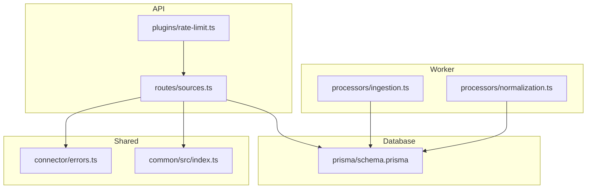
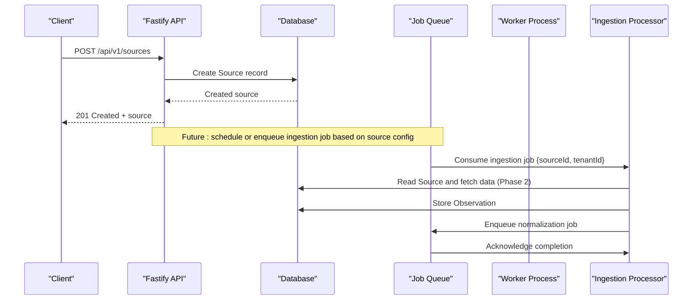
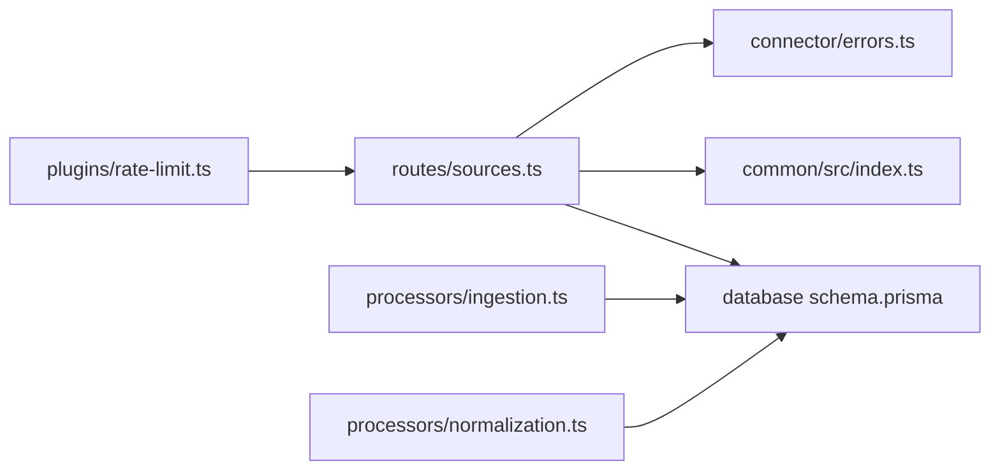

# Data Source Endpoints

<cite>
**Referenced Files in This Document**
- [sources.ts](file://apps/api/src/routes/sources.ts)
- [rate-limit.ts](file://apps/api/src/plugins/rate-limit.ts)
- [ingestion.ts](file://apps/worker/src/processors/ingestion.ts)
- [normalization.ts](file://apps/worker/src/processors/normalization.ts)
- [schema.prisma](file://packages/database/prisma/schema.prisma)
- [errors.ts](file://packages/connector/src/errors.ts)
- [index.ts](file://packages/common/src/index.ts)
</cite>

## Table of Contents
1. [Introduction](#introduction)
2. [Project Structure](#project-structure)
3. [Core Components](#core-components)
4. [Architecture Overview](#architecture-overview)
5. [Detailed Component Analysis](#detailed-component-analysis)
6. [Dependency Analysis](#dependency-analysis)
7. [Performance Considerations](#performance-considerations)
8. [Troubleshooting Guide](#troubleshooting-guide)
9. [Conclusion](#conclusion)

## Introduction
This document provides detailed API documentation for data source management endpoints. It covers:
- CRUD operations for configuring external data sources
- Request and response schemas for source configuration and connection parameters
- Validation rules applied to source creation
- The relationship between configured sources and the job processing pipeline
- Examples of common source configurations
- Error handling for connection failures
- Rate limiting considerations for data source operations

The data source endpoints are implemented as a Fastify route module that persists source definitions into the database and returns paginated results. A worker process consumes ingestion jobs triggered by these sources, with normalization as a subsequent phase.

## Project Structure
The relevant parts of the repository for this documentation include:
- API routes for managing data sources
- Rate limiting plugin for inbound requests
- Worker processors for ingestion and normalization
- Database schema defining the Source model and related entities
- Shared error types used across connectors and services

**Diagram sources**
- [sources.ts:1-118](file://apps/api/src/routes/sources.ts#L1-L118)
- [rate-limit.ts:1-62](file://apps/api/src/plugins/rate-limit.ts#L1-L62)
- [ingestion.ts:1-55](file://apps/worker/src/processors/ingestion.ts#L1-L55)
- [normalization.ts:1-57](file://apps/worker/src/processors/normalization.ts#L1-L57)
- [schema.prisma:70-102](file://packages/database/prisma/schema.prisma#L70-L102)
- [errors.ts:41-108](file://packages/connector/src/errors.ts#L41-L108)
- [index.ts:50-97](file://packages/common/src/index.ts#L50-L97)

**Section sources**
- [sources.ts:1-118](file://apps/api/src/routes/sources.ts#L1-L118)
- [schema.prisma:70-102](file://packages/database/prisma/schema.prisma#L70-L102)

## Core Components
- Data source routes: Provide list, create, get-by-id, and delete (soft-delete via status update).
- Rate limiter: Per-IP request throttling with standard headers and 429 responses.
- Ingestion processor: Validates job payloads and orchestrates fetching and storage phases.
- Normalization processor: Transforms raw observations into canonical models.
- Database schema: Defines Source, Observation, Job, and related tables.

Key responsibilities:
- Validate incoming source configuration using Zod.
- Persist sources scoped by tenant.
- Return paginated lists of sources.
- Enforce authentication on all source endpoints.
- Support optional cron scheduling metadata for future automation.

**Section sources**
- [sources.ts:10-22](file://apps/api/src/routes/sources.ts#L10-L22)
- [sources.ts:28-116](file://apps/api/src/routes/sources.ts#L28-L116)
- [rate-limit.ts:25-58](file://apps/api/src/plugins/rate-limit.ts#L25-L58)
- [ingestion.ts:11-54](file://apps/worker/src/processors/ingestion.ts#L11-L54)
- [normalization.ts:15-57](file://apps/worker/src/processors/normalization.ts#L15-L57)
- [schema.prisma:70-102](file://packages/database/prisma/schema.prisma#L70-L102)

## Architecture Overview
The data source lifecycle spans API configuration and asynchronous job processing:

**Diagram sources**
- [sources.ts:62-79](file://apps/api/src/routes/sources.ts#L62-L79)
- [ingestion.ts:11-54](file://apps/worker/src/processors/ingestion.ts#L11-L54)
- [normalization.ts:15-57](file://apps/worker/src/processors/normalization.ts#L15-L57)
- [schema.prisma:70-102](file://packages/database/prisma/schema.prisma#L70-L102)

## Detailed Component Analysis

### Data Source Management Endpoints
Base path: `/api/v1/sources`

Authentication:
- All endpoints require authentication via a preHandler hook.

Endpoints:
- List sources
  - Method: GET
  - Path: `/api/v1/sources`
  - Query parameters:
    - page: integer (page number)
    - limit: integer (items per page)
  - Response: Paginated result containing an array of sources and pagination metadata.
  - Notes: Results are filtered by the authenticated user’s tenantId and ordered by creation date descending.

- Create source
  - Method: POST
  - Path: `/api/v1/sources`
  - Request body schema:
    - name: string, required, length 1–255
    - type: enum, one of web_scraper, api_connector, marketplace, social_signal, product_database
    - connectorType: string, required, non-empty
    - config: object (JSON), default empty object
    - scheduleCron: string, optional
  - Response: 201 Created with the created source object.
  - Notes: The config field is stored as JSON and can contain URL, auth, headers, mapping rules, etc.

- Get source by ID
  - Method: GET
  - Path: `/api/v1/sources/:id`
  - Path parameters:
    - id: string
  - Response: Source object if found within the authenticated tenant.
  - Error: Not found when no matching source exists for the tenant.

- Delete source
  - Method: DELETE
  - Path: `/api/v1/sources/:id`
  - Path parameters:
    - id: string
  - Behavior: Soft-delete by setting status to disabled.
  - Response: 204 No Content on success.
  - Error: Not found when no matching source exists for the tenant.

Validation rules:
- Name must be a non-empty string up to 255 characters.
- Type must match one of the allowed enums.
- ConnectorType must be a non-empty string.
- Config defaults to an empty object if not provided.
- ScheduleCron is optional; null indicates manual-only execution.

Example request/response schemas:
- Create source request body:
  - name: string
  - type: enum value from allowed set
  - connectorType: string
  - config: object (arbitrary JSON)
  - scheduleCron: string (optional)

- List sources response:
  - data: array of source objects
  - pagination: object with page, limit, total, totalPages

- Get/Delete source response:
  - On success: source object or 204 No Content
  - On failure: structured error with code and message

Error handling:
- Not found errors use a shared NotFoundError with a structured error response.
- Validation errors use a shared ValidationError with details.

Rate limiting:
- Global rate limiting applies to all requests, including source endpoints.
- Headers returned:
  - x-ratelimit-limit
  - x-ratelimit-remaining
  - x-ratelimit-reset
- When exceeded:
  - Status: 429
  - Body includes error.code and error.message
  - retry-after header included

Common source configuration examples:
- Web scraper:
  - type: web_scraper
  - connectorType: custom_scraper
  - config: { url: "...", headers: {...}, selectors: {...} }
  - scheduleCron: "0 */6 * * *"

- API connector:
  - type: api_connector
  - connectorType: universal_api
  - config: { baseUrl: "...", authType: "bearer", authConfig: {...}, headers: {...}, timeout: 30000 }

- Marketplace adapter:
  - type: marketplace
  - connectorType: marketplace_adapter
  - config: { marketplace: "...", credentials: {...}, categoryFilters: [...] }

- Social signal:
  - type: social_signal
  - connectorType: universal_api
  - config: { baseUrl: "...", authType: "oauth2", authConfig: {...}, endpoints: {...} }

- Product database:
  - type: product_database
  - connectorType: universal_api
  - config: { baseUrl: "...", authType: "api_key", authConfig: {...}, queryTemplate: "..." }

Notes:
- The config field is flexible JSON; structure depends on connectorType and implementation.
- scheduleCron is metadata only; actual scheduling is not enforced by these endpoints.

**Section sources**
- [sources.ts:10-22](file://apps/api/src/routes/sources.ts#L10-L22)
- [sources.ts:28-116](file://apps/api/src/routes/sources.ts#L28-L116)
- [index.ts:71-79](file://packages/common/src/index.ts#L71-L79)

### Rate Limiting
Behavior:
- In-memory token bucket per IP address.
- Window: 60 seconds.
- Max requests: 100 per window.
- Headers:
  - x-ratelimit-limit
  - x-ratelimit-remaining
  - x-ratelimit-reset
- On exceeding limit:
  - Status: 429
  - Body: { error: { code: "RATE_LIMITED", message: "Too many requests" } }
  - Header: retry-after

Recommendations:
- For production, replace with Redis-backed rate limiting.
- Consider per-tenant or per-user limits for multi-tenant environments.

**Section sources**
- [rate-limit.ts:25-58](file://apps/api/src/plugins/rate-limit.ts#L25-L58)

### Job Processing Pipeline
Ingestion job:
- Input payload:
  - sourceId: string
  - tenantId: string
- Validation:
  - Rejects jobs missing either field.
- Lifecycle:
  - Validate → Fetch (Phase 2) → Store observation (Phase 2) → Enqueue normalization (Phase 2)

Normalization job:
- Input payload:
  - observationId: string
  - sourceId: string
  - tenantId: string
- Validation:
  - Rejects jobs missing any of the three fields.
- Purpose:
  - Transform raw observations into canonical EXOSQUAD data model.

Relationship to sources:
- Sources define where and how to ingest data.
- When a source is configured (and scheduled or manually triggered), ingestion jobs are enqueued with the source’s identifier and tenant context.
- Observations are persisted and later normalized.

**Section sources**
- [ingestion.ts:11-54](file://apps/worker/src/processors/ingestion.ts#L11-L54)
- [normalization.ts:15-57](file://apps/worker/src/processors/normalization.ts#L15-L57)

### Database Model: Source
Fields:
- id: primary key
- tenantId: foreign key to Tenant
- name: string
- type: string (enum-like values documented in comments)
- connectorType: string
- config: JSON
- scheduleCron: nullable string
- status: string (active | paused | error | disabled)
- lastRunAt, lastSuccessAt, lastError: timestamps and error text
- Health tracking fields (Phase 2): healthStatus, consecutiveErrors, totalFetched, totalFailed, avgLatencyMs, lastFetchedAt, lastHealthyAt
- Timestamps: createdAt, updatedAt

Relations:
- One-to-many with Observations
- One-to-many with RawResponses
- One-to-many with IngestionCheckpoint

Indexes:
- tenantId, status, healthStatus

**Section sources**
- [schema.prisma:70-102](file://packages/database/prisma/schema.prisma#L70-L102)

## Dependency Analysis
The following diagram shows dependencies among core components involved in data source management and processing:

**Diagram sources**
- [sources.ts:1-118](file://apps/api/src/routes/sources.ts#L1-L118)
- [rate-limit.ts:1-62](file://apps/api/src/plugins/rate-limit.ts#L1-L62)
- [ingestion.ts:1-55](file://apps/worker/src/processors/ingestion.ts#L1-L55)
- [normalization.ts:1-57](file://apps/worker/src/processors/normalization.ts#L1-L57)
- [schema.prisma:70-102](file://packages/database/prisma/schema.prisma#L70-L102)
- [index.ts:50-97](file://packages/common/src/index.ts#L50-L97)
- [errors.ts:41-108](file://packages/connector/src/errors.ts#L41-L108)

Coupling and cohesion:
- The sources route is cohesive around source CRUD and uses shared validation and error utilities.
- The worker processors are decoupled from the API but depend on the same database schema.
- Rate limiting is globally applied and does not couple to business logic.

Potential circular dependencies:
- None observed between modules analyzed here.

External dependencies:
- Fastify for routing and hooks.
- Prisma client for database access.
- BullMQ for job queues (referenced in worker processors).

**Section sources**
- [sources.ts:1-118](file://apps/api/src/routes/sources.ts#L1-L118)
- [ingestion.ts:1-55](file://apps/worker/src/processors/ingestion.ts#L1-L55)
- [normalization.ts:1-57](file://apps/worker/src/processors/normalization.ts#L1-L57)

## Performance Considerations
- Pagination:
  - Use page and limit to avoid large result sets.
- Database indexing:
  - Ensure queries filter by tenantId and leverage existing indexes on status and healthStatus.
- Rate limiting:
  - Monitor 429 responses and implement exponential backoff with jitter on clients.
- Job throughput:
  - Scale workers horizontally to handle ingestion and normalization queues.
- Connection timeouts:
  - Configure appropriate timeouts in connector configs to prevent long-running requests.

[No sources needed since this section provides general guidance]

## Troubleshooting Guide
Common issues and resolutions:
- Authentication failures:
  - Ensure requests include valid authentication tokens.
- Validation errors:
  - Check request body against the create source schema.
  - Use ValidationError details to identify invalid fields.
- Not found errors:
  - Verify the source exists within the authenticated tenant.
- Rate limiting:
  - Observe x-ratelimit-* headers and respect retry-after.
  - Implement client-side retries with backoff.
- Upstream source errors:
  - Connector errors such as authentication failures, malformed responses, and upstream rate limits are modeled with specific codes.
  - Handle SOURCE_ERROR, SCHEMA_VALIDATION_FAILED, MALFORMED_RESPONSE, UPSTREAM_RATE_LIMITED appropriately.

Error reference:
- VALIDATION_ERROR: 400, includes details.
- RATE_LIMITED: 429, may include retryAfter.
- SOURCE_ERROR: 502, includes sourceId and context.
- SCHEMA_VALIDATION_FAILED: 422, includes details.
- MALFORMED_RESPONSE: 502.
- UPSTREAM_RATE_LIMITED: 429, retryable, includes retryAfterMs.

**Section sources**
- [index.ts:71-93](file://packages/common/src/index.ts#L71-L93)
- [errors.ts:41-108](file://packages/connector/src/errors.ts#L41-L108)

## Conclusion
The data source endpoints provide a secure, validated, and tenant-scoped interface for configuring external data sources. They integrate with a robust job processing pipeline that ingests and normalizes data asynchronously. Rate limiting protects the API, while structured error types enable consistent handling of validation, connectivity, and upstream constraints. With the current foundation, Phase 2 will extend the ingestion and normalization workflows to fully automate data acquisition and transformation.

[No sources needed since this section summarizes without analyzing specific files]