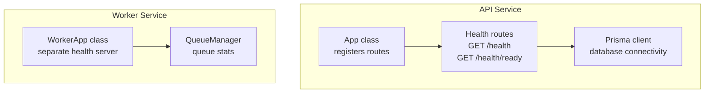
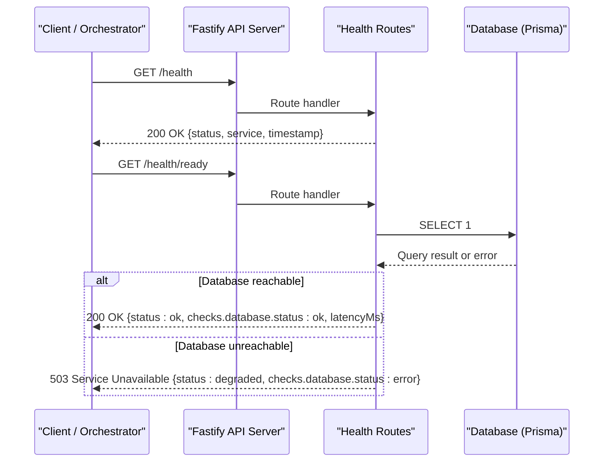
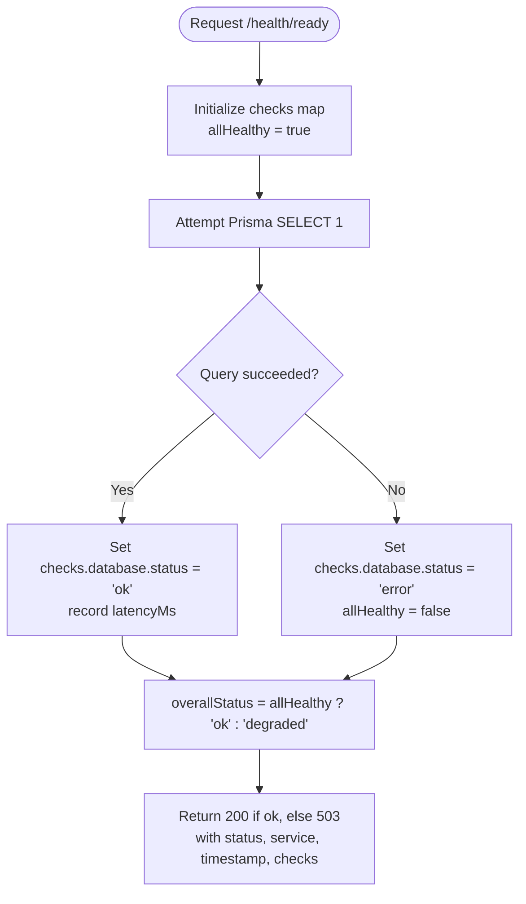
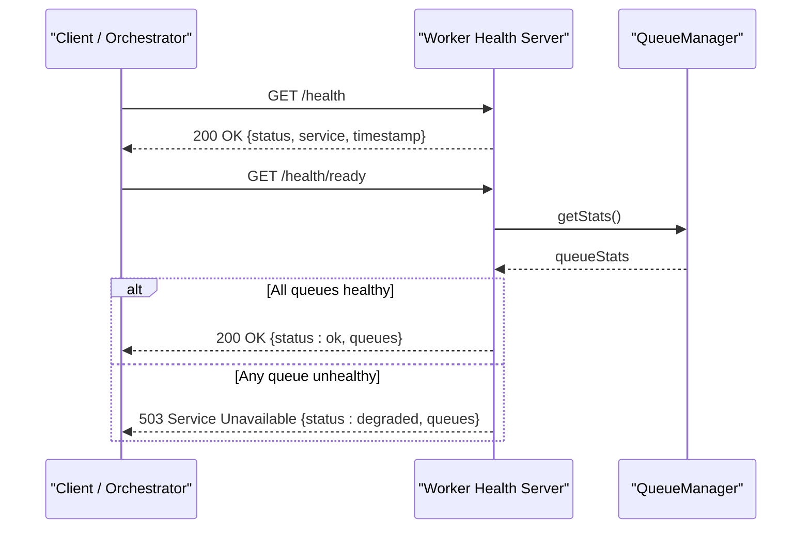
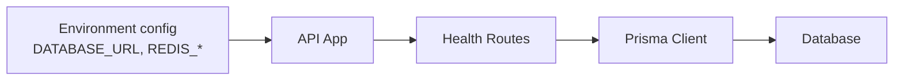
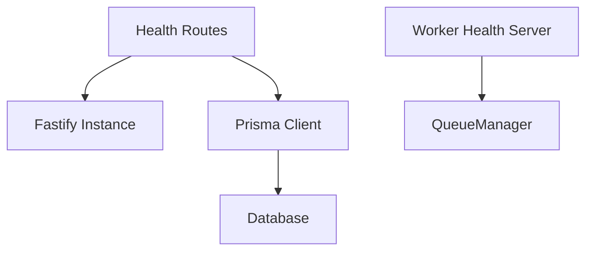

# Health Check Endpoints

<cite>
**Referenced Files in This Document**
- [health.ts](file://apps/api/src/routes/health.ts)
- [app.ts](file://apps/api/src/app.ts)
- [worker app.ts](file://apps/worker/src/app.ts)
- [database index.ts](file://packages/database/src/index.ts)
- [config index.ts](file://packages/config/src/index.ts)
- [health integration test.ts](file://apps/api/test/integration/health.test.ts)
- [architecture documentation.md](file://docs/ARCHITECTURE.md)
</cite>

## Table of Contents
1. [Introduction](#introduction)
2. [Project Structure](#project-structure)
3. [Core Components](#core-components)
4. [Architecture Overview](#architecture-overview)
5. [Detailed Component Analysis](#detailed-component-analysis)
6. [Dependency Analysis](#dependency-analysis)
7. [Performance Considerations](#performance-considerations)
8. [Troubleshooting Guide](#troubleshooting-guide)
9. [Conclusion](#conclusion)
10. [Appendices](#appendices)

## Introduction
This document describes the health check endpoints used for service monitoring and readiness verification across the API and Worker services. It covers:
- Basic liveness probe at `/health`
- Readiness probe at `/health/ready` that verifies dependency connectivity (currently database; Redis is configured but not actively checked in the current implementation)
- Response schemas, status codes, and integration guidance for load balancers and orchestration systems such as Kubernetes
- Guidance for implementing custom health checks and monitoring strategies

## Project Structure
The health endpoints are implemented within the API application and a separate minimal health server in the Worker application. The API registers its health routes under the `/health` prefix, while the Worker exposes its own health endpoints on a dedicated port.

**Diagram sources**
- [app.ts:34-36](file://apps/api/src/app.ts#L34-L36)
- [health.ts:9-47](file://apps/api/src/routes/health.ts#L9-L47)
- [database index.ts:20-25](file://packages/database/src/index.ts#L20-L25)
- [worker app.ts:10-38](file://apps/worker/src/app.ts#L10-L38)

**Section sources**
- [app.ts:34-36](file://apps/api/src/app.ts#L34-L36)
- [health.ts:9-47](file://apps/api/src/routes/health.ts#L9-L47)
- [worker app.ts:10-38](file://apps/worker/src/app.ts#L10-L38)

## Core Components
- API Liveness Probe (`GET /health`)
  - Always returns HTTP 200 when the process is running.
  - Response includes service name and timestamp.
- API Readiness Probe (`GET /health/ready`)
  - Checks database connectivity via Prisma.
  - Returns HTTP 200 if healthy, or HTTP 503 if degraded.
  - Response includes per-check results and latency metrics where available.
- Worker Liveness Probe (`GET /health`)
  - Separate minimal Fastify server on a dedicated port.
  - Returns basic liveness information.
- Worker Readiness Probe (`GET /health/ready`)
  - Queries queue manager statistics to determine overall health.
  - Returns HTTP 200 if all queues are healthy, otherwise HTTP 503.

**Section sources**
- [health.ts:9-47](file://apps/api/src/routes/health.ts#L9-L47)
- [worker app.ts:20-38](file://apps/worker/src/app.ts#L20-L38)

## Architecture Overview
The API service uses Fastify and registers health routes under `/health`. The readiness endpoint performs a lightweight database query to verify connectivity. The Worker service runs a separate Fastify instance for health checks and validates queue connectivity through its QueueManager.

**Diagram sources**
- [health.ts:10-46](file://apps/api/src/routes/health.ts#L10-L46)
- [database index.ts:20-25](file://packages/database/src/index.ts#L20-L25)

## Detailed Component Analysis

### API Health Routes
- Liveness (`GET /health`)
  - Behavior: Returns HTTP 200 with a stable payload indicating the process is alive.
  - Payload fields:
    - `status`: string — always "ok"
    - `service`: string — "exosquad-api"
    - `timestamp`: string — ISO timestamp
- Readiness (`GET /health/ready`)
  - Behavior: Performs a database connectivity check using Prisma.
  - Status logic:
    - If the database check succeeds: HTTP 200 with `status: "ok"`
    - If the database check fails: HTTP 503 with `status: "degraded"`
  - Payload fields:
    - `status`: string — "ok" or "degraded"
    - `service`: string — "exosquad-api"
    - `timestamp`: string — ISO timestamp
    - `checks`: object — keyed by dependency name; currently only `database`
      - `database.status`: string — "ok" or "error"
      - `database.latencyMs`: number — optional latency in milliseconds

**Diagram sources**
- [health.ts:20-46](file://apps/api/src/routes/health.ts#L20-L46)

**Section sources**
- [health.ts:9-47](file://apps/api/src/routes/health.ts#L9-L47)

### Worker Health Server
- Liveness (`GET /health`)
  - Behavior: Returns HTTP 200 with basic liveness payload.
  - Payload fields:
    - `status`: string — "ok"
    - `service`: string — "exosquad-worker"
    - `timestamp`: string — ISO timestamp
- Readiness (`GET /health/ready`)
  - Behavior: Retrieves queue statistics from QueueManager and determines overall health.
  - Status logic:
    - If all queues report "ok": HTTP 200 with `status: "ok"`
    - Otherwise: HTTP 503 with `status: "degraded"`
  - Payload fields:
    - `status`: string — "ok" or "degraded"
    - `service`: string — "exosquad-worker"
    - `timestamp`: string — ISO timestamp
    - `queues`: object — queue-level stats returned by QueueManager

**Diagram sources**
- [worker app.ts:20-38](file://apps/worker/src/app.ts#L20-L38)

**Section sources**
- [worker app.ts:10-38](file://apps/worker/src/app.ts#L10-L38)

### Configuration and Dependencies
- Database
  - The API readiness endpoint uses Prisma to execute a simple query to validate connectivity.
  - The Prisma client is exported as a singleton from the database package.
- Redis
  - Environment variables for Redis are validated at startup (host, port, optional password).
  - The current API readiness endpoint does not actively check Redis connectivity; it focuses on the database.

**Diagram sources**
- [config index.ts:10-17](file://packages/config/src/index.ts#L10-L17)
- [database index.ts:20-25](file://packages/database/src/index.ts#L20-L25)
- [health.ts:24-36](file://apps/api/src/routes/health.ts#L24-L36)

**Section sources**
- [config index.ts:10-17](file://packages/config/src/index.ts#L10-L17)
- [database index.ts:20-25](file://packages/database/src/index.ts#L20-L25)
- [health.ts:24-36](file://apps/api/src/routes/health.ts#L24-L36)

## Dependency Analysis
- API Health Routes depend on:
  - Fastify server instance for route registration
  - Prisma client for database connectivity checks
- Worker Health Server depends on:
  - QueueManager for queue statistics
- External dependencies:
  - Database (via Prisma)
  - Redis (configured via environment variables; not actively probed in current readiness endpoint)

**Diagram sources**
- [health.ts:1-47](file://apps/api/src/routes/health.ts#L1-L47)
- [worker app.ts:10-38](file://apps/worker/src/app.ts#L10-L38)
- [database index.ts:20-25](file://packages/database/src/index.ts#L20-L25)

**Section sources**
- [health.ts:1-47](file://apps/api/src/routes/health.ts#L1-L47)
- [worker app.ts:10-38](file://apps/worker/src/app.ts#L10-L38)

## Performance Considerations
- Keep health endpoints lightweight:
  - Avoid heavy computations or external calls beyond necessary dependency checks.
  - Use fast queries like `SELECT 1` for database checks.
- Measure and expose latency:
  - Include `latencyMs` for each dependency check to aid observability.
- Rate limiting and timeouts:
  - Ensure orchestrators use appropriate intervals and timeouts to avoid overwhelming the service.
- Concurrency:
  - Health checks should be idempotent and safe to call concurrently.

[No sources needed since this section provides general guidance]

## Troubleshooting Guide
Common issues and diagnostics:
- Database connectivity failures
  - Symptom: `/health/ready` returns 503 with `checks.database.status: "error"`.
  - Actions:
    - Verify `DATABASE_URL` configuration.
    - Confirm database availability and credentials.
    - Review logs for errors emitted during the health check.
- Redis configuration
  - While Redis is configured via environment variables, the current readiness endpoint does not check Redis. Add explicit Redis checks if required.
- Worker readiness
  - Symptom: `/health/ready` returns 503 due to queue stats showing unhealthy queues.
  - Actions:
    - Inspect queue backend connectivity and job processing status.
    - Validate worker processes are running and connected to the queue system.

**Section sources**
- [health.ts:24-36](file://apps/api/src/routes/health.ts#L24-L36)
- [worker app.ts:26-38](file://apps/worker/src/app.ts#L26-L38)

## Conclusion
The API and Worker services provide clear liveness and readiness probes:
- `/health` indicates whether the process is alive.
- `/health/ready` reflects dependency health, currently focusing on database connectivity for the API and queue connectivity for the Worker.
These endpoints enable reliable integration with load balancers and orchestration platforms. Extend them with additional dependency checks (e.g., Redis) as your system evolves.

[No sources needed since this section summarizes without analyzing specific files]

## Appendices

### API Endpoint Reference

- GET /health
  - Purpose: Liveness probe
  - Status codes:
    - 200: Process is running
  - Response schema:
    - `status`: string — "ok"
    - `service`: string — "exosquad-api"
    - `timestamp`: string — ISO timestamp

- GET /health/ready
  - Purpose: Readiness probe (dependency health)
  - Status codes:
    - 200: Healthy
    - 503: Unhealthy or degraded
  - Response schema:
    - `status`: string — "ok" or "degraded"
    - `service`: string — "exosquad-api"
    - `timestamp`: string — ISO timestamp
    - `checks`: object — dependency results
      - `database.status`: string — "ok" or "error"
      - `database.latencyMs`: number — optional latency in milliseconds

**Section sources**
- [health.ts:10-46](file://apps/api/src/routes/health.ts#L10-L46)
- [health integration test.ts:18-43](file://apps/api/test/integration/health.test.ts#L18-L43)

### Worker Endpoint Reference

- GET /health
  - Purpose: Liveness probe
  - Status codes:
    - 200: Process is running
  - Response schema:
    - `status`: string — "ok"
    - `service`: string — "exosquad-worker"
    - `timestamp`: string — ISO timestamp

- GET /health/ready
  - Purpose: Readiness probe (queue connectivity)
  - Status codes:
    - 200: Healthy
    - 503: Unhealthy or degraded
  - Response schema:
    - `status`: string — "ok" or "degraded"
    - `service`: string — "exosquad-worker"
    - `timestamp`: string — ISO timestamp
    - `queues`: object — queue-level stats from QueueManager

**Section sources**
- [worker app.ts:20-38](file://apps/worker/src/app.ts#L20-L38)

### Integration Examples

- Load Balancer Health Checks
  - Configure periodic GET requests to `/health` for liveness.
  - Use `/health/ready` to gate traffic until dependencies are healthy.
  - Treat 503 responses as unhealthy and remove instances from rotation.

- Kubernetes Probes
  - LivenessProbe:
    - Path: `/health`
    - Success threshold: 1
    - Failure threshold: 3
  - ReadinessProbe:
    - Path: `/health/ready`
    - Success threshold: 1
    - Failure threshold: 3

- Monitoring Strategies
  - Track response times and failure rates for both endpoints.
  - Alert on sustained 503 responses from `/health/ready`.
  - Correlate latency metrics (`latencyMs`) with infrastructure performance.

**Section sources**
- [architecture documentation.md:188-191](file://docs/ARCHITECTURE.md#L188-L191)

### Implementing Custom Health Checks
- Add new dependency checks to `/health/ready`:
  - Create a function to probe the dependency (e.g., Redis ping).
  - Record status and latency in the `checks` object.
  - Update `allHealthy` logic accordingly.
- Return consistent payloads:
  - Maintain `status`, `service`, `timestamp`, and `checks` fields.
- Log errors:
  - Emit structured logs for failed checks to aid debugging.
- Test thoroughly:
  - Add integration tests verifying expected status codes and payload shapes.

**Section sources**
- [health.ts:20-46](file://apps/api/src/routes/health.ts#L20-L46)
- [health integration test.ts:32-43](file://apps/api/test/integration/health.test.ts#L32-L43)