# Architecture Design

<cite>
**Referenced Files in This Document**
- [apps/api/src/app.ts](file://apps/api/src/app.ts)
- [apps/api/src/plugins/auth.ts](file://apps/api/src/plugins/auth.ts)
- [apps/api/src/plugins/rate-limit.ts](file://apps/api/src/plugins/rate-limit.ts)
- [apps/api/src/plugins/security-headers.ts](file://apps/api/src/plugins/security-headers.ts)
- [apps/api/src/plugins/request-tracker.ts](file://apps/api/src/plugins/request-tracker.ts)
- [apps/api/src/routes/auth.ts](file://apps/api/src/routes/auth.ts)
- [apps/worker/src/app.ts](file://apps/worker/src/app.ts)
- [apps/worker/src/queues/queue-manager.ts](file://apps/worker/src/queues/queue-manager.ts)
- [apps/worker/src/processors/ingestion.ts](file://apps/worker/src/processors/ingestion.ts)
- [apps/worker/src/processors/normalization.ts](file://apps/worker/src/processors/normalization.ts)
- [docker-compose.yml](file://docker-compose.yml)
- [docs/ARCHITECTURE.md](file://docs/ARCHITECTURE.md)
</cite>

## Table of Contents
1. [Introduction](#introduction)
2. [Project Structure](#project-structure)
3. [Core Components](#core-components)
4. [Architecture Overview](#architecture-overview)
5. [Detailed Component Analysis](#detailed-component-analysis)
6. [Dependency Analysis](#dependency-analysis)
7. [Performance Considerations](#performance-considerations)
8. [Troubleshooting Guide](#troubleshooting-guide)
9. [Conclusion](#conclusion)

## Introduction
This document describes Exosquad’s microservices architecture, focusing on the separation between API and worker services, their responsibilities, and communication patterns. It explains the Fastify plugin architecture for cross-cutting concerns such as authentication, rate limiting, and security headers, and documents the queue-based processing model using BullMQ for asynchronous job handling. It also covers multi-tenancy, service boundaries, deployment topology, architectural decisions, trade-offs, and scalability considerations.

## Project Structure
Exosquad is a TypeScript monorepo with two primary runtime services:
- API service (`apps/api`): Fastify HTTP server handling client requests, authentication, authorization, rate limiting, security headers, request tracking, and route registration.
- Worker service (`apps/worker`): BullMQ workers running ingestion and normalization jobs, plus a minimal health endpoint for liveness and readiness checks.

Shared packages include configuration, logging, common types, and database utilities. Local infrastructure uses Docker Compose to run PostgreSQL and Redis.

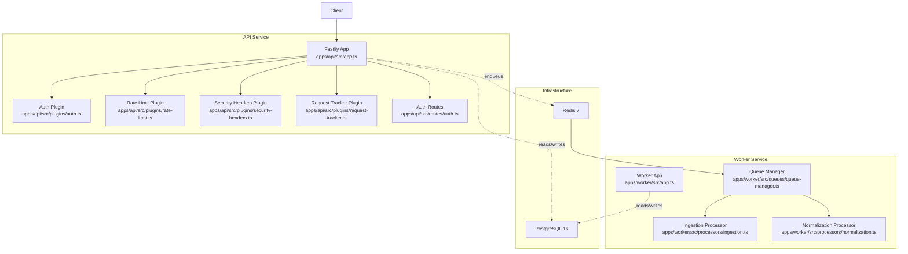

**Diagram sources**
- [apps/api/src/app.ts:12-37](file://apps/api/src/app.ts#L12-L37)
- [apps/api/src/plugins/auth.ts:70-93](file://apps/api/src/plugins/auth.ts#L70-L93)
- [apps/api/src/plugins/rate-limit.ts:28-61](file://apps/api/src/plugins/rate-limit.ts#L28-L61)
- [apps/api/src/plugins/security-headers.ts:7-30](file://apps/api/src/plugins/security-headers.ts#L7-L30)
- [apps/api/src/plugins/request-tracker.ts:9-42](file://apps/api/src/plugins/request-tracker.ts#L9-L42)
- [apps/api/src/routes/auth.ts:45-67](file://apps/api/src/routes/auth.ts#L45-L67)
- [apps/worker/src/app.ts:10-59](file://apps/worker/src/app.ts#L10-L59)
- [apps/worker/src/queues/queue-manager.ts:19-98](file://apps/worker/src/queues/queue-manager.ts#L19-L98)
- [apps/worker/src/processors/ingestion.ts:11-54](file://apps/worker/src/processors/ingestion.ts#L11-L54)
- [apps/worker/src/processors/normalization.ts:15-57](file://apps/worker/src/processors/normalization.ts#L15-L57)
- [docker-compose.yml:8-39](file://docker-compose.yml#L8-L39)

**Section sources**
- [apps/api/src/app.ts:12-37](file://apps/api/src/app.ts#L12-L37)
- [apps/worker/src/app.ts:10-59](file://apps/worker/src/app.ts#L10-L59)
- [docker-compose.yml:8-39](file://docker-compose.yml#L8-L39)
- [docs/ARCHITECTURE.md:43-65](file://docs/ARCHITECTURE.md#L43-L65)

## Core Components
- API Application: Initializes Fastify, registers plugins (request tracking, authentication, rate limiting, security headers), mounts routes under `/health` and `/api/v1/auth`, sets global error handling, and starts/stops the server.
- Authentication Plugin: Validates Bearer JWTs, decodes payload, attaches user context to requests, and provides an `authenticate` preHandler.
- Rate Limiting Plugin: In-memory per-IP rate limiter with configurable window and limits; returns standard rate limit headers and 429 responses when exceeded.
- Security Headers Plugin: Adds security-related response headers and enables HSTS in production.
- Request Tracker Plugin: Generates or propagates `X-Request-Id`, creates child loggers with request context, and enriches logs across the request lifecycle.
- Worker Application: Starts BullMQ workers for ingestion and normalization queues and exposes a separate health server for liveness/readiness probes.
- Queue Manager: Creates BullMQ queues and workers, configures concurrency and rate limiting, enqueues jobs with retries/backoff, and exposes queue statistics for health checks.
- Processors: Placeholder implementations for ingestion and normalization jobs that validate inputs, log structured data, and prepare for Phase 2 implementation.

**Section sources**
- [apps/api/src/app.ts:12-95](file://apps/api/src/app.ts#L12-L95)
- [apps/api/src/plugins/auth.ts:1-101](file://apps/api/src/plugins/auth.ts#L1-L101)
- [apps/api/src/plugins/rate-limit.ts:1-62](file://apps/api/src/plugins/rate-limit.ts#L1-L62)
- [apps/api/src/plugins/security-headers.ts:1-31](file://apps/api/src/plugins/security-headers.ts#L1-L31)
- [apps/api/src/plugins/request-tracker.ts:1-43](file://apps/api/src/plugins/request-tracker.ts#L1-L43)
- [apps/worker/src/app.ts:10-59](file://apps/worker/src/app.ts#L10-L59)
- [apps/worker/src/queues/queue-manager.ts:19-165](file://apps/worker/src/queues/queue-manager.ts#L19-L165)
- [apps/worker/src/processors/ingestion.ts:11-54](file://apps/worker/src/processors/ingestion.ts#L11-L54)
- [apps/worker/src/processors/normalization.ts:15-57](file://apps/worker/src/processors/normalization.ts#L15-L57)

## Architecture Overview
The system follows a clear separation of concerns:
- API layer handles synchronous HTTP requests, validates input, authenticates users, applies rate limits and security headers, tracks requests, and delegates long-running work to queues.
- Worker layer consumes jobs from Redis-backed queues, processes them asynchronously, and exposes health endpoints for orchestration.

Communication pattern:
- API enqueues jobs into BullMQ queues stored in Redis.
- Workers pull jobs from Redis and execute processors.
- Database interactions are planned for Phase 2; current placeholders indicate where Prisma will be integrated.

Service boundaries:
- API: Fastify server with plugins and routes.
- Worker: BullMQ workers and minimal Fastify health server.
- Infrastructure: PostgreSQL and Redis via Docker Compose.

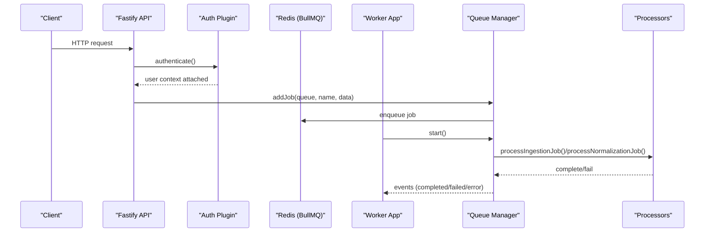

**Diagram sources**
- [apps/api/src/app.ts:27-37](file://apps/api/src/app.ts#L27-L37)
- [apps/api/src/plugins/auth.ts:70-93](file://apps/api/src/plugins/auth.ts#L70-L93)
- [apps/worker/src/queues/queue-manager.ts:23-98](file://apps/worker/src/queues/queue-manager.ts#L23-L98)
- [apps/worker/src/app.ts:41-53](file://apps/worker/src/app.ts#L41-L53)
- [apps/worker/src/processors/ingestion.ts:11-54](file://apps/worker/src/processors/ingestion.ts#L11-L54)
- [apps/worker/src/processors/normalization.ts:15-57](file://apps/worker/src/processors/normalization.ts#L15-L57)

## Detailed Component Analysis

### API Application and Plugin Pipeline
The API application initializes Fastify with custom logger settings, registers cross-cutting plugins in order, mounts routes, and defines a global error handler that normalizes validation errors, known application errors, and unknown errors into consistent JSON responses.

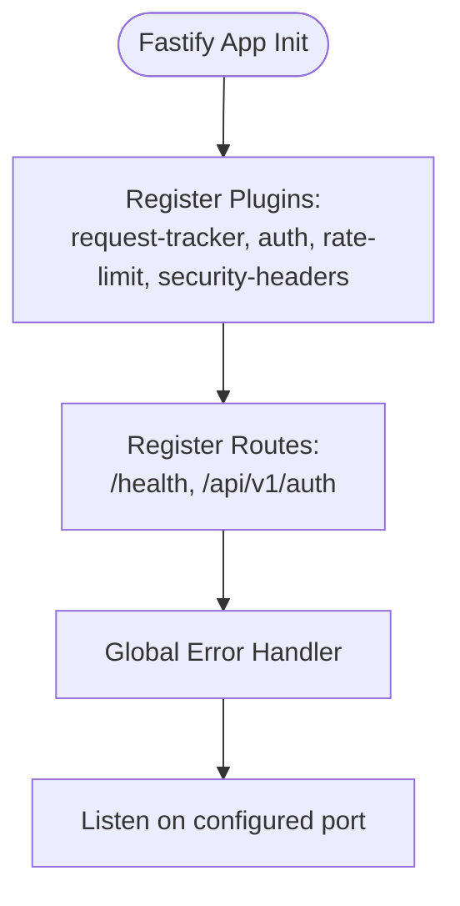

**Diagram sources**
- [apps/api/src/app.ts:15-37](file://apps/api/src/app.ts#L15-L37)
- [apps/api/src/app.ts:39-70](file://apps/api/src/app.ts#L39-L70)

**Section sources**
- [apps/api/src/app.ts:12-95](file://apps/api/src/app.ts#L12-L95)

### Authentication Plugin
The authentication plugin verifies JWT tokens using HS256, extracts user identity and tenant context, and exposes an `authenticate` preHandler. Protected routes can call this preHandler to enforce authorization.

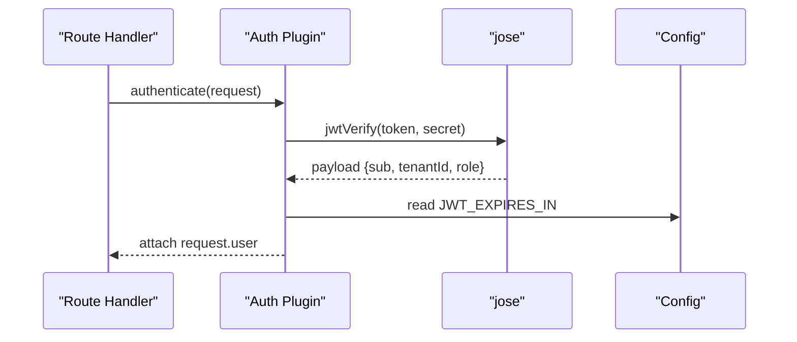

**Diagram sources**
- [apps/api/src/plugins/auth.ts:24-48](file://apps/api/src/plugins/auth.ts#L24-L48)
- [apps/api/src/plugins/auth.ts:53-63](file://apps/api/src/plugins/auth.ts#L53-L63)
- [apps/api/src/plugins/auth.ts:70-93](file://apps/api/src/plugins/auth.ts#L70-L93)

**Section sources**
- [apps/api/src/plugins/auth.ts:1-101](file://apps/api/src/plugins/auth.ts#L1-L101)
- [apps/api/src/routes/auth.ts:45-67](file://apps/api/src/routes/auth.ts#L45-L67)

### Rate Limiting Plugin
The rate limiting plugin implements per-IP in-memory throttling with a 60-second window and a maximum request count. It sets standard rate limit headers and responds with 429 when exceeded. A cleanup interval removes expired entries.

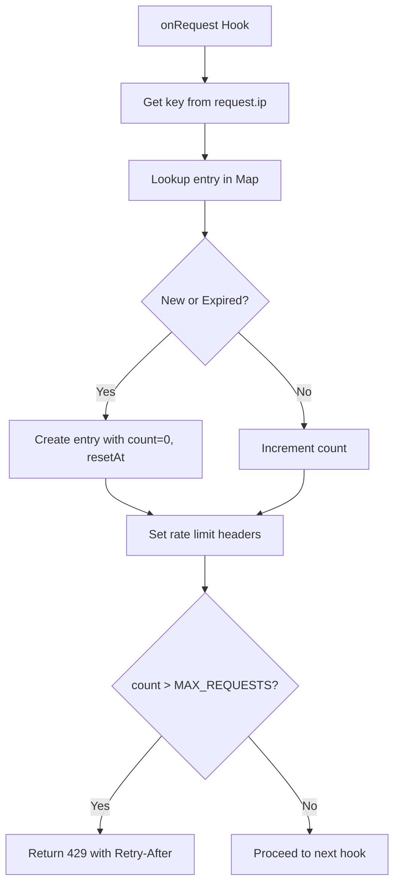

**Diagram sources**
- [apps/api/src/plugins/rate-limit.ts:8-26](file://apps/api/src/plugins/rate-limit.ts#L8-L26)
- [apps/api/src/plugins/rate-limit.ts:28-61](file://apps/api/src/plugins/rate-limit.ts#L28-L61)

**Section sources**
- [apps/api/src/plugins/rate-limit.ts:1-62](file://apps/api/src/plugins/rate-limit.ts#L1-L62)

### Security Headers Plugin
The security headers plugin adds standard security headers to every response and enables HSTS in production environments.

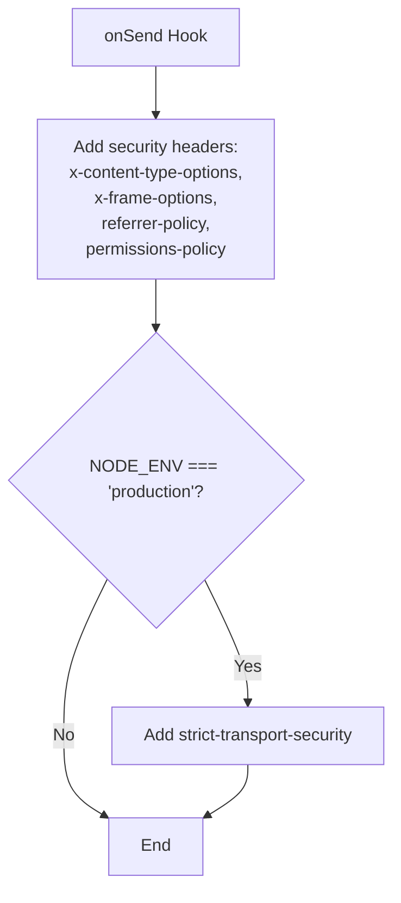

**Diagram sources**
- [apps/api/src/plugins/security-headers.ts:7-30](file://apps/api/src/plugins/security-headers.ts#L7-L30)

**Section sources**
- [apps/api/src/plugins/security-headers.ts:1-31](file://apps/api/src/plugins/security-headers.ts#L1-L31)

### Request Tracker Plugin
The request tracker plugin assigns a unique request ID (from header or generated UUID), creates a child logger with request context, and attaches it to the request object for downstream logging.

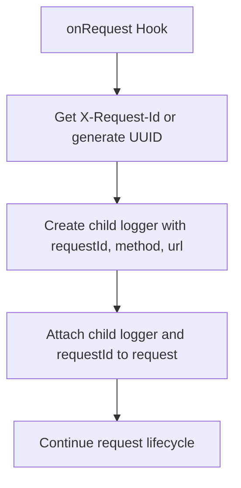

**Diagram sources**
- [apps/api/src/plugins/request-tracker.ts:9-28](file://apps/api/src/plugins/request-tracker.ts#L9-L28)

**Section sources**
- [apps/api/src/plugins/request-tracker.ts:1-43](file://apps/api/src/plugins/request-tracker.ts#L1-L43)

### Worker Application and Health Endpoints
The worker application initializes the queue manager and a minimal Fastify health server. The `/health` endpoint returns liveness status, while `/health/ready` aggregates queue stats to determine readiness.

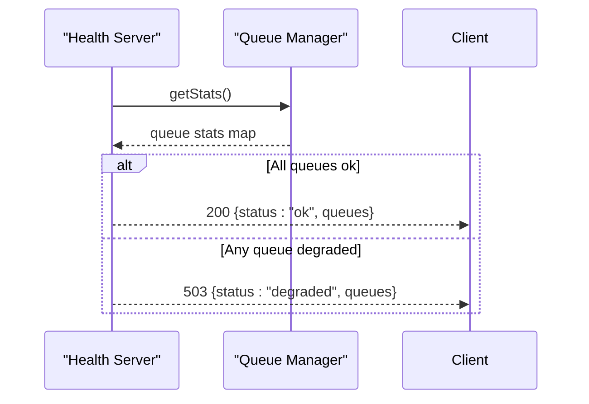

**Diagram sources**
- [apps/worker/src/app.ts:20-38](file://apps/worker/src/app.ts#L20-L38)
- [apps/worker/src/queues/queue-manager.ts:100-125](file://apps/worker/src/queues/queue-manager.ts#L100-L125)

**Section sources**
- [apps/worker/src/app.ts:10-59](file://apps/worker/src/app.ts#L10-L59)

### Queue Manager and Job Processing
The queue manager creates BullMQ queues and workers, configures concurrency and rate limiting, enqueues jobs with retry/backoff policies, and exposes queue statistics. Workers emit completion, failure, and error events for observability.

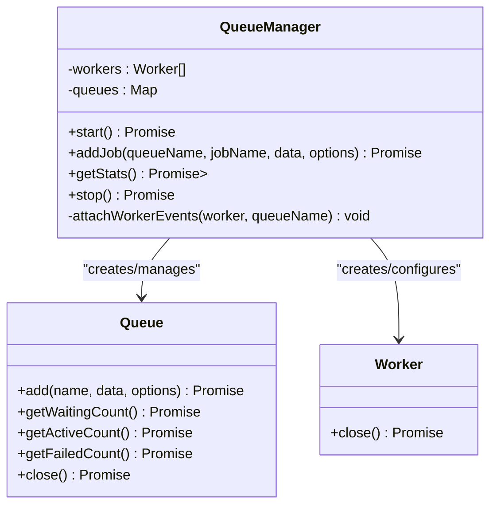

**Diagram sources**
- [apps/worker/src/queues/queue-manager.ts:19-98](file://apps/worker/src/queues/queue-manager.ts#L19-L98)
- [apps/worker/src/queues/queue-manager.ts:100-165](file://apps/worker/src/queues/queue-manager.ts#L100-L165)

**Section sources**
- [apps/worker/src/queues/queue-manager.ts:1-165](file://apps/worker/src/queues/queue-manager.ts#L1-L165)

### Ingestion and Normalization Processors
Processors validate job payloads, create child loggers with job context, and contain placeholders for Phase 2 implementation including fetching, parsing, storing observations, and enqueuing subsequent pipeline stages.

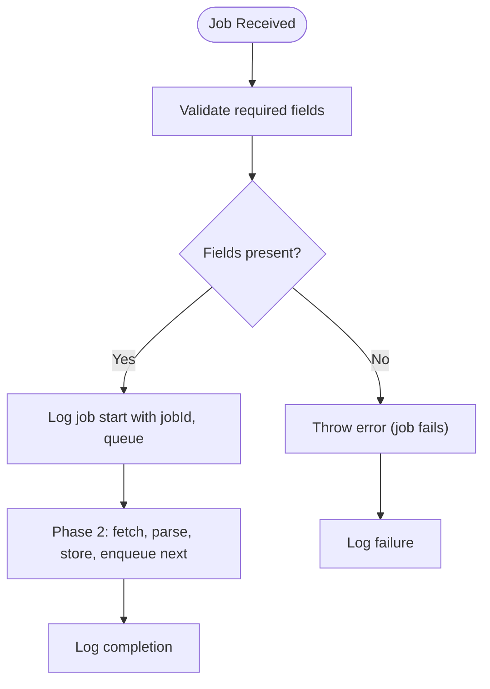

**Diagram sources**
- [apps/worker/src/processors/ingestion.ts:11-54](file://apps/worker/src/processors/ingestion.ts#L11-L54)
- [apps/worker/src/processors/normalization.ts:15-57](file://apps/worker/src/processors/normalization.ts#L15-L57)

**Section sources**
- [apps/worker/src/processors/ingestion.ts:1-55](file://apps/worker/src/processors/ingestion.ts#L1-L55)
- [apps/worker/src/processors/normalization.ts:1-58](file://apps/worker/src/processors/normalization.ts#L1-L58)

## Dependency Analysis
- API depends on Fastify, shared config/logger/common packages, and internal plugins.
- Worker depends on Fastify (for health server), BullMQ, ioredis, and shared packages.
- Infrastructure dependencies: PostgreSQL and Redis are orchestrated via Docker Compose.

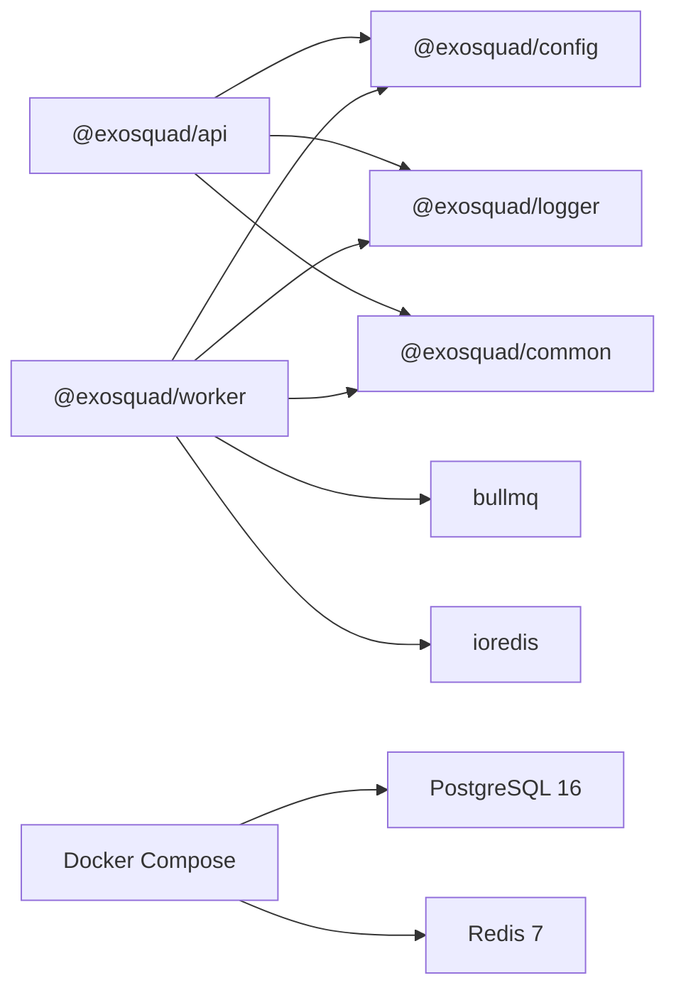

**Diagram sources**
- [apps/api/src/app.ts:1-10](file://apps/api/src/app.ts#L1-L10)
- [apps/worker/package.json:15-22](file://apps/worker/package.json#L15-L22)
- [docker-compose.yml:8-39](file://docker-compose.yml#L8-L39)

**Section sources**
- [apps/api/src/app.ts:1-10](file://apps/api/src/app.ts#L1-L10)
- [apps/worker/package.json:1-29](file://apps/worker/package.json#L1-L29)
- [docker-compose.yml:8-39](file://docker-compose.yml#L8-L39)

## Performance Considerations
- API request timeout is set to 30 seconds; consider tuning based on workload characteristics.
- Rate limiting uses in-memory storage; for multi-instance deployments, migrate to Redis-backed rate limiting to ensure accurate counts across replicas.
- Worker concurrency is configurable; tune `WORKER_CONCURRENCY` and queue-specific limits to match external source constraints and resource capacity.
- BullMQ backoff and retry policies provide resilience; monitor failed job counts and adjust attempts/backoff strategies based on error profiles.
- Structured logging with Pino enables efficient log aggregation; ensure correlation IDs propagate through all layers for distributed tracing.

[No sources needed since this section provides general guidance]

## Troubleshooting Guide
- Authentication failures: Verify JWT secret configuration and token expiration settings; check that protected routes invoke the `authenticate` preHandler.
- Rate limiting issues: Confirm IP resolution behind proxies; ensure `trustProxy` is enabled if necessary. Replace in-memory store with Redis-backed limiter for horizontal scaling.
- Worker health: Use `/health` and `/health/ready` endpoints to verify liveness and queue connectivity; inspect queue stats for degraded states.
- Job failures: Review structured logs for jobId, queue, and error details; adjust retry/backoff parameters and investigate upstream source availability.

**Section sources**
- [apps/api/src/plugins/auth.ts:70-93](file://apps/api/src/plugins/auth.ts#L70-L93)
- [apps/api/src/plugins/rate-limit.ts:28-61](file://apps/api/src/plugins/rate-limit.ts#L28-L61)
- [apps/worker/src/app.ts:20-38](file://apps/worker/src/app.ts#L20-L38)
- [apps/worker/src/queues/queue-manager.ts:141-165](file://apps/worker/src/queues/queue-manager.ts#L141-L165)

## Conclusion
Exosquad’s architecture separates synchronous API concerns from asynchronous worker processing, leveraging Fastify plugins for cross-cutting concerns and BullMQ for resilient job handling. Multi-tenancy is enforced at the application and database levels, with tenant isolation applied consistently. The design supports independent scaling of API and worker services, structured observability, and clear service boundaries. Future phases will implement the universal connector framework, real ingestion and normalization pipelines, and production-grade rate limiting and deployment configurations.

[No sources needed since this section summarizes without analyzing specific files]