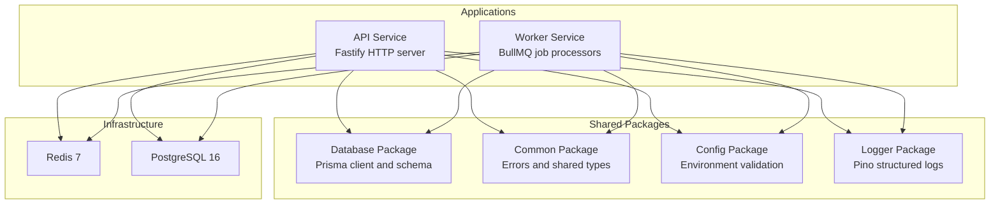
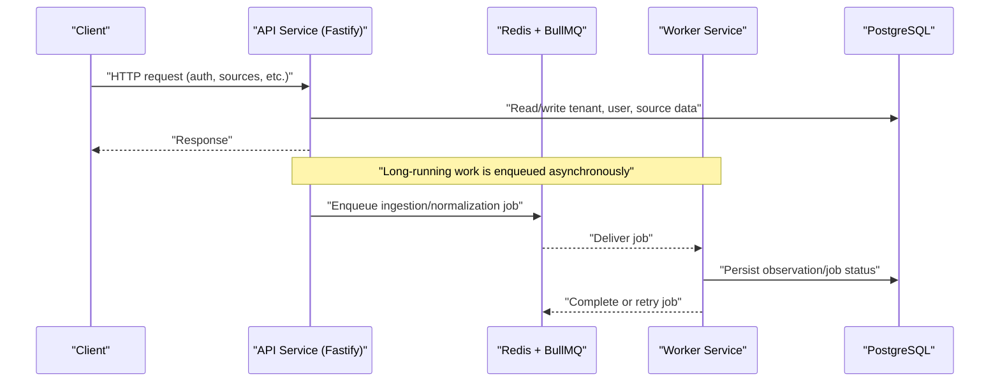
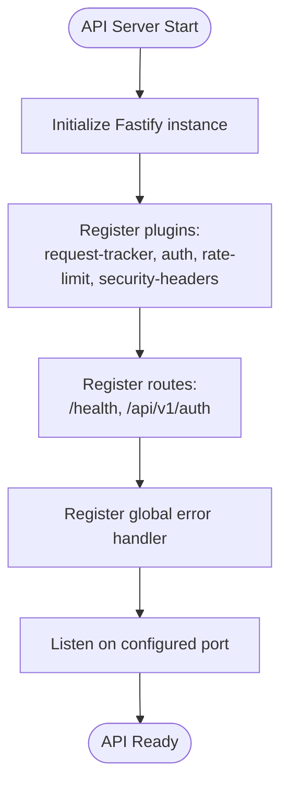
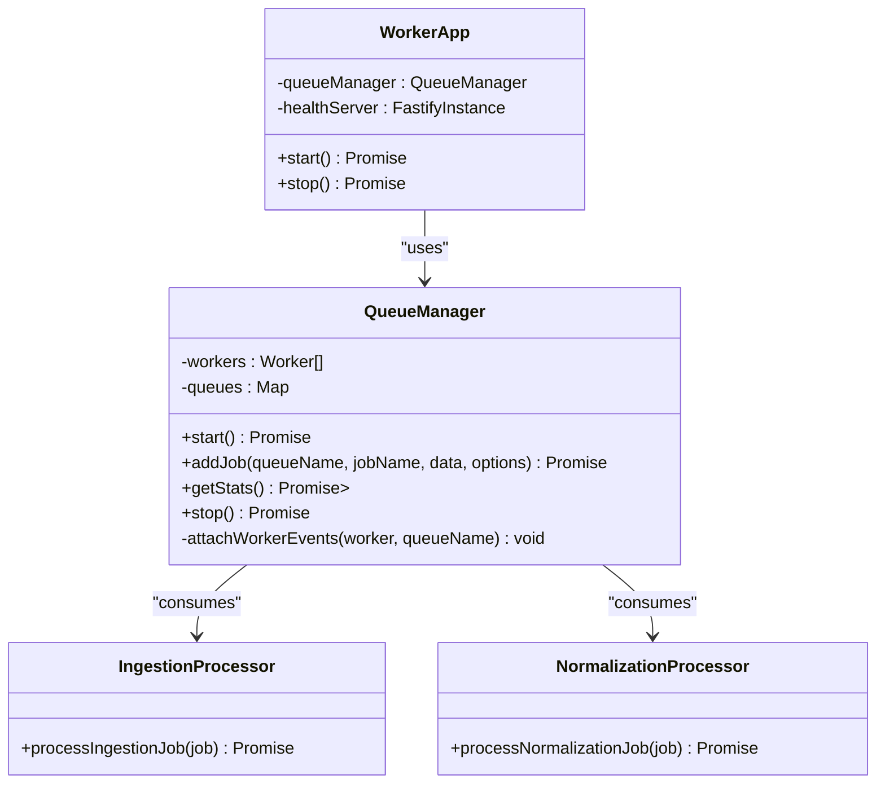
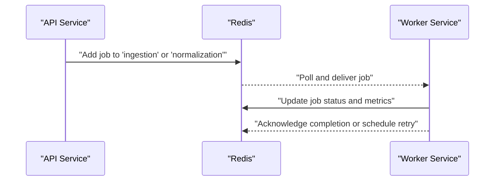
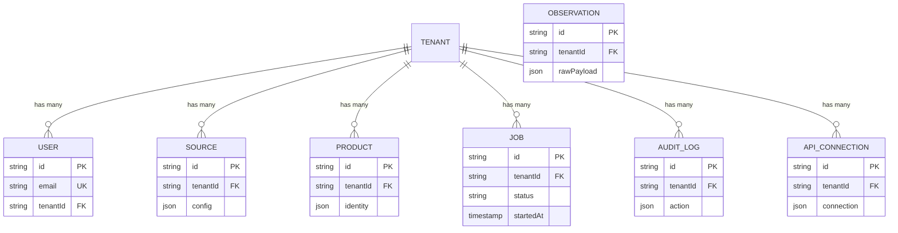
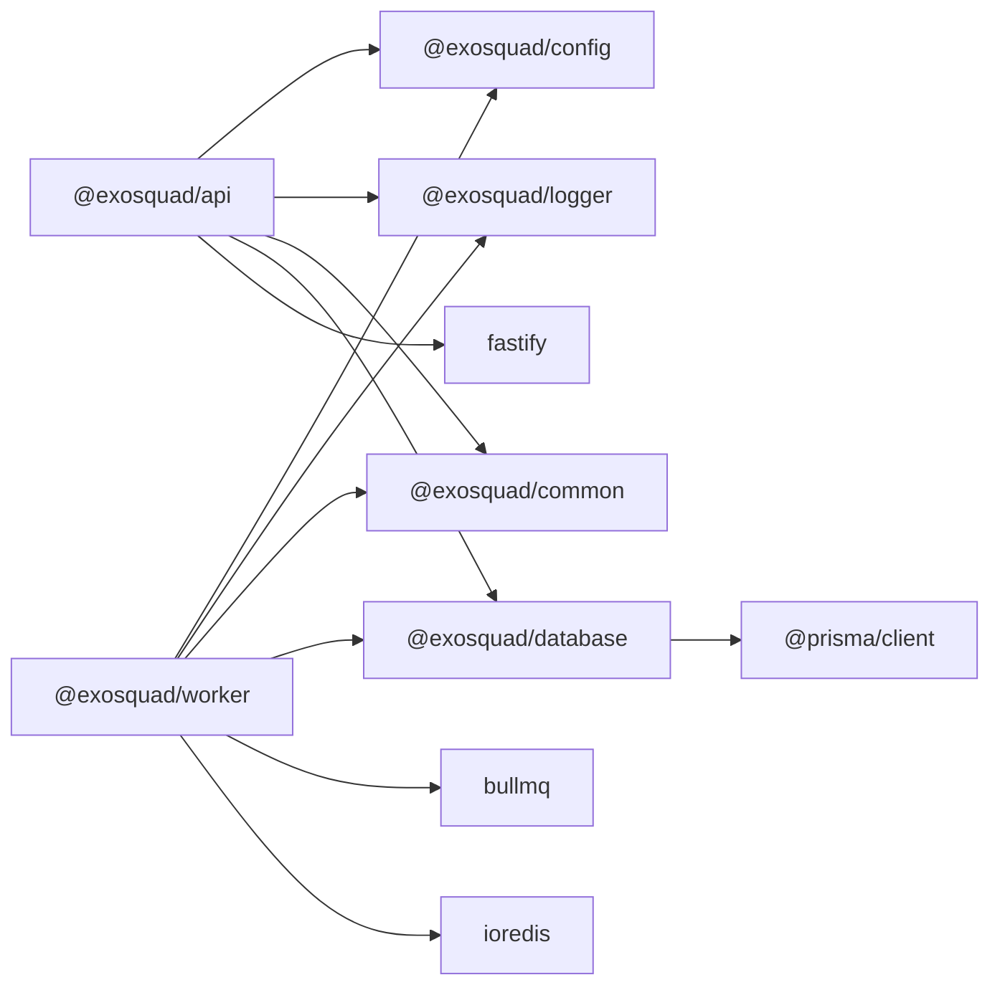

# Microservices Architecture

<cite>
**Referenced Files in This Document**
- [apps/api/src/app.ts](file://apps/api/src/app.ts)
- [apps/api/src/routes/auth.ts](file://apps/api/src/routes/auth.ts)
- [apps/api/src/plugins/rate-limit.ts](file://apps/api/src/plugins/rate-limit.ts)
- [apps/worker/src/app.ts](file://apps/worker/src/app.ts)
- [apps/worker/src/queues/queue-manager.ts](file://apps/worker/src/queues/queue-manager.ts)
- [apps/worker/src/processors/ingestion.ts](file://apps/worker/src/processors/ingestion.ts)
- [apps/worker/src/processors/normalization.ts](file://apps/worker/src/processors/normalization.ts)
- [docker-compose.yml](file://docker-compose.yml)
- [docs/ARCHITECTURE.md](file://docs/ARCHITECTURE.md)
- [packages/database/src/index.ts](file://packages/database/src/index.ts)
- [packages/database/prisma/schema.prisma](file://packages/database/prisma/schema.prisma)
</cite>

## Table of Contents
1. [Introduction](#introduction)
2. [Project Structure](#project-structure)
3. [Core Components](#core-components)
4. [Architecture Overview](#architecture-overview)
5. [Detailed Component Analysis](#detailed-component-analysis)
6. [Dependency Analysis](#dependency-analysis)
7. [Performance Considerations](#performance-considerations)
8. [Troubleshooting Guide](#troubleshooting-guide)
9. [Conclusion](#conclusion)

## Introduction
This document describes Exosquad’s microservices architecture with a clear separation between an HTTP API service and a background worker service. The API service is responsible for handling client requests, authentication, request tracking, rate limiting, and security headers. The worker service consumes jobs from Redis using BullMQ to run ingestion and normalization pipelines. Both services share infrastructure: PostgreSQL for persistent data and Redis for job queues and health metrics. The design supports independent scaling, fault isolation, structured observability, and eventual consistency through asynchronous job processing.

## Project Structure
Exosquad is organized as a monorepo with two primary application services under `apps/`, shared packages under `packages/`, local infrastructure configuration via Docker Compose, and architectural documentation.

**Diagram sources**
- [apps/api/src/app.ts:1-37](file://apps/api/src/app.ts#L1-L37)
- [apps/worker/src/app.ts:10-39](file://apps/worker/src/app.ts#L10-L39)
- [docker-compose.yml:8-39](file://docker-compose.yml#L8-L39)
- [packages/database/src/index.ts:1-37](file://packages/database/src/index.ts#L1-L37)

**Section sources**
- [docs/ARCHITECTURE.md:43-65](file://docs/ARCHITECTURE.md#L43-L65)
- [AGENTS.md:42-84](file://AGENTS.md#L42-L84)

## Core Components
- API Service (`@exosquad/api`): Fastify-based HTTP server exposing health and authentication routes, with plugins for request tracking, authentication, rate limiting, and security headers. It listens on a configurable port and centralizes error handling.
- Worker Service (`@exosquad/worker`): Background processor running BullMQ workers for ingestion and normalization queues. It also exposes a minimal Fastify health endpoint on a separate port.
- Shared Infrastructure:
  - Redis: Used by the worker for BullMQ queues and health statistics.
  - PostgreSQL: Used by both services for multi-tenant data, authentication, sources, observations, products, evidence, jobs, API connections, and audit logs.
- Shared Packages:
  - Database package provides Prisma client and schema.
  - Common package provides error hierarchy and shared types.
  - Config package validates environment variables.
  - Logger package provides Pino structured logging.

**Section sources**
- [apps/api/src/app.ts:12-37](file://apps/api/src/app.ts#L12-L37)
- [apps/worker/src/app.ts:10-39](file://apps/worker/src/app.ts#L10-L39)
- [docs/ARCHITECTURE.md:43-65](file://docs/ARCHITECTURE.md#L43-L65)
- [packages/database/src/index.ts:1-37](file://packages/database/src/index.ts#L1-L37)

## Architecture Overview
The system follows a pipeline architecture where external data flows through ingestion and normalization stages. The API handles synchronous user interactions, while long-running or I/O-heavy tasks are offloaded to the worker via Redis-backed queues.

**Diagram sources**
- [apps/api/src/app.ts:34-37](file://apps/api/src/app.ts#L34-L37)
- [apps/worker/src/queues/queue-manager.ts:23-37](file://apps/worker/src/queues/queue-manager.ts#L23-L37)
- [docker-compose.yml:8-39](file://docker-compose.yml#L8-L39)
- [packages/database/prisma/schema.prisma:15-18](file://packages/database/prisma/schema.prisma#L15-L18)

## Detailed Component Analysis

### API Service
Responsibilities:
- Initialize Fastify with request timeout and proxy trust settings.
- Register cross-cutting plugins: request tracker, authentication, rate limiter, security headers.
- Mount route groups: `/health` and `/api/v1/auth`.
- Centralized error handling mapping validation errors, known application errors, and unknown errors to consistent JSON responses.
- Start and stop lifecycle management with structured logging.

Key implementation points:
- Plugin registration order ensures auth and rate limiting apply before route handlers.
- Error handler distinguishes validation failures, typed application errors, and unexpected errors, preventing internal details from leaking.
- Health endpoints support liveness and readiness checks; readiness can reflect dependency health.

**Diagram sources**
- [apps/api/src/app.ts:15-37](file://apps/api/src/app.ts#L15-L37)
- [apps/api/src/app.ts:39-70](file://apps/api/src/app.ts#L39-L70)
- [apps/api/src/app.ts:73-84](file://apps/api/src/app.ts#L73-L84)

**Section sources**
- [apps/api/src/app.ts:1-96](file://apps/api/src/app.ts#L1-L96)
- [apps/api/src/routes/auth.ts:23-67](file://apps/api/src/routes/auth.ts#L23-L67)
- [apps/api/src/plugins/rate-limit.ts:28-61](file://apps/api/src/plugins/rate-limit.ts#L28-L61)

### Worker Service
Responsibilities:
- Manage BullMQ queues and workers for ingestion and normalization.
- Provide a minimal Fastify health server exposing liveness and readiness endpoints.
- Report queue statistics (waiting, active, failed) for readiness checks.
- Gracefully start and stop workers and queues.

Key implementation points:
- Connection options to Redis are centralized and reused across queues/workers.
- Ingestion worker includes a per-minute rate limiter to control external source access.
- Job enqueueing supports priority, attempts, exponential backoff, delay, idempotency keys, and cleanup policies.
- Health readiness reflects queue connectivity and status.

**Diagram sources**
- [apps/worker/src/queues/queue-manager.ts:19-165](file://apps/worker/src/queues/queue-manager.ts#L19-L165)
- [apps/worker/src/app.ts:10-59](file://apps/worker/src/app.ts#L10-L59)
- [apps/worker/src/processors/ingestion.ts:11-54](file://apps/worker/src/processors/ingestion.ts#L11-L54)
- [apps/worker/src/processors/normalization.ts:15-57](file://apps/worker/src/processors/normalization.ts#L15-L57)

**Section sources**
- [apps/worker/src/app.ts:1-61](file://apps/worker/src/app.ts#L1-L61)
- [apps/worker/src/queues/queue-manager.ts:1-165](file://apps/worker/src/queues/queue-manager.ts#L1-L165)
- [apps/worker/src/processors/ingestion.ts:1-55](file://apps/worker/src/processors/ingestion.ts#L1-L55)
- [apps/worker/src/processors/normalization.ts:1-58](file://apps/worker/src/processors/normalization.ts#L1-L58)

### Inter-Service Communication Patterns
- Asynchronous job processing: The API enqueues jobs into Redis queues; the worker consumes them via BullMQ.
- Health and readiness: Both services expose `/health` and `/health/ready`; the worker’s readiness includes queue stats.
- Shared state: PostgreSQL stores persistent entities; Redis stores job queues and temporary worker metrics.

**Diagram sources**
- [apps/worker/src/queues/queue-manager.ts:82-98](file://apps/worker/src/queues/queue-manager.ts#L82-L98)
- [apps/worker/src/app.ts:26-38](file://apps/worker/src/app.ts#L26-L38)

### Data Model and Persistence
The database layer uses Prisma with PostgreSQL. Core tables include tenants, users, sources, observations, products, product variants, evidence, jobs, API connections, and audit logs. Multi-tenancy is enforced via tenant-scoped relationships.

**Diagram sources**
- [packages/database/prisma/schema.prisma:20-41](file://packages/database/prisma/schema.prisma#L20-L41)
- [docs/ARCHITECTURE.md:73-85](file://docs/ARCHITECTURE.md#L73-L85)

**Section sources**
- [packages/database/src/index.ts:1-37](file://packages/database/src/index.ts#L1-L37)
- [packages/database/prisma/schema.prisma:15-18](file://packages/database/prisma/schema.prisma#L15-L18)
- [docs/ARCHITECTURE.md:68-92](file://docs/ARCHITECTURE.md#L68-L92)

## Dependency Analysis
The API and worker services depend on shared packages for configuration, logging, common types, and database access. External dependencies include Fastify, BullMQ, ioredis, and Prisma.

**Diagram sources**
- [apps/api/package.json:15-28](file://apps/api/package.json#L15-L28)
- [apps/worker/package.json:15-22](file://apps/worker/package.json#L15-L22)
- [packages/database/package.json:17-22](file://packages/database/package.json#L17-L22)

**Section sources**
- [apps/api/package.json:1-36](file://apps/api/package.json#L1-L36)
- [apps/worker/package.json:1-29](file://apps/worker/package.json#L1-L29)
- [packages/database/package.json:1-24](file://packages/database/package.json#L1-L24)

## Performance Considerations
- API scalability:
  - Stateless Fastify instances behind a reverse proxy or load balancer.
  - Request timeouts prevent slow clients from holding resources.
  - Rate limiting protects against abuse; consider migrating to Redis-backed rate limiting for horizontal scaling.
- Worker scalability:
  - Multiple worker processes can consume the same queues; concurrency is configurable.
  - Per-queue rate limiting controls external source pressure.
  - Idempotency keys and retries ensure resilience without duplicate processing.
- Database performance:
  - Use Prisma query optimization and indexing strategies aligned with tenant-scoped queries.
  - Avoid heavy writes in API request paths; push to background jobs.
- Observability:
  - Structured JSON logs enable aggregation and correlation across services.
  - Health endpoints provide liveness/readiness signals for orchestration.

[No sources needed since this section provides general guidance]

## Troubleshooting Guide
- API health checks:
  - `/health` indicates process liveness.
  - `/health/ready` should reflect dependency reachability; if degraded, check PostgreSQL connectivity and configuration.
- Worker health checks:
  - `/health` indicates process liveness.
  - `/health/ready` returns queue stats; if any queue reports error status, verify Redis connectivity and credentials.
- Job failures:
  - Check worker logs for job-level errors; the worker attaches completed, failed, and error events with structured context.
  - Inspect queue metrics (waiting, active, failed) to detect bottlenecks or dead-letter accumulation.
- Rate limiting:
  - If clients receive 429 responses, review per-IP limits and consider upgrading to distributed rate limiting.

**Section sources**
- [apps/api/src/app.ts:39-70](file://apps/api/src/app.ts#L39-L70)
- [apps/worker/src/app.ts:26-38](file://apps/worker/src/app.ts#L26-L38)
- [apps/worker/src/queues/queue-manager.ts:141-163](file://apps/worker/src/queues/queue-manager.ts#L141-L163)
- [apps/api/src/plugins/rate-limit.ts:28-61](file://apps/api/src/plugins/rate-limit.ts#L28-L61)

## Conclusion
Exosquad’s microservices architecture cleanly separates HTTP request handling from background job processing. The API service focuses on fast, secure, and validated HTTP interactions, while the worker service reliably processes ingestion and normalization tasks via BullMQ and Redis. Shared infrastructure (PostgreSQL and Redis) enables persistence and asynchronous coordination. The design supports independent scaling, fault isolation, and comprehensive observability, laying a solid foundation for future phases that implement full ingestion, normalization, entity resolution, and analytics pipelines.

[No sources needed since this section summarizes without analyzing specific files]