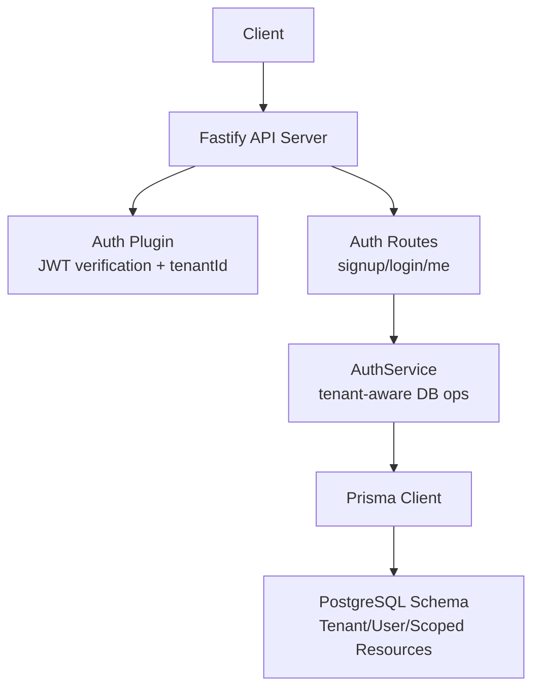
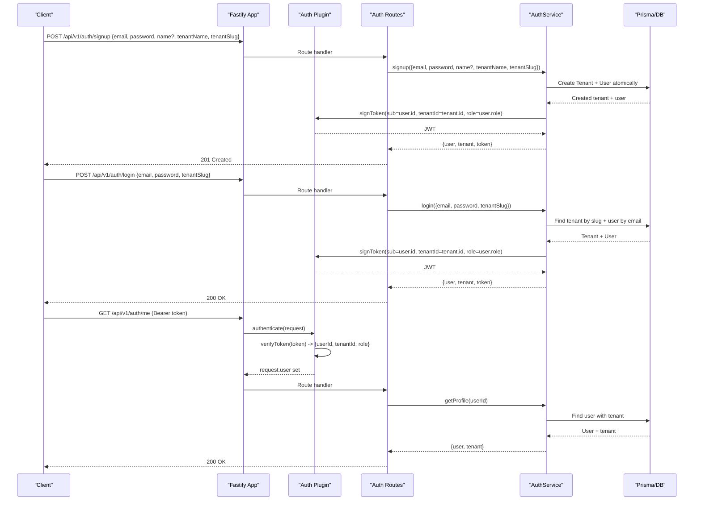
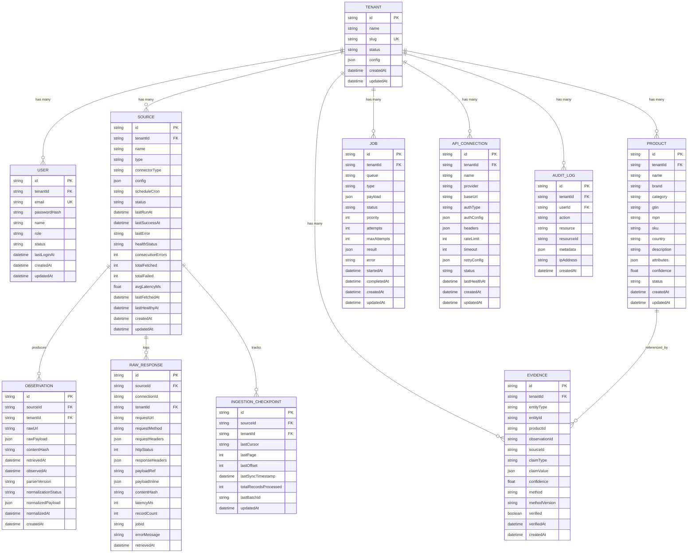
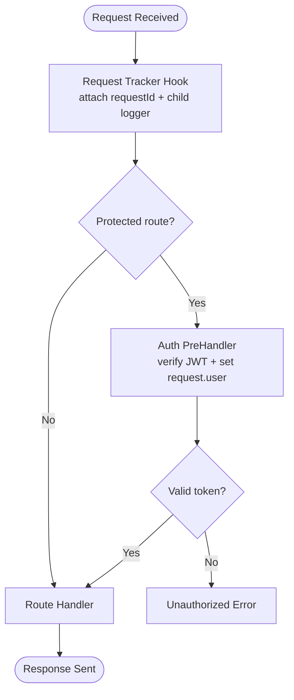
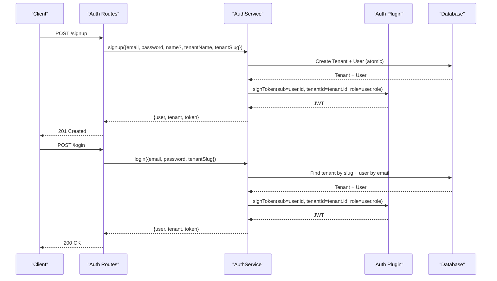
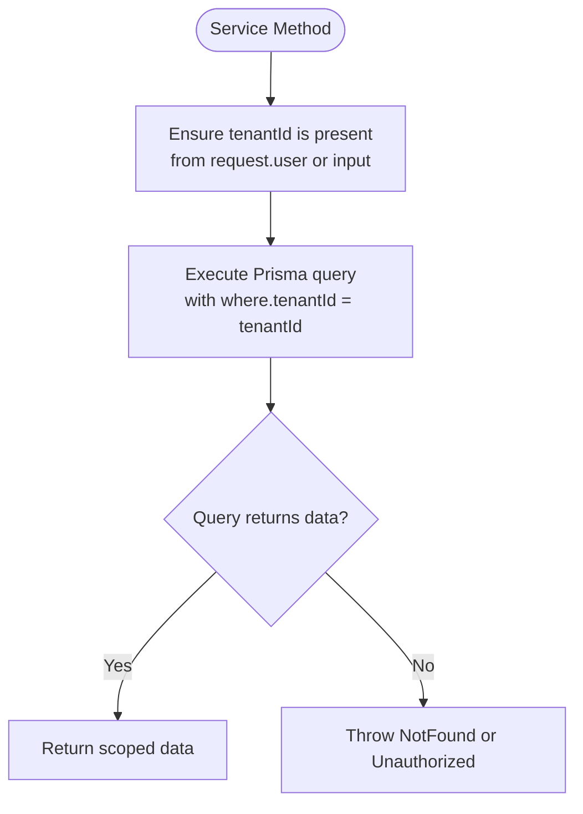
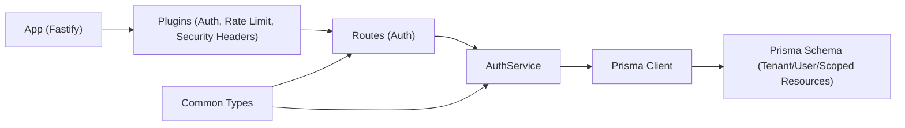

# Multi-Tenancy Design

<cite>
**Referenced Files in This Document**
- [app.ts](file://apps/api/src/app.ts)
- [auth.ts (plugin)](file://apps/api/src/plugins/auth.ts)
- [request-tracker.ts](file://apps/api/src/plugins/request-tracker.ts)
- [auth.ts (routes)](file://apps/api/src/routes/auth.ts)
- [auth.ts (service)](file://apps/api/src/services/auth.ts)
- [schema.prisma](file://packages/database/prisma/schema.prisma)
- [index.ts (common types)](file://packages/common/src/index.ts)
- [ARCHITECTURE.md](file://docs/ARCHITECTURE.md)
</cite>

## Table of Contents
1. [Introduction](#introduction)
2. [Project Structure](#project-structure)
3. [Core Components](#core-components)
4. [Architecture Overview](#architecture-overview)
5. [Detailed Component Analysis](#detailed-component-analysis)
6. [Dependency Analysis](#dependency-analysis)
7. [Performance Considerations](#performance-considerations)
8. [Troubleshooting Guide](#troubleshooting-guide)
9. [Conclusion](#conclusion)

## Introduction
This document explains the multi-tenancy implementation strategy across the application, focusing on tenant isolation at the application level, user-tenant relationships, data segregation patterns, and how tenant context is propagated through the request lifecycle. It also covers authentication integration, database query scoping, configuration management, migration strategies, and performance considerations for multi-tenant scenarios.

The system uses a shared-database, row-level isolation model: every table includes a tenant identifier, and all queries filter by tenant. Authentication tokens carry the tenant identifier to enforce isolation consistently from the API layer down to the database.

## Project Structure
At a high level, multi-tenancy spans these areas:
- API server bootstrapping and plugin registration
- Authentication middleware that decodes JWTs containing tenant information
- Auth routes handling signup and login flows with tenant scoping
- Service layer performing tenant-aware operations against Prisma
- Database schema defining tenants, users, and tenant-scoped resources
- Shared types and architecture documentation describing security and multi-tenancy principles

**Diagram sources**
- [app.ts:27-37](file://apps/api/src/app.ts#L27-L37)
- [auth.ts (plugin):70-93](file://apps/api/src/plugins/auth.ts#L70-L93)
- [auth.ts (routes):23-67](file://apps/api/src/routes/auth.ts#L23-L67)
- [auth.ts (service):26-189](file://apps/api/src/services/auth.ts#L26-L189)
- [schema.prisma:24-64](file://packages/database/prisma/schema.prisma#L24-L64)

**Section sources**
- [app.ts:12-37](file://apps/api/src/app.ts#L12-L37)
- [ARCHITECTURE.md:68-85](file://docs/ARCHITECTURE.md#L68-L85)

## Core Components
- Tenant entity and user relationship: The schema defines a Tenant model and a User model linked via tenantId. Users are scoped to a single tenant, and many resource tables include tenantId to ensure isolation.
- Authentication plugin: Decodes JWTs, validates required fields including tenantId, and attaches an authenticated user object to each request.
- Auth routes: Validate inputs using Zod schemas, call service methods for signup/login/profile retrieval, and return structured responses.
- Auth service: Performs tenant-aware operations such as creating a tenant and owner user atomically, authenticating users within a specific tenant, and retrieving profiles with tenant details.
- Request tracking: Adds request IDs and child loggers for observability; while not directly propagating tenant context, it supports auditability alongside tenant-scoped operations.

Key responsibilities:
- Enforce tenant presence in JWTs and reject requests without valid tenant identifiers.
- Ensure signup creates both tenant and initial user atomically.
- Ensure login resolves the correct tenant by slug and authenticates only users belonging to that tenant.
- Return tenant metadata alongside user data where appropriate.

**Section sources**
- [schema.prisma:24-64](file://packages/database/prisma/schema.prisma#L24-L64)
- [auth.ts (plugin):7-16](file://apps/api/src/plugins/auth.ts#L7-L16)
- [auth.ts (plugin):24-48](file://apps/api/src/plugins/auth.ts#L24-L48)
- [auth.ts (plugin):70-93](file://apps/api/src/plugins/auth.ts#L70-L93)
- [auth.ts (routes):5-21](file://apps/api/src/routes/auth.ts#L5-L21)
- [auth.ts (routes):23-67](file://apps/api/src/routes/auth.ts#L23-L67)
- [auth.ts (service):26-87](file://apps/api/src/services/auth.ts#L26-L87)
- [auth.ts (service):92-156](file://apps/api/src/services/auth.ts#L92-L156)
- [auth.ts (service):158-189](file://apps/api/src/services/auth.ts#L158-L189)
- [request-tracker.ts:9-28](file://apps/api/src/plugins/request-tracker.ts#L9-L28)

## Architecture Overview
Multi-tenancy is implemented as a shared database with explicit tenant scoping:
- Every resource table includes a tenantId foreign key and indexes for efficient filtering.
- Authentication tokens contain userId, tenantId, and role.
- Protected routes use an authenticate preHandler to validate tokens and attach user context.
- Services perform tenant-aware operations using Prisma, ensuring queries are filtered by tenant.

**Diagram sources**
- [auth.ts (routes):23-67](file://apps/api/src/routes/auth.ts#L23-L67)
- [auth.ts (service):26-189](file://apps/api/src/services/auth.ts#L26-L189)
- [auth.ts (plugin):24-48](file://apps/api/src/plugins/auth.ts#L24-L48)
- [auth.ts (plugin):70-93](file://apps/api/src/plugins/auth.ts#L70-L93)

## Detailed Component Analysis

### Tenant Isolation Strategy
- Data model: All core entities include tenantId and are indexed for efficient filtering. Examples include User, Source, Observation, Product, Evidence, Job, ApiConnection, RawResponse, IngestionCheckpoint, and AuditLog.
- Application enforcement: Authentication middleware ensures every protected request carries a valid tenantId. Services must always scope queries by tenantId when accessing tenant-specific resources.
- Security posture: The architecture document states that every table includes a tenantId foreign key and all queries filter by tenant, enforcing isolation at both application and database levels.

**Diagram sources**
- [schema.prisma:24-64](file://packages/database/prisma/schema.prisma#L24-L64)
- [schema.prisma:70-102](file://packages/database/prisma/schema.prisma#L70-L102)
- [schema.prisma:108-131](file://packages/database/prisma/schema.prisma#L108-L131)
- [schema.prisma:137-162](file://packages/database/prisma/schema.prisma#L137-L162)
- [schema.prisma:190-214](file://packages/database/prisma/schema.prisma#L190-L214)
- [schema.prisma:220-244](file://packages/database/prisma/schema.prisma#L220-L244)
- [schema.prisma:250-271](file://packages/database/prisma/schema.prisma#L250-L271)
- [schema.prisma:277-295](file://packages/database/prisma/schema.prisma#L277-L295)
- [schema.prisma:301-328](file://packages/database/prisma/schema.prisma#L301-L328)
- [schema.prisma:334-351](file://packages/database/prisma/schema.prisma#L334-L351)

**Section sources**
- [ARCHITECTURE.md:68-85](file://docs/ARCHITECTURE.md#L68-L85)
- [schema.prisma:24-64](file://packages/database/prisma/schema.prisma#L24-L64)
- [schema.prisma:70-102](file://packages/database/prisma/schema.prisma#L70-L102)
- [schema.prisma:108-131](file://packages/database/prisma/schema.prisma#L108-L131)
- [schema.prisma:137-162](file://packages/database/prisma/schema.prisma#L137-L162)
- [schema.prisma:190-214](file://packages/database/prisma/schema.prisma#L190-L214)
- [schema.prisma:220-244](file://packages/database/prisma/schema.prisma#L220-L244)
- [schema.prisma:250-271](file://packages/database/prisma/schema.prisma#L250-L271)
- [schema.prisma:277-295](file://packages/database/prisma/schema.prisma#L277-L295)
- [schema.prisma:301-328](file://packages/database/prisma/schema.prisma#L301-L328)
- [schema.prisma:334-351](file://packages/database/prisma/schema.prisma#L334-L351)

### Tenant Context Propagation Through Request Lifecycle
- Request entry: Fastify registers plugins and routes during app initialization.
- Request tracking: Adds requestId and child logger to the request object for observability.
- Authentication: The authenticate preHandler verifies the Bearer token, decodes it, and sets request.user with userId, tenantId, and role.
- Route handlers: Use request.user.tenantId implicitly or explicitly to scope operations.

**Diagram sources**
- [request-tracker.ts:9-28](file://apps/api/src/plugins/request-tracker.ts#L9-L28)
- [auth.ts (plugin):70-93](file://apps/api/src/plugins/auth.ts#L70-L93)

**Section sources**
- [app.ts:27-37](file://apps/api/src/app.ts#L27-L37)
- [request-tracker.ts:9-28](file://apps/api/src/plugins/request-tracker.ts#L9-L28)
- [auth.ts (plugin):70-93](file://apps/api/src/plugins/auth.ts#L70-L93)

### Authentication Flow Integration
- Token structure: JWT contains sub (userId), tenantId, and role. Verification enforces presence and types.
- Signup flow: Creates a new tenant and an owner user atomically, then signs a JWT with the new user’s ID, tenant ID, and role.
- Login flow: Resolves tenant by slug, finds the user by email within that tenant, validates password, updates last login timestamp, and signs a JWT.
- Profile retrieval: Returns user profile with associated tenant details.

**Diagram sources**
- [auth.ts (routes):23-67](file://apps/api/src/routes/auth.ts#L23-L67)
- [auth.ts (service):26-189](file://apps/api/src/services/auth.ts#L26-L189)
- [auth.ts (plugin):53-63](file://apps/api/src/plugins/auth.ts#L53-L63)

**Section sources**
- [auth.ts (plugin):24-48](file://apps/api/src/plugins/auth.ts#L24-L48)
- [auth.ts (plugin):53-63](file://apps/api/src/plugins/auth.ts#L53-L63)
- [auth.ts (routes):23-67](file://apps/api/src/routes/auth.ts#L23-L67)
- [auth.ts (service):26-189](file://apps/api/src/services/auth.ts#L26-L189)

### Database Query Scoping Patterns
- Tenant-scoped models: User, Source, Observation, Product, Evidence, Job, ApiConnection, RawResponse, IngestionCheckpoint, and AuditLog include tenantId.
- Indexing: Most tenant-scoped tables have indexes on tenantId to optimize filtering.
- Query enforcement: The architecture document mandates that all queries filter by tenant, ensuring isolation at the application level.

Examples of tenant-aware operations:
- Creating a tenant and user atomically during signup.
- Authenticating a user within a specific tenant by slug.
- Retrieving user profile with tenant details.

**Diagram sources**
- [auth.ts (service):26-87](file://apps/api/src/services/auth.ts#L26-L87)
- [auth.ts (service):92-156](file://apps/api/src/services/auth.ts#L92-L156)
- [auth.ts (service):158-189](file://apps/api/src/services/auth.ts#L158-L189)
- [schema.prisma:24-64](file://packages/database/prisma/schema.prisma#L24-L64)

**Section sources**
- [ARCHITECTURE.md:68-85](file://docs/ARCHITECTURE.md#L68-L85)
- [schema.prisma:24-64](file://packages/database/prisma/schema.prisma#L24-L64)
- [schema.prisma:70-102](file://packages/database/prisma/schema.prisma#L70-L102)
- [schema.prisma:108-131](file://packages/database/prisma/schema.prisma#L108-L131)
- [schema.prisma:137-162](file://packages/database/prisma/schema.prisma#L137-L162)
- [schema.prisma:190-214](file://packages/database/prisma/schema.prisma#L190-L214)
- [schema.prisma:220-244](file://packages/database/prisma/schema.prisma#L220-L244)
- [schema.prisma:250-271](file://packages/database/prisma/schema.prisma#L250-L271)
- [schema.prisma:277-295](file://packages/database/prisma/schema.prisma#L277-L295)
- [schema.prisma:301-328](file://packages/database/prisma/schema.prisma#L301-L328)
- [schema.prisma:334-351](file://packages/database/prisma/schema.prisma#L334-L351)

### Tenant Configuration Management
- Tenant configuration storage: The Tenant model includes a JSON config field for per-tenant settings.
- Environment validation: The architecture document references environment validation via Zod in shared packages, indicating configuration is validated at startup.
- Best practices: Store sensitive tenant settings encrypted at rest and reference them securely in services.

**Section sources**
- [schema.prisma:24-41](file://packages/database/prisma/schema.prisma#L24-L41)
- [ARCHITECTURE.md:60-64](file://docs/ARCHITECTURE.md#L60-L64)

### Migration Strategies
- Prisma migrations: The database package includes scripts for generating and deploying migrations, ensuring schema changes are versioned and applied consistently.
- Multi-tenant schema evolution: When adding new tenant-scoped fields or tables, ensure indexes on tenantId are included to maintain query performance.

**Section sources**
- [schema.prisma:1-18](file://packages/database/prisma/schema.prisma#L1-L18)

### Performance Considerations
- Indexing: Tenant-scoped tables should be indexed on tenantId to optimize filtering.
- Query design: Always filter by tenantId in Prisma queries to avoid full-table scans.
- Connection pooling: Ensure database connection pools are sized appropriately for multi-tenant workloads.
- Observability: Use request tracking and structured logging to monitor tenant-specific performance and errors.

**Section sources**
- [schema.prisma:24-64](file://packages/database/prisma/schema.prisma#L24-L64)
- [schema.prisma:70-102](file://packages/database/prisma/schema.prisma#L70-L102)
- [schema.prisma:108-131](file://packages/database/prisma/schema.prisma#L108-L131)
- [schema.prisma:137-162](file://packages/database/prisma/schema.prisma#L137-L162)
- [schema.prisma:190-214](file://packages/database/prisma/schema.prisma#L190-L214)
- [schema.prisma:220-244](file://packages/database/prisma/schema.prisma#L220-L244)
- [schema.prisma:250-271](file://packages/database/prisma/schema.prisma#L250-L271)
- [schema.prisma:277-295](file://packages/database/prisma/schema.prisma#L277-L295)
- [schema.prisma:301-328](file://packages/database/prisma/schema.prisma#L301-L328)
- [schema.prisma:334-351](file://packages/database/prisma/schema.prisma#L334-L351)
- [request-tracker.ts:9-28](file://apps/api/src/plugins/request-tracker.ts#L9-L28)

## Dependency Analysis
The multi-tenancy implementation depends on several components working together:
- Fastify app initializes plugins and routes.
- Auth plugin provides JWT verification and tenant context.
- Auth routes handle signup/login and call service methods.
- Auth service performs tenant-aware database operations.
- Prisma client interacts with the PostgreSQL schema.
- Common types define shared interfaces like AuthenticatedRequest.

**Diagram sources**
- [app.ts:27-37](file://apps/api/src/app.ts#L27-L37)
- [auth.ts (plugin):70-93](file://apps/api/src/plugins/auth.ts#L70-L93)
- [auth.ts (routes):23-67](file://apps/api/src/routes/auth.ts#L23-L67)
- [auth.ts (service):26-189](file://apps/api/src/services/auth.ts#L26-L189)
- [index.ts (common types):130-134](file://packages/common/src/index.ts#L130-L134)
- [schema.prisma:24-64](file://packages/database/prisma/schema.prisma#L24-L64)

**Section sources**
- [app.ts:27-37](file://apps/api/src/app.ts#L27-L37)
- [auth.ts (plugin):70-93](file://apps/api/src/plugins/auth.ts#L70-L93)
- [auth.ts (routes):23-67](file://apps/api/src/routes/auth.ts#L23-L67)
- [auth.ts (service):26-189](file://apps/api/src/services/auth.ts#L26-L189)
- [index.ts (common types):130-134](file://packages/common/src/index.ts#L130-L134)
- [schema.prisma:24-64](file://packages/database/prisma/schema.prisma#L24-L64)

## Performance Considerations
- Tenant-scoped indexing: Ensure tenantId columns are indexed to optimize filtering.
- Query efficiency: Always include tenantId in Prisma query filters to avoid scanning unrelated rows.
- Connection management: Size database connection pools based on expected multi-tenant concurrency.
- Logging overhead: Use structured logging judiciously to avoid excessive I/O in high-throughput scenarios.

[No sources needed since this section provides general guidance]

## Troubleshooting Guide
Common issues and resolutions:
- Invalid or missing tenantId in JWT: Verify token signing includes tenantId and that verification logic checks its presence and type.
- Unauthorized access across tenants: Ensure all service methods filter queries by tenantId and do not bypass tenant scoping.
- Slow queries on tenant-scoped tables: Check indexes on tenantId and review query plans to ensure filters are applied efficiently.
- Signup conflicts: Handle tenant slug uniqueness errors gracefully and provide clear error messages.

**Section sources**
- [auth.ts (plugin):24-48](file://apps/api/src/plugins/auth.ts#L24-L48)
- [auth.ts (service):36-42](file://apps/api/src/services/auth.ts#L36-L42)
- [schema.prisma:24-41](file://packages/database/prisma/schema.prisma#L24-L41)

## Conclusion
The multi-tenancy strategy relies on explicit tenant scoping at both the application and database layers. Authentication tokens carry tenant identifiers, and all protected routes enforce tenant context. The database schema ensures every resource is tied to a tenant, with indexes supporting efficient filtering. By following these patterns—validating tenant presence in tokens, scoping all queries by tenantId, and leveraging Prisma migrations for schema evolution—the system maintains strong tenant isolation and scalability.

[No sources needed since this section summarizes without analyzing specific files]