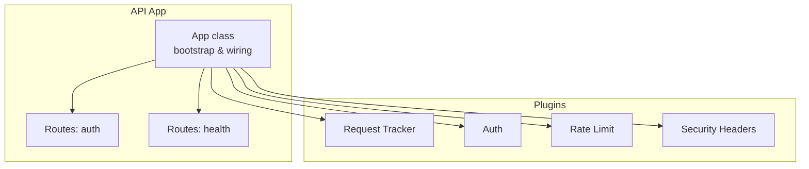
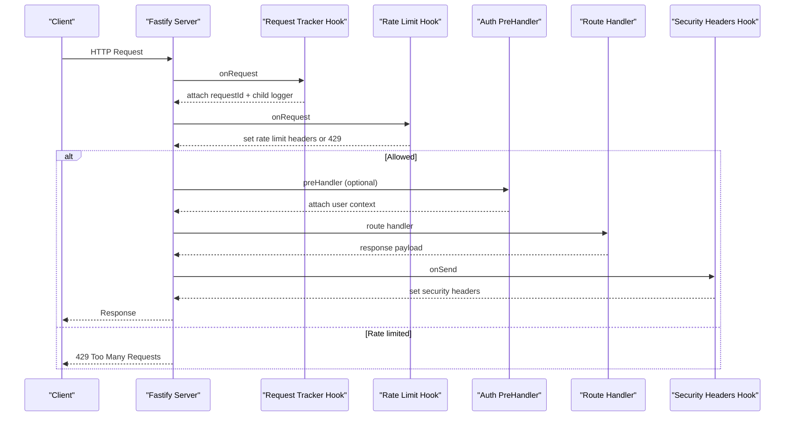
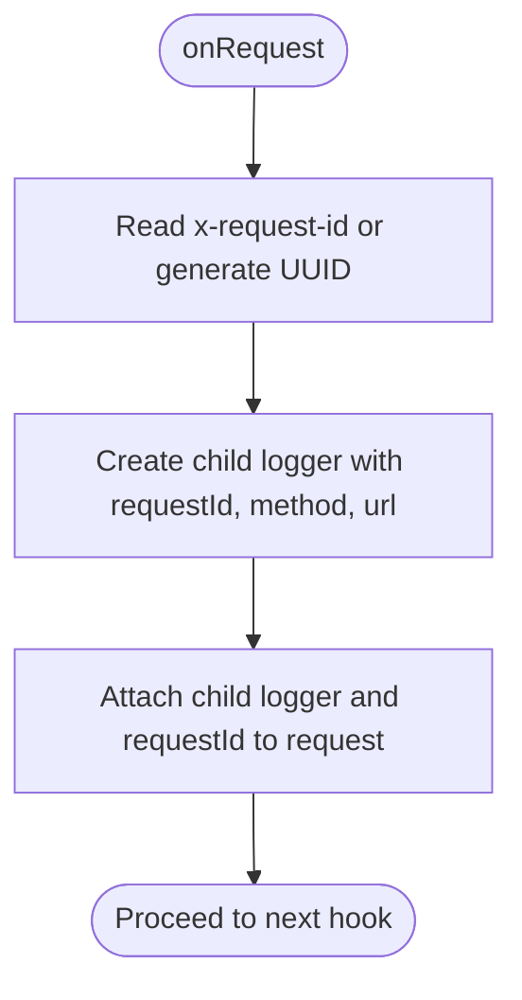
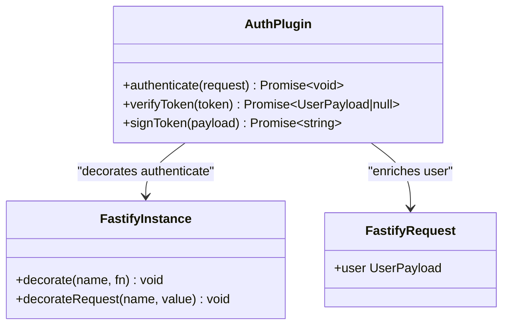
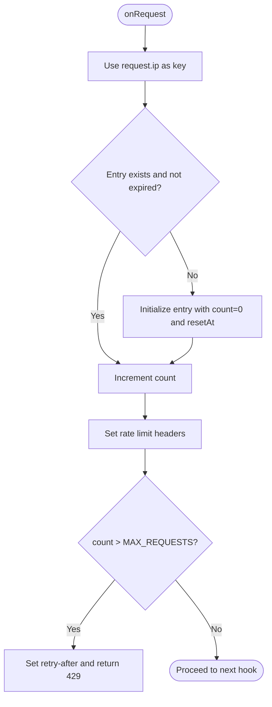
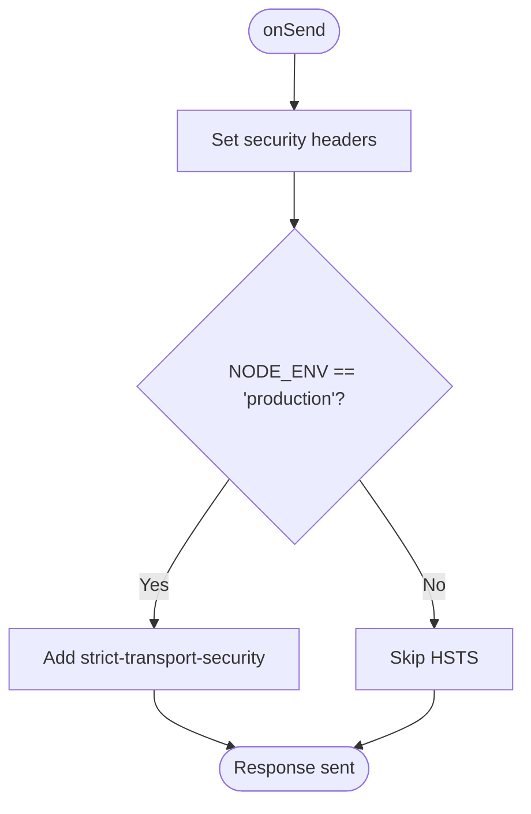
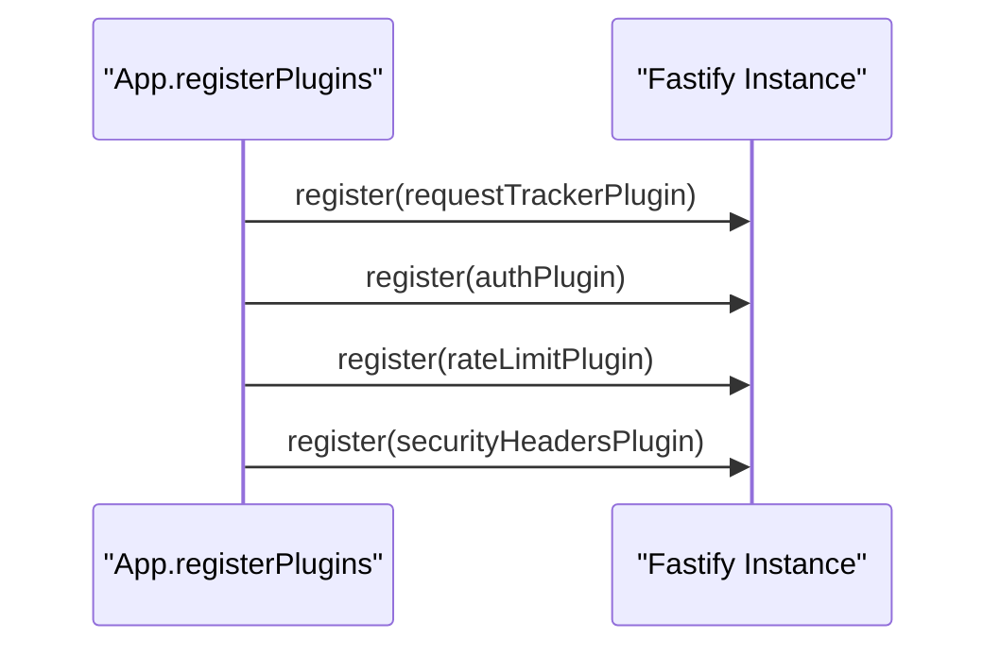
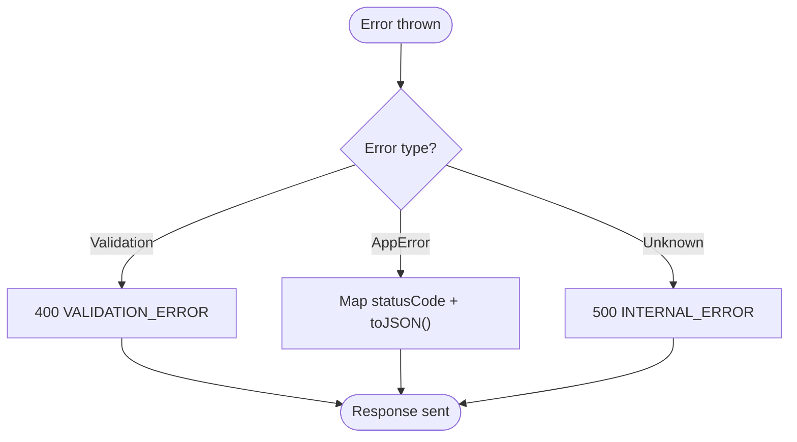
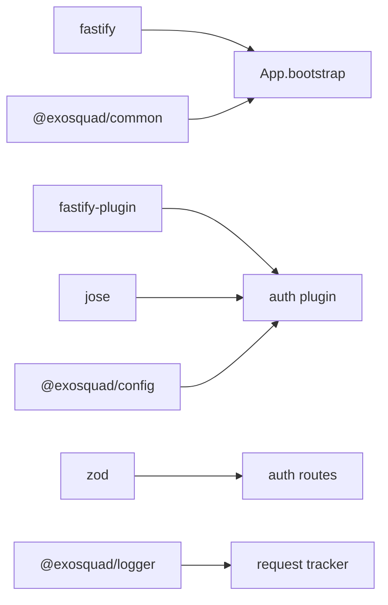

# Plugin System Architecture

<cite>
**Referenced Files in This Document**
- [app.ts](file://apps/api/src/app.ts)
- [auth.ts](file://apps/api/src/plugins/auth.ts)
- [rate-limit.ts](file://apps/api/src/plugins/rate-limit.ts)
- [security-headers.ts](file://apps/api/src/plugins/security-headers.ts)
- [request-tracker.ts](file://apps/api/src/plugins/request-tracker.ts)
- [auth.ts](file://apps/api/src/routes/auth.ts)
- [auth.test.ts](file://apps/api/test/integration/auth.test.ts)
- [package.json](file://apps/api/package.json)
</cite>

## Table of Contents
1. [Introduction](#introduction)
2. [Project Structure](#project-structure)
3. [Core Components](#core-components)
4. [Architecture Overview](#architecture-overview)
5. [Detailed Component Analysis](#detailed-component-analysis)
6. [Dependency Analysis](#dependency-analysis)
7. [Performance Considerations](#performance-considerations)
8. [Troubleshooting Guide](#troubleshooting-guide)
9. [Conclusion](#conclusion)

## Introduction
This document explains the Fastify plugin system used by the API application. It focuses on how cross-cutting concerns are encapsulated as plugins: authentication, rate limiting, security headers, and request tracking. It also covers the plugin registration lifecycle, dependency injection patterns, extension points, error handling within plugins, and testing strategies for custom plugins. Concrete references to the actual codebase are provided via section sources and diagrams that map directly to source files.

## Project Structure
The API app organizes cross-cutting functionality into a dedicated plugins directory. The application bootstrap wires these plugins together with routes and global error handling.

**Diagram sources**
- [app.ts:27-37](file://apps/api/src/app.ts#L27-L37)
- [auth.ts](file://apps/api/src/routes/auth.ts)
- [health.ts](file://apps/api/src/routes/health.ts)

**Section sources**
- [app.ts:12-37](file://apps/api/src/app.ts#L12-L37)

## Core Components
- Request Tracker: injects a per-request ID and child logger into each request; prepares payload for downstream processing.
- Authentication: provides an `authenticate` preHandler and enriches requests with user context after validating JWT tokens.
- Rate Limiting: enforces per-IP request limits using an in-memory store and sets standard rate limit headers.
- Security Headers: attaches security-related response headers on every response.

These plugins are registered in a specific order to ensure correct hook execution and middleware composition.

**Section sources**
- [request-tracker.ts:9-42](file://apps/api/src/plugins/request-tracker.ts#L9-L42)
- [auth.ts:70-93](file://apps/api/src/plugins/auth.ts#L70-L93)
- [rate-limit.ts:28-61](file://apps/api/src/plugins/rate-limit.ts#L28-L61)
- [security-headers.ts:7-30](file://apps/api/src/plugins/security-headers.ts#L7-L30)
- [app.ts:27-32](file://apps/api/src/app.ts#L27-L32)

## Architecture Overview
The application bootstraps Fastify, registers plugins, then registers routes and global error handling. Plugins use Fastify hooks and decorators to extend behavior across all routes.

**Diagram sources**
- [app.ts:27-37](file://apps/api/src/app.ts#L27-L37)
- [request-tracker.ts:12-28](file://apps/api/src/plugins/request-tracker.ts#L12-L28)
- [rate-limit.ts:29-60](file://apps/api/src/plugins/rate-limit.ts#L29-L60)
- [auth.ts:73-90](file://apps/api/src/plugins/auth.ts#L73-L90)
- [security-headers.ts:10-29](file://apps/api/src/plugins/security-headers.ts#L10-L29)

## Detailed Component Analysis

### Request Tracking Plugin
Purpose:
- Assign a unique request ID from upstream header or generate one.
- Create a child logger bound to the request context.
- Attach the child logger and request ID to the request object.
- Prepare payload during send phase.

Key behaviors:
- Uses Fastify’s `onRequest` hook to initialize context.
- Uses Fastify’s `onSend` hook to normalize payload when needed.

**Diagram sources**
- [request-tracker.ts:12-28](file://apps/api/src/plugins/request-tracker.ts#L12-L28)

Error handling:
- No explicit errors thrown; relies on downstream error handling.

Testing strategy:
- Verify that child logger is attached and requestId is present on the request object.
- Validate that payload normalization occurs in `onSend`.

**Section sources**
- [request-tracker.ts:9-42](file://apps/api/src/plugins/request-tracker.ts#L9-L42)

### Authentication Plugin
Purpose:
- Provide a reusable `authenticate` preHandler.
- Enforce Bearer token validation and decode JWT.
- Enrich request with authenticated user context.

Key behaviors:
- Extends FastifyRequest type to include user metadata.
- Exposes utility functions for verifying and signing tokens.
- Uses fastify-plugin to expose a global decorator.

**Diagram sources**
- [auth.ts:70-100](file://apps/api/src/plugins/auth.ts#L70-L100)
- [auth.ts:7-16](file://apps/api/src/plugins/auth.ts#L7-L16)

Error handling:
- Throws UnauthorizedError for missing/invalid authorization header or invalid/expired token.
- Centralized error mapping converts known errors to consistent JSON responses.

Usage example:
- Routes can call `server.authenticate(request)` in a preHandler to protect endpoints.

**Section sources**
- [auth.ts:24-63](file://apps/api/src/plugins/auth.ts#L24-L63)
- [auth.ts:70-100](file://apps/api/src/plugins/auth.ts#L70-L100)
- [auth.ts:55-66](file://apps/api/src/routes/auth.ts#L55-L66)
- [app.ts:39-70](file://apps/api/src/app.ts#L39-L70)

### Rate Limiting Plugin
Purpose:
- Protect endpoints from excessive requests using a simple in-memory store keyed by IP.
- Set standard rate limit headers and return 429 when exceeded.

Key behaviors:
- Registers an `onRequest` hook to count requests per window.
- Periodically cleans up expired entries and allows process exit without blocking.

**Diagram sources**
- [rate-limit.ts:28-60](file://apps/api/src/plugins/rate-limit.ts#L28-L60)

Error handling:
- Returns 429 with a structured error body when limit exceeded.

Production note:
- Replace in-memory store with Redis-backed implementation for horizontal scaling.

**Section sources**
- [rate-limit.ts:1-61](file://apps/api/src/plugins/rate-limit.ts#L1-L61)

### Security Headers Plugin
Purpose:
- Apply security-related headers to every response.

Key behaviors:
- Registers an `onSend` hook to set headers like content-type options, frame options, referrer policy, permissions policy, and HSTS in production.

**Diagram sources**
- [security-headers.ts:7-30](file://apps/api/src/plugins/security-headers.ts#L7-L30)

**Section sources**
- [security-headers.ts:1-30](file://apps/api/src/plugins/security-headers.ts#L1-L30)

### Plugin Registration Lifecycle
Order of registration:
1. Request Tracker
2. Auth
3. Rate Limit
4. Security Headers

This ordering ensures:
- Request context is available early.
- Authentication runs before protected routes.
- Rate limiting applies globally.
- Security headers are applied last to cover all responses.

**Diagram sources**
- [app.ts:27-32](file://apps/api/src/app.ts#L27-L32)

**Section sources**
- [app.ts:27-32](file://apps/api/src/app.ts#L27-L32)

### Dependency Injection Patterns
- Decorators: The auth plugin decorates FastifyInstance with `authenticate` and FastifyRequest with `user`.
- Hooks: Plugins use `addHook` to tap into request/response lifecycle events.
- Configuration: Plugins read configuration values (e.g., JWT secret, expiration) from a shared config module.
- Services: Routes instantiate services (e.g., AuthService) to perform business logic.

Examples:
- Decorator usage in routes: calling `server.authenticate(request)` in a preHandler.
- Config usage in auth plugin for JWT operations.

**Section sources**
- [auth.ts:70-100](file://apps/api/src/plugins/auth.ts#L70-L100)
- [auth.ts:18-63](file://apps/api/src/plugins/auth.ts#L18-L63)
- [auth.ts:55-66](file://apps/api/src/routes/auth.ts#L55-L66)

### Error Handling Within Plugins
- Auth plugin throws domain-specific errors (e.g., UnauthorizedError).
- Global error handler maps validation errors, known application errors, and unknown errors to standardized JSON responses.
- Rate limiter returns a structured 429 response.

**Diagram sources**
- [app.ts:39-70](file://apps/api/src/app.ts#L39-L70)

**Section sources**
- [app.ts:39-70](file://apps/api/src/app.ts#L39-L70)
- [rate-limit.ts:50-58](file://apps/api/src/plugins/rate-limit.ts#L50-L58)

### Testing Strategies for Custom Plugins
- Unit tests: Assert plugin behavior in isolation (e.g., verify token decoding/signing utilities).
- Integration tests: Register the plugin with a test Fastify instance, then exercise routes that depend on it.
- Example pattern:
  - Create a Fastify instance.
  - Register the plugin under test.
  - Register relevant routes.
  - Use `app.inject` to simulate requests and assert status codes and bodies.

Concrete reference:
- Integration test for auth routes demonstrates registering the auth plugin and asserting protected route behavior.

**Section sources**
- [auth.test.ts:1-48](file://apps/api/test/integration/auth.test.ts#L1-L48)

## Dependency Analysis
External dependencies relevant to the plugin system:
- fastify: core framework providing hooks, decorators, and plugin registration.
- fastify-plugin: enables breaking encapsulation for global decorators.
- jose: JWT verification and signing.
- Zod: schema validation in routes.
- Workspace packages: @exosquad/config, @exosquad/logger, @exosquad/common.

**Diagram sources**
- [package.json:15-29](file://apps/api/package.json#L15-L29)
- [auth.ts:1-6](file://apps/api/src/plugins/auth.ts#L1-L6)
- [request-tracker.ts:1-3](file://apps/api/src/plugins/request-tracker.ts#L1-L3)
- [auth.ts:1-3](file://apps/api/src/routes/auth.ts#L1-L3)

**Section sources**
- [package.json:15-29](file://apps/api/package.json#L15-L29)

## Performance Considerations
- Request Tracker: minimal overhead; creates child loggers and attaches lightweight metadata.
- Rate Limiter: in-memory Map is efficient but not horizontally scalable; consider Redis-backed solution for multi-instance deployments.
- Security Headers: negligible overhead; executed once per response.
- Authentication: JWT verification adds CPU cost; cache secrets and consider performance tuning if high throughput.

[No sources needed since this section provides general guidance]

## Troubleshooting Guide
Common issues and resolutions:
- Missing Authorization Header:
  - Symptom: 401-like behavior due to UnauthorizedError.
  - Resolution: Ensure clients send a valid Bearer token.
- Invalid or Expired Token:
  - Symptom: UnauthorizedError thrown during authentication.
  - Resolution: Refresh tokens or validate server time and secret configuration.
- Rate Limiting:
  - Symptom: 429 responses with retry-after header.
  - Resolution: Back off according to retry-after; scale out or switch to distributed rate limiter.
- Validation Errors:
  - Symptom: 400 responses with validation details.
  - Resolution: Fix request payloads to match schemas.

**Section sources**
- [auth.ts:73-90](file://apps/api/src/plugins/auth.ts#L73-L90)
- [rate-limit.ts:50-58](file://apps/api/src/plugins/rate-limit.ts#L50-L58)
- [app.ts:39-70](file://apps/api/src/app.ts#L39-L70)

## Conclusion
The Fastify plugin system in this codebase cleanly separates cross-cutting concerns into modular plugins. The registration order and use of hooks/decorators provide predictable middleware composition. Authentication leverages JWTs with clear error semantics, while rate limiting and security headers offer baseline protection. Request tracking enhances observability. Tests demonstrate practical integration patterns for validating plugin-dependent routes. For production readiness, consider replacing the in-memory rate limiter with a distributed backend and refining security policies based on frontend requirements.