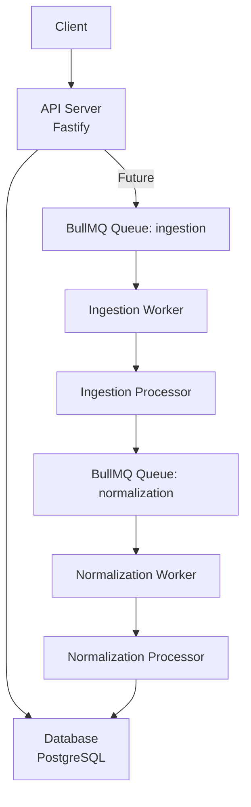
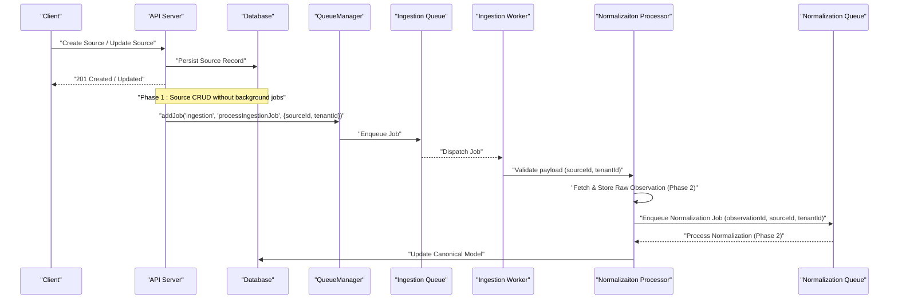
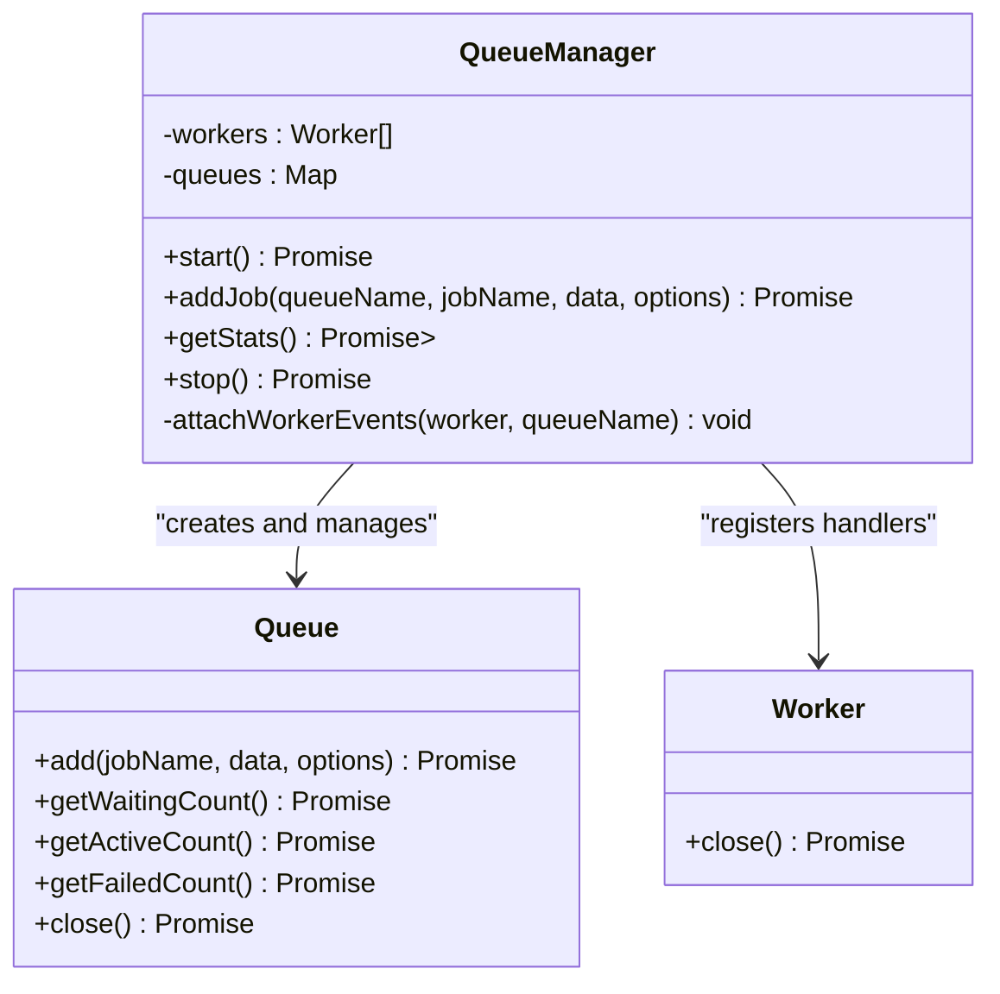
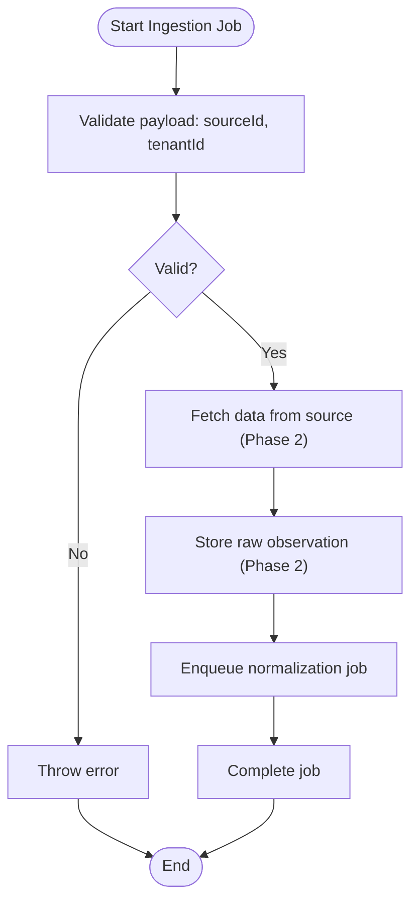
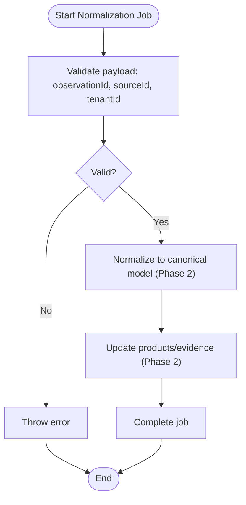
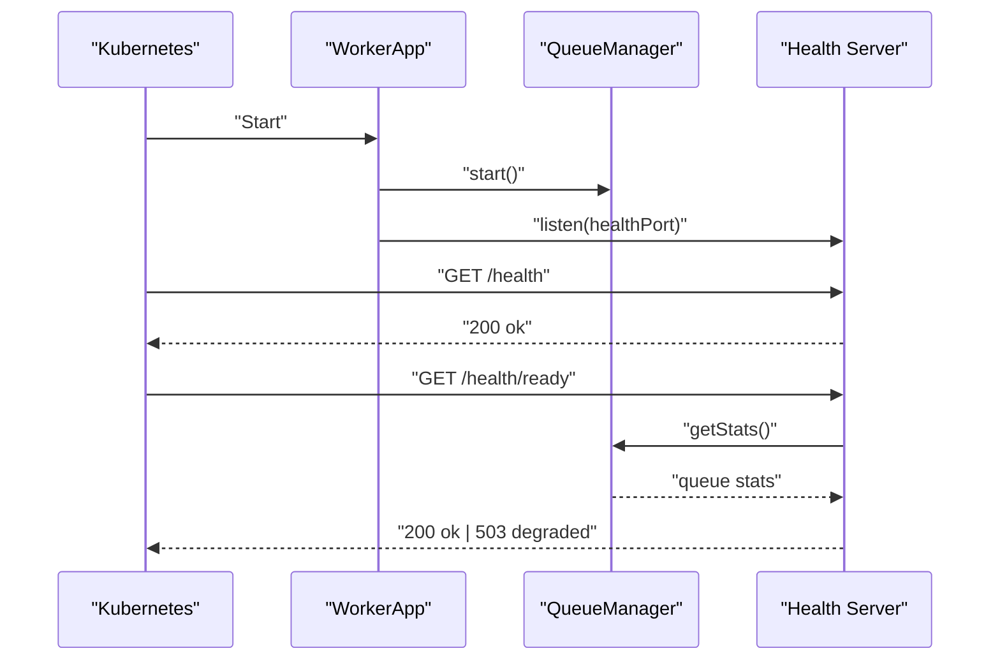
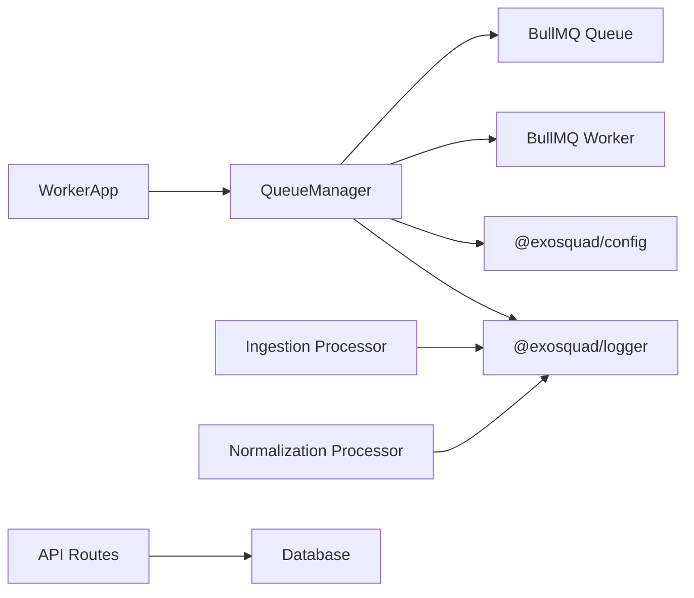

# Queue Processing Architecture

<cite>
**Referenced Files in This Document**
- [queue-manager.ts](file://apps/worker/src/queues/queue-manager.ts)
- [ingestion.ts](file://apps/worker/src/processors/ingestion.ts)
- [normalization.ts](file://apps/worker/src/processors/normalization.ts)
- [app.ts](file://apps/worker/src/app.ts)
- [sources.ts](file://apps/api/src/routes/sources.ts)
- [ARCHITECTURE.md](file://docs/ARCHITECTURE.md)
</cite>

## Table of Contents
1. [Introduction](#introduction)
2. [Project Structure](#project-structure)
3. [Core Components](#core-components)
4. [Architecture Overview](#architecture-overview)
5. [Detailed Component Analysis](#detailed-component-analysis)
6. [Dependency Analysis](#dependency-analysis)
7. [Performance Considerations](#performance-considerations)
8. [Troubleshooting Guide](#troubleshooting-guide)
9. [Conclusion](#conclusion)

## Introduction
This document describes the queue-based processing architecture built with BullMQ and Redis. It explains how jobs are created, queued, consumed by workers, and tracked through completion or failure. The system separates ingestion from normalization: ingestion is responsible for fetching raw data from external sources, while normalization transforms that raw data into a canonical model. The current implementation provides the operational foundation for these phases, including job lifecycle scaffolding, retry/backoff configuration, priority support, structured logging, and health monitoring.

## Project Structure
The queue processing system spans two main services:
- API service: HTTP entry point for client requests and source management.
- Worker service: BullMQ worker process that runs ingestion and normalization processors and exposes health endpoints.

**Diagram sources**
- [app.ts:10-53](file://apps/worker/src/app.ts#L10-L53)
- [queue-manager.ts:23-59](file://apps/worker/src/queues/queue-manager.ts#L23-L59)
- [ingestion.ts:11-54](file://apps/worker/src/processors/ingestion.ts#L11-L54)
- [normalization.ts:15-57](file://apps/worker/src/processors/normalization.ts#L15-L57)

**Section sources**
- [ARCHITECTURE.md:43-65](file://docs/ARCHITECTURE.md#L43-L65)
- [app.ts:10-53](file://apps/worker/src/app.ts#L10-L53)

## Core Components
- QueueManager: Centralizes BullMQ queue creation, worker registration, job enqueueing, statistics collection, and graceful shutdown.
- Ingestion processor: Validates job payloads, logs context, and prepares to fetch and store raw observations; enqueues normalization jobs after successful ingestion.
- Normalization processor: Validates observation payloads, logs context, and prepares to transform raw observations into the canonical EXOSQUAD model.
- WorkerApp: Starts QueueManager and exposes minimal health endpoints for liveness and readiness checks.

Key responsibilities:
- QueueManager manages connection options, queue instances, worker concurrency, rate limiting, retries, backoff, and cleanup policies.
- Processors implement validation, logging, and future integration points for database and connector logic.
- WorkerApp orchestrates startup and exposes /health and /health/ready endpoints.

**Section sources**
- [queue-manager.ts:19-98](file://apps/worker/src/queues/queue-manager.ts#L19-L98)
- [ingestion.ts:11-54](file://apps/worker/src/processors/ingestion.ts#L11-L54)
- [normalization.ts:15-57](file://apps/worker/src/processors/normalization.ts#L15-L57)
- [app.ts:10-53](file://apps/worker/src/app.ts#L10-L53)

## Architecture Overview
The pipeline follows a clear separation of concerns:
- Ingestion: Pulls raw data from external sources and persists immutable observations.
- Normalization: Maps raw observations to the canonical schema, performs entity resolution, and updates product records.

**Diagram sources**
- [queue-manager.ts:65-98](file://apps/worker/src/queues/queue-manager.ts#L65-L98)
- [ingestion.ts:11-54](file://apps/worker/src/processors/ingestion.ts#L11-L54)
- [normalization.ts:15-57](file://apps/worker/src/processors/normalization.ts#L15-L57)
- [sources.ts:62-79](file://apps/api/src/routes/sources.ts#L62-L79)

## Detailed Component Analysis

### QueueManager
QueueManager encapsulates all BullMQ interactions:
- Connection configuration via shared Redis settings.
- Queue initialization for ingestion and normalization.
- Worker setup with concurrency and rate limiting.
- Job enqueueing with priority, attempts, backoff, delay, idempotency key, and retention policies.
- Health stats aggregation across queues.
- Graceful shutdown of workers and queues.

**Diagram sources**
- [queue-manager.ts:19-165](file://apps/worker/src/queues/queue-manager.ts#L19-L165)

Key behaviors:
- Concurrency: Controlled per worker via configuration.
- Rate limiting: Ingestion worker limited to 50 jobs per minute.
- Retention: Jobs removed after completion/failure thresholds.
- Backoff: Exponential backoff with jitter configured at enqueue time.
- Priority: Optional priority field supports job ordering.

**Section sources**
- [queue-manager.ts:7-13](file://apps/worker/src/queues/queue-manager.ts#L7-L13)
- [queue-manager.ts:23-59](file://apps/worker/src/queues/queue-manager.ts#L23-L59)
- [queue-manager.ts:65-98](file://apps/worker/src/queues/queue-manager.ts#L65-L98)
- [queue-manager.ts:103-125](file://apps/worker/src/queues/queue-manager.ts#L103-L125)
- [queue-manager.ts:141-164](file://apps/worker/src/queues/queue-manager.ts#L141-L164)

### Ingestion Processor
Responsibilities:
- Validate required fields (sourceId, tenantId).
- Log structured context for observability.
- Prepare to fetch data from external sources and persist raw observations.
- Enqueue normalization job upon successful ingestion.

Current state:
- Validation and logging are implemented.
- Database and connector integration are marked for Phase 2.

**Diagram sources**
- [ingestion.ts:11-54](file://apps/worker/src/processors/ingestion.ts#L11-L54)

**Section sources**
- [ingestion.ts:11-54](file://apps/worker/src/processors/ingestion.ts#L11-L54)

### Normalization Processor
Responsibilities:
- Validate required fields (observationId, sourceId, tenantId).
- Log structured context for observability.
- Transform raw observations into canonical model.
- Perform entity resolution and update product records (Phase 2).

Current state:
- Validation and logging are implemented.
- Normalization pipeline is marked for Phase 2.

**Diagram sources**
- [normalization.ts:15-57](file://apps/worker/src/processors/normalization.ts#L15-L57)

**Section sources**
- [normalization.ts:15-57](file://apps/worker/src/processors/normalization.ts#L15-L57)

### Worker Application
Responsibilities:
- Initialize QueueManager.
- Start health server on a separate port.
- Provide /health and /health/ready endpoints.
- Readiness endpoint aggregates queue stats to determine service health.

**Diagram sources**
- [app.ts:10-53](file://apps/worker/src/app.ts#L10-L53)
- [queue-manager.ts:103-125](file://apps/worker/src/queues/queue-manager.ts#L103-L125)

**Section sources**
- [app.ts:10-53](file://apps/worker/src/app.ts#L10-L53)

## Dependency Analysis
High-level dependencies:
- WorkerApp depends on QueueManager for queue and worker orchestration.
- QueueManager depends on BullMQ (Queue, Worker), configuration, and logger.
- Processors depend on BullMQ Job type and logger.
- API routes currently perform synchronous database operations; background job enqueueing is prepared for future integration.

**Diagram sources**
- [app.ts:10-53](file://apps/worker/src/app.ts#L10-L53)
- [queue-manager.ts:1-5](file://apps/worker/src/queues/queue-manager.ts#L1-L5)
- [ingestion.ts:1-3](file://apps/worker/src/processors/ingestion.ts#L1-L3)
- [normalization.ts:1-3](file://apps/worker/src/processors/normalization.ts#L1-L3)
- [sources.ts:1-8](file://apps/api/src/routes/sources.ts#L1-L8)

**Section sources**
- [queue-manager.ts:1-5](file://apps/worker/src/queues/queue-manager.ts#L1-L5)
- [sources.ts:1-8](file://apps/api/src/routes/sources.ts#L1-L8)

## Performance Considerations
- Concurrency: Adjust WORKER_CONCURRENCY to match CPU and I/O characteristics.
- Rate Limiting: Ingestion worker is limited to 50 jobs per minute to protect external sources.
- Backoff Strategy: Exponential backoff reduces pressure during transient failures.
- Retention Policies: removeOnComplete and removeOnFail prevent unbounded growth of completed/failed jobs.
- Observability: Structured logging includes jobId, queue, duration, and error context for performance analysis.

[No sources needed since this section provides general guidance]

## Troubleshooting Guide
Common issues and diagnostics:
- Missing required fields:
  - Ingestion: Ensure sourceId and tenantId are present.
  - Normalization: Ensure observationId, sourceId, and tenantId are present.
- Failed jobs:
  - Check worker failed event logs for stack traces and attempt counts.
  - Inspect queue failed counts via getStats.
- Health checks:
  - Use /health for liveness and /health/ready for readiness; readiness returns 503 when any queue reports an error status.
- Debugging:
  - Correlate logs using jobId and queue name.
  - Review backoff and retry behavior if jobs repeatedly fail.

Operational references:
- Worker events: completed, failed, error.
- Stats aggregation: waiting, active, failed counts per queue.
- Graceful shutdown: stop closes workers and queues.

**Section sources**
- [ingestion.ts:20-28](file://apps/worker/src/processors/ingestion.ts#L20-L28)
- [normalization.ts:24-34](file://apps/worker/src/processors/normalization.ts#L24-L34)
- [queue-manager.ts:141-164](file://apps/worker/src/queues/queue-manager.ts#L141-L164)
- [queue-manager.ts:103-125](file://apps/worker/src/queues/queue-manager.ts#L103-L125)
- [app.ts:26-38](file://apps/worker/src/app.ts#L26-L38)

## Conclusion
The queue-based processing architecture establishes a robust foundation for asynchronous data ingestion and normalization using BullMQ and Redis. While the actual fetching and transformation logic is scheduled for Phase 2, the current codebase provides essential scaffolding: validated job payloads, structured logging, retry/backoff configuration, priority support, health endpoints, and graceful shutdown. As connectors and normalization logic are implemented, the pipeline will evolve into a fully operational ingestion-to-normalization workflow with comprehensive observability and resilience.

[No sources needed since this section summarizes without analyzing specific files]