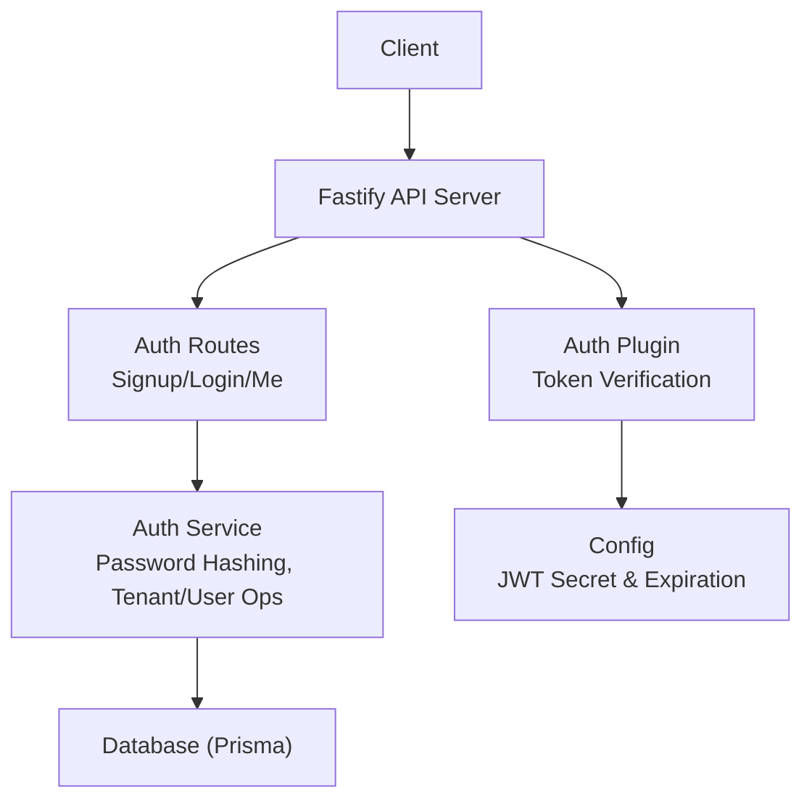
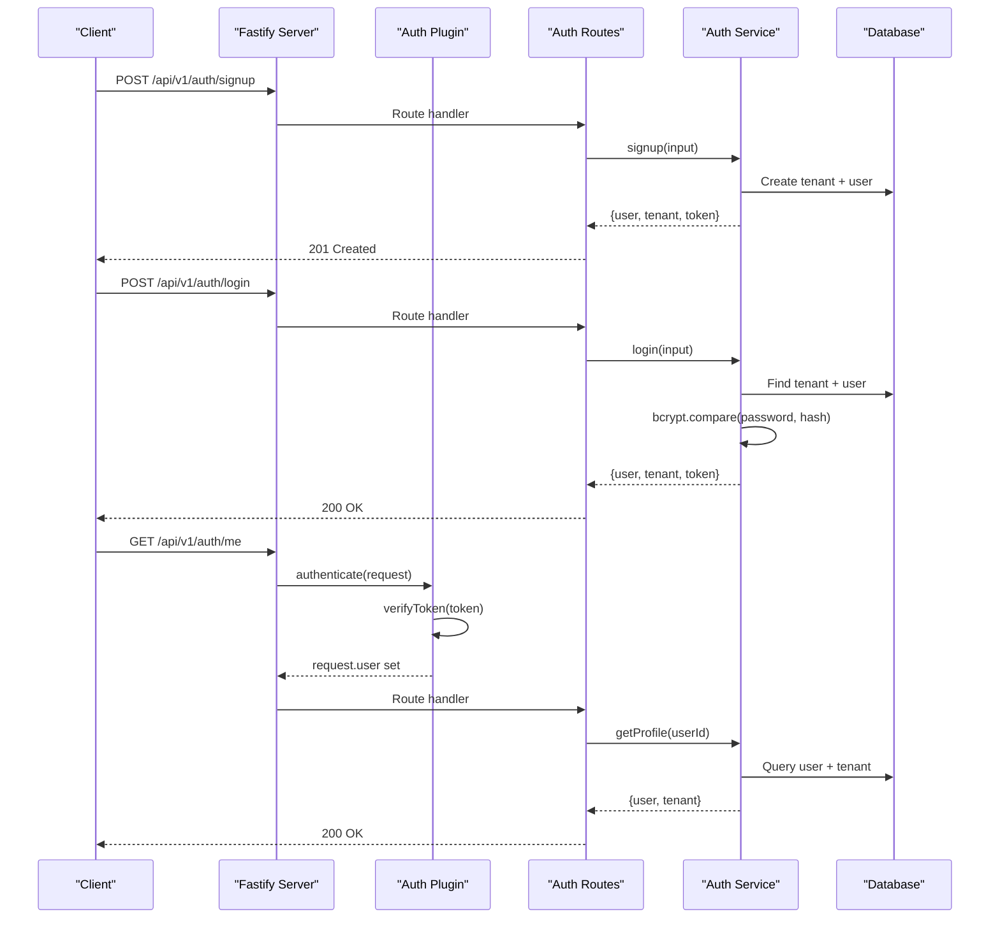
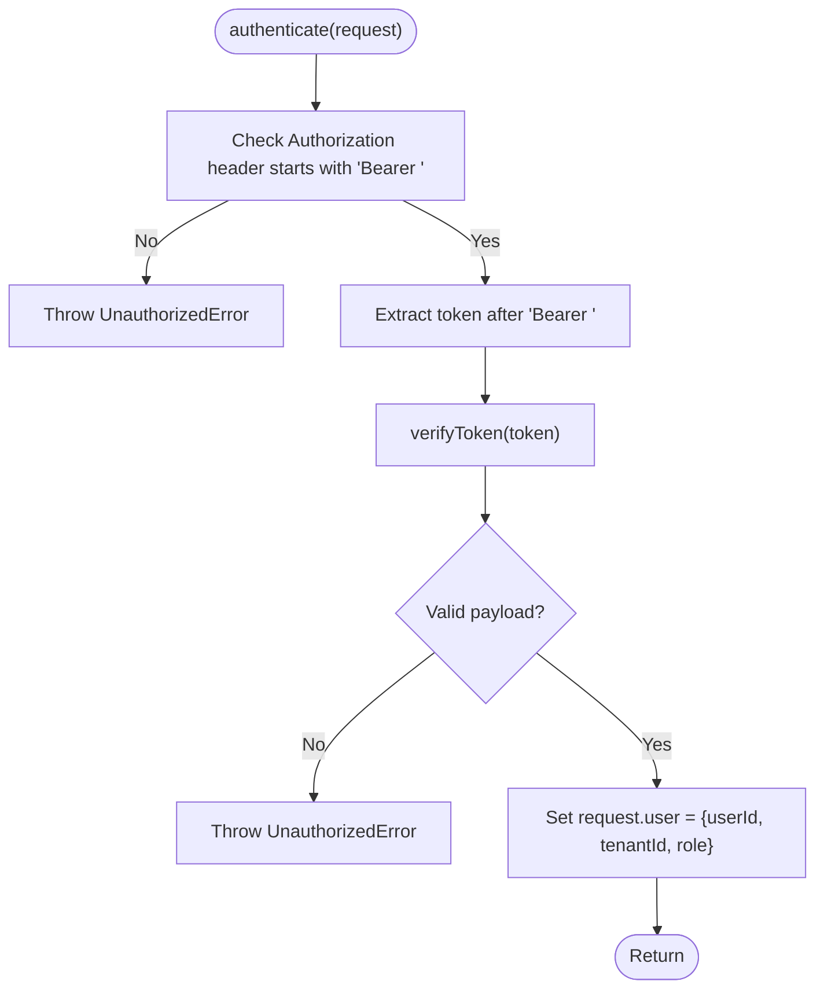
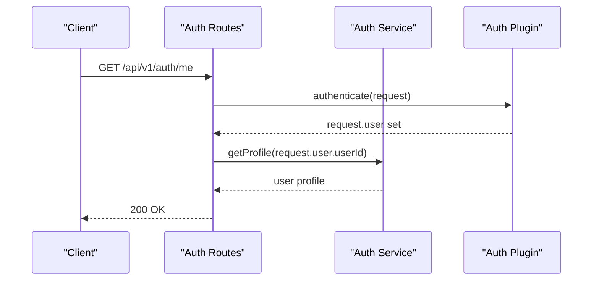
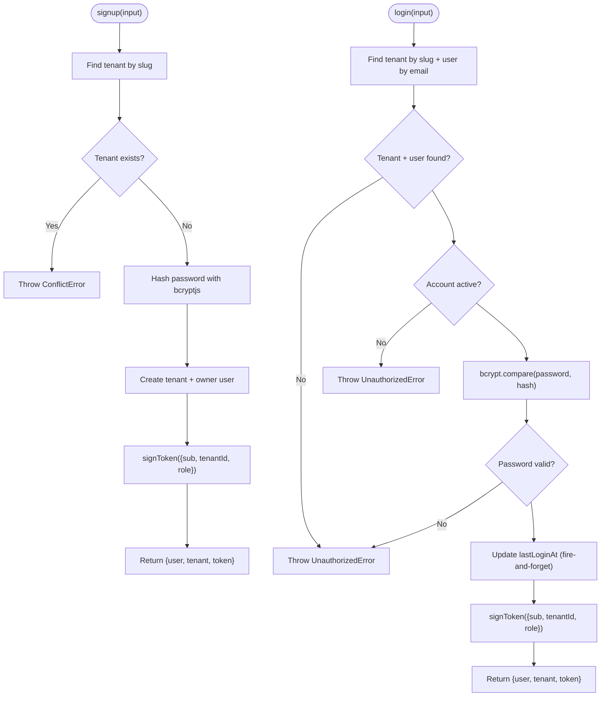
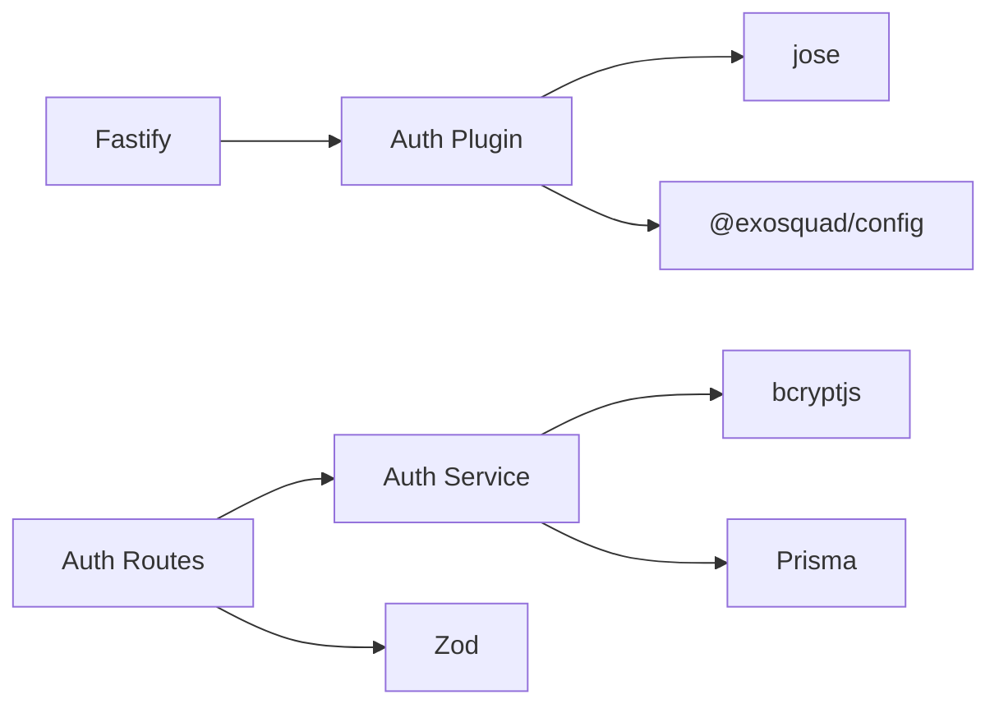

# Authentication & Authorization

<cite>
**Referenced Files in This Document**
- [auth.ts](file://apps/api/src/plugins/auth.ts)
- [auth.ts](file://apps/api/src/routes/auth.ts)
- [auth.ts](file://apps/api/src/services/auth.ts)
- [app.ts](file://apps/api/src/app.ts)
- [index.ts](file://packages/config/src/index.ts)
- [auth.test.ts](file://apps/api/test/integration/auth.test.ts)
</cite>

## Table of Contents
1. [Introduction](#introduction)
2. [Project Structure](#project-structure)
3. [Core Components](#core-components)
4. [Architecture Overview](#architecture-overview)
5. [Detailed Component Analysis](#detailed-component-analysis)
6. [Dependency Analysis](#dependency-analysis)
7. [Performance Considerations](#performance-considerations)
8. [Troubleshooting Guide](#troubleshooting-guide)
9. [Conclusion](#conclusion)

## Introduction
This document explains the authentication and authorization system implemented for the Fastify API. It covers JWT token management, multi-tenant user authentication flow, role-based access control (RBAC), password hashing with bcryptjs, token expiration handling, and session-less stateless security. It also provides guidance on protected routes, middleware usage, custom authorization logic, security considerations, token storage best practices, and multi-tenant isolation patterns.

## Project Structure
The authentication system is organized across a plugin, routes, service layer, application bootstrap, configuration, and integration tests:
- Plugin: Fastify auth plugin that validates tokens and decorates requests with user context.
- Routes: Public endpoints for signup/login and a protected endpoint to retrieve the current user profile.
- Service: Business logic for tenant/user creation, login verification, and profile retrieval; handles password hashing and JWT signing.
- App: Bootstraps Fastify, registers plugins and routes, and centralizes error handling.
- Config: Validates environment variables including JWT secret and expiration policy.
- Tests: Integration tests validating input validation and protected route behavior.

**Diagram sources**
- [app.ts:27-36](file://apps/api/src/app.ts#L27-L36)
- [auth.ts](file://apps/api/src/plugins/auth.ts)
- [auth.ts](file://apps/api/src/routes/auth.ts)
- [auth.ts](file://apps/api/src/services/auth.ts)
- [index.ts:26-30](file://packages/config/src/index.ts#L26-L30)

**Section sources**
- [app.ts:12-36](file://apps/api/src/app.ts#L12-L36)
- [auth.ts](file://apps/api/src/plugins/auth.ts)
- [auth.ts](file://apps/api/src/routes/auth.ts)
- [auth.ts](file://apps/api/src/services/auth.ts)
- [index.ts:26-30](file://packages/config/src/index.ts#L26-L30)

## Core Components
- Fastify Auth Plugin: Provides an authenticate preHandler that verifies Bearer tokens using jose, decodes payload, and attaches user context to the request.
- Auth Routes: Define public endpoints (/signup, /login) and a protected endpoint (/me) requiring authentication.
- Auth Service: Implements signup and login flows, password hashing with bcryptjs, tenant scoping, and JWT issuance.
- Configuration: Enforces minimum length for JWT_SECRET and default JWT_EXPIRES_IN.

Key responsibilities:
- Token signing and verification are centralized in the auth plugin.
- Password hashing uses bcryptjs with a configurable number of rounds.
- Multi-tenancy is enforced by tenantId in the JWT and tenant-scoped queries.
- Role-based access control is represented by a role field in the JWT payload.

**Section sources**
- [auth.ts](file://apps/api/src/plugins/auth.ts)
- [auth.ts](file://apps/api/src/routes/auth.ts)
- [auth.ts](file://apps/api/src/services/auth.ts)
- [index.ts:26-30](file://packages/config/src/index.ts#L26-L30)

## Architecture Overview
The authentication architecture is stateless and relies on JWTs. Clients send a Bearer token in the Authorization header. The Fastify auth plugin verifies the token, extracts user identity and tenant context, and makes it available to route handlers. Protected routes use the authenticate preHandler to ensure only authenticated users can proceed.

**Diagram sources**
- [auth.ts](file://apps/api/src/plugins/auth.ts)
- [auth.ts](file://apps/api/src/routes/auth.ts)
- [auth.ts](file://apps/api/src/services/auth.ts)

## Detailed Component Analysis

### Fastify Auth Plugin
Responsibilities:
- Verify JWT tokens using jose with HS256.
- Extract userId, tenantId, and role from the payload.
- Provide a global authenticate preHandler decorator.
- Attach user context to FastifyRequest for downstream handlers.

Security notes:
- Only HS256 algorithm is allowed.
- Missing or malformed Authorization headers result in UnauthorizedError.
- Invalid or expired tokens result in UnauthorizedError.

**Diagram sources**
- [auth.ts:73-90](file://apps/api/src/plugins/auth.ts#L73-L90)
- [auth.ts:24-48](file://apps/api/src/plugins/auth.ts#L24-L48)

**Section sources**
- [auth.ts:1-100](file://apps/api/src/plugins/auth.ts#L1-L100)

### Auth Routes
Endpoints:
- POST /api/v1/auth/signup: Creates a new tenant and owner user, hashes password, issues JWT.
- POST /api/v1/auth/login: Authenticates user against tenant scope, returns JWT.
- GET /api/v1/auth/me: Protected route requiring authentication; returns user profile.

Validation:
- Zod schemas validate email, password length, tenant name/slug constraints.

Protection:
- The /me route uses a preHandler invoking server.authenticate(request).

**Diagram sources**
- [auth.ts:54-66](file://apps/api/src/routes/auth.ts#L54-L66)
- [auth.ts:23-52](file://apps/api/src/routes/auth.ts#L23-L52)

**Section sources**
- [auth.ts:5-21](file://apps/api/src/routes/auth.ts#L5-L21)
- [auth.ts:23-66](file://apps/api/src/routes/auth.ts#L23-L66)

### Auth Service
Responsibilities:
- Signup: Validate tenant slug uniqueness, hash password with bcryptjs, create tenant and owner user atomically, sign JWT.
- Login: Resolve tenant by slug, find user by email within tenant, check account status, compare password with bcryptjs, update lastLoginAt, sign JWT.
- Profile: Fetch user with associated tenant data.

Security:
- Password hashing uses bcryptjs with a fixed number of rounds.
- Account status checks prevent disabled users from logging in.
- Tenant scoping ensures users are validated within the correct tenant context.

**Diagram sources**
- [auth.ts:31-87](file://apps/api/src/services/auth.ts#L31-L87)
- [auth.ts:92-156](file://apps/api/src/services/auth.ts#L92-L156)

**Section sources**
- [auth.ts:1-189](file://apps/api/src/services/auth.ts#L1-L189)

### Configuration and Token Settings
- JWT_SECRET must be at least 32 characters.
- JWT_EXPIRES_IN defaults to "24h".
- These values are used when signing and verifying tokens.

Best practices:
- Store JWT_SECRET in secure environment variables or secret managers.
- Rotate secrets periodically and re-issue tokens if necessary.

**Section sources**
- [index.ts:26-30](file://packages/config/src/index.ts#L26-L30)
- [auth.ts:18-62](file://apps/api/src/plugins/auth.ts#L18-L62)

### Multi-Tenant Isolation Patterns
- Tenant identification: Each JWT includes tenantId.
- User lookup: Login resolves tenant by slug and restricts user search to that tenant.
- Data access: Subsequent operations should enforce tenantId from request.user to isolate data per tenant.

Recommendations:
- Always filter database queries by tenantId derived from request.user.tenantId.
- Avoid trusting client-provided tenant identifiers beyond initial login resolution.

**Section sources**
- [auth.ts:31-87](file://apps/api/src/services/auth.ts#L31-L87)
- [auth.ts:92-156](file://apps/api/src/services/auth.ts#L92-L156)
- [auth.ts:24-48](file://apps/api/src/plugins/auth.ts#L24-L48)

### Role-Based Access Control (RBAC)
- Roles are embedded in the JWT payload during signing.
- The authenticate preHandler sets request.user.role.
- Custom authorization logic can inspect request.user.role to enforce permissions.

Implementation guidance:
- Create a role-checking middleware that compares required roles against request.user.role.
- Apply role middleware to specific routes or groups of routes.

**Section sources**
- [auth.ts:53-62](file://apps/api/src/plugins/auth.ts#L53-L62)
- [auth.ts:73-90](file://apps/api/src/plugins/auth.ts#L73-L90)

### Session Management
- The system is stateless; no server-side sessions are maintained.
- Tokens are issued via JWT and validated on each request.
- No refresh token strategy is implemented in the current codebase.

Recommendations:
- Implement short-lived access tokens and long-lived refresh tokens stored securely on the client.
- Add a /refresh endpoint that validates refresh tokens and issues new access tokens.

[No sources needed since this section provides general guidance]

### Password Hashing with bcryptjs
- Passwords are hashed using bcryptjs with a configured number of rounds.
- During login, passwords are compared using bcrypt.compare.

Security considerations:
- Use appropriate cost factor (rounds) balancing security and performance.
- Never log or expose password hashes.

**Section sources**
- [auth.ts:44-44](file://apps/api/src/services/auth.ts#L44-L44)
- [auth.ts:121-124](file://apps/api/src/services/auth.ts#L121-L124)

### Token Expiration Handling
- Tokens expire based on config.JWT_EXPIRES_IN.
- Expired tokens cause verifyToken to return null, leading to UnauthorizedError in authenticate.

Operational guidance:
- Monitor token expiry and implement client-side renewal strategies.
- Consider adding refresh token support for seamless UX.

**Section sources**
- [auth.ts:58-62](file://apps/api/src/plugins/auth.ts#L58-L62)
- [auth.ts:24-48](file://apps/api/src/plugins/auth.ts#L24-L48)

### Protected Routes and Middleware Usage
- Protected routes use the authenticate preHandler to ensure valid tokens.
- Example: GET /api/v1/auth/me requires authentication before executing the handler.

Usage pattern:
- Register the auth plugin globally.
- Apply server.authenticate(request) in preHandler for protected routes.

**Section sources**
- [auth.ts:54-66](file://apps/api/src/routes/auth.ts#L54-L66)
- [auth.ts:73-90](file://apps/api/src/plugins/auth.ts#L73-L90)

### Custom Authorization Logic
- Extend the authenticate preHandler or add a role-based middleware.
- Inspect request.user.role to enforce fine-grained permissions.
- Combine with tenantId to enforce both role and tenant scoping.

Example approach:
- Create a requireRole(roles[]) middleware that throws UnauthorizedError if request.user.role is not in the allowed list.
- Apply requireRole(['admin']) to admin-only routes.

[No sources needed since this section provides general guidance]

### Security Considerations
- Use HTTPS to protect tokens in transit.
- Store JWT_SECRET securely and rotate regularly.
- Validate all inputs with Zod to prevent injection and malformed payloads.
- Limit exposed error details to avoid leaking internals.

**Section sources**
- [app.ts:39-70](file://apps/api/src/app.ts#L39-L70)
- [auth.ts:5-8](file://apps/api/src/routes/auth.ts#L5-L8)

### Token Storage Best Practices
- Prefer HttpOnly, Secure, SameSite cookies for storing tokens on the client side.
- If using localStorage, mitigate XSS risks and consider short-lived tokens.
- Avoid storing sensitive data in JWT payloads beyond minimal identity fields.

[No sources needed since this section provides general guidance]

## Dependency Analysis
The authentication system depends on:
- Fastify for routing and plugin architecture.
- jose for JWT signing and verification.
- bcryptjs for password hashing.
- Prisma for database interactions.
- Zod for input validation and environment configuration.

**Diagram sources**
- [auth.ts](file://apps/api/src/plugins/auth.ts)
- [auth.ts](file://apps/api/src/routes/auth.ts)
- [auth.ts](file://apps/api/src/services/auth.ts)
- [index.ts:26-30](file://packages/config/src/index.ts#L26-L30)

**Section sources**
- [auth.ts](file://apps/api/src/plugins/auth.ts)
- [auth.ts](file://apps/api/src/routes/auth.ts)
- [auth.ts](file://apps/api/src/services/auth.ts)
- [index.ts:26-30](file://packages/config/src/index.ts#L26-L30)

## Performance Considerations
- JWT verification is CPU-bound but lightweight; ensure efficient token parsing.
- bcrypt hashing cost impacts login performance; tune rounds based on hardware.
- Avoid synchronous operations in hot paths; use async/await consistently.
- Cache frequently accessed tenant metadata if needed, while ensuring tenant isolation.

[No sources needed since this section provides general guidance]

## Troubleshooting Guide
Common issues:
- Missing or invalid Authorization header: Ensure clients send Bearer tokens correctly.
- Invalid or expired token: Verify token signature and expiration settings.
- Validation errors: Check Zod schemas for required fields and formats.
- Database errors: Confirm Prisma connection and schema integrity.

Diagnostic steps:
- Inspect logs for UnauthorizedError messages.
- Validate environment variables for JWT_SECRET and JWT_EXPIRES_IN.
- Run integration tests to confirm route behaviors.

**Section sources**
- [auth.ts:73-90](file://apps/api/src/plugins/auth.ts#L73-L90)
- [auth.ts:5-21](file://apps/api/src/routes/auth.ts#L5-L21)
- [auth.test.ts:20-47](file://apps/api/test/integration/auth.test.ts#L20-L47)

## Conclusion
The authentication and authorization system implements a robust, stateless JWT-based model with multi-tenant isolation and role-based access control. It leverages Fastify plugins for clean separation of concerns, bcryptjs for secure password handling, and Zod for strict input validation. While refresh tokens are not currently implemented, the architecture supports extension for advanced token lifecycle management. Following the recommended security and performance practices will help maintain a secure and scalable authentication system.