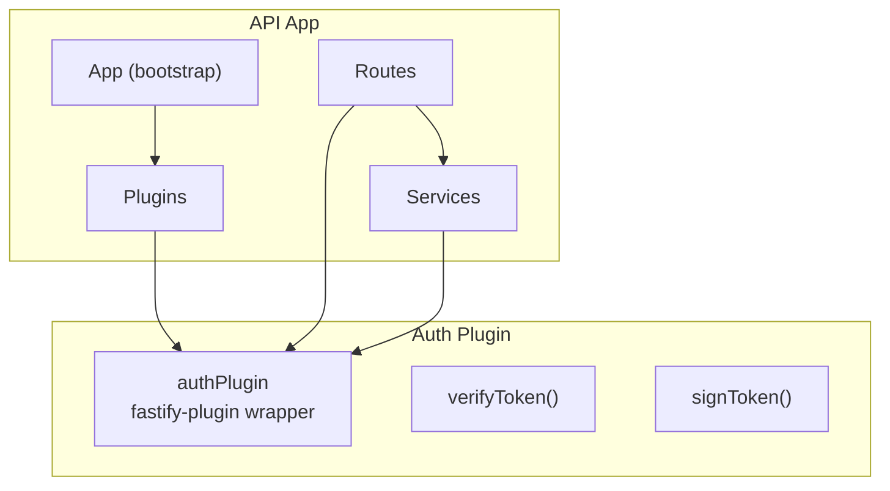
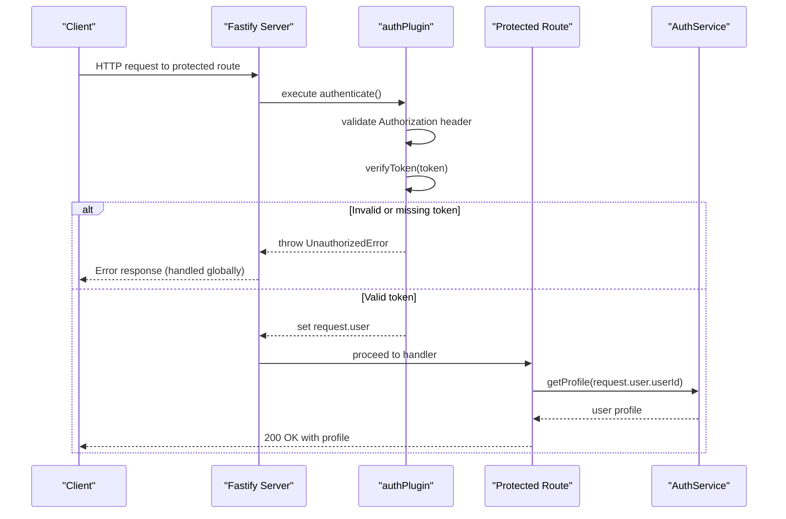
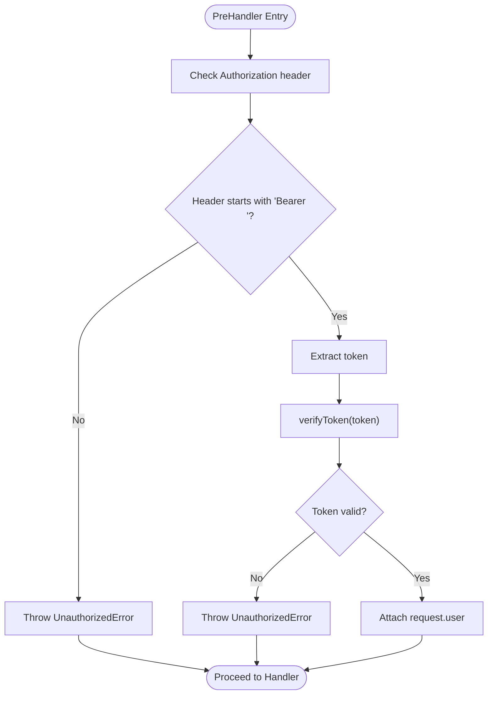
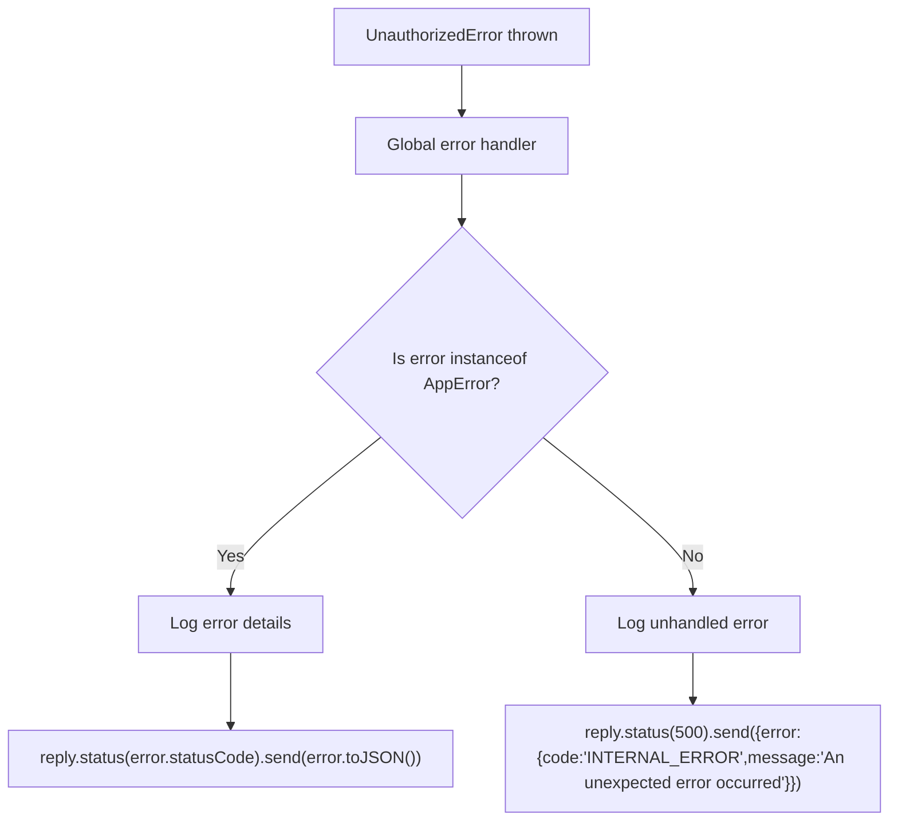
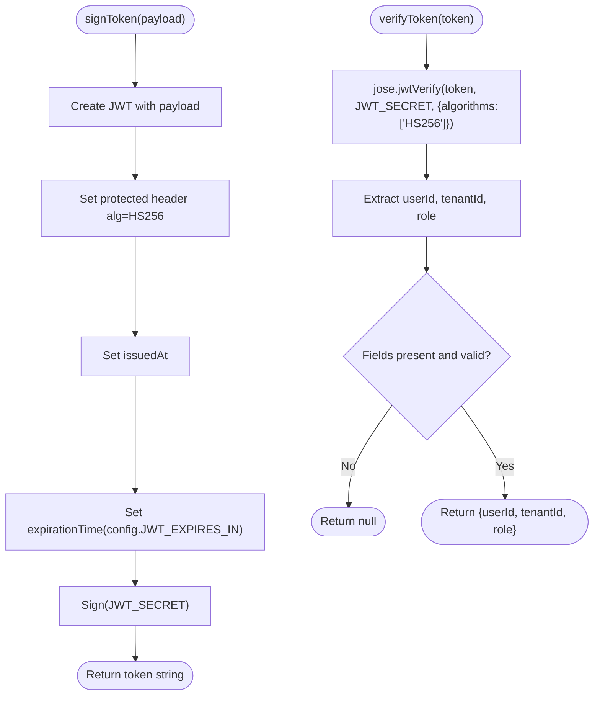
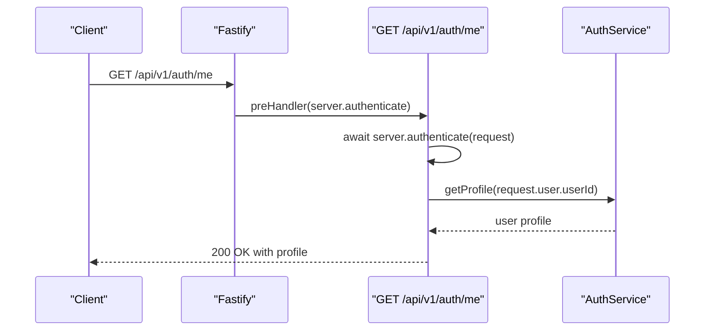
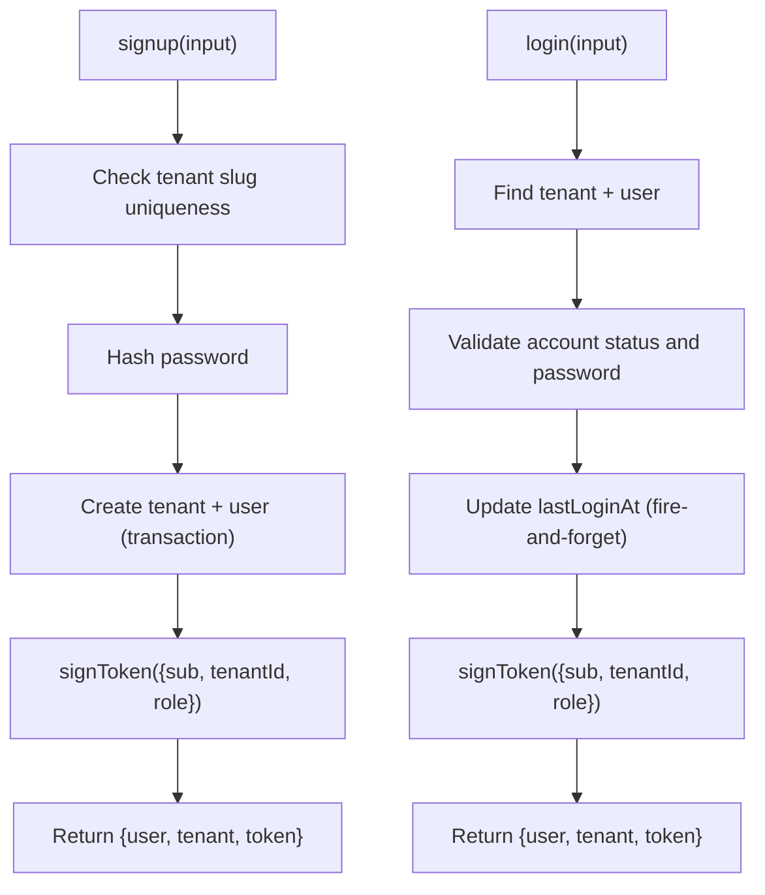
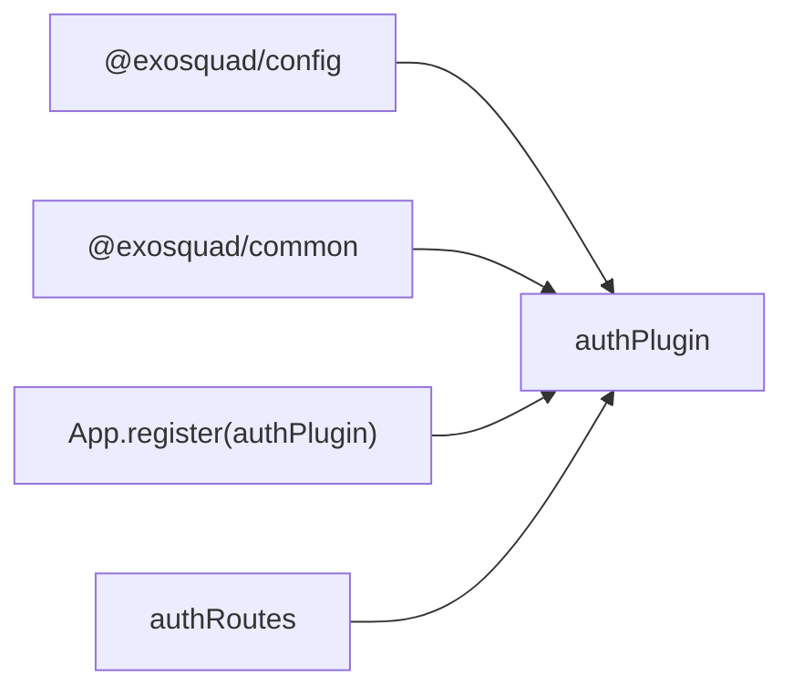
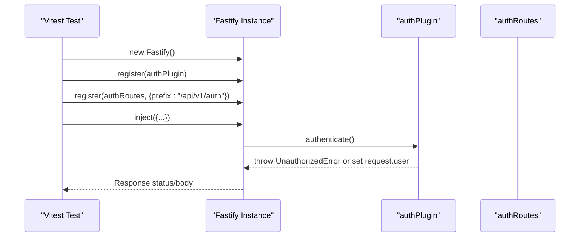
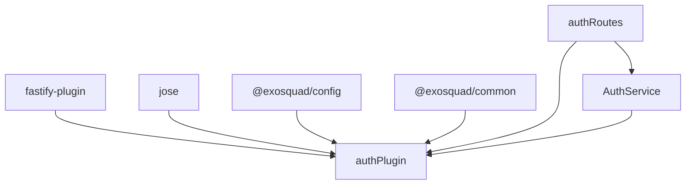

# Fastify Authentication Plugin

<cite>
**Referenced Files in This Document**
- [auth.ts](file://apps/api/src/plugins/auth.ts)
- [app.ts](file://apps/api/src/app.ts)
- [auth.ts](file://apps/api/src/routes/auth.ts)
- [auth.ts](file://apps/api/src/services/auth.ts)
- [auth.test.ts](file://apps/api/test/integration/auth.test.ts)
</cite>

## Table of Contents
1. [Introduction](#introduction)
2. [Project Structure](#project-structure)
3. [Core Components](#core-components)
4. [Architecture Overview](#architecture-overview)
5. [Detailed Component Analysis](#detailed-component-analysis)
6. [Dependency Analysis](#dependency-analysis)
7. [Performance Considerations](#performance-considerations)
8. [Troubleshooting Guide](#troubleshooting-guide)
9. [Conclusion](#conclusion)
10. [Appendices](#appendices)

## Introduction
This document explains the Fastify authentication plugin architecture used in the API application. It focuses on:
- The fastify-plugin wrapper that breaks encapsulation and exposes a global decorator
- The authenticate preHandler function for protecting routes
- Request decoration to attach authenticated user context
- Custom error handling with UnauthorizedError
- How to register the plugin, protect routes, and extend it for additional authorization logic
- Plugin lifecycle, dependency injection patterns, and testing strategies

## Project Structure
The authentication feature spans several modules:
- Plugin definition and decorators live in the plugins directory
- Routes demonstrate how to use the authenticate decorator
- Services implement business logic and token signing
- Application bootstrap registers the plugin and sets up global error handling
- Integration tests verify route behavior and authentication requirements



**Diagram sources**
- [app.ts:27-36](file://apps/api/src/app.ts#L27-L36)
- [auth.ts:70-93](file://apps/api/src/plugins/auth.ts#L70-L93)
- [auth.ts:23-67](file://apps/api/src/routes/auth.ts#L23-L67)
- [auth.ts:26-189](file://apps/api/src/services/auth.ts#L26-L189)

**Section sources**
- [app.ts:12-36](file://apps/api/src/app.ts#L12-L36)
- [auth.ts:70-93](file://apps/api/src/plugins/auth.ts#L70-L93)
- [auth.ts:23-67](file://apps/api/src/routes/auth.ts#L23-L67)
- [auth.ts:26-189](file://apps/api/src/services/auth.ts#L26-L189)

## Core Components
- Auth plugin (fastify-plugin): Provides the authenticate decorator and request.user decoration. Uses fastify-plugin to break encapsulation so the decorator is globally available.
- Token utilities: verifyToken decodes and validates JWTs; signToken issues JWTs for successful authentication flows.
- Route integration: Protected routes invoke server.authenticate as a preHandler to enforce authentication.
- Service layer: AuthService handles signup/login, persists data, and returns tokens using signToken.
- Application bootstrap: Registers the auth plugin and configures global error handling for known errors like UnauthorizedError.

Key responsibilities:
- Breaking encapsulation via fastify-plugin to expose decorators globally
- Validating Authorization headers and decoding JWTs
- Attaching user context to requests
- Throwing UnauthorizedError for invalid or missing credentials
- Providing signToken for issuing JWTs after successful login/signup

**Section sources**
- [auth.ts:7-16](file://apps/api/src/plugins/auth.ts#L7-L16)
- [auth.ts:24-63](file://apps/api/src/plugins/auth.ts#L24-L63)
- [auth.ts:70-100](file://apps/api/src/plugins/auth.ts#L70-L100)
- [auth.ts:23-67](file://apps/api/src/routes/auth.ts#L23-L67)
- [auth.ts:26-189](file://apps/api/src/services/auth.ts#L26-L189)
- [app.ts:39-70](file://apps/api/src/app.ts#L39-L70)

## Architecture Overview
The authentication flow uses Fastify’s plugin system and decorators:
- The app registers the auth plugin during bootstrap
- The plugin decorates the request object with user and adds an authenticate method
- Routes can opt-in to authentication by invoking server.authenticate in a preHandler
- On success, request.user contains userId, tenantId, and role
- Errors are handled centrally by the app’s error handler, which maps UnauthorizedError to appropriate responses



**Diagram sources**
- [auth.ts:70-93](file://apps/api/src/plugins/auth.ts#L70-L93)
- [auth.ts:24-48](file://apps/api/src/plugins/auth.ts#L24-L48)
- [auth.ts:55-66](file://apps/api/src/routes/auth.ts#L55-L66)
- [auth.ts:161-188](file://apps/api/src/services/auth.ts#L161-L188)
- [app.ts:39-70](file://apps/api/src/app.ts#L39-L70)

## Detailed Component Analysis

### Auth Plugin: fastify-plugin Wrapper and Global Decorators
- The plugin wraps the registration function with fastify-plugin to break encapsulation, making the authenticate decorator globally available across all registered plugins and routes.
- It declares FastifyRequest.user to provide TypeScript support for the decorated user context.
- It registers server.decorateRequest("user", undefined) to ensure the property exists on every request.
- It defines server.authenticate as an async preHandler that:
  - Validates the Authorization header format
  - Verifies the JWT using jose
  - Throws UnauthorizedError if validation fails
  - Assigns request.user with decoded payload fields

```mermaid
classDiagram
class FastifyInstance {
+decorate(name, fn)
+decorateRequest(name, type)
}
class AuthPlugin {
+authenticate(request) Promise~void~
+verifyToken(token) Promise~object|null~
+signToken(payload) Promise~string~
}
class FastifyRequest {
+user? : { userId, tenantId, role }
}
FastifyInstance --> AuthPlugin : "registers"
FastifyRequest <.. AuthPlugin : "decorated with user"
```

**Diagram sources**
- [auth.ts:7-16](file://apps/api/src/plugins/auth.ts#L7-L16)
- [auth.ts:70-100](file://apps/api/src/plugins/auth.ts#L70-L100)
- [auth.ts:24-63](file://apps/api/src/plugins/auth.ts#L24-L63)

**Section sources**
- [auth.ts:7-16](file://apps/api/src/plugins/auth.ts#L7-L16)
- [auth.ts:70-100](file://apps/api/src/plugins/auth.ts#L70-L100)

### Authenticate PreHandler: Request Decoration Pattern
- The authenticate function enforces authentication by checking the Authorization header and verifying the token.
- On success, it attaches the user object to request.user, enabling downstream handlers to access identity and tenant context.
- Routes protect endpoints by calling server.authenticate in a preHandler, ensuring authentication runs before route logic.



**Diagram sources**
- [auth.ts:70-93](file://apps/api/src/plugins/auth.ts#L70-L93)
- [auth.ts:24-48](file://apps/api/src/plugins/auth.ts#L24-L48)

**Section sources**
- [auth.ts:70-93](file://apps/api/src/plugins/auth.ts#L70-L93)
- [auth.ts:55-66](file://apps/api/src/routes/auth.ts#L55-L66)

### Custom Error Handling with UnauthorizedError
- The plugin throws UnauthorizedError when the Authorization header is missing/invalid or when the token cannot be verified.
- The application’s global error handler recognizes AppError subclasses (including UnauthorizedError) and responds with the error’s status code and JSON representation.
- Unknown errors are logged and returned as a generic internal error to avoid leaking internals.



**Diagram sources**
- [auth.ts:70-93](file://apps/api/src/plugins/auth.ts#L70-L93)
- [app.ts:39-70](file://apps/api/src/app.ts#L39-L70)

**Section sources**
- [auth.ts:70-93](file://apps/api/src/plugins/auth.ts#L70-L93)
- [app.ts:39-70](file://apps/api/src/app.ts#L39-L70)

### Token Utilities: verifyToken and signToken
- verifyToken uses jose to verify HS256-signed JWTs against a configured secret and extracts userId, tenantId, and role from the payload. It returns null on any verification failure.
- signToken creates a signed JWT with HS256, sets issued-at and expiration based on configuration, and signs it with the configured secret.



**Diagram sources**
- [auth.ts:24-63](file://apps/api/src/plugins/auth.ts#L24-L63)

**Section sources**
- [auth.ts:24-63](file://apps/api/src/plugins/auth.ts#L24-L63)

### Route Integration: Protecting Routes with authenticate
- The /me route demonstrates protecting an endpoint by invoking server.authenticate in a preHandler.
- After authentication succeeds, the handler accesses request.user to fetch the user profile via AuthService.getProfile.



**Diagram sources**
- [auth.ts:55-66](file://apps/api/src/routes/auth.ts#L55-L66)
- [auth.ts:161-188](file://apps/api/src/services/auth.ts#L161-L188)

**Section sources**
- [auth.ts:55-66](file://apps/api/src/routes/auth.ts#L55-L66)
- [auth.ts:161-188](file://apps/api/src/services/auth.ts#L161-L188)

### Service Layer: AuthService and Token Issuance
- AuthService.signup creates a tenant and owner user atomically, then issues a JWT using signToken.
- AuthService.login authenticates credentials, updates lastLoginAt asynchronously, and issues a JWT using signToken.
- Both flows return structured payloads including user and tenant information along with the token.



**Diagram sources**
- [auth.ts:31-87](file://apps/api/src/services/auth.ts#L31-L87)
- [auth.ts:92-156](file://apps/api/src/services/auth.ts#L92-L156)
- [auth.ts:53-63](file://apps/api/src/plugins/auth.ts#L53-L63)

**Section sources**
- [auth.ts:31-87](file://apps/api/src/services/auth.ts#L31-L87)
- [auth.ts:92-156](file://apps/api/src/services/auth.ts#L92-L156)
- [auth.ts:53-63](file://apps/api/src/plugins/auth.ts#L53-L63)

### Plugin Lifecycle and Dependency Injection
- Registration order matters: the app registers plugins before routes, ensuring decorators are available when routes are defined.
- The auth plugin does not depend on other plugins; it depends on external configuration and shared error types.
- Dependency injection pattern:
  - Configuration is accessed via @exosquad/config
  - Shared error classes come from @exosquad/common
  - Database access is performed within services, not inside the plugin, keeping the plugin lightweight and testable



**Diagram sources**
- [auth.ts:1-5](file://apps/api/src/plugins/auth.ts#L1-L5)
- [app.ts:27-36](file://apps/api/src/app.ts#L27-L36)

**Section sources**
- [auth.ts:1-5](file://apps/api/src/plugins/auth.ts#L1-L5)
- [app.ts:27-36](file://apps/api/src/app.ts#L27-L36)

### Testing Strategies
- Integration tests create a Fastify instance, register the auth plugin and routes, and assert expected behaviors:
  - Input validation failures result in error responses
  - Protected routes require authentication and fail without a valid token
- For unit testing the plugin:
  - Mock jose.jwtVerify to simulate valid and invalid tokens
  - Assert that request.user is attached on success
  - Assert UnauthorizedError is thrown on invalid inputs
- For service testing:
  - Mock database calls and bcrypt operations
  - Assert signToken is called with correct payload and that responses include tokens



**Diagram sources**
- [auth.test.ts:9-14](file://apps/api/test/integration/auth.test.ts#L9-L14)
- [auth.test.ts:20-47](file://apps/api/test/integration/auth.test.ts#L20-L47)
- [auth.ts:70-93](file://apps/api/src/plugins/auth.ts#L70-L93)

**Section sources**
- [auth.test.ts:9-14](file://apps/api/test/integration/auth.test.ts#L9-L14)
- [auth.test.ts:20-47](file://apps/api/test/integration/auth.test.ts#L20-L47)

## Dependency Analysis
- The auth plugin depends on:
  - fastify-plugin for breaking encapsulation
  - jose for JWT verification and signing
  - @exosquad/config for secrets and expiration settings
  - @exosquad/common for UnauthorizedError
- Routes depend on the plugin’s authenticate decorator and on AuthService for business logic.
- Services depend on the plugin’s signToken utility and on shared error types.



**Diagram sources**
- [auth.ts:1-5](file://apps/api/src/plugins/auth.ts#L1-L5)
- [auth.ts:70-93](file://apps/api/src/plugins/auth.ts#L70-L93)
- [auth.ts:23-67](file://apps/api/src/routes/auth.ts#L23-L67)
- [auth.ts:26-189](file://apps/api/src/services/auth.ts#L26-L189)

**Section sources**
- [auth.ts:1-5](file://apps/api/src/plugins/auth.ts#L1-L5)
- [auth.ts:70-93](file://apps/api/src/plugins/auth.ts#L70-L93)
- [auth.ts:23-67](file://apps/api/src/routes/auth.ts#L23-L67)
- [auth.ts:26-189](file://apps/api/src/services/auth.ts#L26-L189)

## Performance Considerations
- JWT verification is CPU-bound; consider caching verified tokens if repeated checks occur within short time windows.
- Avoid synchronous operations in preHandlers; keep authenticate asynchronous and minimal.
- Use connection pooling and efficient queries in services to reduce latency.
- Log only necessary details in error paths to minimize overhead.

[No sources needed since this section provides general guidance]

## Troubleshooting Guide
Common issues and resolutions:
- Missing or malformed Authorization header: Ensure clients send "Bearer <token>" and that the token is valid.
- Invalid or expired token: Verify the token was signed with the same secret and has not expired.
- UnauthorizedError not mapped correctly: Confirm the global error handler recognizes AppError subclasses and returns proper status codes.
- Type errors for request.user: Ensure the FastifyRequest declaration is included and the plugin is registered before routes.

**Section sources**
- [auth.ts:70-93](file://apps/api/src/plugins/auth.ts#L70-L93)
- [app.ts:39-70](file://apps/api/src/app.ts#L39-L70)

## Conclusion
The Fastify authentication plugin leverages fastify-plugin to expose a global authenticate decorator, enforcing JWT-based authentication through a preHandler. It decorates requests with user context, throws UnauthorizedError for invalid credentials, and integrates cleanly with the application’s global error handling. Routes protect endpoints by invoking server.authenticate, while services handle business logic and issue tokens using signToken. The architecture supports clear separation of concerns, testability, and extensibility for additional authorization logic.

[No sources needed since this section summarizes without analyzing specific files]

## Appendices

### Registering the Plugin and Protecting Routes
- Register the plugin during app bootstrap to make authenticate globally available.
- Protect routes by adding a preHandler that calls server.authenticate.
- Access request.user in route handlers to retrieve authenticated context.

**Section sources**
- [app.ts:27-36](file://apps/api/src/app.ts#L27-L36)
- [auth.ts:55-66](file://apps/api/src/routes/auth.ts#L55-L66)

### Extending the Plugin for Additional Authorization Logic
- Add role-based checks inside authenticate or create a separate authorize decorator.
- Extend request.user to include additional attributes as needed.
- Introduce middleware-like functions that run after authentication but before route handlers.

**Section sources**
- [auth.ts:7-16](file://apps/api/src/plugins/auth.ts#L7-L16)
- [auth.ts:70-100](file://apps/api/src/plugins/auth.ts#L70-L100)