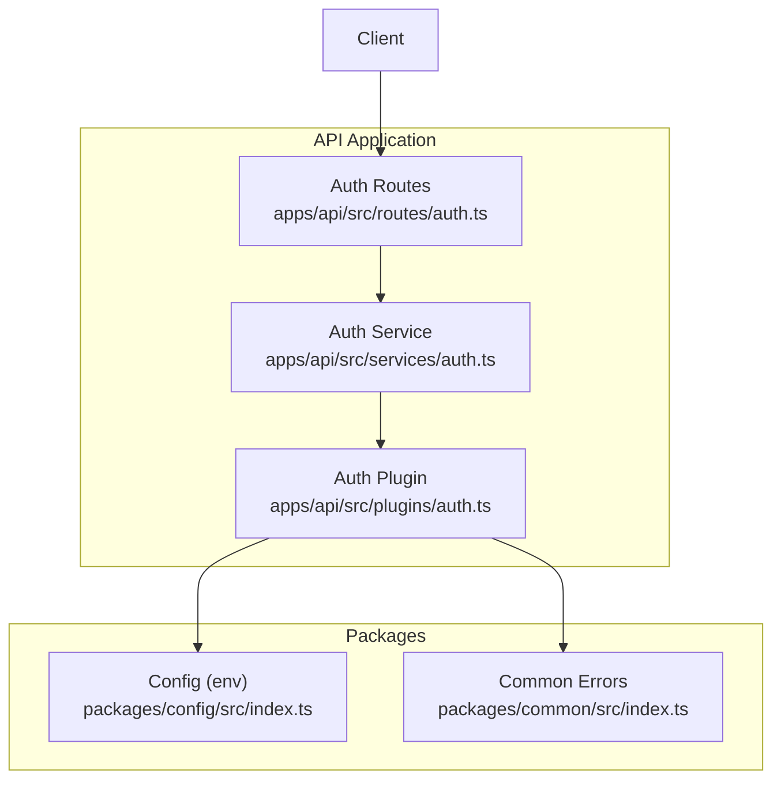
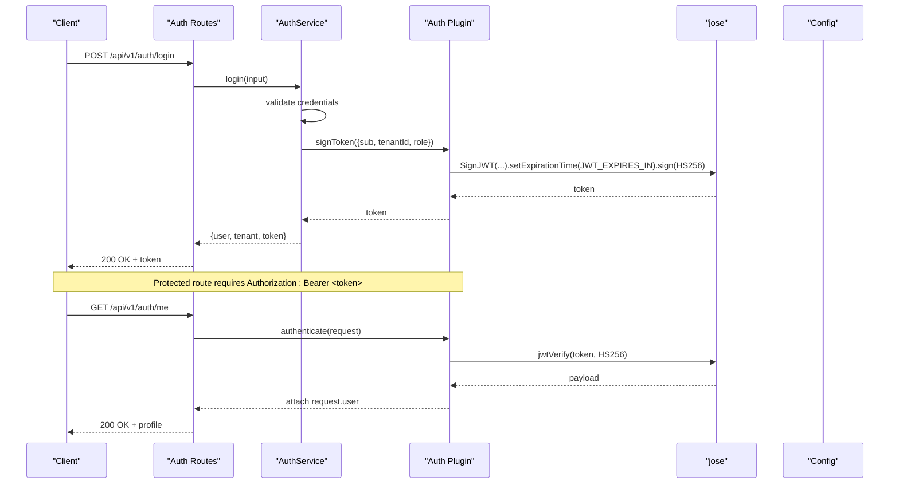
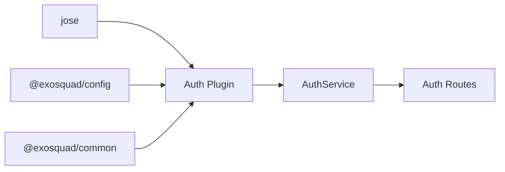

# JWT Token Management

<cite>
**Referenced Files in This Document**
- [auth.ts](file://apps/api/src/plugins/auth.ts)
- [auth.ts](file://apps/api/src/services/auth.ts)
- [auth.ts](file://apps/api/src/routes/auth.ts)
- [index.ts](file://packages/config/src/index.ts)
- [index.ts](file://packages/common/src/index.ts)
- [auth.test.ts](file://apps/api/test/integration/auth.test.ts)
</cite>

## Table of Contents
1. [Introduction](#introduction)
2. [Project Structure](#project-structure)
3. [Core Components](#core-components)
4. [Architecture Overview](#architecture-overview)
5. [Detailed Component Analysis](#detailed-component-analysis)
6. [Dependency Analysis](#dependency-analysis)
7. [Performance Considerations](#performance-considerations)
8. [Troubleshooting Guide](#troubleshooting-guide)
9. [Conclusion](#conclusion)

## Introduction
This document explains how the Exosquad API manages JSON Web Tokens (JWT) for authentication. It focuses on the jose library implementation for signing and verifying tokens using the HS256 algorithm, the signToken function for creating tokens with user context (userId, tenantId, role), and the verifyToken function for validating tokens. It also covers token payload structure, expiration handling via configuration, and security considerations for token storage.

## Project Structure
The JWT functionality is implemented across a few focused files:
- Authentication plugin providing signToken, verifyToken, and Fastify middleware
- Auth service orchestrating signup/login flows and issuing tokens
- Auth routes exposing endpoints that use the auth service and middleware
- Configuration package defining JWT environment variables
- Common package defining error types used by the auth flow

**Diagram sources**
- [auth.ts:1-68](file://apps/api/src/routes/auth.ts#L1-L68)
- [auth.ts:1-190](file://apps/api/src/services/auth.ts#L1-L190)
- [auth.ts:1-101](file://apps/api/src/plugins/auth.ts#L1-L101)
- [index.ts:10-34](file://packages/config/src/index.ts#L10-L34)
- [index.ts:12-93](file://packages/common/src/index.ts#L12-L93)

**Section sources**
- [auth.ts:1-68](file://apps/api/src/routes/auth.ts#L1-L68)
- [auth.ts:1-190](file://apps/api/src/services/auth.ts#L1-L190)
- [auth.ts:1-101](file://apps/api/src/plugins/auth.ts#L1-L101)
- [index.ts:10-34](file://packages/config/src/index.ts#L10-L34)
- [index.ts:12-93](file://packages/common/src/index.ts#L12-L93)

## Core Components
- jose-based JWT signing and verification with HS256
- signToken(payload): creates a signed JWT with configured expiration
- verifyToken(token): validates and decodes a JWT into a typed user context
- Fastify authenticate preHandler: enforces bearer token presence and validity
- AuthService.signup/login: issues tokens after successful account creation or login

Key responsibilities:
- apps/api/src/plugins/auth.ts: jose integration, token lifecycle, and Fastify middleware
- apps/api/src/services/auth.ts: business logic for authentication and token issuance
- apps/api/src/routes/auth.ts: HTTP endpoints for signup, login, and protected profile access
- packages/config/src/index.ts: JWT_SECRET and JWT_EXPIRES_IN validation and defaults
- packages/common/src/index.ts: standardized error classes used throughout the auth flow

**Section sources**
- [auth.ts:18-63](file://apps/api/src/plugins/auth.ts#L18-L63)
- [auth.ts:24-48](file://apps/api/src/plugins/auth.ts#L24-L48)
- [auth.ts:70-93](file://apps/api/src/plugins/auth.ts#L70-L93)
- [auth.ts:67-86](file://apps/api/src/services/auth.ts#L67-L86)
- [auth.ts:136-155](file://apps/api/src/services/auth.ts#L136-L155)
- [auth.ts:23-67](file://apps/api/src/routes/auth.ts#L23-L67)
- [index.ts:26-30](file://packages/config/src/index.ts#L26-L30)
- [index.ts:50-55](file://packages/common/src/index.ts#L50-L55)

## Architecture Overview
The authentication flow uses jose to sign and verify HS256 tokens. The Fastify authenticate middleware extracts the Bearer token, verifies it, and attaches the decoded user context to the request. Services call signToken during signup and login to issue tokens.

**Diagram sources**
- [auth.ts:23-67](file://apps/api/src/routes/auth.ts#L23-L67)
- [auth.ts:92-155](file://apps/api/src/services/auth.ts#L92-L155)
- [auth.ts:24-63](file://apps/api/src/plugins/auth.ts#L24-L63)
- [index.ts:26-30](file://packages/config/src/index.ts#L26-L30)

## Detailed Component Analysis

### jose Library Implementation and HS256 Configuration
- Algorithm: HS256 is explicitly set for both signing and verification.
- Secret handling: The secret is loaded from config.JWT_SECRET and encoded to bytes before use.
- Verification options: algorithms array restricts accepted algorithms to HS256 only.

Security notes:
- HS256 relies on a strong symmetric secret; ensure JWT_SECRET meets minimum length requirements enforced by config.
- Avoid logging secrets or tokens.

**Section sources**
- [auth.ts:18-30](file://apps/api/src/plugins/auth.ts#L18-L30)
- [auth.ts:58-62](file://apps/api/src/plugins/auth.ts#L58-L62)
- [index.ts:26-30](file://packages/config/src/index.ts#L26-L30)

### signToken Function
Purpose:
- Creates a JWT containing user identity and tenant context.
- Sets issued-at and expiration time based on config.JWT_EXPIRES_IN.
- Signs with HS256 using the configured secret.

Payload fields:
- sub: user identifier (userId)
- tenantId: tenant identifier
- role: user role within the tenant

Behavior:
- Returns a compact JWT string suitable for client storage and transmission.

Error handling:
- Throws if signing fails (e.g., invalid secret or misconfiguration).

Usage examples:
- Issued after successful signup and login in AuthService.

**Section sources**
- [auth.ts:53-63](file://apps/api/src/plugins/auth.ts#L53-L63)
- [auth.ts:67-86](file://apps/api/src/services/auth.ts#L67-L86)
- [auth.ts:136-155](file://apps/api/src/services/auth.ts#L136-L155)

### verifyToken Function
Purpose:
- Validates and decodes a JWT using HS256.
- Extracts userId, tenantId, and role from the payload.
- Normalizes missing or invalid role to a safe default.

Validation rules:
- Requires userId and tenantId to be present and strings.
- Ignores malformed or expired tokens by returning null.

Return value:
- A typed object with userId, tenantId, and role when valid.
- null otherwise.

Integration:
- Used by the Fastify authenticate middleware to authorize requests.

**Section sources**
- [auth.ts:24-48](file://apps/api/src/plugins/auth.ts#L24-L48)
- [auth.ts:73-90](file://apps/api/src/plugins/auth.ts#L73-L90)

### Fastify Authentication Middleware
Responsibilities:
- Enforce Authorization header format (Bearer token).
- Call verifyToken to validate the token.
- Attach decoded user context to request.user.
- Throw UnauthorizedError for missing/invalid tokens.

Type augmentation:
- Extends FastifyRequest with a user field containing userId, tenantId, and role.

Usage:
- Applied as a preHandler on protected routes (e.g., GET /me).

**Section sources**
- [auth.ts:7-16](file://apps/api/src/plugins/auth.ts#L7-L16)
- [auth.ts:70-93](file://apps/api/src/plugins/auth.ts#L70-L93)
- [auth.ts:55-66](file://apps/api/src/routes/auth.ts#L55-L66)

### Token Payload Structure
Standard claims and custom fields:
- sub: string (userId)
- tenantId: string
- role: string (defaults to member if absent or invalid)
- iat: issued at timestamp (set automatically)
- exp: expiration timestamp (set via config.JWT_EXPIRES_IN)

Notes:
- Do not store sensitive data in the token payload; it is only base64-encoded, not encrypted.

**Section sources**
- [auth.ts:32-44](file://apps/api/src/plugins/auth.ts#L32-L44)
- [auth.ts:58-62](file://apps/api/src/plugins/auth.ts#L58-L62)

### Expiration Handling
Configuration:
- JWT_EXPIRES_IN is validated and defaults to a human-readable duration string (e.g., "24h").
- signToken sets the expiration time using this configuration.

Implications:
- Tokens expire according to the configured duration.
- Clients should handle 401 responses due to expired tokens by prompting re-authentication.

**Section sources**
- [index.ts:26-30](file://packages/config/src/index.ts#L26-L30)
- [auth.ts:58-62](file://apps/api/src/plugins/auth.ts#L58-L62)

### Security Considerations for Token Storage
Recommendations:
- Prefer httpOnly, secure, SameSite cookies for server-rendered applications.
- For SPAs/mobile clients, consider short-lived access tokens and refresh tokens stored securely (secure storage APIs).
- Never log tokens or secrets.
- Rotate JWT_SECRET periodically and ensure it meets minimum length requirements.
- Use HTTPS everywhere to prevent token interception.

[No sources needed since this section provides general guidance]

## Dependency Analysis
High-level dependencies:
- Auth Plugin depends on jose for cryptographic operations and on @exosquad/config for JWT settings.
- Auth Service imports signToken from the Auth Plugin and uses database queries to authenticate users.
- Auth Routes depend on AuthService and register the authenticate middleware for protected endpoints.
- Common errors are used consistently across services and plugins.

**Diagram sources**
- [auth.ts:1-6](file://apps/api/src/plugins/auth.ts#L1-L6)
- [auth.ts:1-3](file://apps/api/src/services/auth.ts#L1-L3)
- [auth.ts:1-3](file://apps/api/src/routes/auth.ts#L1-L3)
- [index.ts:26-30](file://packages/config/src/index.ts#L26-L30)
- [index.ts:50-55](file://packages/common/src/index.ts#L50-L55)

**Section sources**
- [auth.ts:1-6](file://apps/api/src/plugins/auth.ts#L1-L6)
- [auth.ts:1-3](file://apps/api/src/services/auth.ts#L1-L3)
- [auth.ts:1-3](file://apps/api/src/routes/auth.ts#L1-L3)
- [index.ts:26-30](file://packages/config/src/index.ts#L26-L30)
- [index.ts:50-55](file://packages/common/src/index.ts#L50-L55)

## Performance Considerations
- HS256 signing/verification is fast and CPU-efficient; avoid unnecessary re-signing.
- Keep JWT payloads minimal to reduce network overhead.
- Cache user profiles server-side if frequently accessed, but do not cache tokens.
- Ensure JWT_EXPIRES_IN balances security and UX; shorter lifetimes increase re-auth frequency.

[No sources needed since this section provides general guidance]

## Troubleshooting Guide
Common issues and resolutions:
- Missing or malformed Authorization header:
  - Ensure requests include Authorization: Bearer <token>.
  - The middleware throws UnauthorizedError when the header is missing or does not start with "Bearer ".
- Invalid or expired token:
  - verifyToken returns null for invalid/expired tokens; the middleware throws UnauthorizedError.
  - Check JWT_EXPIRES_IN and ensure clients handle expiration gracefully.
- Invalid payload fields:
  - verifyToken requires userId and tenantId to be present and strings; missing fields result in null.
- Environment configuration errors:
  - JWT_SECRET must meet minimum length; JWT_EXPIRES_IN must be a valid duration string.
  - Startup will fail if environment variables are invalid.

Error types used:
- UnauthorizedError: thrown for missing/invalid tokens and other unauthorized conditions.
- NotFoundError: thrown when resources are not found.
- ConflictError: thrown for duplicate entities (e.g., tenant slug).

Testing patterns:
- Integration tests assert that protected endpoints require authentication and return appropriate status codes.

**Section sources**
- [auth.ts:73-90](file://apps/api/src/plugins/auth.ts#L73-L90)
- [auth.ts:24-48](file://apps/api/src/plugins/auth.ts#L24-L48)
- [index.ts:26-30](file://packages/config/src/index.ts#L26-L30)
- [index.ts:50-55](file://packages/common/src/index.ts#L50-L55)
- [auth.test.ts:40-47](file://apps/api/test/integration/auth.test.ts#L40-L47)

## Conclusion
The Exosquad authentication system uses jose to implement secure HS256 JWT signing and verification. Tokens carry essential user and tenant context while remaining lightweight. The Fastify authenticate middleware centralizes token validation, ensuring consistent protection across routes. Configuration-driven expiration and robust error handling provide a solid foundation for scalable, secure authentication. Follow the recommended token storage practices and keep payloads minimal to maintain performance and security.