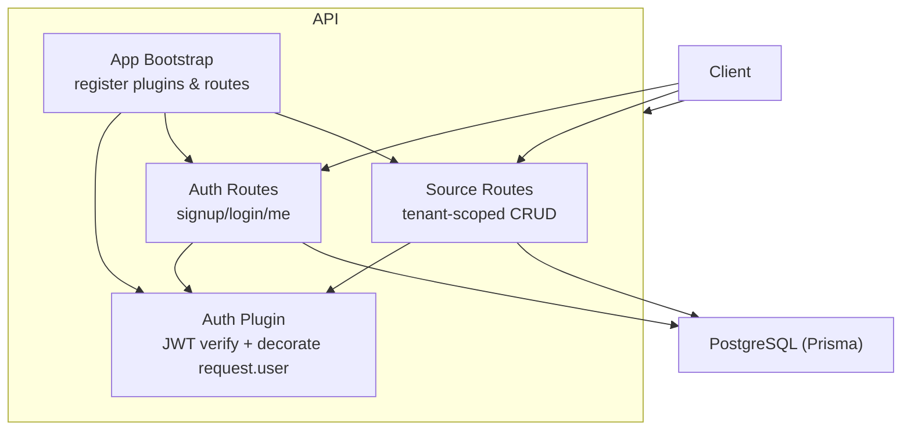
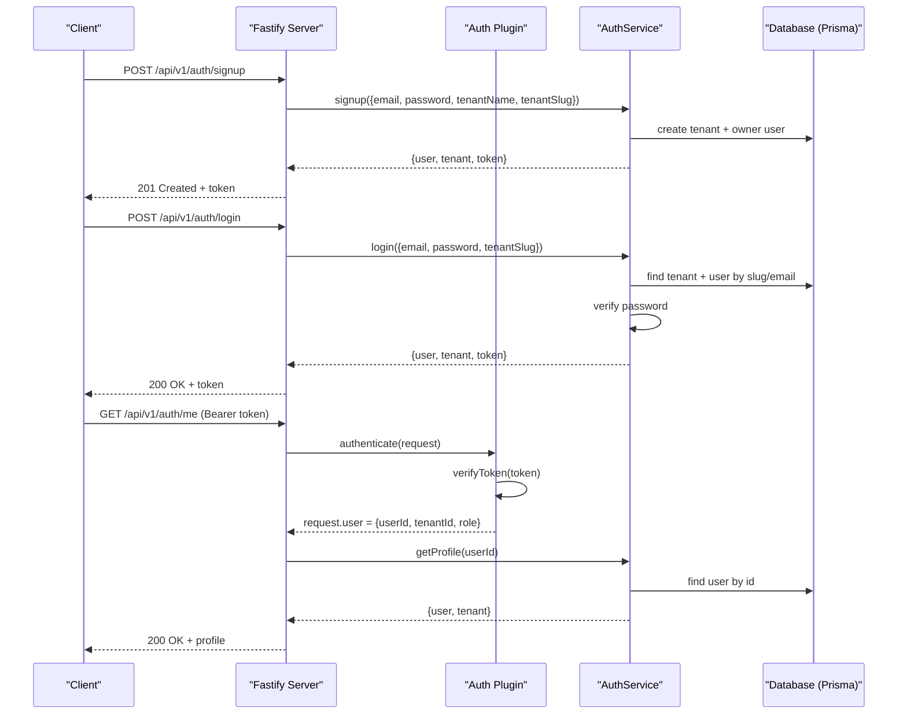
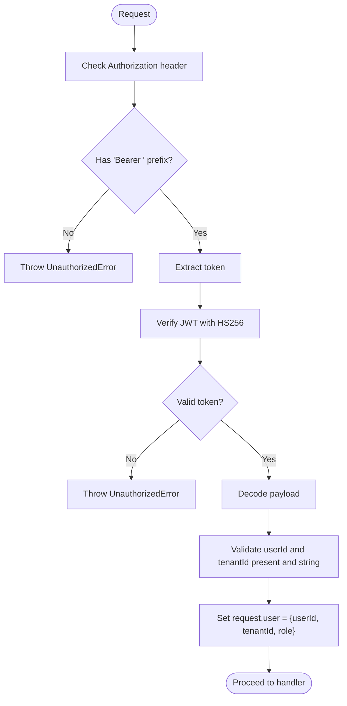
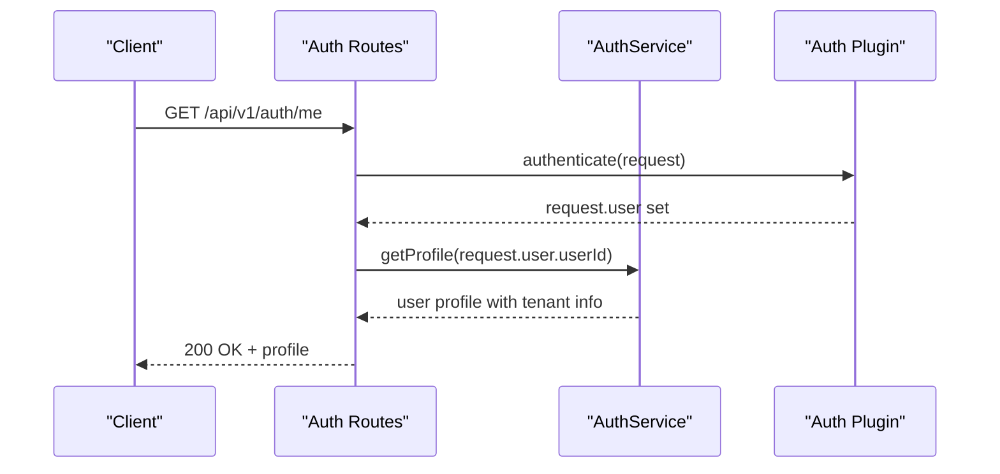
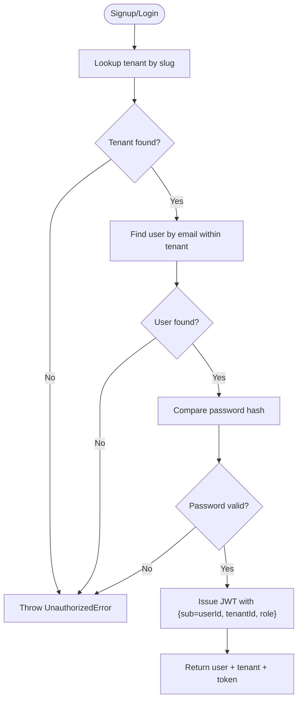
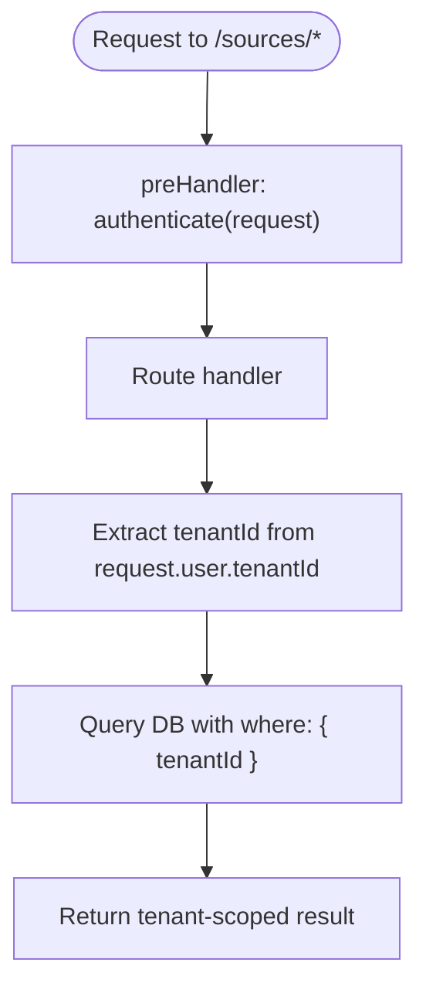
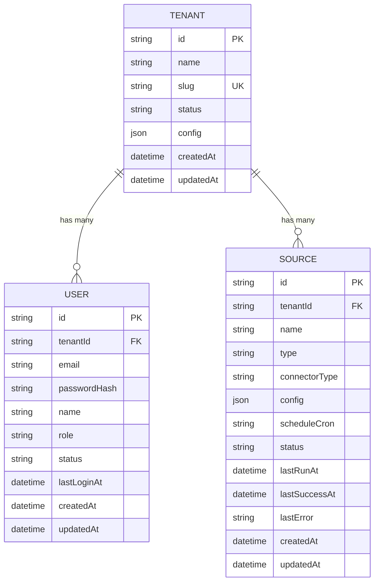
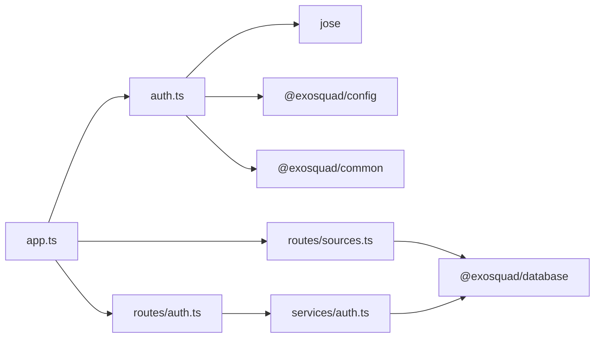

# Multi-Tenant Authentication

<cite>
**Referenced Files in This Document**
- [apps/api/src/plugins/auth.ts](file://apps/api/src/plugins/auth.ts)
- [apps/api/src/routes/auth.ts](file://apps/api/src/routes/auth.ts)
- [apps/api/src/services/auth.ts](file://apps/api/src/services/auth.ts)
- [apps/api/src/app.ts](file://apps/api/src/app.ts)
- [apps/api/src/routes/sources.ts](file://apps/api/src/routes/sources.ts)
- [packages/database/prisma/schema.prisma](file://packages/database/prisma/schema.prisma)
- [docs/ARCHITECTURE.md](file://docs/ARCHITECTURE.md)
</cite>

## Table of Contents
1. [Introduction](#introduction)
2. [Project Structure](#project-structure)
3. [Core Components](#core-components)
4. [Architecture Overview](#architecture-overview)
5. [Detailed Component Analysis](#detailed-component-analysis)
6. [Dependency Analysis](#dependency-analysis)
7. [Performance Considerations](#performance-considerations)
8. [Troubleshooting Guide](#troubleshooting-guide)
9. [Conclusion](#conclusion)

## Introduction
This document explains the multi-tenant authentication implementation, focusing on how tenant isolation is enforced through JWT payloads containing a tenant identifier and how the system maintains tenant boundaries across requests. It also documents the Fastify request decoration pattern used to attach user context, and how tenant-specific data access is controlled at the route and service layers. Examples include tenant-aware route protection, user-scoped operations, and cross-tenant security boundaries. Finally, it addresses common multi-tenancy challenges and their solutions as implemented in this codebase.

## Project Structure
The API application uses Fastify with a plugin-based architecture:
- Authentication logic is encapsulated in a Fastify plugin that verifies JWTs and decorates the request object with user context.
- Routes are organized by feature; protected routes use an authenticate preHandler to enforce authentication and derive tenant scope from the authenticated user.
- Services interact with the database using Prisma, ensuring all queries are scoped to the current tenant.
- The database schema defines tenants, users, and domain entities with tenantId fields and indexes for efficient tenant-scoped queries.

**Diagram sources**
- [apps/api/src/app.ts:27-37](file://apps/api/src/app.ts#L27-L37)
- [apps/api/src/plugins/auth.ts:70-93](file://apps/api/src/plugins/auth.ts#L70-L93)
- [apps/api/src/routes/auth.ts:23-67](file://apps/api/src/routes/auth.ts#L23-L67)
- [apps/api/src/routes/sources.ts:28-117](file://apps/api/src/routes/sources.ts#L28-L117)

**Section sources**
- [apps/api/src/app.ts:12-37](file://apps/api/src/app.ts#L12-L37)
- [apps/api/src/plugins/auth.ts:1-101](file://apps/api/src/plugins/auth.ts#L1-L101)
- [apps/api/src/routes/auth.ts:1-68](file://apps/api/src/routes/auth.ts#L1-L68)
- [apps/api/src/routes/sources.ts:1-118](file://apps/api/src/routes/sources.ts#L1-L118)

## Core Components
- Authentication plugin: Verifies JWT tokens, extracts userId, tenantId, and role, and attaches them to the request via Fastify’s request decoration.
- Auth routes: Provide signup, login, and profile endpoints; protected endpoints require a valid Bearer token.
- Auth service: Handles business logic for creating tenants/users, validating credentials, issuing JWTs, and retrieving profiles.
- Source routes: Demonstrate tenant-scoped resource management using the authenticated user’s tenantId.
- Database schema: Defines Tenant, User, and other entities with tenantId fields and appropriate indexes.

Key responsibilities:
- Enforce tenant isolation at the boundary of every request by deriving tenantId from the JWT-decorated user context.
- Ensure all database queries include tenantId filters to prevent cross-tenant data access.
- Use roles within the JWT to support future authorization checks beyond tenant isolation.

**Section sources**
- [apps/api/src/plugins/auth.ts:24-63](file://apps/api/src/plugins/auth.ts#L24-L63)
- [apps/api/src/routes/auth.ts:23-67](file://apps/api/src/routes/auth.ts#L23-L67)
- [apps/api/src/services/auth.ts:26-189](file://apps/api/src/services/auth.ts#L26-L189)
- [apps/api/src/routes/sources.ts:28-117](file://apps/api/src/routes/sources.ts#L28-L117)
- [packages/database/prisma/schema.prisma:24-64](file://packages/database/prisma/schema.prisma#L24-L64)

## Architecture Overview
The authentication flow centers around JWTs that carry the user identity and tenant context. The Fastify server registers an auth plugin that validates tokens and decorates each request with a user object containing userId, tenantId, and role. Protected routes then rely on this context to scope database operations to the correct tenant.

**Diagram sources**
- [apps/api/src/routes/auth.ts:23-67](file://apps/api/src/routes/auth.ts#L23-L67)
- [apps/api/src/services/auth.ts:31-87](file://apps/api/src/services/auth.ts#L31-L87)
- [apps/api/src/services/auth.ts:92-156](file://apps/api/src/services/auth.ts#L92-L156)
- [apps/api/src/plugins/auth.ts:70-93](file://apps/api/src/plugins/auth.ts#L70-L93)

## Detailed Component Analysis

### Authentication Plugin: JWT Verification and Request Decoration
The authentication plugin performs:
- Token verification using HS256 and a configured secret.
- Extraction of userId (sub), tenantId, and role from the payload.
- Validation that required fields exist and are strings.
- Attaching the decoded user context to the request via Fastify’s request decoration.
- Providing a global authenticate preHandler that enforces authentication on protected routes.

**Diagram sources**
- [apps/api/src/plugins/auth.ts:70-93](file://apps/api/src/plugins/auth.ts#L70-L93)
- [apps/api/src/plugins/auth.ts:24-48](file://apps/api/src/plugins/auth.ts#L24-L48)

**Section sources**
- [apps/api/src/plugins/auth.ts:1-101](file://apps/api/src/plugins/auth.ts#L1-L101)

### Auth Routes: Tenant-Aware Endpoints
- Signup and login accept tenantSlug to bind the user to a specific tenant during registration and authentication.
- The /me endpoint is protected via a preHandler that calls the authenticate method, ensuring only authenticated users can access their profile.
- The route handlers pass the authenticated userId to the service layer.

**Diagram sources**
- [apps/api/src/routes/auth.ts:54-67](file://apps/api/src/routes/auth.ts#L54-L67)
- [apps/api/src/plugins/auth.ts:70-93](file://apps/api/src/plugins/auth.ts#L70-L93)

**Section sources**
- [apps/api/src/routes/auth.ts:1-68](file://apps/api/src/routes/auth.ts#L1-L68)

### Auth Service: Business Logic and JWT Issuance
- Signup creates a tenant and an owner user atomically, then issues a JWT containing userId, tenantId, and role.
- Login locates the tenant by slug, finds the user by email within that tenant, validates the password, updates last login timestamp, and issues a JWT.
- Profile retrieval returns user details along with associated tenant information.

**Diagram sources**
- [apps/api/src/services/auth.ts:31-87](file://apps/api/src/services/auth.ts#L31-L87)
- [apps/api/src/services/auth.ts:92-156](file://apps/api/src/services/auth.ts#L92-L156)

**Section sources**
- [apps/api/src/services/auth.ts:1-190](file://apps/api/src/services/auth.ts#L1-L190)

### Source Routes: Tenant-Scoped Data Access
All source routes are protected by a global preHandler that invokes authenticate, ensuring every request has a validated user context. Handlers extract tenantId from request.user.tenantId and apply it to all database queries, preventing cross-tenant access.

**Diagram sources**
- [apps/api/src/routes/sources.ts:28-117](file://apps/api/src/routes/sources.ts#L28-L117)

**Section sources**
- [apps/api/src/routes/sources.ts:1-118](file://apps/api/src/routes/sources.ts#L1-L118)

### Database Schema: Tenant Isolation Model
The schema defines:
- Tenant entity with unique slug and status.
- User entity linked to Tenant via tenantId, with unique constraint on (tenantId, email).
- Domain entities (e.g., Source, Product, Observation, Evidence, Job, ApiConnection, AuditLog, RawResponse, IngestionCheckpoint) include tenantId and relevant indexes to optimize tenant-scoped queries.

**Diagram sources**
- [packages/database/prisma/schema.prisma:24-102](file://packages/database/prisma/schema.prisma#L24-L102)

**Section sources**
- [packages/database/prisma/schema.prisma:24-102](file://packages/database/prisma/schema.prisma#L24-L102)

## Dependency Analysis
The authentication system depends on:
- jose library for JWT signing and verification.
- Fastify plugin mechanism to register global decorators and preHandlers.
- Prisma client to interact with PostgreSQL and enforce tenant scoping at the query level.
- Configuration module for JWT secret and expiration settings.

**Diagram sources**
- [apps/api/src/plugins/auth.ts:1-5](file://apps/api/src/plugins/auth.ts#L1-L5)
- [apps/api/src/routes/auth.ts:1-4](file://apps/api/src/routes/auth.ts#L1-L4)
- [apps/api/src/services/auth.ts:1-8](file://apps/api/src/services/auth.ts#L1-L8)
- [apps/api/src/routes/sources.ts:1-3](file://apps/api/src/routes/sources.ts#L1-L3)
- [apps/api/src/app.ts:1-10](file://apps/api/src/app.ts#L1-L10)

**Section sources**
- [apps/api/src/plugins/auth.ts:1-101](file://apps/api/src/plugins/auth.ts#L1-L101)
- [apps/api/src/routes/auth.ts:1-68](file://apps/api/src/routes/auth.ts#L1-L68)
- [apps/api/src/services/auth.ts:1-190](file://apps/api/src/services/auth.ts#L1-L190)
- [apps/api/src/routes/sources.ts:1-118](file://apps/api/src/routes/sources.ts#L1-L118)
- [apps/api/src/app.ts:1-37](file://apps/api/src/app.ts#L1-L37)

## Performance Considerations
- JWT verification is lightweight and performed per request; ensure secrets are securely managed and rotation strategies are in place.
- Database queries are indexed by tenantId to optimize tenant-scoped lookups; maintain these indexes as new entities are added.
- Avoid unnecessary joins when not required; prefer filtering by tenantId early in queries to reduce data transfer.
- Consider caching frequently accessed tenant metadata if needed, while ensuring cache invalidation aligns with tenant configuration changes.

[No sources needed since this section provides general guidance]

## Troubleshooting Guide
Common issues and resolutions:
- Missing or malformed Authorization header: Ensure clients send Bearer tokens; the authenticate preHandler throws an unauthorized error if missing or invalid.
- Invalid or expired JWT: Verify token signature and expiration; reissue tokens after login or signup.
- Cross-tenant data leaks: Confirm all route handlers derive tenantId from request.user.tenantId and include it in all Prisma queries.
- Role-based access control: While roles are included in JWTs, explicit authorization checks should be added to protect sensitive operations beyond tenant isolation.

Operational references:
- Authentication errors are handled centrally and return standardized error responses.
- Security headers and rate limiting are applied globally to mitigate abuse.

**Section sources**
- [apps/api/src/plugins/auth.ts:70-93](file://apps/api/src/plugins/auth.ts#L70-L93)
- [apps/api/src/app.ts:39-71](file://apps/api/src/app.ts#L39-L71)
- [docs/ARCHITECTURE.md:142-171](file://docs/ARCHITECTURE.md#L142-L171)

## Conclusion
This multi-tenant authentication implementation enforces strict tenant isolation by embedding tenantId in JWT payloads and deriving tenant scope from the authenticated user context attached to each request. The Fastify plugin pattern centralizes authentication logic, while route handlers consistently apply tenantId filters to database queries. The database schema supports efficient tenant-scoped operations through dedicated fields and indexes. By following these patterns, the system maintains clear security boundaries between tenants and provides a foundation for scalable multi-tenant applications.

[No sources needed since this section summarizes without analyzing specific files]