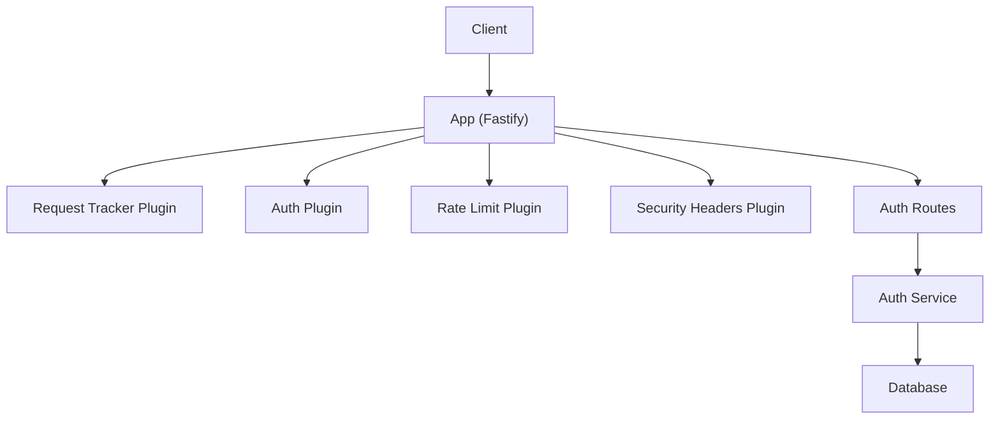
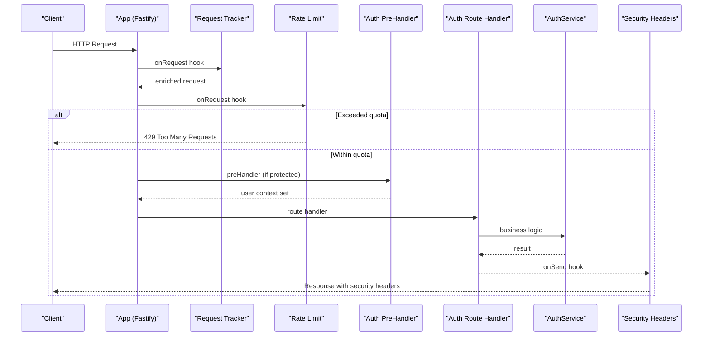
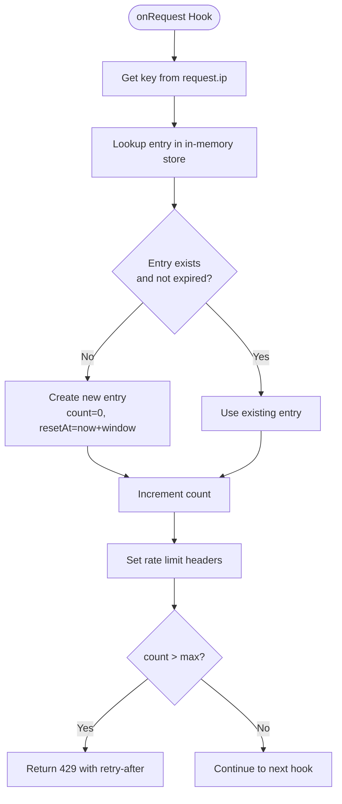
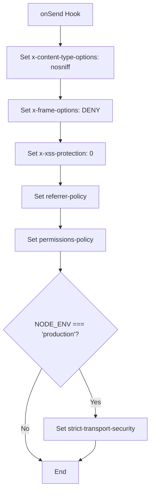
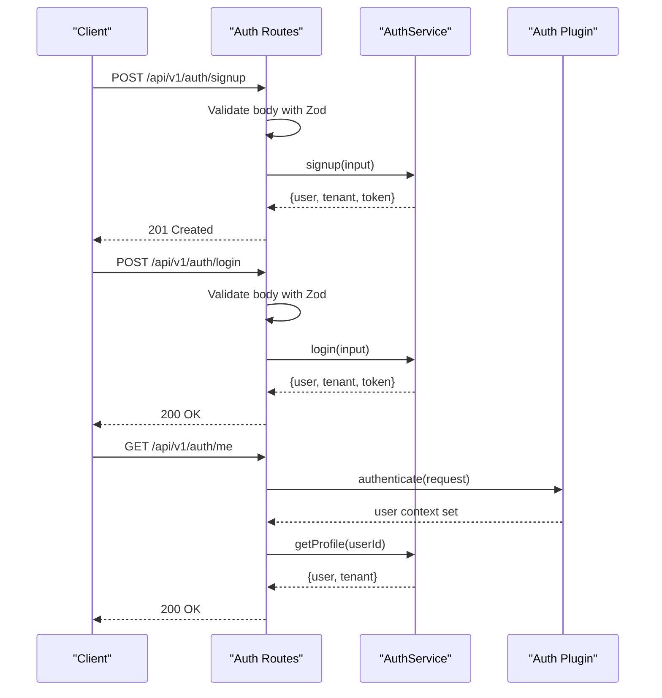
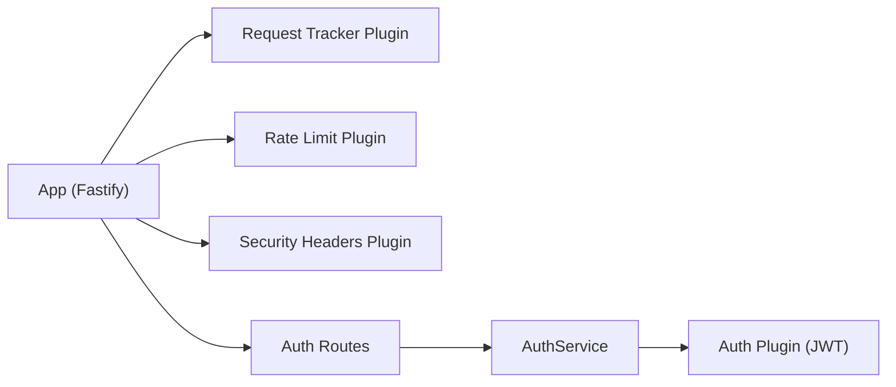

# Rate Limiting & Security Headers

<cite>
**Referenced Files in This Document**
- [app.ts](file://apps/api/src/app.ts)
- [rate-limit.ts](file://apps/api/src/plugins/rate-limit.ts)
- [security-headers.ts](file://apps/api/src/plugins/security-headers.ts)
- [auth.ts](file://apps/api/src/routes/auth.ts)
- [auth-service.ts](file://apps/api/src/services/auth.ts)
- [auth-plugin.ts](file://apps/api/src/plugins/auth.ts)
- [request-tracker.ts](file://apps/api/src/plugins/request-tracker.ts)
</cite>

## Table of Contents
1. [Introduction](#introduction)
2. [Project Structure](#project-structure)
3. [Core Components](#core-components)
4. [Architecture Overview](#architecture-overview)
5. [Detailed Component Analysis](#detailed-component-analysis)
6. [Dependency Analysis](#dependency-analysis)
7. [Performance Considerations](#performance-considerations)
8. [Troubleshooting Guide](#troubleshooting-guide)
9. [Conclusion](#conclusion)

## Introduction
This document explains the API protection mechanisms implemented in the application, focusing on rate limiting and security headers. It details how these controls defend authentication endpoints against abuse and brute force attempts, and how they mitigate common web vulnerabilities such as XSS, clickjacking, and MIME sniffing. The guide includes configuration options, threshold settings, customization patterns, integration with authentication flows, and monitoring approaches for detecting suspicious activity.

## Project Structure
The API is built with Fastify and organizes cross-cutting concerns as plugins:
- Request tracking adds request IDs and contextual logging.
- Authentication provides JWT verification and a preHandler decorator.
- Rate limiting enforces per-IP request quotas.
- Security headers harden responses against common attacks.
- Routes define authentication endpoints and protected resource access.

**Diagram sources**
- [app.ts:27-36](file://apps/api/src/app.ts#L27-L36)
- [auth.ts:23-67](file://apps/api/src/routes/auth.ts#L23-L67)
- [auth-service.ts:26-156](file://apps/api/src/services/auth.ts#L26-L156)

**Section sources**
- [app.ts:1-36](file://apps/api/src/app.ts#L1-L36)

## Core Components
- Rate Limit Plugin: In-memory per-IP limiter with windowed counters, standard rate limit response headers, and a 429 status when exceeded.
- Security Headers Plugin: Sets defensive headers on every response; enables HSTS in production.
- Auth Plugin: Provides token signing/verification and an authenticate preHandler for protected routes.
- Auth Routes: Define signup, login, and profile endpoints; validate inputs with Zod; enforce authentication on sensitive routes.
- Request Tracker Plugin: Assigns unique request IDs and enriches logs for observability.

Key responsibilities:
- Prevent abuse via rate limits on all endpoints, including authentication.
- Harden HTTP responses to reduce attack surface.
- Securely issue and verify JWTs for authenticated sessions.
- Provide consistent error handling and structured logging.

**Section sources**
- [rate-limit.ts:1-62](file://apps/api/src/plugins/rate-limit.ts#L1-L62)
- [security-headers.ts:1-31](file://apps/api/src/plugins/security-headers.ts#L1-L31)
- [auth-plugin.ts:1-101](file://apps/api/src/plugins/auth.ts#L1-L101)
- [auth.ts:1-68](file://apps/api/src/routes/auth.ts#L1-L68)
- [request-tracker.ts:1-43](file://apps/api/src/plugins/request-tracker.ts#L1-L43)

## Architecture Overview
The request lifecycle integrates multiple plugins before reaching route handlers:
1. Request Tracker assigns a request ID and child logger.
2. Rate Limiter evaluates per-IP usage and may short-circuit with 429.
3. Auth Plugin decorates requests with user context when required by routes.
4. Route handlers execute business logic (e.g., AuthService).
5. Security Headers Plugin attaches protective headers on every response.

**Diagram sources**
- [app.ts:27-36](file://apps/api/src/app.ts#L27-L36)
- [rate-limit.ts:28-60](file://apps/api/src/plugins/rate-limit.ts#L28-L60)
- [auth-plugin.ts:70-93](file://apps/api/src/plugins/auth.ts#L70-L93)
- [auth.ts:23-67](file://apps/api/src/routes/auth.ts#L23-L67)
- [security-headers.ts:7-30](file://apps/api/src/plugins/security-headers.ts#L7-L30)

## Detailed Component Analysis

### Rate Limiting Strategy
The rate limiter uses an in-memory Map keyed by client IP with a fixed time window and maximum request count. It sets standard rate limit headers and returns 429 when the limit is exceeded.

- Window and thresholds:
  - Window size: 60 seconds
  - Max requests per window: 100
- Keying strategy:
  - Per-IP using request.ip (requires trustProxy to be enabled at the app level).
- Headers:
  - x-ratelimit-limit: configured maximum
  - x-ratelimit-remaining: remaining requests in current window
  - x-ratelimit-reset: Unix timestamp when the window resets
  - retry-after: seconds until reset when limited
- Cleanup:
  - Periodic cleanup removes expired entries to prevent memory growth.

Customization patterns:
- Adjust WINDOW_MS and MAX_REQUESTS constants to tune sensitivity.
- Replace the in-memory store with a distributed store (e.g., Redis-backed @fastify/rate-limit) for multi-instance deployments.
- Add endpoint-specific overrides by registering route-level hooks or middleware that adjust thresholds for sensitive paths like /login and /signup.

Integration with authentication:
- Since the rate limiter runs early in the pipeline, it protects both public and protected endpoints uniformly.
- For stricter protection on authentication endpoints, consider lower thresholds or separate counters keyed by email + tenantSlug in addition to IP.

Monitoring and detection:
- Track 429 responses and retry-after values to detect brute-force attempts.
- Correlate rate-limited events with request IDs from the request tracker plugin for traceability.

**Diagram sources**
- [rate-limit.ts:28-60](file://apps/api/src/plugins/rate-limit.ts#L28-L60)

**Section sources**
- [rate-limit.ts:1-62](file://apps/api/src/plugins/rate-limit.ts#L1-L62)
- [app.ts:16-20](file://apps/api/src/app.ts#L16-L20)

### Security Headers Configuration
The security headers plugin attaches defensive headers on every response:
- x-content-type-options: nosniff
- x-frame-options: DENY
- x-xss-protection: 0 (modern browsers rely on CSP)
- referrer-policy: strict-origin-when-cross-origin
- permissions-policy: restricts camera, microphone, geolocation
- strict-transport-security: enabled in production with includeSubDomains

Protection coverage:
- XSS mitigation via CSP guidance and disabling legacy XSS filter.
- Clickjacking prevention via X-Frame-Options DENY.
- MIME sniffing prevention via X-Content-Type-Options nosniff.
- HTTPS enforcement via HSTS in production.

Customization patterns:
- Introduce a Content-Security-Policy header tailored to frontend requirements in production.
- Conditionally enable additional headers based on environment variables or feature flags.
- Allow per-route overrides if certain endpoints require relaxed policies (e.g., file downloads).

**Diagram sources**
- [security-headers.ts:7-30](file://apps/api/src/plugins/security-headers.ts#L7-L30)

**Section sources**
- [security-headers.ts:1-31](file://apps/api/src/plugins/security-headers.ts#L1-L31)

### Authentication Flow Integration
Authentication endpoints are defined under a prefixed path and validated with Zod schemas. Protected routes use the auth plugin’s authenticate preHandler to ensure valid JWTs.

- Signup and login:
  - Validate input fields (email, password, tenant identifiers).
  - Create users and tenants securely; sign JWTs upon success.
- Profile endpoint:
  - Requires a valid Bearer token via the authenticate preHandler.

Integration points:
- Rate limiting applies to signup/login to mitigate brute force.
- Security headers apply to all responses, including errors.
- Request tracking ensures each attempt is logged with a unique ID for analysis.

**Diagram sources**
- [auth.ts:23-67](file://apps/api/src/routes/auth.ts#L23-L67)
- [auth-service.ts:31-156](file://apps/api/src/services/auth.ts#L31-L156)
- [auth-plugin.ts:70-93](file://apps/api/src/plugins/auth.ts#L70-L93)

**Section sources**
- [auth.ts:1-68](file://apps/api/src/routes/auth.ts#L1-L68)
- [auth-service.ts:1-190](file://apps/api/src/services/auth.ts#L1-L190)
- [auth-plugin.ts:1-101](file://apps/api/src/plugins/auth.ts#L1-L101)

### Monitoring Approaches for Suspicious Activity
- Log correlation:
  - Use request IDs attached by the request tracker plugin to correlate rate-limited events, authentication failures, and successful logins.
- Metrics to collect:
  - Count of 429 responses per IP and per endpoint.
  - Frequency of invalid credentials on login.
  - Distribution of retry-after values to identify sustained abuse.
- Alerting:
  - Trigger alerts when an IP exceeds a fraction of the global rate limit within a short period.
  - Detect spikes in failed login attempts across tenants.
- Forensics:
  - Inspect request payloads (sanitized) and headers associated with flagged request IDs to understand attack vectors.

**Section sources**
- [request-tracker.ts:1-43](file://apps/api/src/plugins/request-tracker.ts#L1-L43)
- [rate-limit.ts:28-60](file://apps/api/src/plugins/rate-limit.ts#L28-L60)

## Dependency Analysis
The following diagram shows how core modules depend on each other to provide API protection:

**Diagram sources**
- [app.ts:27-36](file://apps/api/src/app.ts#L27-L36)
- [auth.ts:23-67](file://apps/api/src/routes/auth.ts#L23-L67)
- [auth-service.ts:26-156](file://apps/api/src/services/auth.ts#L26-L156)
- [auth-plugin.ts:18-63](file://apps/api/src/plugins/auth.ts#L18-L63)

**Section sources**
- [app.ts:1-36](file://apps/api/src/app.ts#L1-L36)

## Performance Considerations
- In-memory rate limiter:
  - Pros: Zero external dependencies, low latency.
  - Cons: Not shared across processes; potential memory growth without cleanup.
  - Mitigation: Keep periodic cleanup active; monitor Map size; replace with Redis-backed limiter in multi-instance environments.
- Trust proxy:
  - Ensure trustProxy is enabled so request.ip reflects the real client IP behind load balancers or reverse proxies.
- Header overhead:
  - Security headers add minimal overhead; negligible impact on performance.
- Token operations:
  - JWT signing/verification is CPU-bound; consider scaling horizontally and tuning bcrypt rounds for balance between security and latency.

[No sources needed since this section provides general guidance]

## Troubleshooting Guide
Common issues and resolutions:
- Clients receive 429 Too Many Requests:
  - Verify retry-after header and backoff strategies.
  - Review per-IP thresholds and consider relaxing limits for trusted networks or implementing allowlists.
- Incorrect client IP used for rate limiting:
  - Confirm trustProxy is enabled and upstream proxies set appropriate headers.
- Missing security headers:
  - Ensure security headers plugin is registered and running in onSend hook.
  - Check environment-specific conditions (e.g., HSTS only in production).
- Authentication failures despite valid tokens:
  - Validate JWT secret configuration and algorithm settings.
  - Inspect token expiration and payload structure.

Operational checks:
- Monitor 429 rates and retry-after distributions.
- Audit login failure rates per IP and per tenant.
- Validate presence of security headers in responses across environments.

**Section sources**
- [rate-limit.ts:28-60](file://apps/api/src/plugins/rate-limit.ts#L28-L60)
- [security-headers.ts:7-30](file://apps/api/src/plugins/security-headers.ts#L7-L30)
- [auth-plugin.ts:18-63](file://apps/api/src/plugins/auth.ts#L18-L63)

## Conclusion
The API employs a layered defense strategy:
- Rate limiting provides immediate protection against abuse and brute force attempts on authentication endpoints.
- Security headers harden responses against common web vulnerabilities.
- Authentication integrates JWT-based authorization with robust validation and error handling.
- Request tracking enables comprehensive observability for detecting and responding to suspicious activity.

For production readiness, consider:
- Migrating to a distributed rate limiter (e.g., Redis-backed).
- Defining a strict Content-Security-Policy aligned with frontend needs.
- Implementing targeted thresholds for sensitive endpoints and integrating alerting for anomalous patterns.

[No sources needed since this section summarizes without analyzing specific files]