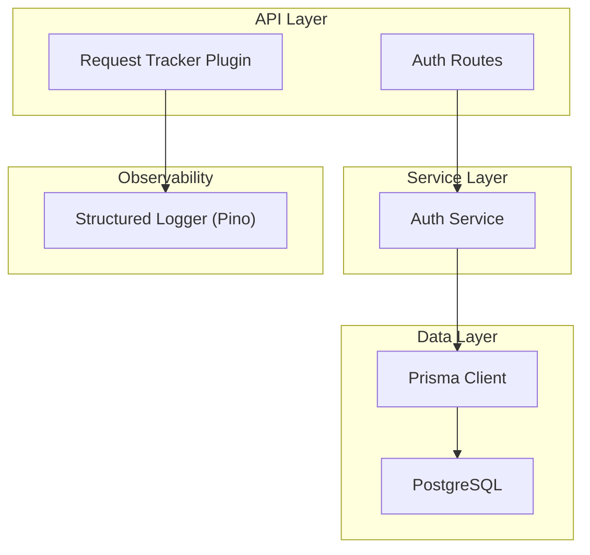
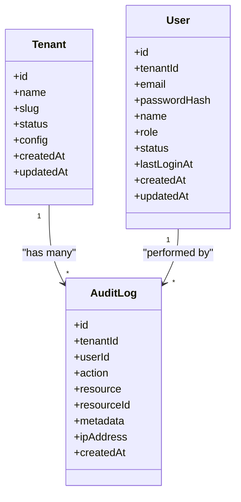
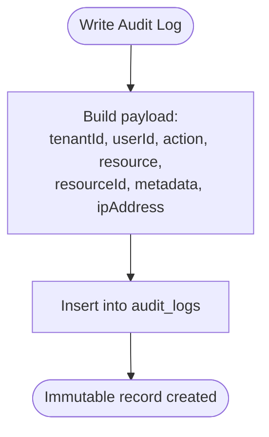
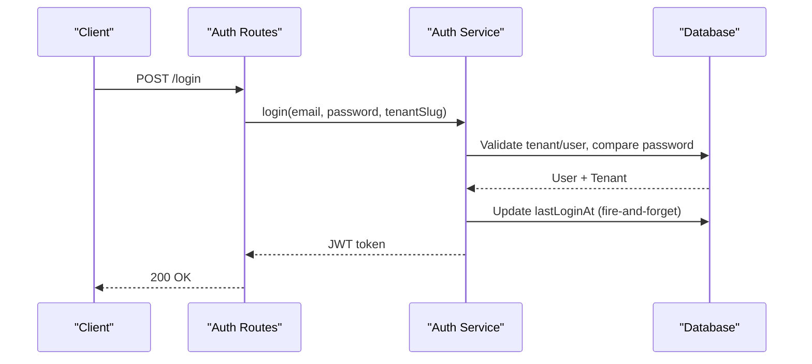
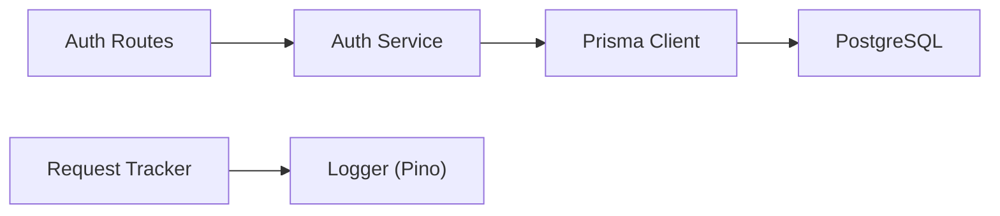

# Audit Logging System

<cite>
**Referenced Files in This Document**
- [schema.prisma](file://packages/database/prisma/schema.prisma)
- [migration.sql](file://packages/database/prisma/migrations/20261001214233_init/migration.sql)
- [ARCHITECTURE.md](file://docs/ARCHITECTURE.md)
- [index.ts (logger)](file://packages/logger/src/index.ts)
- [request-tracker.ts](file://apps/api/src/plugins/request-tracker.ts)
- [auth.ts (routes)](file://apps/api/src/routes/auth.ts)
- [auth.ts (service)](file://apps/api/src/services/auth.ts)
</cite>

## Table of Contents
1. [Introduction](#introduction)
2. [Project Structure](#project-structure)
3. [Core Components](#core-components)
4. [Architecture Overview](#architecture-overview)
5. [Detailed Component Analysis](#detailed-component-analysis)
6. [Dependency Analysis](#dependency-analysis)
7. [Performance Considerations](#performance-considerations)
8. [Troubleshooting Guide](#troubleshooting-guide)
9. [Conclusion](#conclusion)

## Introduction
This document describes the audit logging system designed for compliance and security tracking within the platform. It explains how significant system actions are recorded as immutable, append-only entries to support audits, investigations, and regulatory requirements. The model captures who performed an action, what was changed, when it happened, from where, and contextual metadata. It is multi-tenant aware and indexed for efficient querying.

## Project Structure
The audit logging capability is defined at the data layer via Prisma schema and migrations, with supporting observability utilities in the logger package and request tracking plugin. The API routes and services provide integration points where audit events can be emitted during authentication and other operations.

**Diagram sources**
- [auth.ts (routes):23-67](file://apps/api/src/routes/auth.ts#L23-L67)
- [auth.ts (service):26-189](file://apps/api/src/services/auth.ts#L26-L189)
- [request-tracker.ts:9-42](file://apps/api/src/plugins/request-tracker.ts#L9-L42)
- [index.ts (logger):12-41](file://packages/logger/src/index.ts#L12-L41)
- [schema.prisma:277-295](file://packages/database/prisma/schema.prisma#L277-L295)

**Section sources**
- [ARCHITECTURE.md:68-85](file://docs/ARCHITECTURE.md#L68-L85)
- [schema.prisma:277-295](file://packages/database/prisma/schema.prisma#L277-L295)

## Core Components
- AuditLog model: Immutable record capturing tenant, user, action, resource, optional resource identifier, structured metadata, IP address, and timestamp.
- Tenants and Users: Multi-tenant isolation; users belong to tenants; audit logs optionally attribute to a user and tenant.
- Indexing strategy: Optimized for queries by tenant, user, resource/resourceId, and time range.
- Observability: Structured JSON logging via Pino with child loggers bound to request context.

Key fields and their purpose:
- id: Unique identifier for each audit entry.
- tenantId: Optional foreign key to the Tenant for multi-tenant scoping.
- userId: Optional attribution to the User performing the action.
- action: Semantic label for the operation (e.g., create, update, delete, login, logout, ingest).
- resource: Domain entity type affected (e.g., user, source, product).
- resourceId: Identifier of the specific resource instance.
- metadata: Flexible JSON payload for additional context.
- ipAddress: Source IP address associated with the action.
- createdAt: Immutable timestamp of creation.

**Section sources**
- [schema.prisma:277-295](file://packages/database/prisma/schema.prisma#L277-L295)
- [migration.sql:259-268](file://packages/database/prisma/migrations/20261001214233_init/migration.sql#L259-L268)

## Architecture Overview
Audit logging is implemented as a dedicated table with strong indexing and a clear relationship to tenants. While the current codebase defines the schema and migration, the application’s auth flows and request tracking infrastructure provide natural hooks for emitting audit events.

**Diagram sources**
- [schema.prisma:24-41](file://packages/database/prisma/schema.prisma#L24-L41)
- [schema.prisma:47-64](file://packages/database/prisma/schema.prisma#L47-L64)
- [schema.prisma:277-295](file://packages/database/prisma/schema.prisma#L277-L295)

## Detailed Component Analysis

### AuditLog Model and Schema
- Purpose: Provide an immutable, append-only trail of significant actions across the platform.
- Fields:
  - id: Primary key.
  - tenantId: Optional FK to Tenant for multi-tenant scoping.
  - userId: Optional FK-like reference to User for attribution.
  - action: Enumerated-style string values such as create, update, delete, login, logout, ingest.
  - resource: Entity type string (e.g., user, source, product).
  - resourceId: Optional ID of the affected resource.
  - metadata: JSON field for flexible context.
  - ipAddress: Optional client IP address.
  - createdAt: Timestamp set on insert.
- Relationships:
  - Optional relation to Tenant.
  - No direct FK to User; userId is stored as a string for flexibility.
- Mapping: Mapped to the audit_logs table.

**Diagram sources**
- [schema.prisma:277-295](file://packages/database/prisma/schema.prisma#L277-L295)

**Section sources**
- [schema.prisma:277-295](file://packages/database/prisma/schema.prisma#L277-L295)

### Indexing Strategy
Indexes ensure efficient querying for compliance and security use cases:
- tenantId index: Fast filtering by organization.
- userId index: Fast filtering by actor.
- composite (resource, resourceId) index: Efficient lookup of changes per entity.
- createdAt index: Time-range queries for retention and reporting.

These indexes are declared in the schema and materialized by the migration.

**Section sources**
- [schema.prisma:290-294](file://packages/database/prisma/schema.prisma#L290-L294)
- [migration.sql:259-268](file://packages/database/prisma/migrations/20261001214233_init/migration.sql#L259-L268)

### Relationship to Tenants and Users
- Tenants: Every major domain object includes tenantId; AuditLog optionally links to Tenant for scoping and cross-entity auditing.
- Users: Authentication service updates lastLoginAt upon successful login; audit logs can capture login/logout events with userId and ipAddress for accountability.

**Diagram sources**
- [auth.ts (routes):41-52](file://apps/api/src/routes/auth.ts#L41-L52)
- [auth.ts (service):92-156](file://apps/api/src/services/auth.ts#L92-L156)

**Section sources**
- [auth.ts (service):126-134](file://apps/api/src/services/auth.ts#L126-L134)

### Action Types and Resource Tracking
- Actions: create, update, delete, login, logout, ingest, and extensible via string values.
- Resources: Represented as strings (e.g., user, source, product), enabling consistent categorization of audited entities.
- Metadata: JSON allows rich context without schema rigidity, suitable for varied business events.

**Section sources**
- [schema.prisma:281-285](file://packages/database/prisma/schema.prisma#L281-L285)

### IP Address Logging
- ipAddress field supports capturing the originating client IP for security investigations and compliance reporting.
- Request tracking plugin attaches request-level context (method, URL, requestId) to structured logs, complementing audit records.

**Section sources**
- [schema.prisma:285](file://packages/database/prisma/schema.prisma#L285)
- [request-tracker.ts:12-25](file://apps/api/src/plugins/request-tracker.ts#L12-L25)

### Immutability and Compliance
- AuditLog is intended to be append-only; no update or delete operations are modeled for this table.
- Combined with timestamps and optional IP addresses, it provides a robust foundation for compliance audits and incident response.

**Section sources**
- [schema.prisma:277-295](file://packages/database/prisma/schema.prisma#L277-L295)

### Retention Policies
- The repository does not define explicit retention policies for audit data.
- Recommended approach: Implement a background job that archives or purges audit_logs older than a policy-defined threshold, leveraging the createdAt index for efficient time-based scans.

[No sources needed since this section provides general guidance]

## Dependency Analysis
- Data model dependencies:
  - AuditLog optionally depends on Tenant via tenantId.
  - userId references User but is not enforced as a foreign key in the schema.
- Application dependencies:
  - Auth routes call the Auth Service for login/signup.
  - Request tracker plugin enriches logs with request context.
  - Logger package provides Pino-based structured logging.

**Diagram sources**
- [auth.ts (routes):23-67](file://apps/api/src/routes/auth.ts#L23-L67)
- [auth.ts (service):26-189](file://apps/api/src/services/auth.ts#L26-L189)
- [request-tracker.ts:9-42](file://apps/api/src/plugins/request-tracker.ts#L9-L42)
- [index.ts (logger):12-41](file://packages/logger/src/index.ts#L12-L41)

**Section sources**
- [ARCHITECTURE.md:45-64](file://docs/ARCHITECTURE.md#L45-L64)

## Performance Considerations
- Index utilization: Queries filtered by tenantId, userId, resource+resourceId, and createdAt will benefit from existing indexes.
- Write path: AuditLog inserts are lightweight; consider batching if emitting many audit events per request.
- Storage growth: Without retention policies, audit_logs can grow significantly; plan archival strategies early.

[No sources needed since this section provides general guidance]

## Troubleshooting Guide
- Missing audit entries:
  - Ensure audit writes are invoked around critical operations (e.g., login, logout, ingestion).
  - Verify database connectivity and permissions for writing to audit_logs.
- Slow queries:
  - Confirm queries leverage tenantId, userId, resource/resourceId, and createdAt filters.
  - Avoid full-table scans by adding appropriate WHERE clauses aligned with indexes.
- Context correlation:
  - Use requestId from the request tracker to correlate logs and audit events.
  - Include requestId in metadata for traceability.

**Section sources**
- [request-tracker.ts:12-25](file://apps/api/src/plugins/request-tracker.ts#L12-L25)
- [schema.prisma:290-294](file://packages/database/prisma/schema.prisma#L290-L294)

## Conclusion
The audit logging system provides a solid foundation for compliance and security tracking through an immutable, indexed, and multi-tenant-aware model. It captures essential attributes—actor, action, resource, context, and origin—enabling robust auditing and investigation workflows. To fully operationalize, integrate audit writes into relevant application flows and implement retention policies to manage long-term storage efficiently.