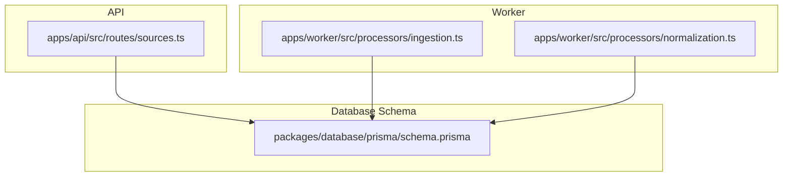
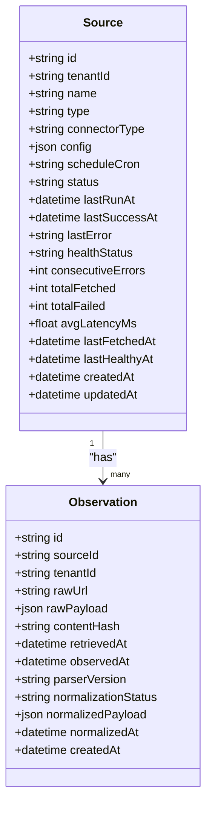
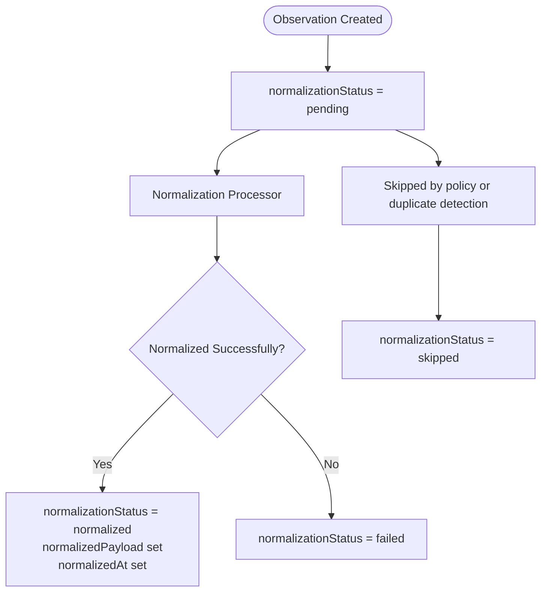
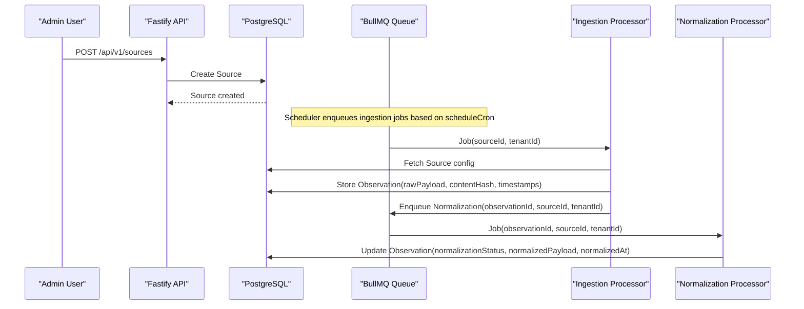
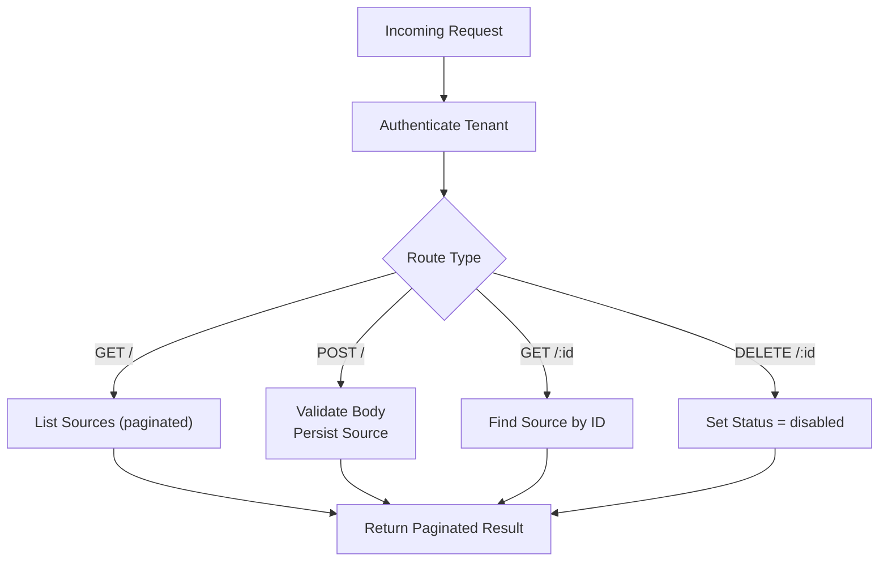
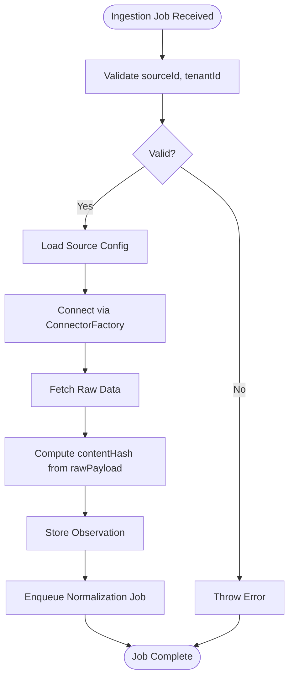
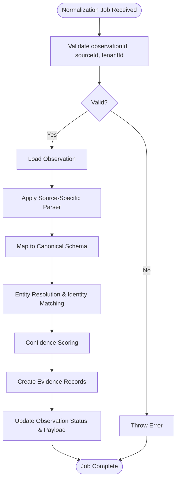
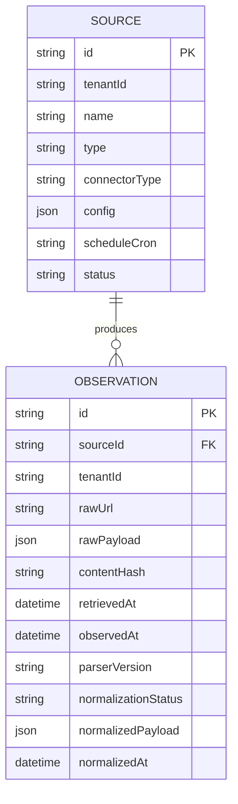
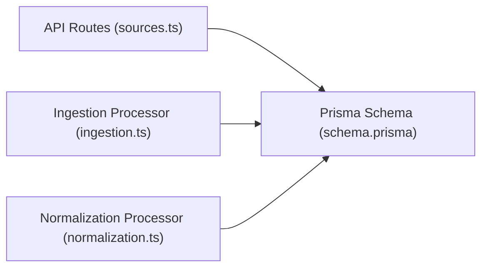

# Data Sources & Observations

<cite>
**Referenced Files in This Document**   
- [schema.prisma](file://packages/database/prisma/schema.prisma)
- [sources.ts](file://apps/api/src/routes/sources.ts)
- [ingestion.ts](file://apps/worker/src/processors/ingestion.ts)
- [normalization.ts](file://apps/worker/src/processors/normalization.ts)
- [normalization.test.ts](file://apps/worker/test/unit/normalization.test.ts)
</cite>

## Table of Contents
1. [Introduction](#introduction)
2. [Project Structure](#project-structure)
3. [Core Components](#core-components)
4. [Architecture Overview](#architecture-overview)
5. [Detailed Component Analysis](#detailed-component-analysis)
6. [Dependency Analysis](#dependency-analysis)
7. [Performance Considerations](#performance-considerations)
8. [Troubleshooting Guide](#troubleshooting-guide)
9. [Conclusion](#conclusion)

## Introduction
This document explains the data ingestion pipeline models for sources and observations, focusing on:
- The Source model structure, connector types, configuration management, and scheduling capabilities
- The Observation model as immutable evidence storage with rawPayload, contentHash-based deduplication, and normalization workflow states
- The relationship between Sources and Observations and indexing strategies for performance
- The normalization pipeline from pending to normalized/failed/skipped, parser versioning, and timestamp tracking for provenance

The goal is to make these concepts accessible while preserving precise technical details derived from the repository.

## Project Structure
The ingestion pipeline spans three main areas:
- Database schema defining Source and Observation models
- API routes for managing Sources
- Worker processors for ingestion and normalization jobs

**Diagram sources**
- [sources.ts:10-22](file://apps/api/src/routes/sources.ts#L10-L22)
- [ingestion.ts:1-54](file://apps/worker/src/processors/ingestion.ts#L1-L54)
- [normalization.ts:1-57](file://apps/worker/src/processors/normalization.ts#L1-L57)
- [schema.prisma:70-131](file://packages/database/prisma/schema.prisma#L70-L131)

**Section sources**
- [sources.ts:1-117](file://apps/api/src/routes/sources.ts#L1-L117)
- [ingestion.ts:1-54](file://apps/worker/src/processors/ingestion.ts#L1-L54)
- [normalization.ts:1-57](file://apps/worker/src/processors/normalization.ts#L1-L57)
- [schema.prisma:70-131](file://packages/database/prisma/schema.prisma#L70-L131)

## Core Components
This section documents the Source and Observation models, their fields, relationships, and operational semantics.

### Source Model
The Source model represents a configurable data ingestion endpoint. Key aspects include:
- Identification and multi-tenancy: id, tenantId
- Human-readable name: name
- Connector classification:
  - type: web_scraper | api_connector | marketplace | social_signal | product_database
  - connectorType: implementation strategy such as universal_api | custom_scraper | marketplace_adapter
- Configuration: config (JSON), used for URL, authentication, headers, mapping rules
- Scheduling: scheduleCron (optional cron expression; null means manual-only)
- Lifecycle and health: status, lastRunAt, lastSuccessAt, lastError, plus Phase 2 health metrics like healthStatus, consecutiveErrors, totalFetched, totalFailed, avgLatencyMs, lastFetchedAt, lastHealthyAt
- Relationships: one-to-many with observations, rawResponses, and ingestion checkpoints

**Diagram sources**
- [schema.prisma:70-102](file://packages/database/prisma/schema.prisma#L70-L102)
- [schema.prisma:108-131](file://packages/database/prisma/schema.prisma#L108-L131)

**Section sources**
- [schema.prisma:70-102](file://packages/database/prisma/schema.prisma#L70-L102)

### Observation Model
The Observation model stores immutable evidence from sources. It includes:
- Evidence identity and provenance: id, sourceId, tenantId, rawUrl
- Raw payload and deduplication: rawPayload (JSON), contentHash (SHA-256 of raw payload)
- Timestamps for provenance:
  - retrievedAt: when data was fetched from the source
  - observedAt: when the data was observed/published
- Normalization state machine:
  - normalizationStatus: pending | normalized | failed | skipped
  - normalizedPayload: JSON result after successful normalization
  - normalizedAt: timestamp when normalization completed
- Parser versioning: parserVersion indicates which connector/parser version processed this observation

**Diagram sources**
- [schema.prisma:108-131](file://packages/database/prisma/schema.prisma#L108-L131)
- [normalization.ts:15-57](file://apps/worker/src/processors/normalization.ts#L15-L57)

**Section sources**
- [schema.prisma:108-131](file://packages/database/prisma/schema.prisma#L108-L131)

## Architecture Overview
The ingestion pipeline connects API-managed Sources to worker-driven Ingestion and Normalization processors, persisting results in the database.

**Diagram sources**
- [sources.ts:62-79](file://apps/api/src/routes/sources.ts#L62-L79)
- [ingestion.ts:11-54](file://apps/worker/src/processors/ingestion.ts#L11-L54)
- [normalization.ts:15-57](file://apps/worker/src/processors/normalization.ts#L15-L57)
- [schema.prisma:70-131](file://packages/database/prisma/schema.prisma#L70-L131)

## Detailed Component Analysis

### Source Management API
The Source management API exposes endpoints to list, create, retrieve, and disable Sources within a tenant. Validation uses Zod to enforce allowed connector types and optional scheduling.

Key behaviors:
- Authentication hook ensures tenant-scoped access
- List endpoint paginates results ordered by creation time
- Create endpoint validates and persists Source with config and scheduleCron
- Delete endpoint soft-disables a Source by updating its status

**Diagram sources**
- [sources.ts:28-117](file://apps/api/src/routes/sources.ts#L28-L117)

**Section sources**
- [sources.ts:10-22](file://apps/api/src/routes/sources.ts#L10-L22)
- [sources.ts:62-79](file://apps/api/src/routes/sources.ts#L62-L79)
- [sources.ts:82-95](file://apps/api/src/routes/sources.ts#L82-L95)
- [sources.ts:97-116](file://apps/api/src/routes/sources.ts#L97-L116)

### Ingestion Processor
The ingestion processor defines the job lifecycle for fetching data from external sources and storing raw observations. Currently stubbed for Phase 2, it validates required fields and logs progress.

Expected behavior:
- Validate job payload contains sourceId and tenantId
- Fetch source configuration via Source model
- Use a connector factory to fetch raw data
- Persist Observation with rawPayload, contentHash, and timestamps
- Enqueue normalization job with observationId, sourceId, tenantId

**Diagram sources**
- [ingestion.ts:11-54](file://apps/worker/src/processors/ingestion.ts#L11-L54)
- [schema.prisma:108-131](file://packages/database/prisma/schema.prisma#L108-L131)

**Section sources**
- [ingestion.ts:11-54](file://apps/worker/src/processors/ingestion.ts#L11-L54)

### Normalization Processor
The normalization processor transforms raw observations into canonical EXOSQUAD data. It validates job payloads and outlines the future steps including schema mapping, entity extraction, identity matching, confidence scoring, and evidence chain creation.

Validation tests ensure missing fields are rejected:
- Missing observationId
- Missing sourceId
- Missing tenantId

**Diagram sources**
- [normalization.ts:15-57](file://apps/worker/src/processors/normalization.ts#L15-L57)
- [normalization.test.ts:17-55](file://apps/worker/test/unit/normalization.test.ts#L17-L55)

**Section sources**
- [normalization.ts:15-57](file://apps/worker/src/processors/normalization.ts#L15-L57)
- [normalization.test.ts:17-55](file://apps/worker/test/unit/normalization.test.ts#L17-L55)

### Relationship Between Sources and Observations
- One Source can produce many Observations
- Each Observation references its originating Source via sourceId
- Observations carry tenantId for multi-tenant isolation
- Indexes on sourceId and tenantId optimize queries for both listing observations per source and filtering by tenant

**Diagram sources**
- [schema.prisma:70-102](file://packages/database/prisma/schema.prisma#L70-L102)
- [schema.prisma:108-131](file://packages/database/prisma/schema.prisma#L108-L131)

**Section sources**
- [schema.prisma:70-102](file://packages/database/prisma/schema.prisma#L70-L102)
- [schema.prisma:108-131](file://packages/database/prisma/schema.prisma#L108-L131)

## Dependency Analysis
The ingestion pipeline depends on:
- API layer for Source CRUD operations
- Worker layer for ingestion and normalization processing
- Database layer for persistence and indexing

**Diagram sources**
- [sources.ts:1-117](file://apps/api/src/routes/sources.ts#L1-L117)
- [ingestion.ts:1-54](file://apps/worker/src/processors/ingestion.ts#L1-L54)
- [normalization.ts:1-57](file://apps/worker/src/processors/normalization.ts#L1-L57)
- [schema.prisma:70-131](file://packages/database/prisma/schema.prisma#L70-L131)

**Section sources**
- [sources.ts:1-117](file://apps/api/src/routes/sources.ts#L1-L117)
- [ingestion.ts:1-54](file://apps/worker/src/processors/ingestion.ts#L1-L54)
- [normalization.ts:1-57](file://apps/worker/src/processors/normalization.ts#L1-L57)
- [schema.prisma:70-131](file://packages/database/prisma/schema.prisma#L70-L131)

## Performance Considerations
Indexing strategy for Sources and Observations:
- Source indexes:
  - tenantId: fast filtering by tenant
  - status: efficient querying active/paused/disabled sources
  - healthStatus: support health monitoring queries
- Observation indexes:
  - sourceId: fast retrieval of all observations for a given source
  - tenantId: tenant-scoped queries
  - contentHash: deduplication checks and uniqueness enforcement
  - normalizationStatus: batch processing of pending/failed/skipped observations
  - retrievedAt: time-range queries for ingestion windows

These indexes reduce query latency for common workflows such as:
- Listing observations per source
- Filtering observations by tenant
- Running normalization jobs by status
- Checking duplicates via contentHash

[No sources needed since this section provides general guidance]

## Troubleshooting Guide
Common issues and resolutions:
- Missing required fields in ingestion jobs:
  - Ensure job payloads include sourceId and tenantId
  - Reference validation logic in ingestion processor
- Missing required fields in normalization jobs:
  - Ensure job payloads include observationId, sourceId, and tenantId
  - Tests verify rejection when any field is absent
- Source not found:
  - API returns a not found error if the requested Source does not exist for the tenant
- Normalization failures:
  - Check normalizationStatus and normalizedAt to determine if normalization succeeded or failed
  - Inspect normalizedPayload for partial results

Operational tips:
- Monitor Source status and healthStatus fields to detect degraded or unhealthy connectors
- Use scheduleCron to automate ingestion; null implies manual-only execution
- Track parserVersion to correlate normalization outcomes with specific parser versions

**Section sources**
- [ingestion.ts:20-28](file://apps/worker/src/processors/ingestion.ts#L20-L28)
- [normalization.ts:24-34](file://apps/worker/src/processors/normalization.ts#L24-L34)
- [normalization.test.ts:17-55](file://apps/worker/test/unit/normalization.test.ts#L17-L55)
- [sources.ts:82-95](file://apps/api/src/routes/sources.ts#L82-L95)

## Conclusion
The data ingestion pipeline centers on two core models:
- Source: configurable ingestion endpoints with connector types, JSON configuration, and optional cron scheduling
- Observation: immutable evidence records with rawPayload, contentHash-based deduplication, and a clear normalization state machine

The API manages Sources, while worker processors orchestrate ingestion and normalization. Robust indexing supports efficient queries across tenants, sources, and normalization states. Parser versioning and timestamp fields provide strong provenance for downstream analytics and auditing.

[No sources needed since this section summarizes without analyzing specific files]