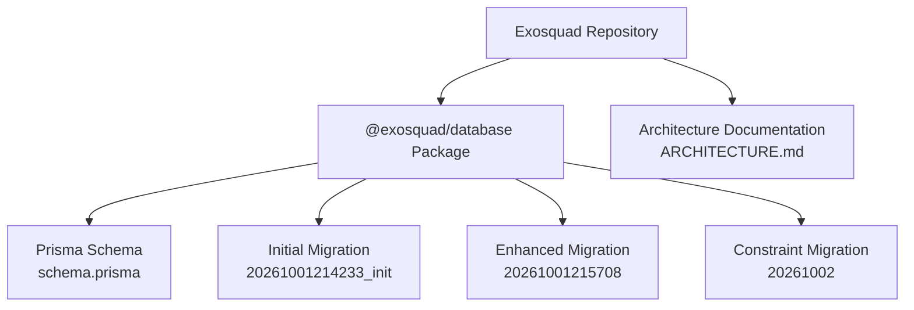
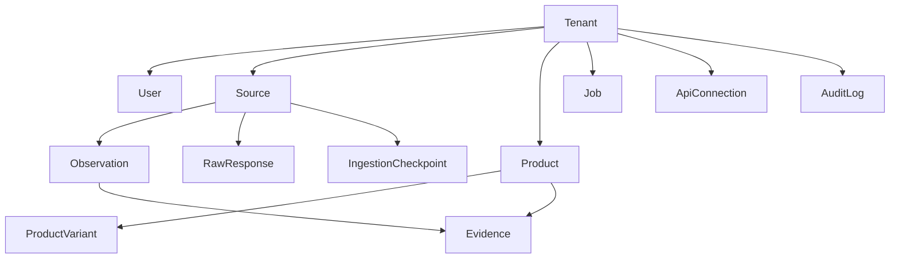
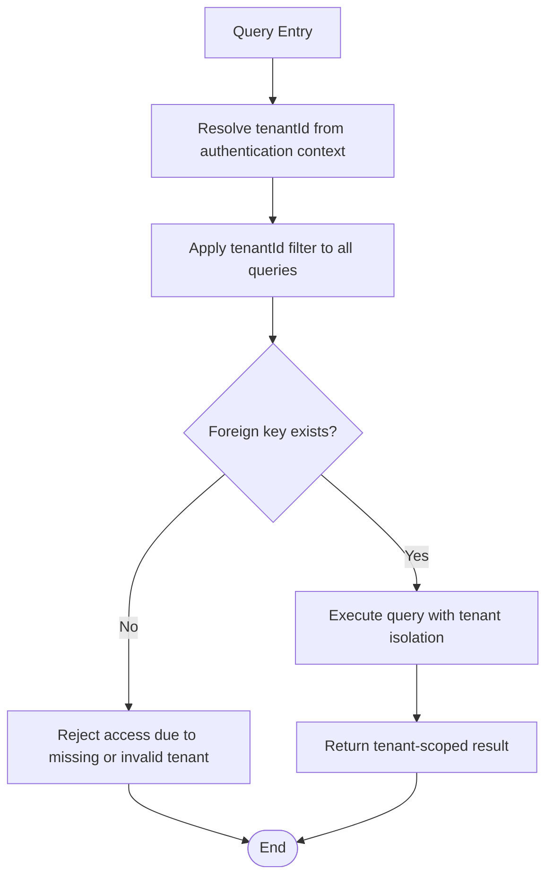
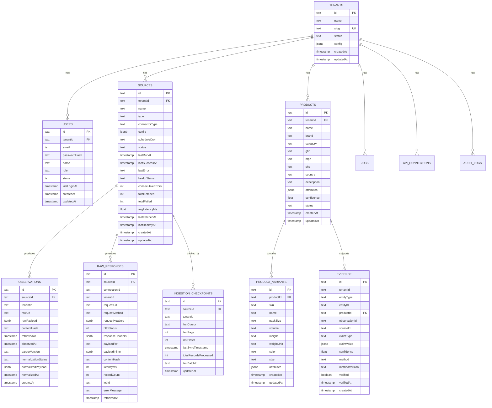
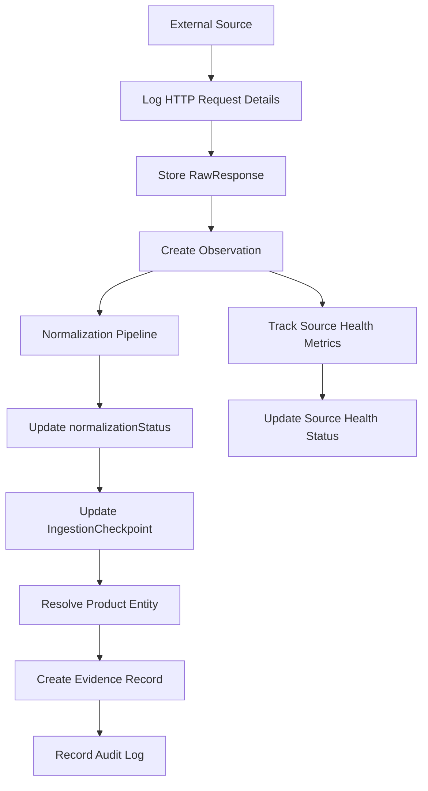

Now I have a complete understanding of the changes. Based on my analysis, I can see that the update reason mentions migration `20261001215708` which added:

1. **Raw responses table** - for HTTP transaction details
2. **Ingestion checkpoints table** - for resumable ingestion 
3. **Source health tracking fields** - for operational visibility

The existing documentation already covers most of these concepts but needs to be updated to reflect the actual implementation. Let me now create the updated documentation:

# Database Schema

<cite>
**Referenced Files in This Document**
- [schema.prisma](file://packages/database/prisma/schema.prisma)
- [migration.sql](file://packages/database/prisma/migrations/20261001214233_init/migration.sql)
- [migration.sql](file://packages/database/prisma/migrations/20261001215708_add_raw_responses_checkpoints_source_health/migration.sql)
- [migration.sql](file://packages/database/prisma/migrations/20261002_add_observation_unique_constraint/migration.sql)
- [ARCHITECTURE.md](file://docs/ARCHITECTURE.md)
</cite>

## Update Summary
**Changes Made**
- Updated Core Data Models section to include new RawResponse and IngestionCheckpoint tables
- Added detailed documentation for RawResponse table with HTTP transaction details
- Added detailed documentation for IngestionCheckpoint table with resumable ingestion state
- Updated Source model documentation to include health tracking fields
- Enhanced Multi-Tenancy section with new table relationships
- Updated Foreign Keys section with new constraint definitions
- Enhanced Indexes section with new index definitions for raw_responses and ingestion_checkpoints
- Updated Data Validation Rules section with new enum values and constraints
- Enhanced Data Lifecycle section with new operational tables
- Updated Migration Strategy section to include all three migrations

## Table of Contents
1. [Introduction](#introduction)
2. [Project Structure](#project-structure)
3. [Core Data Models](#core-data-models)
4. [Architecture Overview](#architecture-overview)
5. [Detailed Model Documentation](#detailed-model-documentation)
6. [Multi-Tenancy and Tenant Isolation](#multi-tenancy-and-tenant-isolation)
7. [Foreign Keys, Constraints, and Referential Integrity](#foreign-keys-constraints-and-referential-integrity)
8. [Indexes and Query Performance](#indexes-and-query-performance)
9. [Data Validation Rules and Business Constraints](#data-validation-rules-and-business-constraints)
10. [Data Lifecycle and Archival Strategy](#data-lifecycle-and-archival-strategy)
11. [Migration Strategy](#migration-strategy)
12. [Performance Considerations for Large Datasets](#performance-considerations-for-large-datasets)
13. [Troubleshooting Guide](#troubleshooting-guide)
14. [Conclusion](#conclusion)

## Introduction
This document describes Exosquad's database schema as implemented with Prisma and PostgreSQL. It focuses on the core entities required by the data model: Tenant, User, Source, Observation, Product, and Evidence. It also documents related tables that support ingestion and auditability, including RawResponse, IngestionCheckpoint, Job, ApiConnection, and AuditLog.

The system is a multi-tenant intelligence platform that ingests external data, preserves immutable observations, normalizes them into canonical product entities, and maintains an evidence chain linking conclusions to their sources. The schema includes comprehensive operational visibility through source health tracking, HTTP response logging, and resumable ingestion checkpoints.

**Section sources**
- [ARCHITECTURE.md:1-20](file://docs/ARCHITECTURE.md#L1-L20)
- [ARCHITECTURE.md:68-92](file://docs/ARCHITECTURE.md#L68-L92)

## Project Structure
The database definition lives in the shared `@exosquad/database` package:

- Prisma schema: `packages/database/prisma/schema.prisma`
- Generated migration SQL: `packages/database/prisma/migrations/20261001214233_init/migration.sql`
- Additional migrations: `packages/database/prisma/migrations/20261001215708_add_raw_responses_checkpoints_source_health/migration.sql`
- Constraint migration: `packages/database/prisma/migrations/20261002_add_observation_unique_constraint/migration.sql`
- Architecture documentation describing database strategy and Phase 1 tables: `docs/ARCHITECTURE.md`

**Diagram sources**
- [schema.prisma:1-18](file://packages/database/prisma/schema.prisma#L1-L18)
- [migration.sql:1-12](file://packages/database/prisma/migrations/20261001214233_init/migration.sql#L1-L12)
- [migration.sql:1-78](file://packages/database/prisma/migrations/20261001215708_add_raw_responses_checkpoints_source_health/migration.sql#L1-L78)
- [migration.sql:1-3](file://packages/database/prisma/migrations/20261002_add_observation_unique_constraint/migration.sql#L1-L3)
- [ARCHITECTURE.md:60-85](file://docs/ARCHITECTURE.md#L60-L85)

**Section sources**
- [schema.prisma:1-18](file://packages/database/prisma/schema.prisma#L1-L18)
- [migration.sql:1-12](file://packages/database/prisma/migrations/20261001214233_init/migration.sql#L1-L12)
- [migration.sql:1-78](file://packages/database/prisma/migrations/20261001215708_add_raw_responses_checkpoints_source_health/migration.sql#L1-L78)
- [migration.sql:1-3](file://packages/database/prisma/migrations/20261002_add_observation_unique_constraint/migration.sql#L1-L3)
- [ARCHITECTURE.md:60-85](file://docs/ARCHITECTURE.md#L60-L85)

## Core Data Models
The primary domain models are:

| Entity | Purpose | Key Characteristics |
|---|---|---|
| Tenant | Multi-tenant organization boundary | Unique slug, status, JSON config |
| User | Authentication and authorization within a tenant | Tenant-scoped unique email, role, status |
| Source | Configurable ingestion endpoint | Type, connector type, schedule, health metrics |
| Observation | Immutable raw payload from a source | Content hash, normalization status, timestamps |
| Product | Resolved canonical product entity | Brand, GTIN, MPN, SKU, confidence score |
| Evidence | Provenance record linking claims to sources | Claim type, claim value, confidence, method |

Supporting tables include:

| Entity | Purpose |
|---|---|
| ProductVariant | SKU-level or variant-level detail under a product |
| RawResponse | HTTP response provenance for ingestion with full transaction details |
| IngestionCheckpoint | Resumable ingestion state per source with pagination tracking |
| Job | Async job persistence for queues |
| ApiConnection | Provider-agnostic API connection configuration |
| AuditLog | Immutable action audit trail |

**Section sources**
- [schema.prisma:24-41](file://packages/database/prisma/schema.prisma#L24-L41)
- [schema.prisma:47-64](file://packages/database/prisma/schema.prisma#L47-L64)
- [schema.prisma:70-102](file://packages/database/prisma/schema.prisma#L70-L102)
- [schema.prisma:108-131](file://packages/database/prisma/schema.prisma#L108-L131)
- [schema.prisma:137-162](file://packages/database/prisma/schema.prisma#L137-L162)
- [schema.prisma:164-184](file://packages/database/prisma/schema.prisma#L164-L184)
- [schema.prisma:190-214](file://packages/database/prisma/schema.prisma#L190-L214)
- [schema.prisma:220-244](file://packages/database/prisma/schema.prisma#L220-L244)
- [schema.prisma:250-271](file://packages/database/prisma/schema.prisma#L250-L271)
- [schema.prisma:277-295](file://packages/database/prisma/schema.prisma#L277-L295)
- [schema.prisma:302-329](file://packages/database/prisma/schema.prisma#L302-L329)
- [schema.prisma:335-352](file://packages/database/prisma/schema.prisma#L335-L352)

## Architecture Overview
At a high level, the data architecture supports:

- Multi-tenant isolation through `tenantId` on most tables.
- Append-only observation storage for raw ingestion results.
- Comprehensive HTTP response logging for debugging and audit purposes.
- Resumable ingestion with checkpoint tracking for reliable data processing.
- Source health monitoring with operational metrics for system visibility.
- Normalization pipeline moving from raw payloads to canonical product entities.
- Evidence records linking analytical conclusions back to sources and observations.
- Operational tables for jobs, API connections, and audit logs.

**Diagram sources**
- [schema.prisma:24-41](file://packages/database/prisma/schema.prisma#L24-L41)
- [schema.prisma:47-64](file://packages/database/prisma/schema.prisma#L47-L64)
- [schema.prisma:70-102](file://packages/database/prisma/schema.prisma#L70-L102)
- [schema.prisma:108-131](file://packages/database/prisma/schema.prisma#L108-L131)
- [schema.prisma:137-162](file://packages/database/prisma/schema.prisma#L137-L162)
- [schema.prisma:164-184](file://packages/database/prisma/schema.prisma#L164-L184)
- [schema.prisma:190-214](file://packages/database/prisma/schema.prisma#L190-L214)
- [schema.prisma:220-244](file://packages/database/prisma/schema.prisma#L220-L244)
- [schema.prisma:250-271](file://packages/database/prisma/schema.prisma#L250-L271)
- [schema.prisma:277-295](file://packages/database/prisma/schema.prisma#L277-L295)
- [schema.prisma:302-329](file://packages/database/prisma/schema.prisma#L302-L329)
- [schema.prisma:335-352](file://packages/database/prisma/schema.prisma#L335-L352)

## Detailed Model Documentation

### Tenant
Tenant represents a multi-tenant organization. It provides the isolation boundary for users, sources, products, jobs, API connections, and audit logs.

| Field | Type | Nullable | Default | Constraint | Notes |
|---|---|---:|---|---|---|
| id | String | No | cuid() | Primary key | Unique identifier |
| name | String | No | None | Not null | Organization display name |
| slug | String | No | None | Unique | Tenant identifier used in routing or scoping |
| status | String | No | active | Enum-like values: active, suspended, cancelled | Organizational lifecycle |
| config | Json | No | {} | JSONB | Flexible tenant-specific settings |
| createdAt | DateTime | No | now() | Timestamp | Creation time |
| updatedAt | DateTime | No | updatedAt | Timestamp | Last update time |

Relationships:
- One-to-many with User
- One-to-many with Source
- One-to-many with Product
- One-to-many with Job
- One-to-many with ApiConnection
- One-to-many with AuditLog

**Section sources**
- [schema.prisma:24-41](file://packages/database/prisma/schema.prisma#L24-L41)
- [migration.sql:1-12](file://packages/database/prisma/migrations/20261001214233_init/migration.sql#L1-L12)
- [migration.sql:186-187](file://packages/database/prisma/migrations/20261001214233_init/migration.sql#L186-L187)

### User
User represents authenticated accounts scoped to a tenant.

| Field | Type | Nullable | Default | Constraint | Notes |
|---|---|---:|---|---|---|
| id | String | No | cuid() | Primary key | Unique identifier |
| tenantId | String | No | None | Foreign key to tenants.id | Tenant ownership |
| email | String | No | None | Unique with tenantId | Email uniqueness per tenant |
| passwordHash | String | No | None | Not null | Securely hashed password |
| name | String | Yes | None | Optional | Display name |
| role | String | No | member | Enum-like values: owner, admin, member, viewer | Authorization role |
| status | String | No | active | Enum-like values: active, disabled | Account lifecycle |
| lastLoginAt | DateTime | Yes | None | Optional | Last login timestamp |
| createdAt | DateTime | No | now() | Timestamp | Creation time |
| updatedAt | DateTime | No | updatedAt | Timestamp | Last update time |

Relationships:
- Many-to-one with Tenant

Indexes:
- Index on tenantId
- Unique index on (tenantId, email)

**Section sources**
- [schema.prisma:47-64](file://packages/database/prisma/schema.prisma#L47-L64)
- [migration.sql:14-28](file://packages/database/prisma/migrations/20261001214233_init/migration.sql#L14-L28)
- [migration.sql:189-193](file://packages/database/prisma/migrations/20261001214233_init/migration.sql#L189-L193)
- [migration.sql:270-271](file://packages/database/prisma/migrations/20261001214233_init/migration.sql#L270-L271)

### Source
Source represents a configurable ingestion endpoint. It tracks operational health and scheduling metadata with comprehensive health monitoring capabilities.

| Field | Type | Nullable | Default | Constraint | Notes |
|---|---|---:|---|---|---|
| id | String | No | cuid() | Primary key | Unique identifier |
| tenantId | String | No | None | Foreign key to tenants.id | Tenant ownership |
| name | String | No | None | Not null | Human-readable source name |
| type | String | No | None | Enum-like values | web_scraper, api_connector, marketplace, social_signal, product_database |
| connectorType | String | No | None | Enum-like values | universal_api, custom_scraper, marketplace_adapter |
| config | Json | No | {} | JSONB | URL, auth, headers, mapping rules |
| scheduleCron | String | Yes | None | Optional | Cron expression; null means manual only |
| status | String | No | active | Enum-like values | active, paused, error, disabled |
| lastRunAt | DateTime | Yes | None | Optional | Last scheduled run time |
| lastSuccessAt | DateTime | Yes | None | Optional | Last successful run time |
| lastError | String | Yes | None | Optional | Most recent error message |
| healthStatus | String | No | unknown | Enum-like values | unknown, healthy, degraded, unhealthy |
| consecutiveErrors | Int | No | 0 | Integer | Error streak counter |
| totalFetched | Int | No | 0 | Integer | Total fetched count |
| totalFailed | Int | No | 0 | Integer | Total failed count |
| avgLatencyMs | Float | Yes | None | Optional | Average latency metric |
| lastFetchedAt | DateTime | Yes | None | Optional | Last fetch timestamp |
| lastHealthyAt | DateTime | Yes | None | Optional | Last healthy check timestamp |
| createdAt | DateTime | No | now() | Timestamp | Creation time |
| updatedAt | DateTime | No | updatedAt | Timestamp | Last update time |

Relationships:
- Many-to-one with Tenant
- One-to-many with Observation
- One-to-many with RawResponse
- One-to-many with IngestionCheckpoint

Indexes:
- Index on tenantId
- Index on status
- Index on healthStatus

**Section sources**
- [schema.prisma:70-102](file://packages/database/prisma/schema.prisma#L70-L102)
- [migration.sql:30-47](file://packages/database/prisma/migrations/20261001214233_init/migration.sql#L30-L47)
- [migration.sql:195-199](file://packages/database/prisma/migrations/20261001214233_init/migration.sql#L195-L199)
- [migration.sql:273-274](file://packages/database/prisma/migrations/20261001214233_init/migration.sql#L273-L274)

### Observation
Observation stores immutable raw data from sources. It is append-only and includes deduplication via content hash with atomic idempotency protection.

| Field | Type | Nullable | Default | Constraint | Notes |
|---|---|---:|---|---|---|
| id | String | No | cuid() | Primary key | Unique identifier |
| sourceId | String | No | None | Foreign key to sources.id | Source that produced this observation |
| tenantId | String | No | None | Tenant scope | Tenant isolation |
| rawUrl | String | Yes | None | Optional | Original URL |
| rawPayload | Json | No | None | JSONB | Raw payload from source |
| contentHash | String | No | None | Indexed | SHA-256 of raw payload for deduplication |
| retrievedAt | DateTime | No | None | Timestamp | When data was fetched from source |
| observedAt | DateTime | No | None | Timestamp | When data was observed/published |
| parserVersion | String | Yes | None | Optional | Connector/parser version |
| normalizationStatus | String | No | pending | Enum-like values | pending, normalized, failed, skipped |
| normalizedPayload | Json | Yes | None | Optional | Canonical normalized payload |
| normalizedAt | DateTime | Yes | None | Optional | Normalization completion time |
| createdAt | DateTime | No | now() | Timestamp | Creation time |

Relationships:
- Many-to-one with Source

Indexes:
- Index on sourceId
- Index on tenantId
- Index on contentHash
- Index on normalizationStatus
- Index on retrievedAt
- Unique composite index on (sourceId, contentHash) for atomic idempotency

**Section sources**
- [schema.prisma:108-131](file://packages/database/prisma/schema.prisma#L108-L131)
- [migration.sql:49-66](file://packages/database/prisma/migrations/20261001214233_init/migration.sql#L49-L66)
- [migration.sql:201-214](file://packages/database/prisma/migrations/20261001214233_init/migration.sql#L201-L214)
- [migration.sql:276-277](file://packages/database/prisma/migrations/20261001214233_init/migration.sql#L276-L277)
- [migration.sql:1-3](file://packages/database/prisma/migrations/20261002_add_observation_unique_constraint/migration.sql#L1-L3)

### Product
Product represents resolved canonical product entities. It includes identity fields and confidence scoring.

| Field | Type | Nullable | Default | Constraint | Notes |
|---|---|---:|---|---|---|
| id | String | No | cuid() | Primary key | Unique identifier |
| tenantId | String | No | None | Foreign key to tenants.id | Tenant ownership |
| name | String | No | None | Not null | Product name |
| brand | String | Yes | None | Optional | Brand name |
| category | String | Yes | None | Optional | Category label |
| gtin | String | Yes | None | Optional | Global Trade Item Number |
| mpn | String | Yes | None | Optional | Manufacturer Part Number |
| sku | String | Yes | None | Optional | Stock Keeping Unit |
| country | String | Yes | None | Optional | Country of origin |
| description | String | Yes | None | Optional | Product description |
| attributes | Json | No | {} | JSONB | Flexible attribute map |
| confidence | Float | No | 0.0 | Numeric | Resolution confidence 0.0–1.0 |
| status | String | No | active | Enum-like values | active, merged, deprecated |
| createdAt | DateTime | No | now() | Timestamp | Creation time |
| updatedAt | DateTime | No | updatedAt | Timestamp | Last update time |

Relationships:
- Many-to-one with Tenant
- One-to-many with ProductVariant
- One-to-many with Evidence

Indexes:
- Index on tenantId
- Index on brand
- Index on gtin

**Section sources**
- [schema.prisma:137-162](file://packages/database/prisma/schema.prisma#L137-L162)
- [migration.sql:68-87](file://packages/database/prisma/migrations/20261001214233_init/migration.sql#L68-L87)
- [migration.sql:216-223](file://packages/database/prisma/migrations/20261001214233_init/migration.sql#L216-L223)
- [migration.sql:279-280](file://packages/database/prisma/migrations/20261001214233_init/migration.sql#L279-L280)

### ProductVariant
ProductVariant captures SKU-level or variant-level details under a product.

| Field | Type | Nullable | Default | Constraint | Notes |
|---|---|---:|---|---|---|
| id | String | No | cuid() | Primary key | Unique identifier |
| productId | String | No | None | Foreign key to products.id | Parent product |
| sku | String | Yes | None | Optional | Variant SKU |
| name | String | Yes | None | Optional | Variant name |
| packSize | String | Yes | None | Optional | Pack size |
| volume | String | Yes | None | Optional | Volume |
| weight | String | Yes | None | Optional | Weight |
| weightUnit | String | Yes | None | Optional | g, kg, oz, lb |
| color | String | Yes | None | Optional | Color |
| size | String | Yes | None | Optional | Size |
| attributes | Json | No | {} | JSONB | Flexible attribute map |
| createdAt | DateTime | No | now() | Timestamp | Creation time |
| updatedAt | DateTime | No | updatedAt | Timestamp | Last update time |

Relationships:
- Many-to-one with Product

Indexes:
- Index on productId
- Index on sku

**Section sources**
- [schema.prisma:164-184](file://packages/database/prisma/schema.prisma#L164-L184)
- [migration.sql:89-106](file://packages/database/prisma/migrations/20261001214233_init/migration.sql#L89-L106)
- [migration.sql:225-229](file://packages/database/prisma/migrations/20261001214233_init/migration.sql#L225-L229)
- [migration.sql:282-283](file://packages/database/prisma/migrations/20261001214233_init/migration.sql#L282-L283)

### Evidence
Evidence links analytical claims to entities such as products, suppliers, or sources. It preserves provenance and confidence.

| Field | Type | Nullable | Default | Constraint | Notes |
|---|---|---:|---|---|---|
| id | String | No | cuid() | Primary key | Unique identifier |
| tenantId | String | No | None | Tenant scope | Tenant isolation |
| entityType | String | No | None | Enum-like values | product, supplier, source |
| entityId | String | No | None | Identifier of the target entity |
| productId | String | Yes | None | Optional foreign key to products.id | Direct link when entityType is product |
| observationId | String | Yes | None | Optional | Link to raw observation |
| sourceId | String | Yes | None | Optional | Link to source |
| claimType | String | No | None | Enum-like values | price, availability, specification, authenticity, demand_signal |
| claimValue | Json | No | None | JSONB | Structured claim data |
| confidence | Float | No | 0.0 | Numeric | Confidence score |
| method | String | No | None | Enum-like values | manual, automated, ai_inference |
| methodVersion | String | Yes | None | Optional | Method version |
| verified | Boolean | No | false | Boolean | Manual or automated verification flag |
| verifiedAt | DateTime | Yes | None | Optional | Verification timestamp |
| createdAt | DateTime | No | now() | Timestamp | Creation time |

Relationships:
- Optional many-to-one with Product

Indexes:
- Composite index on (entityType, entityId)
- Index on tenantId
- Index on claimType
- Index on productId

**Section sources**
- [schema.prisma:190-214](file://packages/database/prisma/schema.prisma#L190-L214)
- [migration.sql:108-127](file://packages/database/prisma/migrations/20261001214233_init/migration.sql#L108-L127)
- [migration.sql:231-241](file://packages/database/prisma/migrations/20261001214233_init/migration.sql#L231-L241)
- [migration.sql:285-286](file://packages/database/prisma/migrations/20261001214233_init/migration.sql#L285-L286)

### RawResponse
RawResponse stores comprehensive HTTP transaction details for debugging, auditing, and operational visibility. This table captures every HTTP request/response pair during data ingestion.

| Field | Type | Nullable | Default | Constraint | Notes |
|---|---|---:|---|---|---|
| id | String | No | cuid() | Primary key | Unique identifier |
| sourceId | String | No | None | Foreign key to sources.id | Source that generated this response |
| connectionId | String | Yes | None | Optional | API connection used for the request |
| tenantId | String | No | None | Tenant scope | Tenant isolation |
| requestUrl | String | No | None | Not null | Full URL of the HTTP request |
| requestMethod | String | No | GET | Enum-like values | HTTP method (GET, POST, PUT, DELETE) |
| requestHeaders | Json | No | {} | JSONB | Sanitized request headers (no secrets) |
| httpStatus | Int | No | None | Not null | HTTP status code (200, 404, 500, etc.) |
| responseHeaders | Json | No | {} | JSONB | Response headers for debugging |
| payloadRef | String | Yes | None | Optional | Reference to stored payload (future: object storage) |
| payloadInline | Json | Yes | None | Optional | Inline payload for Phase 2 (migrate to ref later) |
| contentHash | String | No | None | Indexed | SHA-256 of raw response body |
| latencyMs | Int | No | None | Not null | Request latency in milliseconds |
| recordCount | Int | No | 0 | Integer | Number of records extracted from response |
| jobId | String | Yes | None | Optional | Associated job ID for traceability |
| errorMessage | String | Yes | None | Optional | Error message if request failed |
| retrievedAt | DateTime | No | now() | Timestamp | When the response was received |

Relationships:
- Many-to-one with Source

Indexes:
- Index on sourceId
- Index on tenantId
- Index on contentHash
- Index on retrievedAt
- Index on jobId

**Section sources**
- [schema.prisma:302-329](file://packages/database/prisma/schema.prisma#L302-L329)
- [migration.sql:11-31](file://packages/database/prisma/migrations/20261001215708_add_raw_responses_checkpoints_source_health/migration.sql#L11-L31)
- [migration.sql:49-62](file://packages/database/prisma/migrations/20261001215708_add_raw_responses_checkpoints_source_health/migration.sql#L49-L62)
- [migration.sql:74-74](file://packages/database/prisma/migrations/20261001215708_add_raw_responses_checkpoints_source_health/migration.sql#L74-L74)

### IngestionCheckpoint
IngestionCheckpoint tracks resumable ingestion state per source, enabling reliable incremental sync and recovery from failures. Each source has exactly one checkpoint record.

| Field | Type | Nullable | Default | Constraint | Notes |
|---|---|---:|---|---|---|
| id | String | No | cuid() | Primary key | Unique identifier |
| sourceId | String | No | None | Foreign key to sources.id | Source this checkpoint belongs to |
| tenantId | String | No | None | Tenant scope | Tenant isolation |
| lastCursor | String | Yes | None | Optional | Cursor-based pagination state |
| lastPage | Int | Yes | None | Optional | Page-based pagination state |
| lastOffset | Int | Yes | None | Optional | Offset-based pagination state |
| lastSyncTimestamp | DateTime | Yes | None | Optional | For incremental sync based on timestamps |
| totalRecordsProcessed | Int | No | 0 | Integer | Cumulative count of processed records |
| lastBatchId | String | Yes | None | Optional | Idempotency key for last batch |
| updatedAt | DateTime | No | updatedAt | Timestamp | Last checkpoint update time |

Relationships:
- Many-to-one with Source

Indexes:
- Unique index on sourceId (one checkpoint per source)
- Index on tenantId

**Section sources**
- [schema.prisma:335-352](file://packages/database/prisma/schema.prisma#L335-L352)
- [migration.sql:34-47](file://packages/database/prisma/migrations/20261001215708_add_raw_responses_checkpoints_source_health/migration.sql#L34-L47)
- [migration.sql:64-68](file://packages/database/prisma/migrations/20261001215708_add_raw_responses_checkpoints_source_health/migration.sql#L64-L68)
- [migration.sql:77-77](file://packages/database/prisma/migrations/20261001215708_add_raw_responses_checkpoints_source_health/migration.sql#L77-L77)

## Multi-Tenancy and Tenant Isolation
Every major table includes a `tenantId` column, ensuring that data is scoped to a single tenant. The architecture documentation states that every table includes a `tenantId` foreign key and all queries filter by tenant. Tenant isolation is enforced at both application and database levels.

Key implementation points:

- Tenant-scoped entities: User, Source, Product, Evidence, RawResponse, IngestionCheckpoint, ApiConnection, AuditLog.
- Jobs may have an optional tenantId because some system-level jobs might not be tenant-bound.
- Foreign keys enforce referential integrity between tenants and dependent entities.
- Indexes on tenantId optimize tenant-scoped queries.
- New operational tables (RawResponse, IngestionCheckpoint) follow the same tenant isolation pattern.

**Diagram sources**
- [ARCHITECTURE.md:70-71](file://docs/ARCHITECTURE.md#L70-L71)
- [schema.prisma:47-64](file://packages/database/prisma/schema.prisma#L47-L64)
- [schema.prisma:70-102](file://packages/database/prisma/schema.prisma#L70-L102)
- [schema.prisma:108-131](file://packages/database/prisma/schema.prisma#L108-L131)
- [schema.prisma:137-162](file://packages/database/prisma/schema.prisma#L137-L162)
- [schema.prisma:190-214](file://packages/database/prisma/schema.prisma#L190-L214)
- [schema.prisma:220-244](file://packages/database/prisma/schema.prisma#L220-L244)
- [schema.prisma:250-271](file://packages/database/prisma/schema.prisma#L250-L271)
- [schema.prisma:277-295](file://packages/database/prisma/schema.prisma#L277-L295)
- [schema.prisma:302-329](file://packages/database/prisma/schema.prisma#L302-L329)
- [schema.prisma:335-352](file://packages/database/prisma/schema.prisma#L335-L352)

**Section sources**
- [ARCHITECTURE.md:70-71](file://docs/ARCHITECTURE.md#L70-L71)
- [schema.prisma:24-41](file://packages/database/prisma/schema.prisma#L24-L41)
- [schema.prisma:47-64](file://packages/database/prisma/schema.prisma#L47-L64)
- [schema.prisma:70-102](file://packages/database/prisma/schema.prisma#L70-L102)
- [schema.prisma:108-131](file://packages/database/prisma/schema.prisma#L108-L131)
- [schema.prisma:137-162](file://packages/database/prisma/schema.prisma#L137-L162)
- [schema.prisma:190-214](file://packages/database/prisma/schema.prisma#L190-L214)
- [schema.prisma:220-244](file://packages/database/prisma/schema.prisma#L220-L244)
- [schema.prisma:250-271](file://packages/database/prisma/schema.prisma#L250-L271)
- [schema.prisma:277-295](file://packages/database/prisma/schema.prisma#L277-L295)
- [schema.prisma:302-329](file://packages/database/prisma/schema.prisma#L302-L329)
- [schema.prisma:335-352](file://packages/database/prisma/schema.prisma#L335-L352)

## Foreign Keys, Constraints, and Referential Integrity
The migrations define explicit foreign key constraints for core relationships:

| Child Table | Column | Parent Table | Column | Delete Behavior | Update Behavior |
|---|---|---|---|---|---|
| users | tenantId | tenants | id | RESTRICT | CASCADE |
| sources | tenantId | tenants | id | RESTRICT | CASCADE |
| observations | sourceId | sources | id | RESTRICT | CASCADE |
| products | tenantId | tenants | id | RESTRICT | CASCADE |
| product_variants | productId | products | id | RESTRICT | CASCADE |
| evidence | productId | products | id | SET NULL | CASCADE |
| jobs | tenantId | tenants | id | SET NULL | CASCADE |
| api_connections | tenantId | tenants | id | RESTRICT | CASCADE |
| audit_logs | tenantId | tenants | id | SET NULL | CASCADE |
| raw_responses | sourceId | sources | id | RESTRICT | CASCADE |
| ingestion_checkpoints | sourceId | sources | id | RESTRICT | CASCADE |

Important behaviors:

- RESTRICT prevents deletion of a parent row if child rows exist.
- SET NULL allows deletion of a referenced product while keeping evidence records intact but unlinked.
- CASCADE updates propagate changes to referenced IDs.
- New operational tables maintain strict referential integrity with source entities.

**Diagram sources**
- [migration.sql:270-295](file://packages/database/prisma/migrations/20261001214233_init/migration.sql#L270-L295)
- [migration.sql:74-77](file://packages/database/prisma/migrations/20261001215708_add_raw_responses_checkpoints_source_health/migration.sql#L74-L77)
- [schema.prisma:24-41](file://packages/database/prisma/schema.prisma#L24-L41)
- [schema.prisma:47-64](file://packages/database/prisma/schema.prisma#L47-L64)
- [schema.prisma:70-102](file://packages/database/prisma/schema.prisma#L70-L102)
- [schema.prisma:108-131](file://packages/database/prisma/schema.prisma#L108-L131)
- [schema.prisma:137-162](file://packages/database/prisma/schema.prisma#L137-L162)
- [schema.prisma:164-184](file://packages/database/prisma/schema.prisma#L164-L184)
- [schema.prisma:190-214](file://packages/database/prisma/schema.prisma#L190-L214)
- [schema.prisma:302-329](file://packages/database/prisma/schema.prisma#L302-L329)
- [schema.prisma:335-352](file://packages/database/prisma/schema.prisma#L335-L352)

**Section sources**
- [migration.sql:270-295](file://packages/database/prisma/migrations/20261001214233_init/migration.sql#L270-L295)
- [migration.sql:74-77](file://packages/database/prisma/migrations/20261001215708_add_raw_responses_checkpoints_source_health/migration.sql#L74-L77)
- [schema.prisma:59-63](file://packages/database/prisma/schema.prisma#L59-L63)
- [schema.prisma:93-101](file://packages/database/prisma/schema.prisma#L93-L101)
- [schema.prisma:123-129](file://packages/database/prisma/schema.prisma#L123-L129)
- [schema.prisma:154-161](file://packages/database/prisma/schema.prisma#L154-L161)
- [schema.prisma:179-183](file://packages/database/prisma/schema.prisma#L179-L183)
- [schema.prisma:207-213](file://packages/database/prisma/schema.prisma#L207-L213)
- [schema.prisma:321-327](file://packages/database/prisma/schema.prisma#L321-L327)
- [schema.prisma:347-350](file://packages/database/prisma/schema.prisma#L347-L350)

## Indexes and Query Performance
Indexes are defined both in the Prisma schema and generated in the migrations. They support common query patterns:

| Table | Index | Purpose |
|---|---|---|
| tenants | slug unique | Fast tenant lookup by slug |
| users | tenantId | Tenant-scoped user queries |
| users | tenantId + email unique | Per-tenant email uniqueness |
| sources | tenantId | Tenant-scoped source queries |
| sources | status | Filter by source status |
| sources | healthStatus | Health monitoring queries |
| observations | sourceId | Fetch observations by source |
| observations | tenantId | Tenant-scoped observation queries |
| observations | contentHash | Deduplication and duplicate detection |
| observations | normalizationStatus | Pipeline status filtering |
| observations | retrievedAt | Time-based queries |
| observations | sourceId + contentHash unique | Atomic idempotency prevention |
| products | tenantId | Tenant-scoped product queries |
| products | brand | Brand search |
| products | gtin | GTIN lookup |
| product_variants | productId | Variant lookup by product |
| product_variants | sku | SKU lookup |
| evidence | entityType + entityId | Entity resolution queries |
| evidence | tenantId | Tenant-scoped evidence queries |
| evidence | claimType | Claim-type filtering |
| evidence | productId | Product-linked evidence queries |
| jobs | queue + status | Queue worker queries |
| jobs | tenantId | Tenant-scoped job queries |
| jobs | status | Status filtering |
| jobs | createdAt | Time-based job queries |
| api_connections | tenantId | Tenant-scoped API connection queries |
| audit_logs | tenantId | Tenant-scoped audit queries |
| audit_logs | userId | User-scoped audit queries |
| audit_logs | resource + resourceId | Resource audit lookup |
| audit_logs | createdAt | Time-based audit queries |
| raw_responses | sourceId | Response lookup by source |
| raw_responses | tenantId | Tenant-scoped response queries |
| raw_responses | contentHash | Deduplication and duplicate detection |
| raw_responses | retrievedAt | Time-based response queries |
| raw_responses | jobId | Job-linked response queries |
| ingestion_checkpoints | sourceId unique | One checkpoint per source |
| ingestion_checkpoints | tenantId | Tenant-scoped checkpoint queries |

**Section sources**
- [schema.prisma:61-63](file://packages/database/prisma/schema.prisma#L61-L63)
- [schema.prisma:98-101](file://packages/database/prisma/schema.prisma#L98-L101)
- [schema.prisma:125-131](file://packages/database/prisma/schema.prisma#L125-L131)
- [schema.prisma:158-161](file://packages/database/prisma/schema.prisma#L158-L161)
- [schema.prisma:181-183](file://packages/database/prisma/schema.prisma#L181-L183)
- [schema.prisma:209-213](file://packages/database/prisma/schema.prisma#L209-L213)
- [schema.prisma:239-243](file://packages/database/prisma/schema.prisma#L239-L243)
- [schema.prisma:269-270](file://packages/database/prisma/schema.prisma#L269-L270)
- [schema.prisma:290-294](file://packages/database/prisma/schema.prisma#L290-L294)
- [schema.prisma:323-327](file://packages/database/prisma/schema.prisma#L323-L327)
- [schema.prisma:349-350](file://packages/database/prisma/schema.prisma#L349-L350)
- [migration.sql:186-268](file://packages/database/prisma/migrations/20261001214233_init/migration.sql#L186-L268)
- [migration.sql:49-71](file://packages/database/prisma/migrations/20261001215708_add_raw_responses_checkpoints_source_health/migration.sql#L49-L71)

## Data Validation Rules and Business Constraints
Validation is enforced through a combination of database constraints and documented business rules:

- Primary keys ensure unique identifiers for all entities.
- Unique constraints:
  - tenants.slug
  - users.tenantId + users.email
  - ingestion_checkpoints.sourceId
  - observations.sourceId + contentHash (atomic idempotency)
- Not-null constraints ensure required fields such as names, types, statuses, and timestamps.
- Enum-like string fields define allowed values:
  - Tenant.status: active, suspended, cancelled
  - User.role: owner, admin, member, viewer
  - User.status: active, disabled
  - Source.type: web_scraper, api_connector, marketplace, social_signal, product_database
  - Source.connectorType: universal_api, custom_scraper, marketplace_adapter
  - Source.status: active, paused, error, disabled
  - Source.healthStatus: unknown, healthy, degraded, unhealthy
  - Observation.normalizationStatus: pending, normalized, failed, skipped
  - Product.status: active, merged, deprecated
  - Evidence.entityType: product, supplier, source
  - Evidence.claimType: price, availability, specification, authenticity, demand_signal
  - Evidence.method: manual, automated, ai_inference
  - Job.queue: ingestion, normalization, analysis, outreach
  - Job.status: pending, running, completed, failed, cancelled
  - ApiConnection.authType: none, api_key, bearer, basic, oauth2
  - ApiConnection.status: active, error, disabled
  - RawResponse.requestMethod: GET, POST, PUT, DELETE (HTTP methods)
- JSONB fields store flexible structures with defaults of empty objects.
- Observations are append-only; they are never overwritten.
- Product identity distinguishes brand, product, SKU, variant, pack size, volume, weight, country, and GTIN.
- Confidence scores are numeric values intended to represent resolution confidence.
- RawResponse enforces HTTP transaction integrity with required status codes and latency tracking.
- IngestionCheckpoint ensures exactly one checkpoint per source with comprehensive pagination state tracking.

**Section sources**
- [schema.prisma:24-41](file://packages/database/prisma/schema.prisma#L24-L41)
- [schema.prisma:47-64](file://packages/database/prisma/schema.prisma#L47-L64)
- [schema.prisma:70-102](file://packages/database/prisma/schema.prisma#L70-L102)
- [schema.prisma:108-131](file://packages/database/prisma/schema.prisma#L108-L131)
- [schema.prisma:137-162](file://packages/database/prisma/schema.prisma#L137-L162)
- [schema.prisma:190-214](file://packages/database/prisma/schema.prisma#L190-L214)
- [schema.prisma:220-244](file://packages/database/prisma/schema.prisma#L220-L244)
- [schema.prisma:250-271](file://packages/database/prisma/schema.prisma#L250-L271)
- [schema.prisma:302-329](file://packages/database/prisma/schema.prisma#L302-L329)
- [schema.prisma:335-352](file://packages/database/prisma/schema.prisma#L335-L352)
- [ARCHITECTURE.md:87-92](file://docs/ARCHITECTURE.md#L87-L92)

## Data Lifecycle and Archival Strategy
The current schema reflects a strong append-only design for ingestion-related data with comprehensive operational visibility:

- Observations are immutable and preserve raw payloads, URLs, retrieval timestamps, content hashes, and parser versions.
- RawResponse stores comprehensive HTTP transaction details including request metadata, status codes, response headers, payload references, content hashes, latency, and error messages.
- IngestionCheckpoint tracks resumable ingestion state per source, including cursor, page, offset, incremental sync timestamps, processed record counts, and idempotency keys.
- Evidence preserves provenance chains linking conclusions to sources and observations.
- AuditLog records significant actions with tenant, user, resource, and metadata.
- Source health tracking provides operational visibility with health status, error counting, latency metrics, and timing information.

Archival considerations implied by the schema:

- Large JSONB payloads in observations and raw_responses may require future archival strategies.
- RawResponse includes a payloadRef field intended for future object storage migration.
- Time-based indexes on retrievedAt, createdAt, and updatedAt support time-range queries and potential partitioning or archival by date.
- Evidence and audit logs grow over time and benefit from tenant-scoped and time-based indexing.
- Source health metrics accumulate over time and may require periodic aggregation or cleanup.

**Diagram sources**
- [schema.prisma:108-131](file://packages/database/prisma/schema.prisma#L108-L131)
- [schema.prisma:302-329](file://packages/database/prisma/schema.prisma#L302-L329)
- [schema.prisma:335-352](file://packages/database/prisma/schema.prisma#L335-L352)
- [schema.prisma:190-214](file://packages/database/prisma/schema.prisma#L190-L214)
- [schema.prisma:277-295](file://packages/database/prisma/schema.prisma#L277-L295)
- [schema.prisma:70-102](file://packages/database/prisma/schema.prisma#L70-L102)
- [ARCHITECTURE.md:87-92](file://docs/ARCHITECTURE.md#L87-L92)

**Section sources**
- [schema.prisma:108-131](file://packages/database/prisma/schema.prisma#L108-L131)
- [schema.prisma:302-329](file://packages/database/prisma/schema.prisma#L302-L329)
- [schema.prisma:335-352](file://packages/database/prisma/schema.prisma#L335-L352)
- [schema.prisma:190-214](file://packages/database/prisma/schema.prisma#L190-L214)
- [schema.prisma:277-295](file://packages/database/prisma/schema.prisma#L277-L295)
- [schema.prisma:70-102](file://packages/database/prisma/schema.prisma#L70-L102)
- [ARCHITECTURE.md:87-92](file://docs/ARCHITECTURE.md#L87-L92)

## Migration Strategy
The project uses Prisma migrations with multiple sequential migrations:

- Initial migration: `packages/database/prisma/migrations/20261001214233_init`
- Enhanced migration: `packages/database/prisma/migrations/20261001215708_add_raw_responses_checkpoints_source_health`
- Constraint migration: `packages/database/prisma/migrations/20261002_add_observation_unique_constraint`
- Migration lock: `packages/database/prisma/migrations/migration_lock.toml`

The migrations create all Phase 1 tables, add operational tables for HTTP response logging and resumable ingestion, enhance source health tracking, and establish proper constraints. They align with the Prisma schema and document the database structure as part of the repository.

Recommended practices:

- Keep Prisma schema as the source of truth.
- Generate migrations from schema changes.
- Review generated SQL before applying to production.
- Use transactional migrations where possible.
- Back up databases before large schema changes.
- Test migrations against a staging database.
- Version control all migration files.
- Follow naming conventions for migration descriptions.

**Section sources**
- [schema.prisma:1-18](file://packages/database/prisma/schema.prisma#L1-L18)
- [migration.sql:1-296](file://packages/database/prisma/migrations/20261001214233_init/migration.sql#L1-L296)
- [migration.sql:1-78](file://packages/database/prisma/migrations/20261001215708_add_raw_responses_checkpoints_source_health/migration.sql#L1-L78)
- [migration.sql:1-3](file://packages/database/prisma/migrations/20261002_add_observation_unique_constraint/migration.sql#L1-L3)

## Performance Considerations for Large Datasets
For large-scale ingestion and analytics workloads:

- Prefer tenant-scoped queries using indexed tenantId columns.
- Use contentHash for deduplication instead of full-text comparisons.
- Partition large append-only tables such as observations, raw_responses, evidence, and audit_logs by time if growth becomes significant.
- Monitor JSONB query performance; consider generating generated columns or secondary indexes for frequently queried JSON paths.
- Avoid scanning entire tables without tenant filters.
- Use pagination for list endpoints and avoid returning large JSON payloads in hot paths.
- Archive old observations and raw responses to cold storage while retaining minimal metadata in the operational database.
- Tune database connection pools and read replicas for heavy ingestion workloads.
- Monitor index bloat and rebuild indexes periodically for write-heavy tables.
- Leverage the atomic idempotency constraint on observations to prevent duplicate processing.
- Utilize source health metrics for proactive monitoring and alerting.
- Consider partitioning raw_responses by retrievedAt for efficient time-based queries and archival.

[No sources needed since this section provides general guidance]

## Troubleshooting Guide
Common database issues and how to investigate them:

| Issue | Likely Cause | Investigation Steps | Resolution |
|---|---|---|---|
| Duplicate observations | Missing or incorrect contentHash | Check contentHash uniqueness and ingestion logic | Ensure deterministic hashing and deduplication |
| Tenant data leakage | Missing tenantId filter | Review query builders and middleware | Enforce tenantId in all queries |
| Orphaned evidence after product deletion | Evidence productId set to null | Check delete behavior on evidence.product | Accept SET NULL behavior or add application-level cleanup |
| Slow observation queries | Missing indexes or broad scans | Explain plan for queries | Add tenantId, sourceId, normalizationStatus, retrievedAt filters |
| Failed foreign key inserts | Invalid tenantId or sourceId | Validate referenced IDs before insert | Ensure referential integrity and proper cascading |
| Stale ingestion checkpoints | Incorrect cursor/page/offset handling | Inspect checkpoint fields | Align checkpoint state with source pagination |
| Audit log gaps | Missing audit logging calls | Review action handlers | Ensure audit events are recorded for significant mutations |
| Missing HTTP response logs | RawResponse creation failure | Check ingestion pipeline error handling | Implement proper error handling and retry logic |
| Source health not updating | Health tracking logic not triggered | Verify health check intervals and metrics collection | Implement regular health monitoring and metric updates |
| Checkpoint conflicts | Concurrent ingestion processes | Check checkpoint locking mechanism | Implement proper locking or optimistic concurrency control |

**Section sources**
- [schema.prisma:108-131](file://packages/database/prisma/schema.prisma#L108-L131)
- [schema.prisma:302-329](file://packages/database/prisma/schema.prisma#L302-L329)
- [schema.prisma:335-352](file://packages/database/prisma/schema.prisma#L335-L352)
- [schema.prisma:277-295](file://packages/database/prisma/schema.prisma#L277-L295)
- [schema.prisma:70-102](file://packages/database/prisma/schema.prisma#L70-L102)
- [migration.sql:270-295](file://packages/database/prisma/migrations/20261001214233_init/migration.sql#L270-L295)

## Conclusion
Exosquad's database schema implements a clear multi-tenant architecture centered around Tenant, User, Source, Observation, Product, and Evidence. The design emphasizes immutable raw data, canonical product resolution, and traceable evidence. The addition of comprehensive HTTP response logging, resumable ingestion checkpoints, and source health tracking provides robust operational visibility and reliability. Foreign keys, unique constraints, and indexes provide referential integrity and query performance. The append-only observation model and structured evidence chain support reliable ingestion, normalization, and analysis pipelines. The enhanced schema with operational tables enables better debugging, monitoring, and recovery capabilities for production deployments. Future phases can extend this foundation with additional intelligence domains while preserving data provenance and tenant isolation.

[No sources needed since this section summarizes without analyzing specific files]