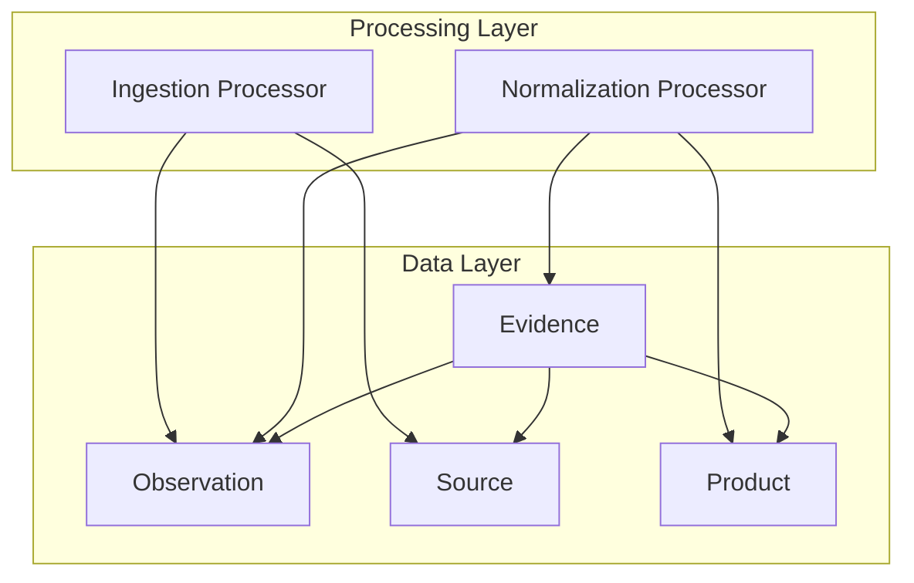
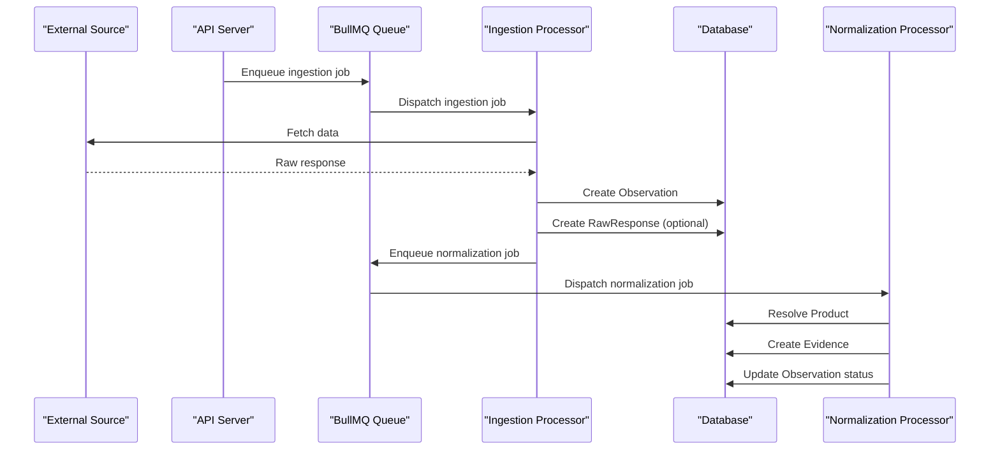
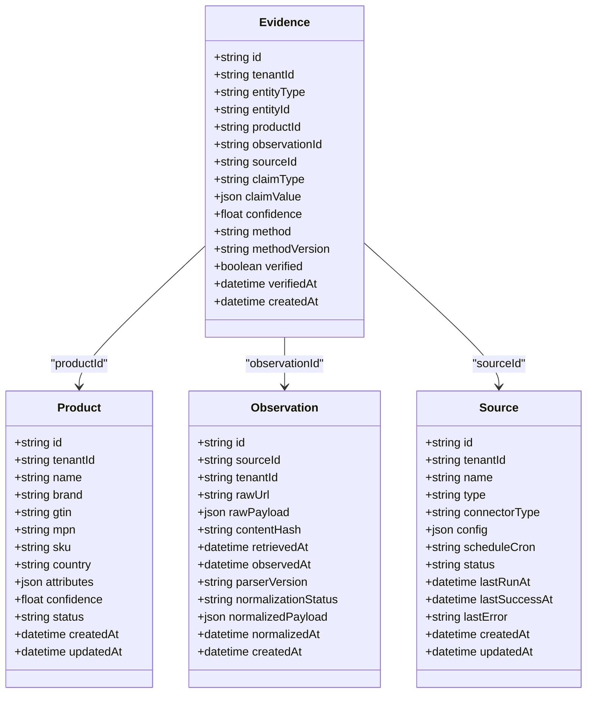
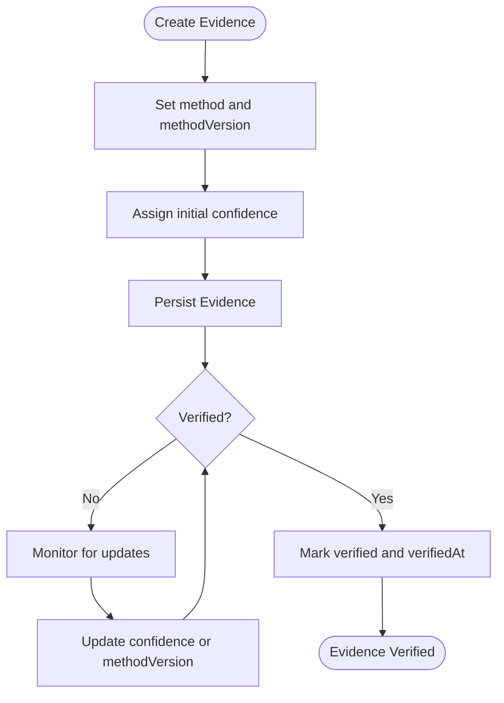
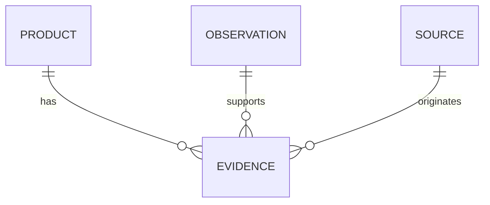
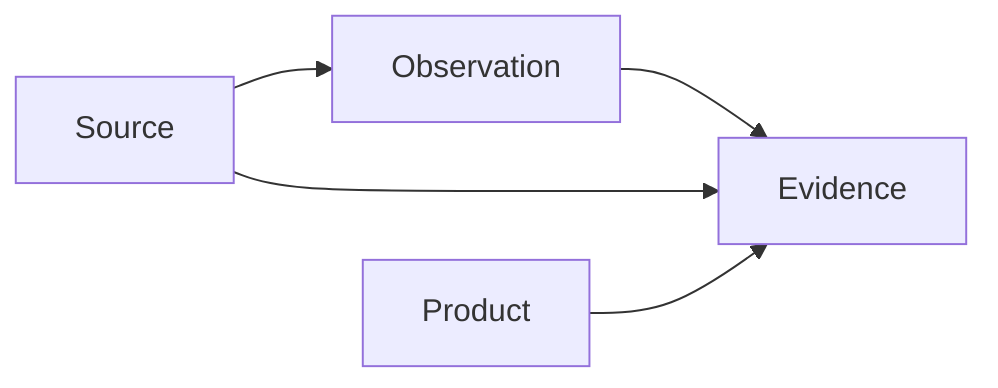

# Evidence & Provenance Tracking

<cite>
**Referenced Files in This Document**
- [schema.prisma](file://packages/database/prisma/schema.prisma)
- [migration.sql](file://packages/database/prisma/migrations/20261001214233_init/migration.sql)
- [normalization.ts](file://apps/worker/src/processors/normalization.ts)
- [ingestion.ts](file://apps/worker/src/processors/ingestion.ts)
- [ARCHITECTURE.md](file://docs/ARCHITECTURE.md)
- [AGENTS.md](file://AGENTS.md)
</cite>

## Table of Contents
1. [Introduction](#introduction)
2. [Project Structure](#project-structure)
3. [Core Components](#core-components)
4. [Architecture Overview](#architecture-overview)
5. [Detailed Component Analysis](#detailed-component-analysis)
6. [Dependency Analysis](#dependency-analysis)
7. [Performance Considerations](#performance-considerations)
8. [Troubleshooting Guide](#troubleshooting-guide)
9. [Conclusion](#conclusion)
10. [Appendices](#appendices)

## Introduction
This document explains the evidence and provenance tracking system that connects raw data to resolved insights. It focuses on:
- The Evidence model structure, including polymorphic entity references and claim types.
- Confidence scoring and verification state.
- How observations, sources, products, and evidence form an audit trail.
- The planned verification workflow and method tracking.
- Examples of evidence chains and provenance queries.

The system is designed so every conclusion can be traced back to immutable raw data, with explicit confidence and method metadata.

## Project Structure
Evidence and provenance are primarily defined in the database schema and referenced by worker processing stages. The relevant parts of the repository include:
- Database schema defining `Evidence`, `Observation`, `Product`, `Source`, and related tables.
- Worker processors that will create evidence during normalization.
- Architecture and engineering documents describing immutability, evidence chain principles, and Phase 2 plans.

**Diagram sources**
- [schema.prisma:108-131](file://packages/database/prisma/schema.prisma#L108-L131)
- [schema.prisma:137-162](file://packages/database/prisma/schema.prisma#L137-L162)
- [schema.prisma:190-214](file://packages/database/prisma/schema.prisma#L190-L214)
- [ingestion.ts:11-54](file://apps/worker/src/processors/ingestion.ts#L11-L54)
- [normalization.ts:15-57](file://apps/worker/src/processors/normalization.ts#L15-L57)

**Section sources**
- [schema.prisma:108-131](file://packages/database/prisma/schema.prisma#L108-L131)
- [schema.prisma:137-162](file://packages/database/prisma/schema.prisma#L137-L162)
- [schema.prisma:190-214](file://packages/database/prisma/schema.prisma#L190-L214)
- [ingestion.ts:11-54](file://apps/worker/src/processors/ingestion.ts#L11-L54)
- [normalization.ts:15-57](file://apps/worker/src/processors/normalization.ts#L15-L57)
- [ARCHITECTURE.md:68-92](file://docs/ARCHITECTURE.md#L68-L92)
- [AGENTS.md:30-33](file://AGENTS.md#L30-L33)

## Core Components
The evidence and provenance system centers on a small set of core entities:
- Observation: immutable record of raw data from a source.
- Source: configured ingestion endpoint or provider.
- Product: resolved product identity with optional confidence.
- Evidence: provenance record linking conclusions to observations, sources, and products.

Key design principles:
- Observations are append-only and never overwritten.
- Every important conclusion links back to its evidence.
- Confidence scores quantify certainty for entity resolution and claims.
- Method metadata records whether evidence came from manual review, automated logic, or AI inference.

**Section sources**
- [schema.prisma:108-131](file://packages/database/prisma/schema.prisma#L108-L131)
- [schema.prisma:137-162](file://packages/database/prisma/schema.prisma#L137-L162)
- [schema.prisma:190-214](file://packages/database/prisma/schema.prisma#L190-L214)
- [ARCHITECTURE.md:87-92](file://docs/ARCHITECTURE.md#L87-L92)
- [AGENTS.md:30-33](file://AGENTS.md#L30-L33)

## Architecture Overview
The evidence pipeline flows from external sources through ingestion and normalization into persistent evidence records.

**Diagram sources**
- [ingestion.ts:11-54](file://apps/worker/src/processors/ingestion.ts#L11-L54)
- [normalization.ts:15-57](file://apps/worker/src/processors/normalization.ts#L15-L57)
- [schema.prisma:108-131](file://packages/database/prisma/schema.prisma#L108-L131)
- [schema.prisma:137-162](file://packages/database/prisma/schema.prisma#L137-L162)
- [schema.prisma:190-214](file://packages/database/prisma/schema.prisma#L190-L214)

## Detailed Component Analysis

### Evidence Model Structure
The Evidence model captures provenance for any business entity and supports polymorphic relationships via typed fields.

- Identity and tenant isolation:
  - `id`: unique identifier.
  - `tenantId`: multi-tenant isolation.
- Polymorphic entity reference:
  - `entityType`: indicates the target entity kind, such as product, supplier, or source.
  - `entityId`: the identifier of the target entity within that type.
- Direct product linkage:
  - `productId`: direct foreign key when the evidence concerns a product.
- Observation and source linkage:
  - `observationId`: links evidence to the raw observation that informed it.
  - `sourceId`: links evidence to the original source.
- Claim semantics:
  - `claimType`: category of the claim, such as price, availability, specification, authenticity, or demand_signal.
  - `claimValue`: flexible JSON payload holding the actual claim details.
- Confidence and verification:
  - `confidence`: numeric confidence score for the claim or resolution.
  - `verified`: boolean indicating whether the evidence has been verified.
  - `verifiedAt`: timestamp of verification.
- Method tracking:
  - `method`: how the evidence was produced, such as manual, automated, or ai_inference.
  - `methodVersion`: version of the method or algorithm used.
- Timestamps:
  - `createdAt`: creation time.

Indexes support efficient querying by entity type and id, tenant, claim type, and product.

**Diagram sources**
- [schema.prisma:108-131](file://packages/database/prisma/schema.prisma#L108-L131)
- [schema.prisma:137-162](file://packages/database/prisma/schema.prisma#L137-L162)
- [schema.prisma:190-214](file://packages/database/prisma/schema.prisma#L190-L214)

**Section sources**
- [schema.prisma:190-214](file://packages/database/prisma/schema.prisma#L190-L214)
- [migration.sql:109-127](file://packages/database/prisma/migrations/20261001214233_init/migration.sql#L109-L127)

### Entity Type Polymorphism
`entityType` allows Evidence to refer to different entity kinds without requiring separate tables per entity. Supported values include:
- product
- supplier
- source

When `entityType` is product, `productId` provides a direct foreign key relationship to the Product table. For other entity types, `entityId` identifies the target entity, while `productId` may be null.

This design enables:
- Unified query patterns across entity kinds.
- Flexible expansion to new entity types without schema changes.
- Clear separation between polymorphic identity (`entityType`, `entityId`) and direct product linkage (`productId`).

**Section sources**
- [schema.prisma:190-214](file://packages/database/prisma/schema.prisma#L190-L214)

### Claim Types
`claimType` categorizes the nature of the evidence claim. Defined categories include:
- price
- availability
- specification
- authenticity
- demand_signal

Each claim carries structured details in `claimValue`, allowing rich payloads tailored to the claim type. For example:
- Price claims might include currency, amount, unit, and source context.
- Availability claims might include stock level, region, and validity window.
- Specification claims might include attribute-value pairs.
- Authenticity claims might include classification and supporting signals.
- Demand signal claims might include trend indicators and volume metrics.

**Section sources**
- [schema.prisma:190-214](file://packages/database/prisma/schema.prisma#L190-L214)

### Confidence Scoring
Confidence is represented as a floating-point value, typically in the range 0.0 to 1.0. It quantifies the certainty of:
- Product resolution confidence.
- Evidence claim strength.
- Aggregated insight reliability.

Confidence should be updated as more evidence accumulates or as verification occurs. Higher confidence does not imply truth; it reflects the system’s assessed certainty based on available evidence and methods.

**Section sources**
- [schema.prisma:137-162](file://packages/database/prisma/schema.prisma#L137-L162)
- [schema.prisma:190-214](file://packages/database/prisma/schema.prisma#L190-L214)
- [ARCHITECTURE.md:87-92](file://docs/ARCHITECTURE.md#L87-L92)

### Verification Workflow and Method Tracking
Verification workflow:
- Creation: Evidence is created with initial `confidence`, `method`, and `methodVersion`.
- Review: Manual reviewers or automated checks update `verified` and `verifiedAt`.
- Re-evaluation: New observations or improved methods can adjust `confidence` and `methodVersion`.

Method tracking:
- manual: Human-reviewed evidence.
- automated: Deterministic rules or calculations.
- ai_inference: AI-assisted reasoning or classification.

The normalization processor is designed to create evidence records as part of the canonical mapping and entity resolution process.

**Diagram sources**
- [normalization.ts:15-57](file://apps/worker/src/processors/normalization.ts#L15-L57)
- [schema.prisma:190-214](file://packages/database/prisma/schema.prisma#L190-L214)

**Section sources**
- [normalization.ts:15-57](file://apps/worker/src/processors/normalization.ts#L15-L57)
- [schema.prisma:190-214](file://packages/database/prisma/schema.prisma#L190-L214)

### Relationship Mapping to Products, Observations, and Sources
Evidence maintains three primary relationships:
- To Product: via `productId` when directly tied to a product.
- To Observation: via `observationId`, linking the conclusion to the raw data.
- To Source: via `sourceId`, linking the conclusion to the origin.

These relationships enable full traceability:
- From a product, you can find all evidence claims about it.
- From an observation, you can find all derived conclusions.
- From a source, you can assess the quality and history of claims originating there.

**Diagram sources**
- [schema.prisma:108-131](file://packages/database/prisma/schema.prisma#L108-L131)
- [schema.prisma:137-162](file://packages/database/prisma/schema.prisma#L137-L162)
- [schema.prisma:190-214](file://packages/database/prisma/schema.prisma#L190-L214)

**Section sources**
- [schema.prisma:108-131](file://packages/database/prisma/schema.prisma#L108-L131)
- [schema.prisma:137-162](file://packages/database/prisma/schema.prisma#L137-L162)
- [schema.prisma:190-214](file://packages/database/prisma/schema.prisma#L190-L214)

### Evidence Chains and Provenance Queries
An evidence chain traces a conclusion back through observations to sources. A typical chain looks like:
- Source returns raw data.
- Observation stores immutable raw payload and metadata.
- Normalization resolves product identity and creates evidence with claim type, confidence, and method.
- Verification marks evidence as reviewed or validated.

Example provenance queries:
- Find all evidence for a product by `productId`.
- Find all evidence for a specific claim type, such as `authenticity`.
- Find evidence created by a particular method, such as `ai_inference`.
- Trace from an observation to all derived evidence.
- Filter evidence by tenant and confidence threshold.

Indexes on `entityType`, `entityId`, `tenantId`, `claimType`, and `productId` support these queries efficiently.

**Section sources**
- [schema.prisma:190-214](file://packages/database/prisma/schema.prisma#L190-L214)

## Dependency Analysis
Evidence depends on several foundational models and processing stages:
- Depends on Observation for raw data linkage.
- Depends on Source for origin linkage.
- Optionally depends on Product for direct product linkage.
- Created during normalization after ingestion produces observations.

**Diagram sources**
- [schema.prisma:108-131](file://packages/database/prisma/schema.prisma#L108-L131)
- [schema.prisma:137-162](file://packages/database/prisma/schema.prisma#L137-L162)
- [schema.prisma:190-214](file://packages/database/prisma/schema.prisma#L190-L214)

**Section sources**
- [schema.prisma:108-131](file://packages/database/prisma/schema.prisma#L108-L131)
- [schema.prisma:137-162](file://packages/database/prisma/schema.prisma#L137-L162)
- [schema.prisma:190-214](file://packages/database/prisma/schema.prisma#L190-L214)

## Performance Considerations
- Use indexes on frequently filtered columns: `tenantId`, `entityType`, `entityId`, `claimType`, `productId`.
- Keep `claimValue` payloads concise and structured to avoid large JSON blobs.
- Partition or archive historical evidence if volumes grow significantly.
- Avoid over-indexing; balance read performance with write overhead.
- Ensure confidence updates are batched where possible to reduce contention.

[No sources needed since this section provides general guidance]

## Troubleshooting Guide
Common issues and resolutions:
- Missing required fields in normalization jobs:
  - Ensure `observationId`, `sourceId`, and `tenantId` are present before processing.
- Evidence not linked to product:
  - Confirm `productId` is set when `entityType` is product.
- Low confidence despite strong signals:
  - Review method and methodVersion; ensure confidence calculation accounts for all evidence.
- Verification not recorded:
  - Ensure `verified` and `verifiedAt` are updated when evidence is reviewed.
- Query performance degradation:
  - Validate index usage on `tenantId`, `entityType`, `entityId`, `claimType`, and `productId`.

**Section sources**
- [normalization.ts:24-34](file://apps/worker/src/processors/normalization.ts#L24-L34)
- [schema.prisma:190-214](file://packages/database/prisma/schema.prisma#L190-L214)

## Conclusion
The evidence and provenance tracking system provides a robust foundation for tracing conclusions back to raw data. Through polymorphic entity references, structured claim types, confidence scoring, and method tracking, the system ensures transparency and auditability. As Phase 2 implements ingestion and normalization, evidence records will become the backbone of reliable intelligence outputs.

[No sources needed since this section summarizes without analyzing specific files]

## Appendices

### Data Principles and Engineering Rules
- Observations are immutable and append-only.
- Every important conclusion links back to evidence.
- External data must come from real sources; no fabricated data.
- AI is an interface and reasoning layer; deterministic calculations remain deterministic.

**Section sources**
- [ARCHITECTURE.md:87-92](file://docs/ARCHITECTURE.md#L87-L92)
- [AGENTS.md:19-29](file://AGENTS.md#L19-L29)
- [AGENTS.md:30-33](file://AGENTS.md#L30-L33)