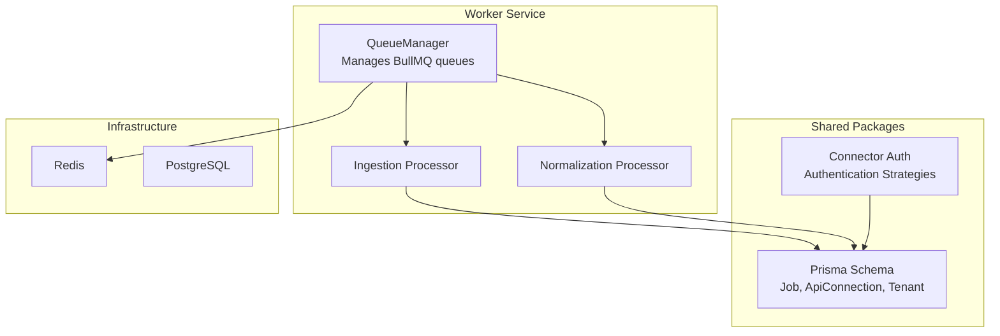
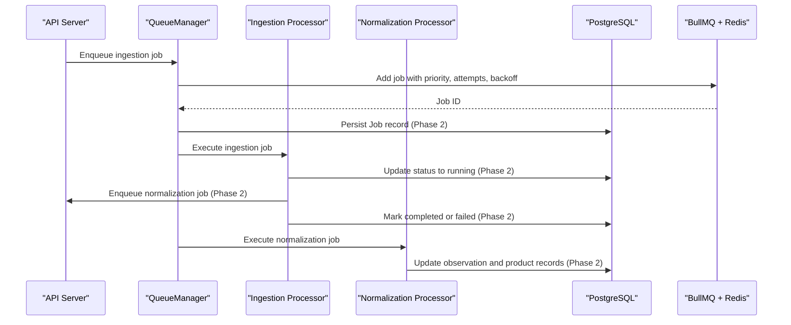
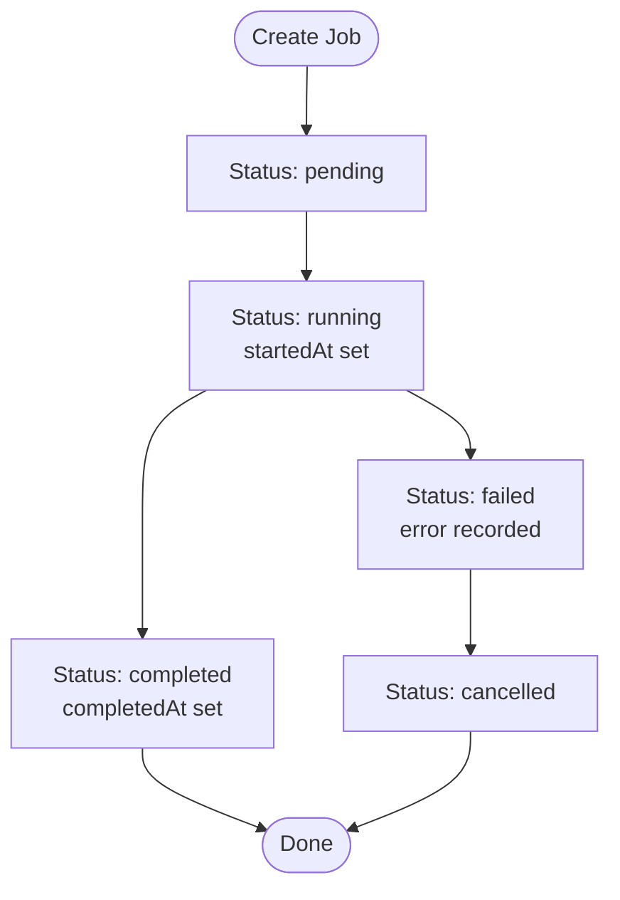
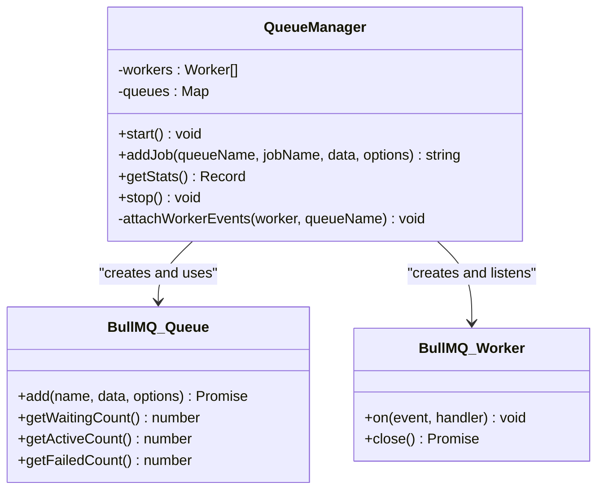
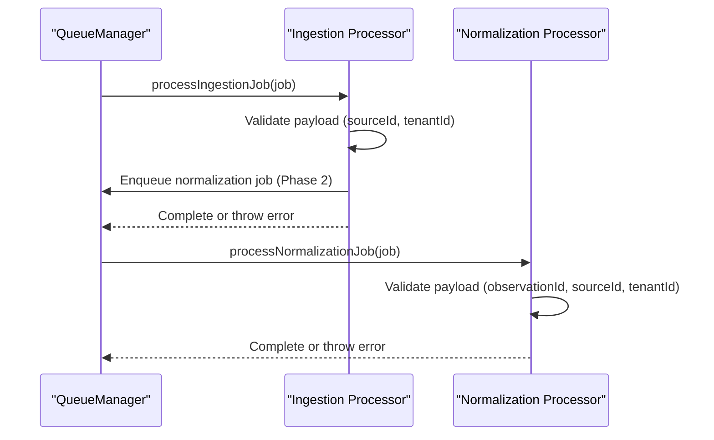
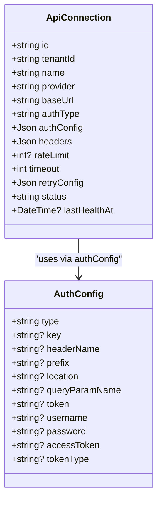
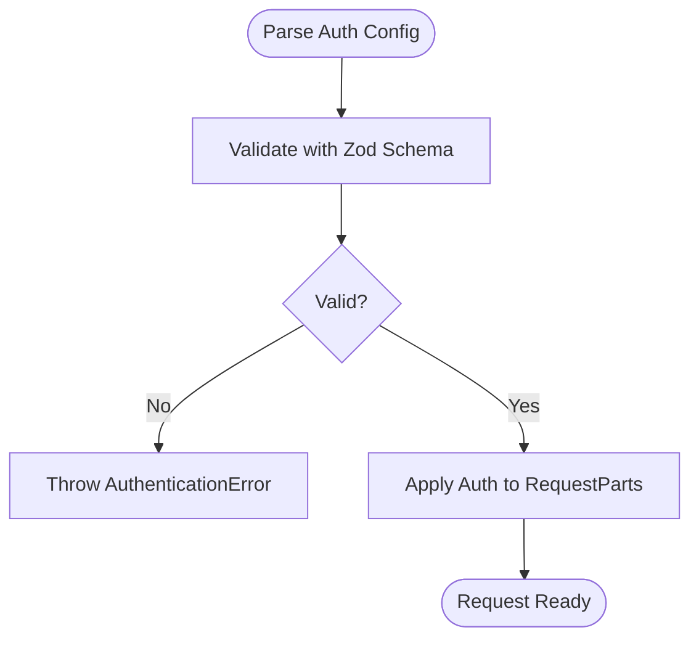
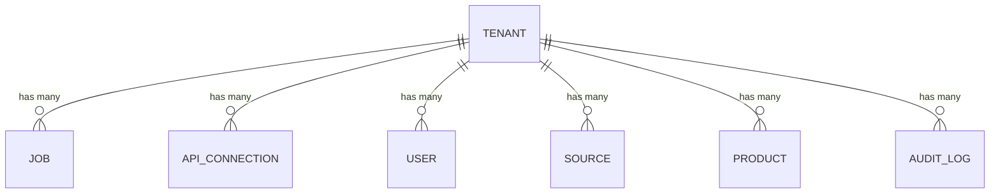
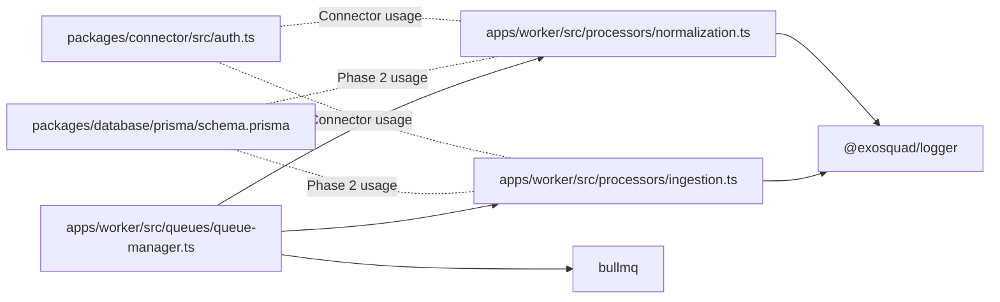

# Job System & API Connections

<cite>
**Referenced Files in This Document**
- [schema.prisma](file://packages/database/prisma/schema.prisma)
- [queue-manager.ts](file://apps/worker/src/queues/queue-manager.ts)
- [ingestion.ts](file://apps/worker/src/processors/ingestion.ts)
- [normalization.ts](file://apps/worker/src/processors/normalization.ts)
- [auth.ts](file://packages/connector/src/auth.ts)
- [ARCHITECTURE.md](file://docs/ARCHITECTURE.md)
</cite>

## Table of Contents
1. [Introduction](#introduction)
2. [Project Structure](#project-structure)
3. [Core Components](#core-components)
4. [Architecture Overview](#architecture-overview)
5. [Detailed Component Analysis](#detailed-component-analysis)
6. [Dependency Analysis](#dependency-analysis)
7. [Performance Considerations](#performance-considerations)
8. [Troubleshooting Guide](#troubleshooting-guide)
9. [Conclusion](#conclusion)

## Introduction
This document explains the background job processing system and provider-agnostic API connection model used by the platform. It focuses on:
- The Job model, including queue types, status lifecycle, retry mechanisms, and priority handling.
- The ApiConnection model for configuring external API integrations with authentication strategies, rate limiting, timeouts, and health monitoring.
- The relationship between jobs and tenants, including tenant-scoped execution and resource isolation.

The system uses a pipeline architecture where data flows from real sources through ingestion and normalization into canonical models. Jobs are persisted to PostgreSQL while execution is coordinated by BullMQ and Redis. API connections are stored as reusable, tenant-scoped configurations that drive connector behavior.

## Project Structure
The relevant parts of the repository are organized around:
- A shared Prisma schema defining multi-tenant entities, jobs, and API connections.
- A worker service that manages BullMQ queues and workers.
- Processors for ingestion and normalization jobs.
- A connector package implementing authentication strategies for outgoing HTTP requests.
- Architecture documentation describing queues, resilience, and universal connectors.

**Diagram sources**
- [queue-manager.ts:19-60](file://apps/worker/src/queues/queue-manager.ts#L19-L60)
- [ingestion.ts:11-54](file://apps/worker/src/processors/ingestion.ts#L11-L54)
- [normalization.ts:15-57](file://apps/worker/src/processors/normalization.ts#L15-L57)
- [schema.prisma:220-271](file://packages/database/prisma/schema.prisma#L220-L271)
- [auth.ts:11-49](file://packages/connector/src/auth.ts#L11-L49)

**Section sources**
- [ARCHITECTURE.md:43-65](file://docs/ARCHITECTURE.md#L43-L65)
- [ARCHITECTURE.md:95-139](file://docs/ARCHITECTURE.md#L95-L139)

## Core Components
This section summarizes the two primary components covered by this document:
- Job persistence and queue execution.
- ApiConnection configuration and authentication strategy application.

Key responsibilities:
- Job model stores metadata about async work, including queue type, status, priority, attempts, and timestamps.
- QueueManager creates and configures BullMQ queues and workers, enqueues jobs with retries and backoff, and exposes statistics.
- Processors validate inputs, log structured context, and implement placeholder logic until Phase 2 implementation.
- ApiConnection model stores base URL, authentication type, headers, rate limits, timeouts, retry configuration, and health state.
- Connector auth module validates and applies authentication to outgoing requests.

**Section sources**
- [schema.prisma:220-271](file://packages/database/prisma/schema.prisma#L220-L271)
- [queue-manager.ts:19-98](file://apps/worker/src/queues/queue-manager.ts#L19-L98)
- [ingestion.ts:11-54](file://apps/worker/src/processors/ingestion.ts#L11-L54)
- [normalization.ts:15-57](file://apps/worker/src/processors/normalization.ts#L15-L57)
- [auth.ts:11-112](file://packages/connector/src/auth.ts#L11-L112)

## Architecture Overview
The background job system and API connection model fit into the broader pipeline:

**Diagram sources**
- [queue-manager.ts:62-98](file://apps/worker/src/queues/queue-manager.ts#L62-L98)
- [ingestion.ts:20-53](file://apps/worker/src/processors/ingestion.ts#L20-L53)
- [normalization.ts:24-56](file://apps/worker/src/processors/normalization.ts#L24-L56)
- [schema.prisma:220-244](file://packages/database/prisma/schema.prisma#L220-L244)

## Detailed Component Analysis

### Job Model and Lifecycle
The Job model captures the full lifecycle of asynchronous work:
- Queue types: ingestion, normalization, analysis, outreach.
- Status values: pending, running, completed, failed, cancelled.
- Priority: integer field used by BullMQ to order job execution.
- Retry mechanics: attempts and maxAttempts fields; default maximum attempts is three.
- Timing: startedAt and completedAt track execution windows.
- Results and errors: result and error fields store outcomes.
- Tenancy: optional tenantId links jobs to tenants for isolation and reporting.

Indexes support efficient queries by queue and status, tenant, overall status, and creation time.

**Diagram sources**
- [schema.prisma:220-244](file://packages/database/prisma/schema.prisma#L220-L244)

**Section sources**
- [schema.prisma:220-244](file://packages/database/prisma/schema.prisma#L220-L244)

### Queue Management, Retries, and Priority
QueueManager coordinates BullMQ queues and workers:
- Creates ingestion and normalization queues with dedicated workers.
- Applies concurrency settings and per-queue rate limiting for ingestion.
- Adds jobs with configurable priority, attempts, backoff, delay, and idempotency keys.
- Configures automatic cleanup of completed and failed jobs.
- Exposes queue statistics for health checks.
- Attaches event listeners for completion, failure, and worker errors.

**Diagram sources**
- [queue-manager.ts:19-165](file://apps/worker/src/queues/queue-manager.ts#L19-L165)

Retry and backoff behavior:
- Default attempts: 3.
- Default backoff: exponential with initial delay of 1000 milliseconds.
- Idempotency: jobId option allows deduplication.
- Cleanup: removeOnComplete and removeOnFail configured with counts.

Priority handling:
- Priority defaults to 0 when not provided.
- Higher-priority jobs can be processed earlier depending on queue semantics.

Rate limiting:
- Ingestion worker includes a limiter allowing up to 50 jobs per minute.

**Section sources**
- [queue-manager.ts:23-98](file://apps/worker/src/queues/queue-manager.ts#L23-L98)
- [queue-manager.ts:100-165](file://apps/worker/src/queues/queue-manager.ts#L100-L165)

### Job Processors: Ingestion and Normalization
Processors define the expected job payloads and logging structure:
- Ingestion processor expects sourceId and tenantId.
- Normalization processor expects observationId, sourceId, and tenantId.
- Both processors create child loggers bound to job context.
- Placeholder comments indicate Phase 2 integration points for database updates, fetching, parsing, and downstream job enqueueing.

**Diagram sources**
- [ingestion.ts:11-54](file://apps/worker/src/processors/ingestion.ts#L11-L54)
- [normalization.ts:15-57](file://apps/worker/src/processors/normalization.ts#L15-L57)

**Section sources**
- [ingestion.ts:11-54](file://apps/worker/src/processors/ingestion.ts#L11-L54)
- [normalization.ts:15-57](file://apps/worker/src/processors/normalization.ts#L15-L57)

### ApiConnection Model and Authentication Strategies
ApiConnection provides a provider-agnostic configuration for external APIs:
- Fields include name, provider label, baseUrl, authType, authConfig, headers, rateLimit, timeout, retryConfig, status, and lastHealthAt.
- Status supports active, error, disabled.
- Rate limit is expressed as requests per minute.
- Timeout is in milliseconds with a default value.
- Retry configuration is JSON with fields such as maxAttempts and backoffMs.
- Health monitoring tracks last successful health check timestamp.

Authentication strategies supported by the connector:
- none: no authentication applied.
- api_key: key placed in header or query parameter with configurable header name, prefix, and query param name.
- bearer: Authorization header with Bearer token.
- basic: Authorization header with Basic credentials.
- oauth2: Authorization header with custom token type and access token.

**Diagram sources**
- [schema.prisma:250-271](file://packages/database/prisma/schema.prisma#L250-L271)
- [auth.ts:11-49](file://packages/connector/src/auth.ts#L11-L49)

Authentication application flow:
- parseAuthConfig validates raw JSON against discriminated union schemas.
- applyAuth mutates request parts to add headers or query parameters based on auth type.
- Unknown auth types raise an authentication error.

**Diagram sources**
- [auth.ts:101-112](file://packages/connector/src/auth.ts#L101-L112)
- [auth.ts:65-99](file://packages/connector/src/auth.ts#L65-L99)

**Section sources**
- [schema.prisma:250-271](file://packages/database/prisma/schema.prisma#L250-L271)
- [auth.ts:11-112](file://packages/connector/src/auth.ts#L11-L112)

### Tenant Scoping and Resource Isolation
Tenants provide isolation across organizations:
- Every core table includes a tenantId foreign key.
- Queries filter by tenant to enforce isolation at both application and database levels.
- Jobs optionally reference tenantId for tenant-scoped execution and reporting.
- ApiConnection requires tenantId, ensuring API credentials are scoped per organization.

**Diagram sources**
- [schema.prisma:24-41](file://packages/database/prisma/schema.prisma#L24-L41)
- [schema.prisma:220-271](file://packages/database/prisma/schema.prisma#L220-L271)

**Section sources**
- [ARCHITECTURE.md:68-86](file://docs/ARCHITECTURE.md#L68-L86)
- [schema.prisma:24-41](file://packages/database/prisma/schema.prisma#L24-L41)
- [schema.prisma:220-271](file://packages/database/prisma/schema.prisma#L220-L271)

## Dependency Analysis
The following diagram shows how the worker, processors, schema, and connector interact:

**Diagram sources**
- [queue-manager.ts:1-6](file://apps/worker/src/queues/queue-manager.ts#L1-L6)
- [ingestion.ts:1-3](file://apps/worker/src/processors/ingestion.ts#L1-L3)
- [normalization.ts:1-3](file://apps/worker/src/processors/normalization.ts#L1-L3)
- [auth.ts:1-10](file://packages/connector/src/auth.ts#L1-L10)
- [schema.prisma:220-271](file://packages/database/prisma/schema.prisma#L220-L271)

**Section sources**
- [queue-manager.ts:1-166](file://apps/worker/src/queues/queue-manager.ts#L1-L166)
- [ingestion.ts:1-55](file://apps/worker/src/processors/ingestion.ts#L1-L55)
- [normalization.ts:1-58](file://apps/worker/src/processors/normalization.ts#L1-L58)
- [auth.ts:1-113](file://packages/connector/src/auth.ts#L1-L113)
- [schema.prisma:220-271](file://packages/database/prisma/schema.prisma#L220-L271)

## Performance Considerations
- Concurrency: Worker concurrency is configurable and should be tuned based on CPU and I/O characteristics.
- Rate limiting: Ingestion worker enforces a per-minute cap to avoid overwhelming external providers.
- Backoff and retries: Exponential backoff reduces pressure during transient failures.
- Cleanup policies: Automatic removal of completed and failed jobs prevents queue bloat.
- Database indexes: Indexes on queue/status, tenantId, status, and createdAt optimize common queries.
- Timeouts: ApiConnection timeout protects against slow upstream responses.
- Logging: Structured logs with jobId, queue, and duration aid performance diagnostics.

[No sources needed since this section provides general guidance]

## Troubleshooting Guide
Common issues and resolutions:
- Missing required job fields:
  - Ingestion jobs require sourceId and tenantId.
  - Normalization jobs require observationId, sourceId, and tenantId.
  - Ensure callers populate these fields before enqueueing.
- Unknown queue names:
  - QueueManager throws an error if an unknown queue is referenced.
  - Use only ingestion and normalization queues currently defined.
- Authentication errors:
  - Invalid or unsupported auth types cause AuthenticationError.
  - Validate authConfig using parseAuthConfig before applying.
- Health monitoring:
  - Track lastHealthAt on ApiConnection to detect degraded providers.
  - Use queue stats to monitor waiting, active, and failed job counts.

**Section sources**
- [ingestion.ts:20-28](file://apps/worker/src/processors/ingestion.ts#L20-L28)
- [normalization.ts:24-34](file://apps/worker/src/processors/normalization.ts#L24-L34)
- [queue-manager.ts:77-80](file://apps/worker/src/queues/queue-manager.ts#L77-L80)
- [auth.ts:93-99](file://packages/connector/src/auth.ts#L93-L99)
- [auth.ts:104-112](file://packages/connector/src/auth.ts#L104-L112)
- [queue-manager.ts:100-125](file://apps/worker/src/queues/queue-manager.ts#L100-L125)

## Conclusion
The background job system and API connection model provide a robust foundation for scalable, tenant-isolated data processing and provider-agnostic integrations:
- Jobs capture lifecycle, priority, and retry semantics while being executed by BullMQ workers.
- Processors establish validation and logging patterns ready for Phase 2 implementation.
- ApiConnection centralizes authentication, rate limiting, timeouts, and health tracking.
- Tenant scoping ensures strict resource isolation across organizations.

As Phase 2 progresses, the placeholders in processors will connect to the database and connector framework to complete the ingestion and normalization pipelines.

[No sources needed since this section summarizes without analyzing specific files]