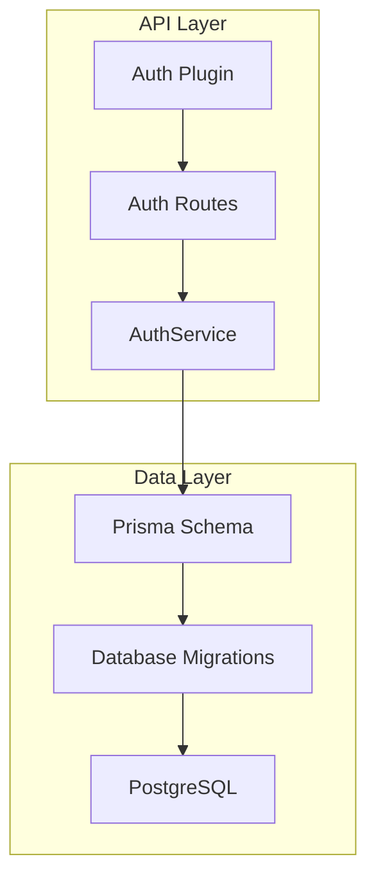
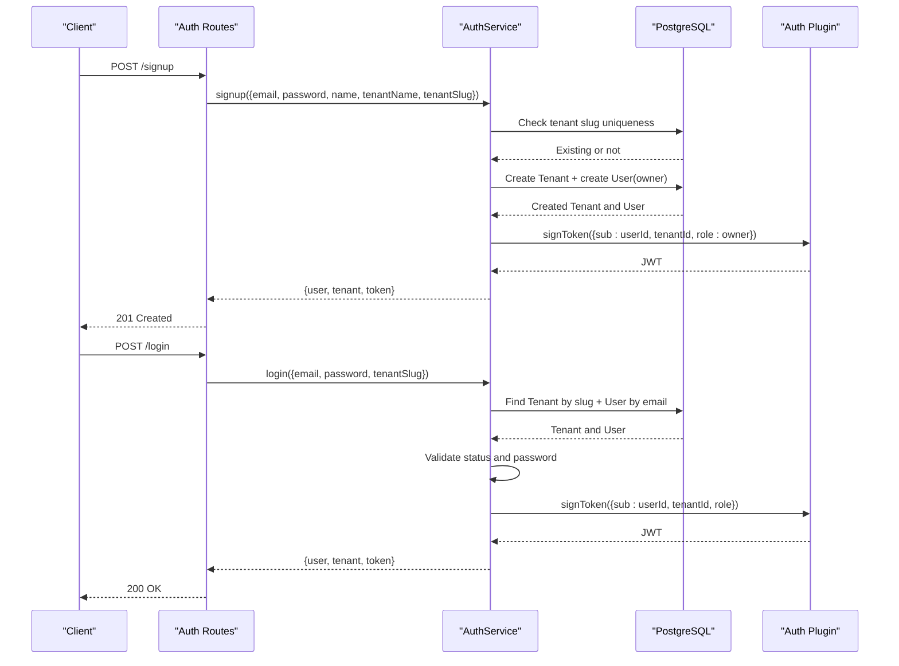
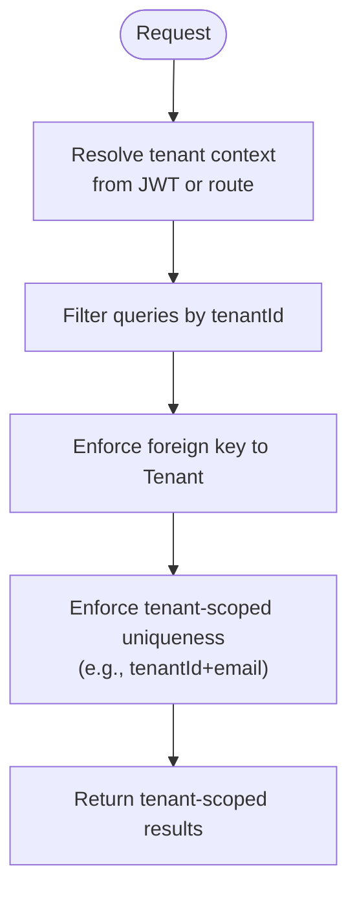
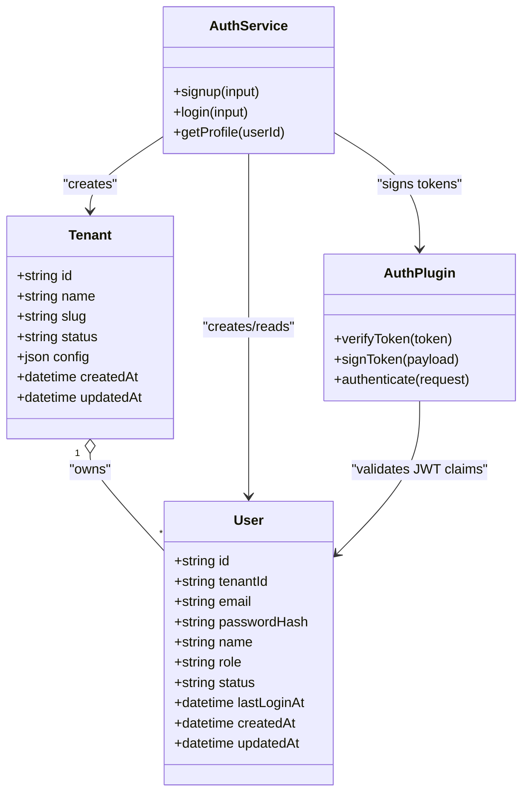
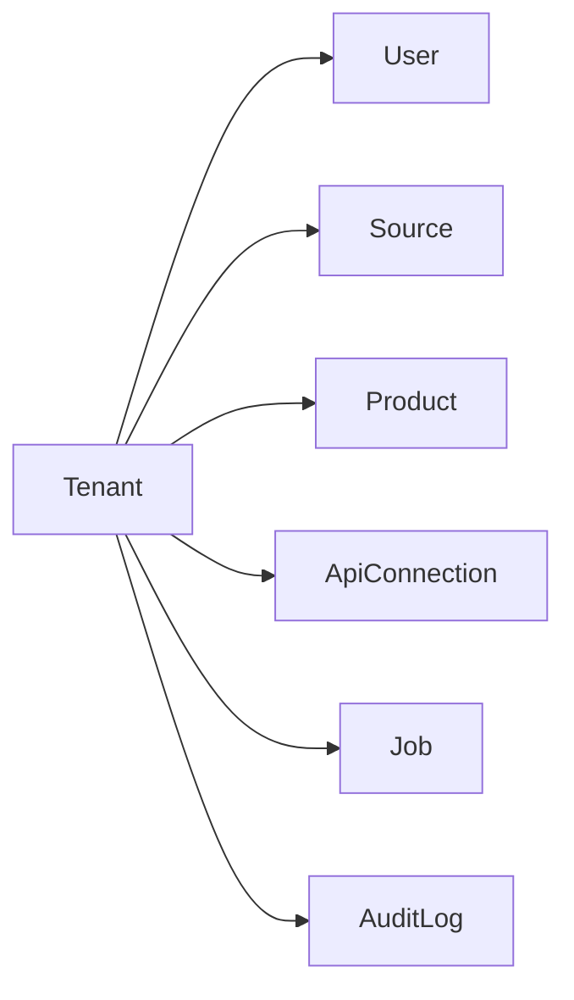

# Multi-Tenancy Models

<cite>
**Referenced Files in This Document**
- [schema.prisma](file://packages/database/prisma/schema.prisma)
- [migration.sql](file://packages/database/prisma/migrations/20261001214233_init/migration.sql)
- [auth.ts](file://apps/api/src/services/auth.ts)
- [auth.ts](file://apps/api/src/plugins/auth.ts)
</cite>

## Table of Contents
1. [Introduction](#introduction)
2. [Project Structure](#project-structure)
3. [Core Components](#core-components)
4. [Architecture Overview](#architecture-overview)
5. [Detailed Component Analysis](#detailed-component-analysis)
6. [Dependency Analysis](#dependency-analysis)
7. [Performance Considerations](#performance-considerations)
8. [Troubleshooting Guide](#troubleshooting-guide)
9. [Conclusion](#conclusion)

## Introduction
This document explains Exosquad’s multi-tenancy foundation with a focus on the Tenant and User data models, how tenant isolation is enforced through foreign keys and unique constraints, and how authentication integrates with these models. It also documents related resources such as Sources, Products, Jobs, API Connections, and Audit Logs that are scoped to tenants.

## Project Structure
The multi-tenancy schema is defined in Prisma and materialized by PostgreSQL migrations. The API layer uses this schema for user signup, login, and profile retrieval, while JWT middleware carries tenant context across requests.



**Diagram sources**
- [schema.prisma:24-64](file://packages/database/prisma/schema.prisma#L24-L64)
- [migration.sql:1-296](file://packages/database/prisma/migrations/20261001214233_init/migration.sql#L1-L296)
- [auth.ts](file://apps/api/src/services/auth.ts)
- [auth.ts](file://apps/api/src/plugins/auth.ts)

**Section sources**
- [schema.prisma:24-64](file://packages/database/prisma/schema.prisma#L24-L64)
- [migration.sql:1-296](file://packages/database/prisma/migrations/20261001214233_init/migration.sql#L1-L296)
- [auth.ts](file://apps/api/src/services/auth.ts)
- [auth.ts](file://apps/api/src/plugins/auth.ts)

## Core Components
- Tenant: Represents an isolated organization or workspace.
- User: Represents an account within a tenant, with role-based access control and authentication fields.
- Related Resources: Sources, Products, Jobs, API Connections, and Audit Logs are all associated with a Tenant to enforce data isolation.

Key implementation points:
- Tenant isolation is implemented via foreign key relationships from resource tables to the Tenant table.
- Unique constraints ensure tenant-level uniqueness (for example, email per tenant).
- Indexes optimize queries filtered by tenantId.

**Section sources**
- [schema.prisma:24-64](file://packages/database/prisma/schema.prisma#L24-L64)
- [schema.prisma:70-102](file://packages/database/prisma/schema.prisma#L70-L102)
- [schema.prisma:137-162](file://packages/database/prisma/schema.prisma#L137-L162)
- [schema.prisma:220-244](file://packages/database/prisma/schema.prisma#L220-L244)
- [schema.prisma:250-271](file://packages/database/prisma/schema.prisma#L250-L271)
- [schema.prisma:277-295](file://packages/database/prisma/schema.prisma#L277-L295)
- [migration.sql:186-296](file://packages/database/prisma/migrations/20261001214233_init/migration.sql#L186-L296)

## Architecture Overview
The following diagram shows how Tenants own Users and other resources, and how authentication flows use tenant context.

```mermaid
erDiagram
TENANT {
string id PK
string name
string slug UK
string status
json config
datetime createdAt
datetime updatedAt
}
USER {
string id PK
string tenantId FK
string email UK_TENANT_EMAIL
string passwordHash
string name
string role
string status
datetime lastLoginAt
datetime createdAt
datetime updatedAt
}
SOURCE {
string id PK
string tenantId FK
string name
string type
string connectorType
json config
string scheduleCron
string status
datetime lastRunAt
datetime lastSuccessAt
string lastError
datetime createdAt
datetime updatedAt
}
PRODUCT {
string id PK
string tenantId FK
string name
string brand
string category
string gtin
string mpn
string sku
string country
string description
json attributes
float confidence
string status
datetime createdAt
datetime updatedAt
}
JOB {
string id PK
string tenantId FK
string queue
string type
json payload
string status
int priority
int attempts
int maxAttempts
json result
string error
datetime startedAt
datetime completedAt
datetime createdAt
datetime updatedAt
}
API_CONNECTION {
string id PK
string tenantId FK
string name
string provider
string baseUrl
string authType
json authConfig
json headers
int rateLimit
int timeout
json retryConfig
string status
datetime lastHealthAt
datetime createdAt
datetime updatedAt
}
AUDIT_LOG {
string id PK
string tenantId FK
string userId FK
string action
string resource
string resourceId
json metadata
string ipAddress
datetime createdAt
}
TENANT ||--o{ USER : "owns"
TENANT ||--o{ SOURCE : "owns"
TENANT ||--o{ PRODUCT : "owns"
TENANT ||--o{ JOB : "owns"
TENANT ||--o{ API_CONNECTION : "owns"
TENANT ||--o{ AUDIT_LOG : "owns"
```

**Diagram sources**
- [schema.prisma:24-64](file://packages/database/prisma/schema.prisma#L24-L64)
- [schema.prisma:70-102](file://packages/database/prisma/schema.prisma#L70-L102)
- [schema.prisma:137-162](file://packages/database/prisma/schema.prisma#L137-L162)
- [schema.prisma:220-244](file://packages/database/prisma/schema.prisma#L220-L244)
- [schema.prisma:250-271](file://packages/database/prisma/schema.prisma#L250-L271)
- [schema.prisma:277-295](file://packages/database/prisma/schema.prisma#L277-L295)

## Detailed Component Analysis

### Tenant Model
Purpose:
- Represents a tenant boundary for data isolation.
- Provides identity and configuration for each organization.

Fields:
- id: Primary key identifier.
- name: Human-readable tenant name.
- slug: Unique, URL-friendly identifier for the tenant.
- status: Lifecycle state (active, suspended, cancelled).
- config: JSON configuration object for tenant-specific settings.
- createdAt / updatedAt: Timestamps for auditing and lifecycle tracking.

Relationships:
- One-to-many with User, Source, ApiConnection, Product, Job, and AuditLog.

Constraints and mapping:
- Slug is globally unique.
- Table mapped to “tenants”.

**Section sources**
- [schema.prisma:24-41](file://packages/database/prisma/schema.prisma#L24-L41)
- [migration.sql:1-12](file://packages/database/prisma/migrations/20261001214233_init/migration.sql#L1-L12)
- [migration.sql:186-187](file://packages/database/prisma/migrations/20261001214233_init/migration.sql#L186-L187)

### User Model
Purpose:
- Represents a user account scoped to a specific tenant.
- Supports role-based access control and authentication.

Fields:
- id: Primary key identifier.
- tenantId: Foreign key linking the user to their Tenant.
- email: User email address.
- passwordHash: Securely hashed password.
- name: Optional display name.
- role: Role-based access control value (owner, admin, member, viewer).
- status: Account status (active, disabled).
- lastLoginAt: Last successful login timestamp.
- createdAt / updatedAt: Timestamps.

Relationships:
- Belongs to one Tenant via tenantId.

Constraints and indexing:
- Unique constraint on (tenantId, email) ensures email uniqueness within a tenant.
- Index on tenantId optimizes tenant-scoped lookups.
- Table mapped to “users”.

Authentication integration:
- Signup creates a Tenant and an Owner User atomically.
- Login validates credentials against the Tenant-scoped User and issues a JWT containing userId, tenantId, and role.
- Profile retrieval includes the associated Tenant.



**Diagram sources**
- [auth.ts](file://apps/api/src/services/auth.ts)
- [auth.ts](file://apps/api/src/plugins/auth.ts)

**Section sources**
- [schema.prisma:47-64](file://packages/database/prisma/schema.prisma#L47-L64)
- [migration.sql:14-28](file://packages/database/prisma/migrations/20261001214233_init/migration.sql#L14-L28)
- [migration.sql:189-193](file://packages/database/prisma/migrations/20261001214233_init/migration.sql#L189-L193)
- [migration.sql:270-271](file://packages/database/prisma/migrations/20261001214233_init/migration.sql#L270-L271)
- [auth.ts](file://apps/api/src/services/auth.ts)
- [auth.ts](file://apps/api/src/plugins/auth.ts)

### Tenant Isolation Through Relationships and Constraints
Isolation mechanisms:
- Foreign Keys: Resource tables (User, Source, Product, ApiConnection, Job, AuditLog) reference Tenant.id, ensuring every record belongs to a Tenant.
- Unique Constraints: Email uniqueness is enforced per tenant via a composite unique index on (tenantId, email).
- Indexing: tenantId indexes on relevant tables optimize filtering by tenant.

Operational impact:
- Queries should always filter by tenantId to maintain isolation at the application level.
- Deleting a Tenant can be restricted for critical resources to prevent accidental data loss.



**Diagram sources**
- [schema.prisma:24-64](file://packages/database/prisma/schema.prisma#L24-L64)
- [schema.prisma:70-102](file://packages/database/prisma/schema.prisma#L70-L102)
- [schema.prisma:137-162](file://packages/database/prisma/schema.prisma#L137-L162)
- [schema.prisma:220-244](file://packages/database/prisma/schema.prisma#L220-L244)
- [schema.prisma:250-271](file://packages/database/prisma/schema.prisma#L250-L271)
- [schema.prisma:277-295](file://packages/database/prisma/schema.prisma#L277-L295)
- [migration.sql:186-296](file://packages/database/prisma/migrations/20261001214233_init/migration.sql#L186-L296)

**Section sources**
- [schema.prisma:24-64](file://packages/database/prisma/schema.prisma#L24-L64)
- [schema.prisma:70-102](file://packages/database/prisma/schema.prisma#L70-L102)
- [schema.prisma:137-162](file://packages/database/prisma/schema.prisma#L137-L162)
- [schema.prisma:220-244](file://packages/database/prisma/schema.prisma#L220-L244)
- [schema.prisma:250-271](file://packages/database/prisma/schema.prisma#L250-L271)
- [schema.prisma:277-295](file://packages/database/prisma/schema.prisma#L277-L295)
- [migration.sql:186-296](file://packages/database/prisma/migrations/20261001214233_init/migration.sql#L186-L296)

### Authentication Fields and Role-Based Access Control
Roles:
- owner: Initial creator of a tenant.
- admin: Administrative user within a tenant.
- member: Standard collaborator.
- viewer: Read-only access.

Authentication flow:
- Signup creates a Tenant and sets the first User’s role to owner.
- Login verifies credentials and returns a JWT containing userId, tenantId, and role.
- Protected routes use the auth plugin to decode the JWT and attach user context (including tenantId and role) to the request.



**Diagram sources**
- [schema.prisma:24-64](file://packages/database/prisma/schema.prisma#L24-L64)
- [auth.ts](file://apps/api/src/services/auth.ts)
- [auth.ts](file://apps/api/src/plugins/auth.ts)

**Section sources**
- [schema.prisma:47-64](file://packages/database/prisma/schema.prisma#L47-L64)
- [auth.ts](file://apps/api/src/services/auth.ts)
- [auth.ts](file://apps/api/src/plugins/auth.ts)

## Dependency Analysis
The database schema defines strong dependencies between Tenant and its child resources. Migrations enforce referential integrity and provide performance-critical indexes.



**Diagram sources**
- [schema.prisma:24-64](file://packages/database/prisma/schema.prisma#L24-L64)
- [schema.prisma:70-102](file://packages/database/prisma/schema.prisma#L70-L102)
- [schema.prisma:137-162](file://packages/database/prisma/schema.prisma#L137-L162)
- [schema.prisma:220-244](file://packages/database/prisma/schema.prisma#L220-L244)
- [schema.prisma:250-271](file://packages/database/prisma/schema.prisma#L250-L271)
- [schema.prisma:277-295](file://packages/database/prisma/schema.prisma#L277-L295)

**Section sources**
- [schema.prisma:24-64](file://packages/database/prisma/schema.prisma#L24-L64)
- [schema.prisma:70-102](file://packages/database/prisma/schema.prisma#L70-L102)
- [schema.prisma:137-162](file://packages/database/prisma/schema.prisma#L137-L162)
- [schema.prisma:220-244](file://packages/database/prisma/schema.prisma#L220-L244)
- [schema.prisma:250-271](file://packages/database/prisma/schema.prisma#L250-L271)
- [schema.prisma:277-295](file://packages/database/prisma/schema.prisma#L277-L295)

## Performance Considerations
- Composite unique index on (tenantId, email) prevents duplicate emails within a tenant and supports efficient tenant-scoped lookups.
- Indexes on tenantId across resource tables optimize common tenant-filtered queries.
- Using tenant-scoped queries reduces scan scope and improves throughput.
- Avoid unscoped queries that bypass tenant filters; they risk both performance and data leakage.

[No sources needed since this section provides general guidance]

## Troubleshooting Guide
Common issues and resolutions:
- Duplicate email within a tenant:
  - Cause: Attempting to create a User with an existing email under the same tenant.
  - Resolution: Ensure email uniqueness per tenant; handle conflict errors appropriately.
- Invalid or expired JWT:
  - Cause: Missing, malformed, or expired token.
  - Resolution: Verify token presence, algorithm, and expiration; re-authenticate if necessary.
- Disabled user account:
  - Cause: User status is not active.
  - Resolution: Re-enable the user or contact tenant administrator.
- Tenant slug conflicts:
  - Cause: Attempting to create a tenant with an existing slug.
  - Resolution: Use a different slug; handle conflict errors.

**Section sources**
- [auth.ts](file://apps/api/src/services/auth.ts)
- [auth.ts](file://apps/api/src/plugins/auth.ts)

## Conclusion
Exosquad’s multi-tenancy model centers on the Tenant entity, which isolates data through foreign key relationships and enforces uniqueness constraints like (tenantId, email). The User model ties authentication and authorization to a specific tenant, with roles controlling access. Indexing strategies and consistent tenant-scoped queries ensure performance and safety. The authentication pipeline integrates seamlessly with these models, issuing JWTs that carry tenant context for downstream authorization checks.

[No sources needed since this section summarizes without analyzing specific files]