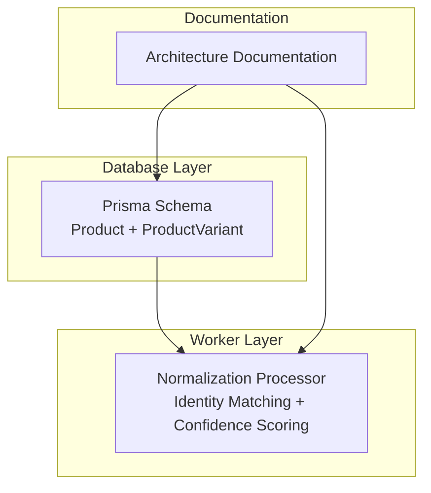
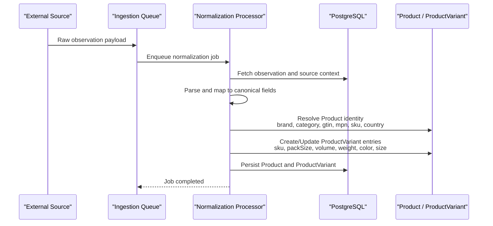
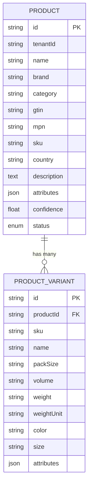
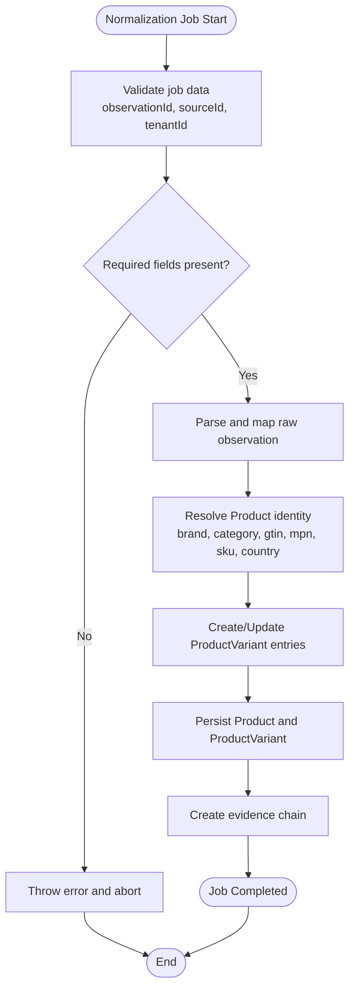
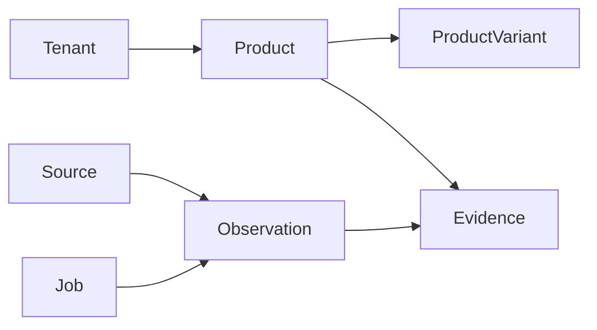

# Product Identity & Variants

<cite>
**Referenced Files in This Document**
- [schema.prisma](file://packages/database/prisma/schema.prisma)
- [normalization.ts](file://apps/worker/src/processors/normalization.ts)
- [ARCHITECTURE.md](file://docs/ARCHITECTURE.md)
</cite>

## Table of Contents
1. [Introduction](#introduction)
2. [Project Structure](#project-structure)
3. [Core Components](#core-components)
4. [Architecture Overview](#architecture-overview)
5. [Detailed Component Analysis](#detailed-component-analysis)
6. [Dependency Analysis](#dependency-analysis)
7. [Performance Considerations](#performance-considerations)
8. [Troubleshooting Guide](#troubleshooting-guide)
9. [Conclusion](#conclusion)

## Introduction
This document explains the product identity management models used by the platform, focusing on how products are identified, resolved, and differentiated through variants. It covers:

- The Product model for canonical product identity, including brand, category, GTIN/UPC/EAN codes, MPN, SKU, country of origin, confidence scoring, and lifecycle state.
- The ProductVariant model for managing different SKUs, pack sizes, volumes, weights, colors, and sizes within a product family.
- The relationship between Products and Variants.
- Indexing strategies for efficient lookups by brand, GTIN, and SKU.
- The confidence scoring system and product lifecycle states (active, merged, deprecated).
- How normalization and entity resolution fit into the broader pipeline.

## Project Structure
The product identity models are defined in the Prisma schema and are part of the database package. The worker’s normalization processor documents where product identity matching and confidence scoring will be implemented.

**Diagram sources**
- [schema.prisma:137-184](file://packages/database/prisma/schema.prisma#L137-L184)
- [normalization.ts:4-14](file://apps/worker/src/processors/normalization.ts#L4-L14)
- [ARCHITECTURE.md:68-92](file://docs/ARCHITECTURE.md#L68-L92)

**Section sources**
- [schema.prisma:137-184](file://packages/database/prisma/schema.prisma#L137-L184)
- [normalization.ts:4-14](file://apps/worker/src/processors/normalization.ts#L4-L14)
- [ARCHITECTURE.md:68-92](file://docs/ARCHITECTURE.md#L68-L92)

## Core Components
This section summarizes the two core data models that represent product identity and its variants.

### Product Model
The Product model represents a resolved product entity with canonical identity attributes and evidence linkage.

Key attributes:
- Identifier and tenant isolation: id, tenantId
- Canonical identity fields: name, brand, category, gtin, mpn, sku, country
- Descriptive and extensible data: description, attributes
- Resolution quality: confidence (0.0–1.0)
- Lifecycle state: status (active | merged | deprecated)
- Relationships: variants, evidence

Indexing strategy:
- Tenant-scoped queries via tenantId index
- Brand lookup optimization via brand index
- Global trade identifier lookup via gtin index

Lifecycle states:
- active: currently valid and discoverable
- merged: superseded or consolidated into another product
- deprecated: no longer maintained or available

Confidence scoring:
- A float from 0.0 to 1.0 representing the certainty of product resolution based on normalized inputs and evidence.

**Section sources**
- [schema.prisma:137-162](file://packages/database/prisma/schema.prisma#L137-L162)
- [ARCHITECTURE.md:87-92](file://docs/ARCHITECTURE.md#L87-L92)

### ProductVariant Model
The ProductVariant model captures variant-level details within a product family.

Key attributes:
- Parent relationship: productId linking to Product
- Variant identifiers and descriptors: sku, name
- Physical and packaging characteristics: packSize, volume, weight, weightUnit
- Appearance and sizing: color, size
- Extensibility: attributes (JSON)
- Timestamps: createdAt, updatedAt

Indexing strategy:
- Fast retrieval by parent product via productId index
- Direct SKU lookup via sku index

Use cases:
- Differentiating pack sizes (e.g., single vs multipack)
- Distinguishing volumes and weights (e.g., 500ml vs 1L; 200g vs 500g)
- Capturing color and size variations (e.g., red/blue, S/M/L/XL)

**Section sources**
- [schema.prisma:164-184](file://packages/database/prisma/schema.prisma#L164-L184)

## Architecture Overview
Product identity is established during normalization, where raw observations are transformed into canonical entities. The Product and ProductVariant models provide the stable schema for resolved identities and their variants.

**Diagram sources**
- [normalization.ts:4-14](file://apps/worker/src/processors/normalization.ts#L4-L14)
- [normalization.ts:15-57](file://apps/worker/src/processors/normalization.ts#L15-L57)
- [schema.prisma:137-184](file://packages/database/prisma/schema.prisma#L137-L184)

## Detailed Component Analysis

### Product Identity Attributes
The Product model centralizes canonical identity information required for accurate product resolution across sources.

- Brand: Identifies the manufacturer or brand owner.
- Category: Classifies the product domain or taxonomy.
- GTIN/UPC/EAN: Standardized global trade identifiers for unique product identification.
- MPN: Manufacturer Part Number for internal manufacturer identification.
- SKU: Internal stock keeping unit for inventory and sales tracking.
- Country: Country of origin for regulatory and sourcing purposes.
- Description and attributes: Free-form and structured metadata to enrich product records.
- Confidence: Numeric score indicating resolution reliability.
- Status: Lifecycle state controlling visibility and usage.

These fields support robust deduplication and matching across heterogeneous sources.

**Section sources**
- [schema.prisma:137-162](file://packages/database/prisma/schema.prisma#L137-L162)
- [ARCHITECTURE.md:87-92](file://docs/ARCHITECTURE.md#L87-L92)

### ProductVariant Attributes
The ProductVariant model provides granular differentiation within a product family.

- SKU: Variant-specific stock keeping unit.
- Name: Human-readable variant title.
- Pack Size: Packaging configuration (e.g., count per pack).
- Volume: Liquid or volumetric measurement.
- Weight and Weight Unit: Mass and unit (g, kg, oz, lb).
- Color: Visual appearance attribute.
- Size: Dimensional or sizing attribute.
- Attributes: JSON field for additional variant-specific properties.

This structure enables precise inventory and search capabilities at the variant level while maintaining a shared product identity.

**Section sources**
- [schema.prisma:164-184](file://packages/database/prisma/schema.prisma#L164-L184)

### Relationship Between Products and Variants
A Product can have multiple ProductVariants, allowing one canonical product to represent many sellable or shippable forms.

**Diagram sources**
- [schema.prisma:137-184](file://packages/database/prisma/schema.prisma#L137-L184)

### Indexing Strategy for Lookups
Indexes are defined to optimize common query patterns:

- Brand lookup: Indexed on Product.brand to accelerate filtering by brand.
- GTIN lookup: Indexed on Product.gtin to enable fast global trade identifier resolution.
- SKU lookup: Indexed on ProductVariant.sku to quickly resolve variant-level SKUs.
- Tenant scoping: Indexed on Product.tenantId to ensure multi-tenant isolation and performance.

These indexes support high-throughput ingestion and querying workflows.

**Section sources**
- [schema.prisma:158-161](file://packages/database/prisma/schema.prisma#L158-L161)
- [schema.prisma:181-182](file://packages/database/prisma/schema.prisma#L181-L182)

### Confidence Scoring System
Confidence is represented as a floating-point value between 0.0 and 1.0 on the Product model. It reflects the reliability of product resolution derived from normalized inputs and supporting evidence.

Guidelines:
- Higher confidence indicates stronger agreement across sources and identifiers (e.g., matching GTIN, MPN, brand, and SKU).
- Lower confidence suggests ambiguity or conflicting signals requiring manual review or further evidence collection.
- Confidence should be updated during normalization when new evidence becomes available.

This approach ensures transparent decision-making and supports downstream analytics and risk assessment.

**Section sources**
- [schema.prisma:149-150](file://packages/database/prisma/schema.prisma#L149-L150)
- [ARCHITECTURE.md:87-92](file://docs/ARCHITECTURE.md#L87-L92)

### Product Lifecycle States
Products transition through lifecycle states to reflect their operational status:

- active: The product is current, valid, and usable.
- merged: The product has been consolidated into another product record.
- deprecated: The product is no longer maintained or available.

State transitions should be governed by business rules during normalization or manual curation, ensuring consistent product graph integrity.

**Section sources**
- [schema.prisma:150-151](file://packages/database/prisma/schema.prisma#L150-L151)

### Normalization and Entity Resolution Flow
The normalization processor is responsible for transforming raw observations into canonical product identities and variants. While the implementation is a placeholder for Phase 2, the intended flow includes:

1. Fetch raw observation and source context.
2. Apply source-specific parsing and mapping.
3. Run entity resolution against Product identity fields.
4. Create or update Product and ProductVariant records.
5. Generate evidence records linking conclusions to sources.
6. Update observation processing status.

**Diagram sources**
- [normalization.ts:15-57](file://apps/worker/src/processors/normalization.ts#L15-L57)
- [schema.prisma:137-184](file://packages/database/prisma/schema.prisma#L137-L184)

**Section sources**
- [normalization.ts:4-14](file://apps/worker/src/processors/normalization.ts#L4-L14)
- [normalization.ts:15-57](file://apps/worker/src/processors/normalization.ts#L15-L57)

## Dependency Analysis
The product identity models depend on the broader data pipeline and multi-tenancy framework.

- Multi-tenancy: All entities include tenantId for isolation.
- Observations and evidence: Provide provenance for product decisions.
- Jobs: Track asynchronous processing of ingestion and normalization tasks.

**Diagram sources**
- [schema.prisma:24-41](file://packages/database/prisma/schema.prisma#L24-L41)
- [schema.prisma:108-131](file://packages/database/prisma/schema.prisma#L108-L131)
- [schema.prisma:137-184](file://packages/database/prisma/schema.prisma#L137-L184)
- [schema.prisma:190-214](file://packages/database/prisma/schema.prisma#L190-L214)
- [schema.prisma:220-244](file://packages/database/prisma/schema.prisma#L220-L244)

**Section sources**
- [schema.prisma:24-41](file://packages/database/prisma/schema.prisma#L24-L41)
- [schema.prisma:108-131](file://packages/database/prisma/schema.prisma#L108-L131)
- [schema.prisma:137-184](file://packages/database/prisma/schema.prisma#L137-L184)
- [schema.prisma:190-214](file://packages/database/prisma/schema.prisma#L190-L214)
- [schema.prisma:220-244](file://packages/database/prisma/schema.prisma#L220-L244)

## Performance Considerations
- Use indexed fields for frequent filters: brand, gtin, and variant sku.
- Keep Product.attributes and ProductVariant.attributes lean; prefer structured fields for frequently queried dimensions.
- Normalize and validate input early in the normalization pipeline to reduce redundant writes.
- Batch updates for large ingestion jobs to minimize transaction overhead.
- Monitor confidence thresholds to prioritize high-certainty matches and flag low-confidence cases for review.

[No sources needed since this section provides general guidance]

## Troubleshooting Guide
Common issues and resolutions related to product identity and variants:

- Missing required normalization fields:
  - Ensure observationId, sourceId, and tenantId are provided before processing.
  - If missing, the normalization job will fail and must be retried with correct payload.

- Duplicate or ambiguous product matches:
  - Review confidence scores and evidence chains to determine whether merging or deprecation is appropriate.
  - Adjust matching rules to improve brand, GTIN, MPN, and SKU alignment.

- Slow SKU or brand lookups:
  - Verify that indexes exist on Product.brand, Product.gtin, and ProductVariant.sku.
  - Confirm queries filter by tenantId to leverage tenant-scoped indexes.

- Variant inconsistencies:
  - Validate that variant attributes (packSize, volume, weight, color, size) are consistently formatted.
  - Use attributes JSON sparingly for non-indexed, optional metadata.

**Section sources**
- [normalization.ts:30-34](file://apps/worker/src/processors/normalization.ts#L30-L34)
- [schema.prisma:158-161](file://packages/database/prisma/schema.prisma#L158-L161)
- [schema.prisma:181-182](file://packages/database/prisma/schema.prisma#L181-L182)

## Conclusion
The Product and ProductVariant models provide a robust foundation for product identity management. By standardizing canonical identity fields, indexing key lookup paths, and incorporating confidence scoring and lifecycle states, the platform can reliably resolve, differentiate, and maintain product records across diverse sources. The normalization pipeline will implement entity resolution and evidence creation to ensure traceability and accuracy.

[No sources needed since this section summarizes without analyzing specific files]