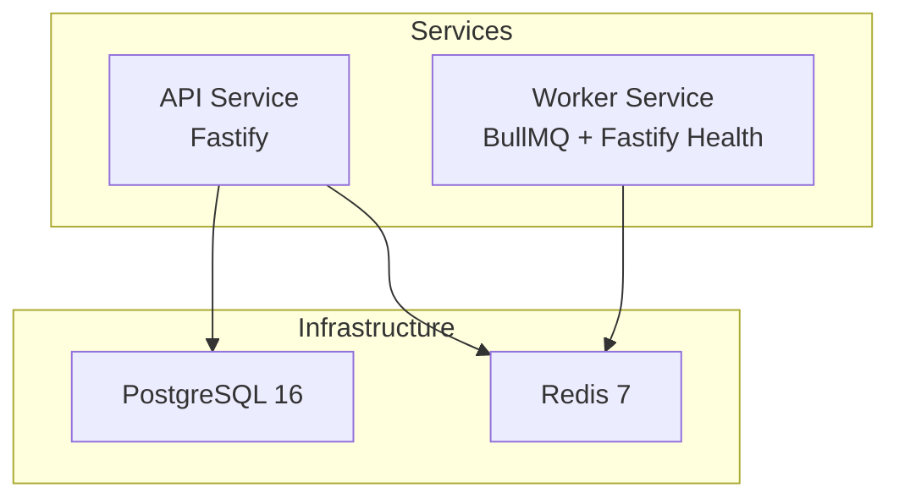
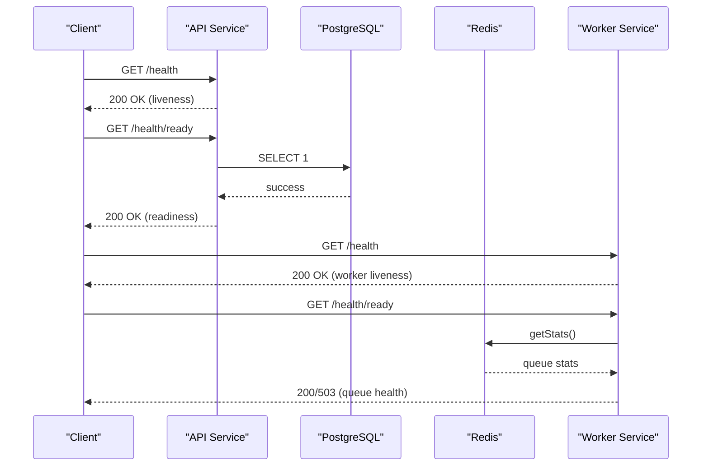
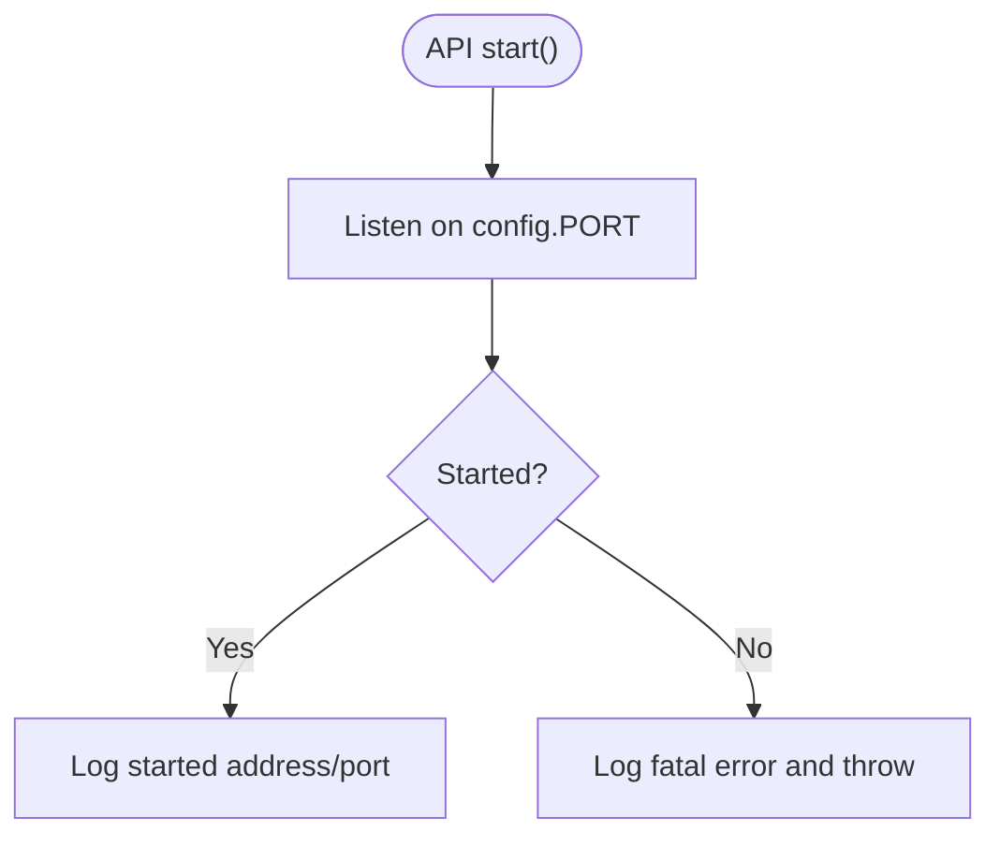
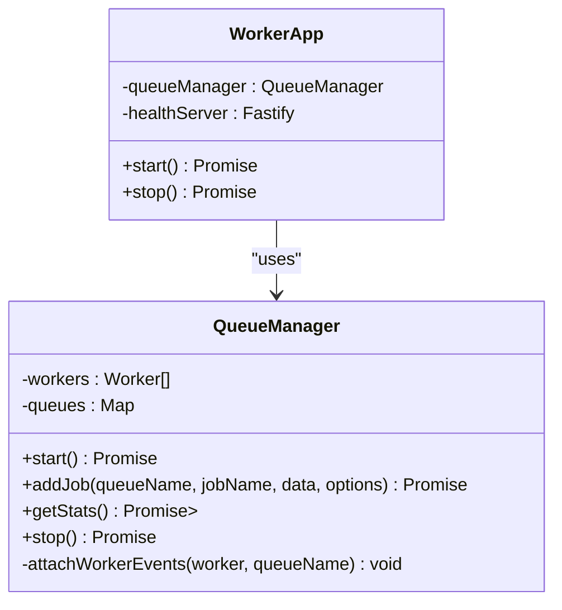
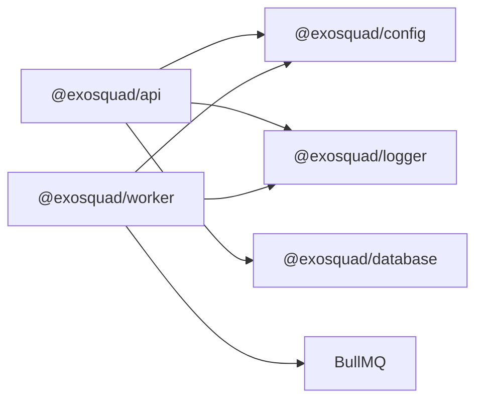

# Deployment & Operations

<cite>
**Referenced Files in This Document**
- [docker-compose.yml](file://docker-compose.yml)
- [package.json](file://package.json)
- [apps/api/src/app.ts](file://apps/api/src/app.ts)
- [apps/api/src/routes/health.ts](file://apps/api/src/routes/health.ts)
- [apps/worker/src/app.ts](file://apps/worker/src/app.ts)
- [apps/worker/src/queues/queue-manager.ts](file://apps/worker/src/queues/queue-manager.ts)
- [packages/config/src/index.ts](file://packages/config/src/index.ts)
- [packages/database/package.json](file://packages/database/package.json)
- [packages/database/prisma/migrations/migration_lock.toml](file://packages/database/prisma/migrations/migration_lock.toml)
- [docs/ARCHITECTURE.md](file://docs/ARCHITECTURE.md)
</cite>

## Table of Contents
1. [Introduction](#introduction)
2. [Project Structure](#project-structure)
3. [Core Components](#core-components)
4. [Architecture Overview](#architecture-overview)
5. [Detailed Component Analysis](#detailed-component-analysis)
6. [Dependency Analysis](#dependency-analysis)
7. [Performance Considerations](#performance-considerations)
8. [Troubleshooting Guide](#troubleshooting-guide)
9. [Conclusion](#conclusion)
10. [Appendices](#appendices)

## Introduction
This document provides comprehensive deployment and operations guidance for Exosquad, covering containerization with Docker, service orchestration via Docker Compose, environment configuration, secrets management, scaling strategies, monitoring, logging, health checks, alerting, database migrations, backups, disaster recovery, performance tuning, and operational runbooks. It is intended for platform engineers, DevOps practitioners, and operators deploying Exosquad in production environments.

## Project Structure
Exosquad is a monorepo with:
- API service (Fastify-based HTTP server)
- Worker service (BullMQ job processing with a minimal health endpoint)
- Shared packages for configuration, database access, common types, and logging
- Local development infrastructure defined with Docker Compose

**Diagram sources**
- [docker-compose.yml:8-39](file://docker-compose.yml#L8-L39)
- [apps/api/src/app.ts:12-37](file://apps/api/src/app.ts#L12-L37)
- [apps/worker/src/app.ts:10-48](file://apps/worker/src/app.ts#L10-L48)

**Section sources**
- [docker-compose.yml:1-44](file://docker-compose.yml#L1-L44)
- [package.json:1-33](file://package.json#L1-L33)

## Core Components
- API Service: Fastify application exposing health endpoints and authentication routes; integrates request tracking, rate limiting, security headers, and structured logging.
- Worker Service: BullMQ-based background processor with dedicated queues for ingestion and normalization; exposes a separate health endpoint on port PORT+1.
- Configuration: Centralized environment validation using Zod to enforce required variables at startup.
- Database: Prisma client used by the API for readiness checks; migrations managed via Prisma CLI scripts.
- Infrastructure: PostgreSQL and Redis containers orchestrated via Docker Compose for local development.

Key responsibilities:
- API: HTTP routing, plugin registration, error handling, health probes.
- Worker: Queue lifecycle, worker concurrency, job metrics, graceful shutdown.
- Config: Strongly typed, validated environment variables.
- DB: Migration tooling and client initialization.

**Section sources**
- [apps/api/src/app.ts:12-89](file://apps/api/src/app.ts#L12-L89)
- [apps/worker/src/app.ts:10-59](file://apps/worker/src/app.ts#L10-L59)
- [packages/config/src/index.ts:10-56](file://packages/config/src/index.ts#L10-L56)
- [packages/database/package.json:7-15](file://packages/database/package.json#L7-L15)

## Architecture Overview
The system consists of two Node.js services communicating with PostgreSQL and Redis:
- The API serves HTTP requests and performs readiness checks against the database.
- The Worker processes jobs from Redis-backed queues and reports queue health.

**Diagram sources**
- [apps/api/src/routes/health.ts:9-47](file://apps/api/src/routes/health.ts#L9-L47)
- [apps/worker/src/app.ts:20-38](file://apps/worker/src/app.ts#L20-L38)
- [apps/worker/src/queues/queue-manager.ts:103-125](file://apps/worker/src/queues/queue-manager.ts#L103-L125)

## Detailed Component Analysis

### API Service
- Initializes Fastify with custom logger, request timeout, and proxy trust settings.
- Registers plugins for request tracking, authentication, rate limiting, and security headers.
- Mounts health routes under /health and auth routes under /api/v1/auth.
- Implements centralized error handling that differentiates validation errors, known AppError instances, and unknown errors.

Operational notes:
- Liveness probe returns 200 when process is alive.
- Readiness probe validates database connectivity and returns degraded status if dependencies are unhealthy.

**Diagram sources**
- [apps/api/src/app.ts:73-84](file://apps/api/src/app.ts#L73-L84)

**Section sources**
- [apps/api/src/app.ts:12-89](file://apps/api/src/app.ts#L12-L89)
- [apps/api/src/routes/health.ts:9-47](file://apps/api/src/routes/health.ts#L9-L47)

### Worker Service
- Manages BullMQ queues and workers for ingestion and normalization.
- Exposes a minimal Fastify server for health checks on port PORT+1.
- Provides /health for liveness and /health/ready for queue health based on queue statistics.

Scaling considerations:
- Concurrency controlled by WORKER_CONCURRENCY.
- Ingestion queue includes a limiter to cap throughput.

**Diagram sources**
- [apps/worker/src/queues/queue-manager.ts:19-165](file://apps/worker/src/queues/queue-manager.ts#L19-L165)
- [apps/worker/src/app.ts:10-59](file://apps/worker/src/app.ts#L10-L59)

**Section sources**
- [apps/worker/src/app.ts:10-59](file://apps/worker/src/app.ts#L10-L59)
- [apps/worker/src/queues/queue-manager.ts:1-166](file://apps/worker/src/queues/queue-manager.ts#L1-L166)

### Configuration and Secrets
- Environment variables are validated at startup using Zod; missing or invalid values cause the process to fail fast.
- Required variables include DATABASE_URL, JWT_SECRET, and optional Redis credentials.
- Recommended secrets management:
  - Use Kubernetes Secrets, AWS Secrets Manager, HashiCorp Vault, or similar to inject secrets into containers.
  - Avoid committing secrets; use .env files only for local development.

Environment variables reference:
- DATABASE_URL: Database connection string (required).
- REDIS_HOST, REDIS_PORT, REDIS_PASSWORD: Redis connection parameters.
- NODE_ENV: Application environment.
- PORT: API listening port.
- LOG_LEVEL: Logging verbosity.
- JWT_SECRET: Secret for signing tokens (minimum length enforced).
- JWT_EXPIRES_IN: Token expiration duration.
- WORKER_CONCURRENCY: Number of concurrent jobs per worker.

**Section sources**
- [packages/config/src/index.ts:10-56](file://packages/config/src/index.ts#L10-L56)

### Database Migrations
- Prisma is used for schema management and migrations.
- Scripts available:
  - Generate client: pnpm db:generate
  - Deploy migrations: pnpm db:migrate
  - Development migrations: pnpm db:migrate:dev
  - Status check: prisma migrate status
- Migration lock file indicates PostgreSQL provider.

Operational runbook:
- Before deploy: ensure DATABASE_URL points to target database.
- Run migrations in CI/CD before starting services.
- Rollback strategy: maintain migration history and test rollback procedures in staging.

**Section sources**
- [packages/database/package.json:7-15](file://packages/database/package.json#L7-L15)
- [packages/database/prisma/migrations/migration_lock.toml:1-3](file://packages/database/prisma/migrations/migration_lock.toml#L1-L3)
- [package.json:18-21](file://package.json#L18-L21)

### Monitoring, Logging, and Health Checks
- Structured JSON logs via Pino for aggregation in production.
- Request tracking assigns unique requestId and attaches child loggers for traceability.
- Health endpoints:
  - API: GET /health (liveness), GET /health/ready (readiness with DB check).
  - Worker: GET /health (liveness), GET /health/ready (queue health).

Alerting strategies:
- Alert on non-200 responses from /health/ready endpoints.
- Monitor queue backlogs and failure rates exposed by worker health.
- Track error rates and latency from API logs.

**Section sources**
- [docs/ARCHITECTURE.md:173-194](file://docs/ARCHITECTURE.md#L173-L194)
- [apps/api/src/plugins/request-tracker.ts:1-42](file://apps/api/src/plugins/request-tracker.ts#L1-L42)
- [apps/api/src/routes/health.ts:9-47](file://apps/api/src/routes/health.ts#L9-L47)
- [apps/worker/src/app.ts:20-38](file://apps/worker/src/app.ts#L20-L38)

## Dependency Analysis
External dependencies and integration points:
- API depends on:
  - @exosquad/config for environment validation.
  - @exosquad/logger for structured logging.
  - @exosquad/database for Prisma client usage in readiness checks.
- Worker depends on:
  - BullMQ for queue management.
  - @exosquad/config and @exosquad/logger.

**Diagram sources**
- [apps/api/src/app.ts:1-10](file://apps/api/src/app.ts#L1-L10)
- [apps/worker/src/app.ts:1-5](file://apps/worker/src/app.ts#L1-L5)
- [apps/worker/src/queues/queue-manager.ts:1-5](file://apps/worker/src/queues/queue-manager.ts#L1-L5)

**Section sources**
- [apps/api/src/app.ts:1-10](file://apps/api/src/app.ts#L1-L10)
- [apps/worker/src/app.ts:1-5](file://apps/worker/src/app.ts#L1-L5)
- [apps/worker/src/queues/queue-manager.ts:1-5](file://apps/worker/src/queues/queue-manager.ts#L1-L5)

## Performance Considerations
- API:
  - Tune requestTimeout and concurrency limits via reverse proxy (e.g., Nginx/Traefik).
  - Enable compression and keep-alive at the edge.
  - Use rate limiting and security headers already integrated.
- Worker:
  - Adjust WORKER_CONCURRENCY based on CPU/memory capacity and queue load.
  - Monitor queue latency and failure rates; scale horizontally by running multiple worker replicas.
- Database:
  - Ensure connection pooling is configured appropriately for Prisma.
  - Index frequently queried fields and monitor slow queries.
- Redis:
  - Configure memory limits and persistence policies suitable for workload.
  - Monitor memory usage and eviction policies.

[No sources needed since this section provides general guidance]

## Troubleshooting Guide
Common issues and resolutions:
- Startup failures due to invalid environment:
  - Validate all required variables are present and correctly formatted.
  - Check logs for environment validation errors.
- Database connectivity issues:
  - Verify DATABASE_URL and network reachability.
  - Use /health/ready to confirm dependency health.
- Redis connectivity issues:
  - Confirm REDIS_HOST, REDIS_PORT, and REDIS_PASSWORD.
  - Check worker /health/ready for queue status.
- High error rates:
  - Inspect structured logs for stack traces and context (requestId).
  - Review rate limiting and authentication plugin behavior.

Operational tips:
- Use container healthchecks provided in docker-compose.yml for Postgres and Redis.
- Implement external monitoring for service health endpoints.

**Section sources**
- [packages/config/src/index.ts:42-56](file://packages/config/src/index.ts#L42-L56)
- [apps/api/src/routes/health.ts:19-47](file://apps/api/src/routes/health.ts#L19-L47)
- [apps/worker/src/app.ts:26-38](file://apps/worker/src/app.ts#L26-L38)
- [docker-compose.yml:20-39](file://docker-compose.yml#L20-L39)

## Conclusion
Exosquad’s deployment model centers on a Fastify API and a BullMQ-backed Worker, both orchestrated with Docker Compose for local development. Production deployments should leverage robust secrets management, structured logging, and comprehensive health checks. Scaling is achieved by tuning worker concurrency and horizontally replicating services behind a reverse proxy. Database migrations are managed via Prisma, and operational runbooks should cover backup, disaster recovery, and alerting strategies.

[No sources needed since this section summarizes without analyzing specific files]

## Appendices

### A. Docker Compose Usage
- Start services: docker compose up -d
- Stop services: docker compose down
- Reset volumes: docker compose down -v

Volumes:
- postgres_data: Persistent PostgreSQL data.
- redis_data: Persistent Redis data.

Healthchecks:
- Postgres: pg_isready
- Redis: redis-cli ping

**Section sources**
- [docker-compose.yml:1-44](file://docker-compose.yml#L1-L44)

### B. Environment Variables Reference
- DATABASE_URL: Required; valid URL format.
- REDIS_HOST: Default localhost.
- REDIS_PORT: Default 6379.
- REDIS_PASSWORD: Optional.
- NODE_ENV: development | production | test.
- PORT: Default 3000.
- LOG_LEVEL: fatal | error | warn | info | debug | trace.
- JWT_SECRET: Minimum 32 characters.
- JWT_EXPIRES_IN: Duration string (e.g., 24h).
- WORKER_CONCURRENCY: Positive integer; default 5.

**Section sources**
- [packages/config/src/index.ts:10-34](file://packages/config/src/index.ts#L10-L34)

### C. Operational Runbooks

#### C.1 Deploying Services
- Build artifacts using the monorepo build script.
- Set environment variables in your platform’s secret store.
- Deploy API and Worker services with appropriate resource limits.
- Ensure reverse proxy routes /health and /health/ready for both services.

**Section sources**
- [package.json:10-21](file://package.json#L10-L21)
- [apps/api/src/app.ts:73-84](file://apps/api/src/app.ts#L73-L84)
- [apps/worker/src/app.ts:41-52](file://apps/worker/src/app.ts#L41-L52)

#### C.2 Database Migrations
- Run migrations in CI/CD before service rollout.
- Verify migration status post-deploy.
- Maintain rollback plans and test in staging.

**Section sources**
- [packages/database/package.json:7-15](file://packages/database/package.json#L7-L15)
- [package.json:18-21](file://package.json#L18-L21)

#### C.3 Backups and Disaster Recovery
- Schedule regular PostgreSQL logical backups (e.g., pg_dump) and object storage replication.
- Backup Redis persistence files if enabled.
- Define RPO/RTO targets and test restoration procedures.
- Validate data integrity after restore using health checks and sample queries.

[No sources needed since this section provides general guidance]

#### C.4 Monitoring and Alerting
- Collect structured logs from API and Worker.
- Monitor /health and /health/ready endpoints for liveness and readiness.
- Alert on:
  - Non-200 responses from readiness endpoints.
  - Elevated error rates and latency.
  - Queue backlog growth and failure spikes.

**Section sources**
- [docs/ARCHITECTURE.md:173-194](file://docs/ARCHITECTURE.md#L173-L194)
- [apps/api/src/routes/health.ts:9-47](file://apps/api/src/routes/health.ts#L9-L47)
- [apps/worker/src/app.ts:20-38](file://apps/worker/src/app.ts#L20-L38)

#### C.5 Scaling Strategies
- Horizontal scaling:
  - Replicate API pods/services behind a load balancer.
  - Scale Worker replicas based on queue depth and latency.
- Vertical scaling:
  - Increase CPU/memory for API and Worker containers.
  - Tune WORKER_CONCURRENCY to match resources.

[No sources needed since this section provides general guidance]