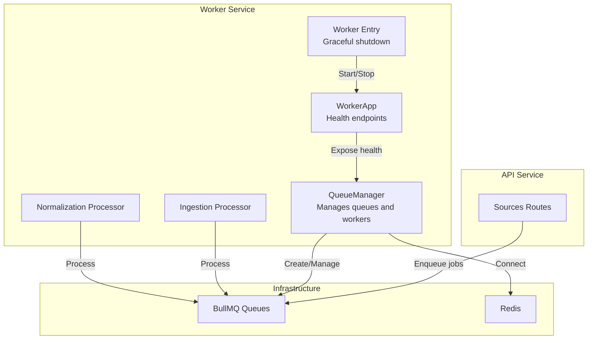
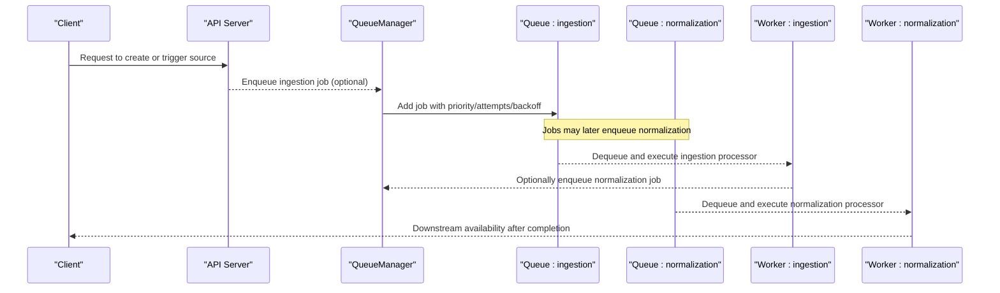
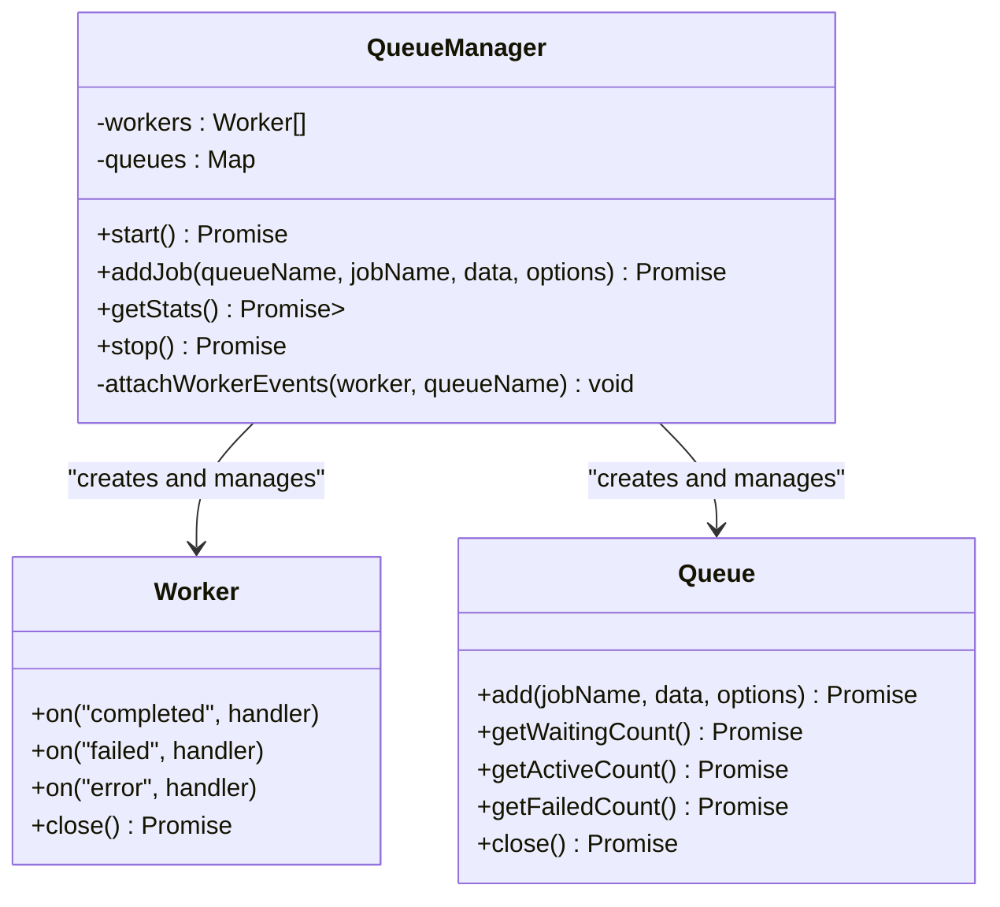
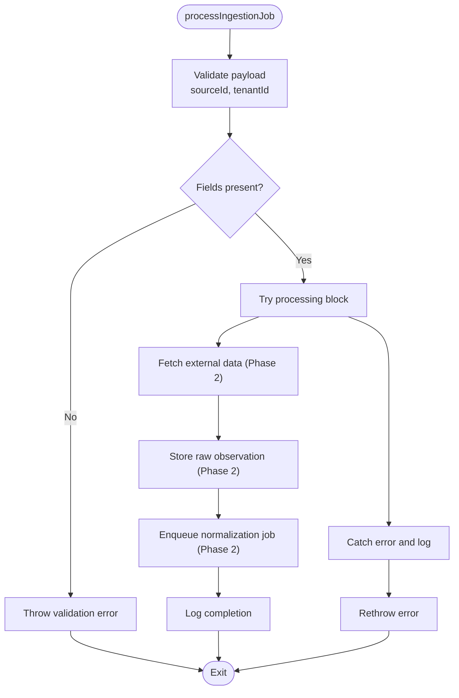
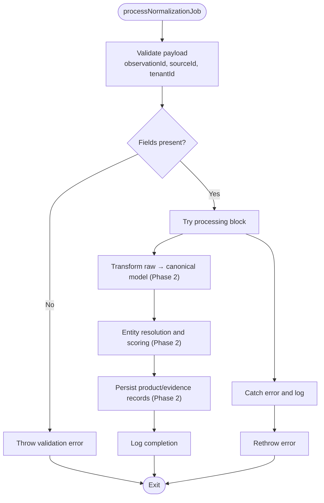
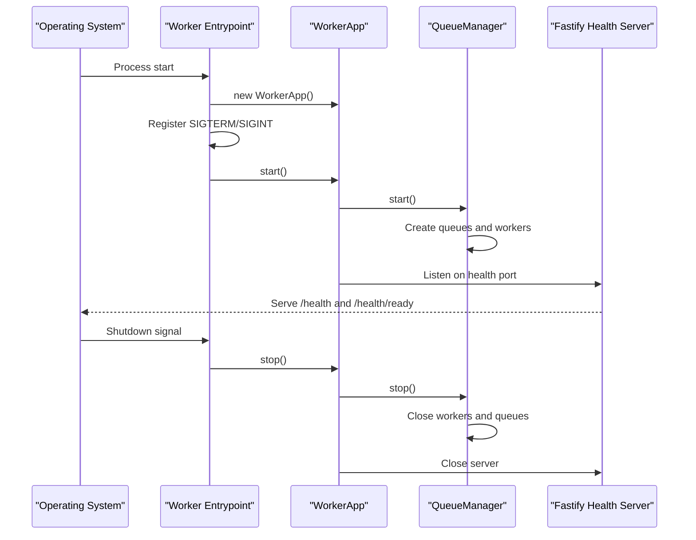
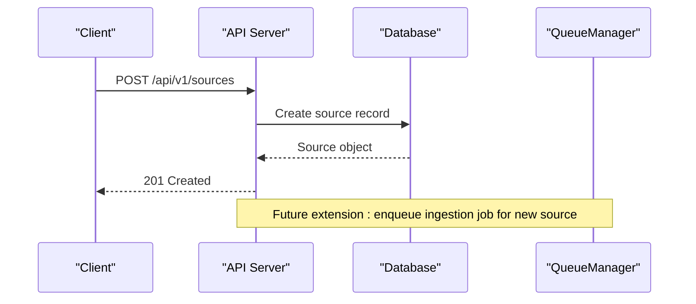
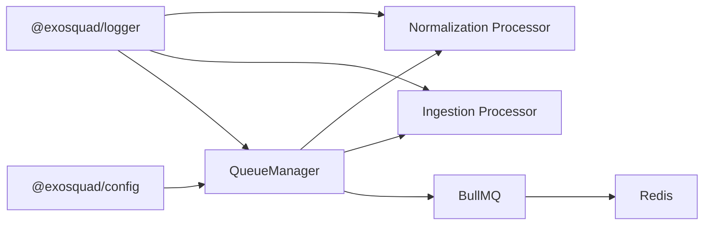

# Job Processing System

<cite>
**Referenced Files in This Document**
- [queue-manager.ts](file://apps/worker/src/queues/queue-manager.ts)
- [ingestion.ts](file://apps/worker/src/processors/ingestion.ts)
- [normalization.ts](file://apps/worker/src/processors/normalization.ts)
- [app.ts](file://apps/worker/src/app.ts)
- [index.ts](file://apps/worker/src/index.ts)
- [sources.ts](file://apps/api/src/routes/sources.ts)
- [ARCHITECTURE.md](file://docs/ARCHITECTURE.md)
</cite>

## Table of Contents
1. [Introduction](#introduction)
2. [Project Structure](#project-structure)
3. [Core Components](#core-components)
4. [Architecture Overview](#architecture-overview)
5. [Detailed Component Analysis](#detailed-component-analysis)
6. [Dependency Analysis](#dependency-analysis)
7. [Performance Considerations](#performance-considerations)
8. [Troubleshooting Guide](#troubleshooting-guide)
9. [Conclusion](#conclusion)

## Introduction
This document explains the asynchronous job processing system built on BullMQ within the EXOSQUAD platform. It covers the queue architecture, job lifecycle management, worker process coordination, ingestion and normalization processors, configuration options, retry mechanisms, error handling, monitoring, scaling strategies, performance optimization, prioritization, and failure recovery patterns. The system is designed as a multi-stage pipeline where external data is ingested, stored as raw observations, and then normalized into a canonical model for downstream analysis.

The worker service runs independently from the API server, enabling separate scaling and resilience characteristics. Health endpoints expose liveness and readiness information to orchestration systems.

## Project Structure
The job processing system lives primarily under the worker application, with supporting routes in the API application and architectural guidance in the documentation.

**Diagram sources**
- [queue-manager.ts:1-166](file://apps/worker/src/queues/queue-manager.ts#L1-L166)
- [ingestion.ts:1-55](file://apps/worker/src/processors/ingestion.ts#L1-L55)
- [normalization.ts:1-58](file://apps/worker/src/processors/normalization.ts#L1-L58)
- [app.ts:1-61](file://apps/worker/src/app.ts#L1-L61)
- [index.ts:1-23](file://apps/worker/src/index.ts#L1-L23)
- [sources.ts:1-118](file://apps/api/src/routes/sources.ts#L1-L118)

**Section sources**
- [queue-manager.ts:1-166](file://apps/worker/src/queues/queue-manager.ts#L1-L166)
- [app.ts:1-61](file://apps/worker/src/app.ts#L1-L61)
- [index.ts:1-23](file://apps/worker/src/index.ts#L1-L23)
- [sources.ts:1-118](file://apps/api/src/routes/sources.ts#L1-L118)
- [ARCHITECTURE.md:95-110](file://docs/ARCHITECTURE.md#L95-L110)

## Core Components
- QueueManager: Central coordinator that creates BullMQ queues, starts dedicated workers per queue, attaches event listeners, exposes addJob for enqueuing, provides stats for health checks, and manages graceful shutdown.
- Ingestion processor: Validates job payloads, logs structured context, and serves as the foundation for fetching external data and storing raw observations.
- Normalization processor: Validates job payloads, logs structured context, and prepares the transformation pipeline to map raw observations into the canonical EXOSQUAD model.
- WorkerApp: Hosts the QueueManager and exposes minimal HTTP endpoints for liveness and readiness probes.
- Worker entrypoint: Initializes the WorkerApp, registers graceful shutdown handlers, and handles fatal startup errors.

Key responsibilities:
- QueueManager owns queue lifecycle, worker concurrency, rate limiting, retries, backoff, and cleanup policies.
- Processors focus on validation, logging, and future integration points for data fetching and normalization logic.
- WorkerApp ensures the worker process is observable and can be scaled independently.

**Section sources**
- [queue-manager.ts:1-166](file://apps/worker/src/queues/queue-manager.ts#L1-L166)
- [ingestion.ts:1-55](file://apps/worker/src/processors/ingestion.ts#L1-L55)
- [normalization.ts:1-58](file://apps/worker/src/processors/normalization.ts#L1-L58)
- [app.ts:1-61](file://apps/worker/src/app.ts#L1-L61)
- [index.ts:1-23](file://apps/worker/src/index.ts#L1-L23)

## Architecture Overview
The system uses two primary queues:
- ingestion: Responsible for pulling data from external sources and persisting raw observations.
- normalization: Responsible for transforming raw observations into the canonical model.

Workers are created per queue with configurable concurrency. The ingestion worker includes a rate limiter to cap throughput. Jobs include default retry and backoff behavior, along with retention settings for completed and failed jobs.

**Diagram sources**
- [queue-manager.ts:23-59](file://apps/worker/src/queues/queue-manager.ts#L23-L59)
- [queue-manager.ts:65-98](file://apps/worker/src/queues/queue-manager.ts#L65-L98)
- [ingestion.ts:11-53](file://apps/worker/src/processors/ingestion.ts#L11-L53)
- [normalization.ts:15-56](file://apps/worker/src/processors/normalization.ts#L15-L56)

## Detailed Component Analysis

### Queue Manager
The QueueManager encapsulates all BullMQ interactions:
- Connection configuration shared across queues and workers.
- Starts dedicated queues and workers for ingestion and normalization.
- Attaches worker events for completion, failure, and error logging.
- Provides addJob with support for priority, attempts, backoff, delay, idempotency via jobId, and retention policies.
- Exposes getStats for readiness checks by aggregating waiting, active, and failed counts.
- Implements stop to close workers and queues gracefully.

**Diagram sources**
- [queue-manager.ts:19-165](file://apps/worker/src/queues/queue-manager.ts#L19-L165)

Key behaviors:
- Concurrency: Controlled via config.WORKER_CONCURRENCY for both queues.
- Rate limiting: Applied to the ingestion worker to cap throughput at 50 jobs per minute.
- Retention: Completed jobs retained up to 1000; failed jobs retained up to 5000.
- Defaults: Attempts default to 3; backoff defaults to exponential with 1-second base delay.

Operational notes:
- Health endpoint readiness depends on successful retrieval of queue statistics.
- Graceful shutdown closes workers first, then queues.

**Section sources**
- [queue-manager.ts:1-166](file://apps/worker/src/queues/queue-manager.ts#L1-L166)

### Ingestion Processor
Responsibilities:
- Validate required fields: sourceId and tenantId.
- Log structured context including jobId, jobName, queue, and payload.
- Placeholder for Phase 2 implementation: fetch data from external sources, store raw observations, and enqueue normalization jobs.

Error handling:
- Throws an error when required fields are missing.
- Wraps processing logic in try/catch and rethrows errors to trigger retries based on job options.

**Diagram sources**
- [ingestion.ts:11-53](file://apps/worker/src/processors/ingestion.ts#L11-L53)

**Section sources**
- [ingestion.ts:1-55](file://apps/worker/src/processors/ingestion.ts#L1-L55)

### Normalization Processor
Responsibilities:
- Validate required fields: observationId, sourceId, and tenantId.
- Log structured context including jobId, jobName, queue, and payload.
- Placeholder for Phase 2 implementation: transform raw observations into the canonical model, perform entity resolution, confidence scoring, and evidence chain creation.

Error handling:
- Throws an error when required fields are missing.
- Wraps processing logic in try/catch and rethrows errors to trigger retries based on job options.

**Diagram sources**
- [normalization.ts:15-56](file://apps/worker/src/processors/normalization.ts#L15-L56)

**Section sources**
- [normalization.ts:1-58](file://apps/worker/src/processors/normalization.ts#L1-L58)

### Worker Application and Entrypoint
WorkerApp:
- Creates QueueManager instance.
- Sets up Fastify health endpoints:
  - /health returns liveness status.
  - /health/ready aggregates queue stats and returns readiness status.
- Starts QueueManager and listens on a health port derived from the configured API port.

Entrypoint:
- Initializes WorkerApp.
- Registers SIGTERM and SIGINT handlers for graceful shutdown.
- Handles fatal startup errors and exits with non-zero status.

**Diagram sources**
- [index.ts:4-22](file://apps/worker/src/index.ts#L4-L22)
- [app.ts:10-59](file://apps/worker/src/app.ts#L10-L59)
- [queue-manager.ts:23-59](file://apps/worker/src/queues/queue-manager.ts#L23-L59)

**Section sources**
- [app.ts:1-61](file://apps/worker/src/app.ts#L1-L61)
- [index.ts:1-23](file://apps/worker/src/index.ts#L1-L23)

### API Integration Points
While the current sources route does not directly enqueue jobs, it demonstrates how authenticated API endpoints interact with the database and could be extended to enqueue ingestion jobs for newly created or scheduled sources.

**Diagram sources**
- [sources.ts:62-79](file://apps/api/src/routes/sources.ts#L62-L79)

**Section sources**
- [sources.ts:1-118](file://apps/api/src/routes/sources.ts#L1-L118)

## Dependency Analysis
The worker service depends on:
- BullMQ for queue and worker abstractions.
- Redis for persistence and coordination.
- Shared configuration for connection parameters and concurrency.
- Structured logger for observability.

**Diagram sources**
- [queue-manager.ts:1-12](file://apps/worker/src/queues/queue-manager.ts#L1-L12)
- [ingestion.ts:1-3](file://apps/worker/src/processors/ingestion.ts#L1-L3)
- [normalization.ts:1-3](file://apps/worker/src/processors/normalization.ts#L1-L3)

**Section sources**
- [queue-manager.ts:1-166](file://apps/worker/src/queues/queue-manager.ts#L1-L166)
- [ingestion.ts:1-55](file://apps/worker/src/processors/ingestion.ts#L1-L55)
- [normalization.ts:1-58](file://apps/worker/src/processors/normalization.ts#L1-L58)

## Performance Considerations
- Concurrency tuning: Adjust WORKER_CONCURRENCY to match CPU and I/O characteristics of ingestion and normalization workloads.
- Rate limiting: The ingestion worker is capped at 50 jobs per minute to protect external sources and reduce load spikes.
- Backoff strategy: Default exponential backoff helps mitigate transient failures without overwhelming dependencies.
- Retention policy: Limiting retained completed and failed jobs prevents unbounded growth in Redis memory usage.
- Idempotency: Use jobId to prevent duplicate processing when producers may retry enqueues.
- Prioritization: Set priority on high-value jobs to ensure they are processed ahead of lower-priority tasks.
- Scaling workers: Run multiple worker processes per queue to increase throughput; monitor queue metrics to determine optimal scale.

[No sources needed since this section provides general guidance]

## Troubleshooting Guide
Common issues and diagnostics:
- Missing required fields:
  - Ingestion: Ensure sourceId and tenantId are present in job.data.
  - Normalization: Ensure observationId, sourceId, and tenantId are present in job.data.
- Retry exhaustion:
  - Check attemptsMade in failed job logs.
  - Review backoff configuration and adjust if necessary.
- Queue health:
  - Inspect /health/ready to verify queue connectivity and status.
  - Monitor waiting, active, and failed counts to detect bottlenecks.
- Graceful shutdown:
  - Ensure SIGTERM/SIGINT handlers are registered so workers finish current jobs before exiting.

Recommended actions:
- Validate job payloads at the producer side to avoid repeated failures.
- Increase attempts or adjust backoff for flaky external dependencies.
- Scale workers horizontally to handle increased load.
- Implement dead-letter handling for jobs that consistently fail after max attempts.

**Section sources**
- [ingestion.ts:20-28](file://apps/worker/src/processors/ingestion.ts#L20-L28)
- [normalization.ts:24-34](file://apps/worker/src/processors/normalization.ts#L24-L34)
- [queue-manager.ts:141-163](file://apps/worker/src/queues/queue-manager.ts#L141-L163)
- [app.ts:26-38](file://apps/worker/src/app.ts#L26-L38)

## Conclusion
The EXOSQUAD job processing system leverages BullMQ to provide resilient, scalable, and observable asynchronous processing. The QueueManager centralizes queue and worker lifecycle management, while ingestion and normalization processors establish clear validation and logging foundations for future data pipelines. With configurable concurrency, rate limiting, retries, backoff, and retention policies, the system supports robust operation under varying loads. Health endpoints enable reliable orchestration and monitoring. As Phase 2 implementations are added, these components will evolve to support real data fetching, schema mapping, entity resolution, and evidence tracking, maintaining a clean separation between orchestration and business logic.

[No sources needed since this section summarizes without analyzing specific files]