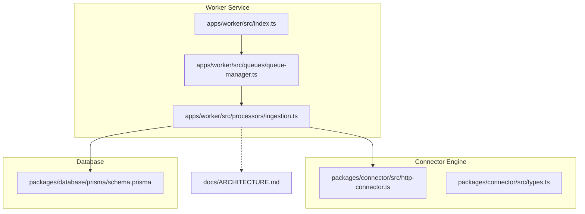
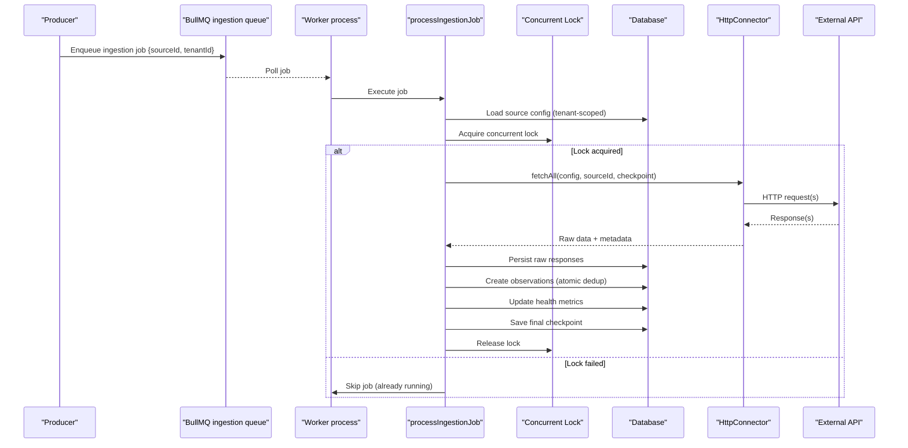
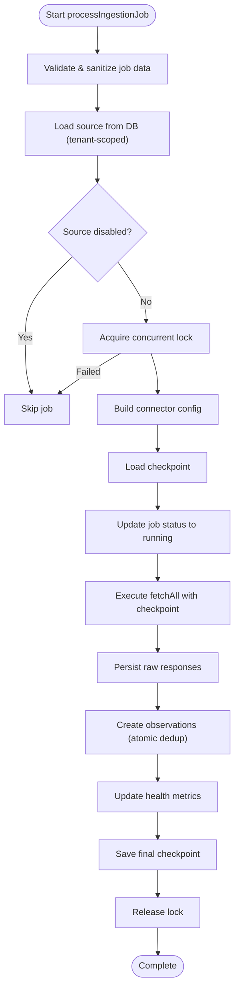
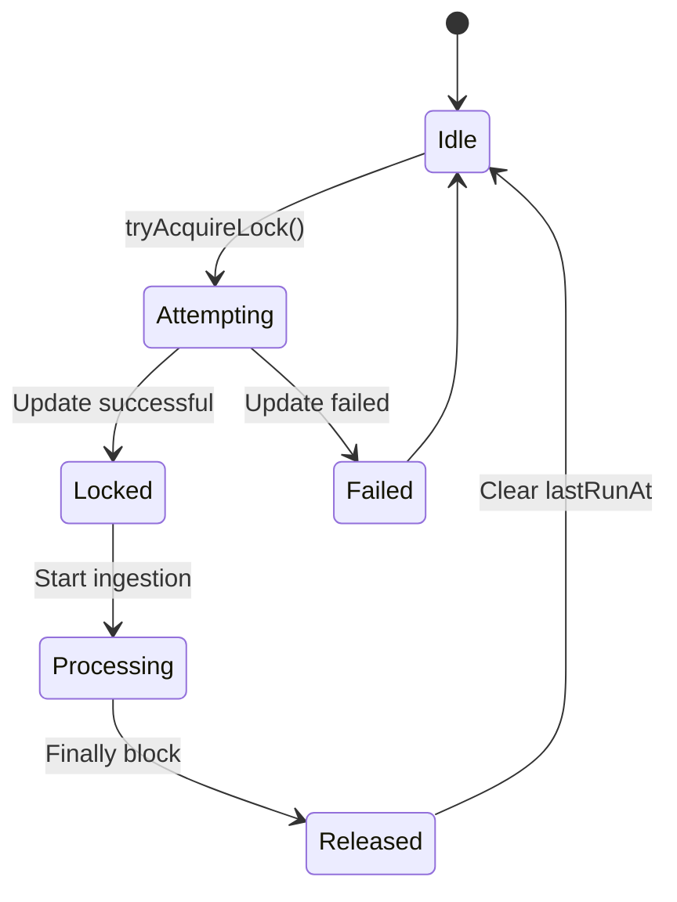
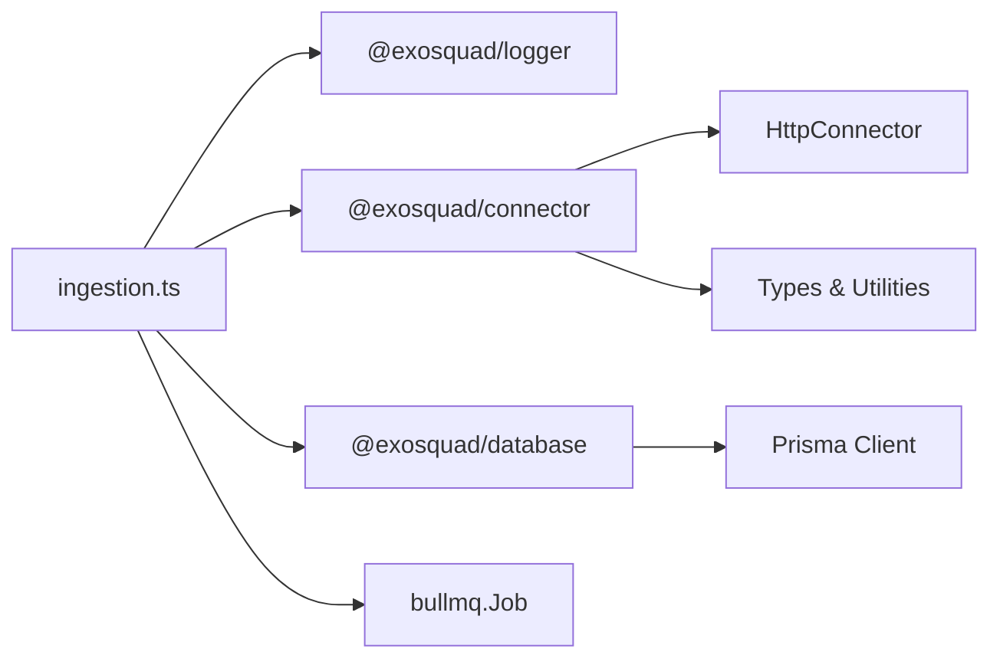

# Ingestion Processor

<cite>
**Referenced Files in This Document**
- [ingestion.ts](file://apps/worker/src/processors/ingestion.ts)
- [ingestion.test.ts](file://apps/worker/test/unit/ingestion.test.ts)
- [ARCHITECTURE.md](file://docs/ARCHITECTURE.md)
- [index.ts](file://apps/worker/src/index.ts)
- [http-connector.ts](file://packages/connector/src/http-connector.ts)
- [types.ts](file://packages/connector/src/types.ts)
- [schema.prisma](file://packages/database/prisma/schema.prisma)
</cite>

## Update Summary
**Changes Made**
- Complete rewrite of ingestion processor from stub to production implementation
- Integration with new connector engine for real HTTP fetching
- Added full lifecycle management with concurrent ingestion protection
- Implemented provenance tracking and health metrics integration
- Added incremental checkpointing for resumable ingestion
- Enhanced security with SSRF protection and log sanitization
- Updated architecture diagrams to reflect actual implementation

## Table of Contents
1. [Introduction](#introduction)
2. [Project Structure](#project-structure)
3. [Core Components](#core-components)
4. [Architecture Overview](#architecture-overview)
5. [Detailed Component Analysis](#detailed-component-analysis)
6. [Dependency Analysis](#dependency-analysis)
7. [Performance Considerations](#performance-considerations)
8. [Security Architecture](#security-architecture)
9. [Troubleshooting Guide](#troubleshooting-guide)
10. [Conclusion](#conclusion)
11. [Appendices](#appendices)

## Introduction
The ingestion processor is the first phase of the EXOSQUAD data pipeline, now fully implemented as a production-grade system that performs real HTTP fetches from external sources. It owns external data source integration by receiving ingestion jobs, validating required context, orchestrating fetching via the universal connector engine, parsing responses, storing raw observations immutably, and updating health metrics.

This document explains:
- The ingestion processor's role in the pipeline
- Production implementation with real HTTP fetching
- Full lifecycle management with concurrent ingestion protection
- Provenance tracking and health metrics integration
- Security features including SSRF protection and log sanitization
- Incremental checkpointing for resumable ingestion
- Error handling strategies and structured logging patterns
- Job data structures and expected inputs
- Complete job lifecycle from validation through completion

## Project Structure
The ingestion processor lives in the worker service under `apps/worker`. It is a BullMQ job processor that consumes jobs from the `ingestion` queue and integrates with the new connector engine package.



**Diagram sources**
- [ingestion.ts:1-530](file://apps/worker/src/processors/ingestion.ts#L1-L530)
- [http-connector.ts:1-770](file://packages/connector/src/http-connector.ts#L1-L770)
- [types.ts:1-250](file://packages/connector/src/types.ts#L1-L250)
- [schema.prisma:108-352](file://packages/database/prisma/schema.prisma#L108-L352)

**Section sources**
- [ingestion.ts:1-530](file://apps/worker/src/processors/ingestion.ts#L1-L530)
- [ARCHITECTURE.md:53-65](file://docs/ARCHITECTURE.md#L53-L65)

## Core Components
- **Ingestion job processor**: Production implementation with full lifecycle management, concurrent ingestion protection, and health metrics tracking
- **HTTP Connector Engine**: Universal connector abstraction providing HTTP fetching, authentication, pagination, retry logic, rate limiting, and circuit breaking
- **Database layer**: Prisma models for observations, raw responses, ingestion checkpoints, and source health tracking
- **Logger package**: Provides Pino-based structured logging with child logger support for per-job context
- **Queue manager**: Manages BullMQ workers, emits lifecycle events, and integrates with structured logging

Key responsibilities:
- Validate required fields (`sourceId`, `tenantId`)
- Acquire concurrent ingestion locks to prevent duplicate processing
- Load source configuration from database with tenant scoping
- Execute HTTP requests via universal connector with full resilience
- Persist raw responses with provenance metadata
- Create observations atomically with deduplication
- Update source health metrics and status
- Implement incremental checkpointing for resumable ingestion

**Section sources**
- [ingestion.ts:11-530](file://apps/worker/src/processors/ingestion.ts#L11-L530)
- [http-connector.ts:74-440](file://packages/connector/src/http-connector.ts#L74-L440)
- [schema.prisma:108-352](file://packages/database/prisma/schema.prisma#L108-L352)

## Architecture Overview
The ingestion processor implements a complete production pipeline:

```
REAL SOURCES → INGESTION (Real HTTP Fetch) → RAW OBSERVATIONS → NORMALIZATION
```

The current implementation performs real HTTP fetches with full lifecycle management:



**Diagram sources**
- [ingestion.ts:124-447](file://apps/worker/src/processors/ingestion.ts#L124-L447)
- [http-connector.ts:193-393](file://packages/connector/src/http-connector.ts#L193-L393)

## Detailed Component Analysis

### Production Ingestion Lifecycle
The processor follows a comprehensive production lifecycle with multiple safeguards:

1. **Job Validation**: Validate required fields and sanitize sensitive data
2. **Source Loading**: Load source configuration from database with tenant scoping
3. **Concurrent Locking**: Acquire lock to prevent duplicate ingestion
4. **Configuration Building**: Build connector config from validated source config
5. **Checkpoint Loading**: Load existing checkpoint for resumable ingestion
6. **Job Status Update**: Mark job as running in database
7. **HTTP Fetching**: Execute paginated fetch with incremental checkpointing
8. **Raw Response Persistence**: Store complete response metadata and payload
9. **Observation Creation**: Create observations atomically with deduplication
10. **Health Metrics Update**: Update source health status and statistics
11. **Final Checkpoint**: Save final checkpoint state
12. **Lock Release**: Always release the lock in finally block



**Diagram sources**
- [ingestion.ts:124-447](file://apps/worker/src/processors/ingestion.ts#L124-L447)

**Section sources**
- [ingestion.ts:124-447](file://apps/worker/src/processors/ingestion.ts#L124-L447)

### Concurrent Ingestion Protection
The system prevents duplicate ingestion through a database-level locking mechanism:

- Uses `lastRunAt` field on sources as a soft lock
- 10-minute lock timeout to handle stuck processes
- Atomic update operation ensures only one process can acquire the lock
- Lock is always released in finally block to prevent deadlocks



**Diagram sources**
- [ingestion.ts:76-107](file://apps/worker/src/processors/ingestion.ts#L76-L107)

**Section sources**
- [ingestion.ts:69-107](file://apps/worker/src/processors/ingestion.ts#L69-L107)

### Incremental Checkpointing
The system supports resumable ingestion through incremental checkpointing:

- Checkpoint saved after each page during pagination
- Supports cursor, page, offset, and link-based pagination
- Prevents data loss if worker crashes mid-ingestion
- Tracks total records processed across pages


**Diagram sources**
- [ingestion.ts:213-244](file://apps/worker/src/processors/ingestion.ts#L213-L244)
- [http-connector.ts:338-351](file://packages/connector/src/http-connector.ts#L338-L351)

**Section sources**
- [ingestion.ts:213-244](file://apps/worker/src/processors/ingestion.ts#L213-L244)
- [http-connector.ts:338-351](file://packages/connector/src/http-connector.ts#L338-L351)

### Health Metrics Integration
The processor maintains comprehensive health metrics for each source:

- **Success Path**: Updates `lastSuccessAt`, `lastHealthyAt`, resets error counters
- **Failure Path**: Tracks consecutive errors, determines health status based on error count
- **Status Management**: Sets source status to "error" for non-retryable failures or repeated errors
- **Statistics**: Tracks total fetched records, average latency, failure counts

Health status determination:
- `healthy`: Successful ingestion with no recent errors
- `degraded`: 2+ consecutive errors
- `unhealthy`: 5+ consecutive errors
- `unknown`: Initial state or single error

**Section sources**
- [ingestion.ts:316-407](file://apps/worker/src/processors/ingestion.ts#L316-L407)

### Validation Logic
Enhanced validation includes both job data validation and source configuration validation:

**Job Data Validation:**
- Required fields: `sourceId`, `tenantId`
- Sanitizes sensitive data before logging
- Throws descriptive error messages

**Source Configuration Validation:**
- Validates URL format and SSRF protection
- Parses and validates auth configuration
- Validates pagination configuration
- Validates retry and rate limit settings

**Section sources**
- [ingestion.ts:134-142](file://apps/worker/src/processors/ingestion.ts#L134-L142)
- [ingestion.ts:455-511](file://apps/worker/src/processors/ingestion.ts#L455-L511)

### Error Handling Strategy
Comprehensive error handling with detailed categorization:

- **Validation Errors**: Throw immediately with descriptive messages
- **Connector Errors**: Categorize by type (authentication, rate limit, server error)
- **Database Errors**: Handle unique constraint violations for deduplication
- **Retry Logic**: Exponential backoff with jitter for transient failures
- **Circuit Breaking**: Prevent cascading failures to unhealthy sources

Error categories:
- `SOURCE_AUTH_FAILED`: Authentication issues (401, 403)
- `RATE_LIMIT_EXCEEDED`: Rate limiting (429)
- `SOURCE_NOT_FOUND`: Resource not found (404)
- `SOURCE_SERVER_ERROR`: Server-side errors (5xx)
- `SOURCE_HTTP_ERROR`: Other HTTP errors

**Section sources**
- [ingestion.ts:365-443](file://apps/worker/src/processors/ingestion.ts#L365-L443)
- [http-connector.ts:569-633](file://packages/connector/src/http-connector.ts#L569-L633)

### Logging Patterns with createChildLogger
Enhanced structured logging with security considerations:

- Each job creates a child logger with bindings: `jobId`, `jobName`, `queue`
- Sensitive data sanitization before logging (passwords, tokens, secrets)
- Comprehensive contextual information in all log entries
- Structured error logs include error categories and health status

Usage pattern:
- Initialize child logger at job entry
- Log informational events with sanitized data
- Log error events with structured error objects and context
- Track performance metrics (latency, record counts)

**Section sources**
- [ingestion.ts:125-132](file://apps/worker/src/processors/ingestion.ts#L125-L132)
- [ingestion.ts:353-364](file://apps/worker/src/processors/ingestion.ts#L353-L364)

### Database Schema Integration
The processor integrates with several database tables:

**Observations Table:**
- Immutable raw data storage with content hashing for deduplication
- Multi-tenant isolation with `tenantId`
- Parser version tracking for provenance

**Raw Responses Table:**
- Complete HTTP request/response metadata
- Sanitized headers (no secrets)
- Latency and performance metrics

**Ingestion Checkpoints Table:**
- Resumable ingestion state per source
- Pagination state preservation
- Total records processed tracking

**Sources Table:**
- Health status and metrics
- Last success/failure timestamps
- Consecutive error counting

**Section sources**
- [schema.prisma:108-352](file://packages/database/prisma/schema.prisma#L108-L352)

## Dependency Analysis
The ingestion processor depends on:
- BullMQ Job type for typing the job payload and lifecycle
- @exosquad/logger for structured child loggers
- @exosquad/connector for HTTP fetching and resilience
- @exosquad/database for Prisma client and database operations



**Diagram sources**
- [ingestion.ts:16-32](file://apps/worker/src/processors/ingestion.ts#L16-L32)
- [http-connector.ts:17-45](file://packages/connector/src/http-connector.ts#L17-L45)

**Section sources**
- [ingestion.ts:16-32](file://apps/worker/src/processors/ingestion.ts#L16-L32)

## Performance Considerations
- **Connection Reuse**: Shared connector instance for circuit breaker and rate limiter state
- **Batch Operations**: Bulk observation creation with atomic deduplication
- **Incremental Checkpointing**: Resume capability reduces reprocessing on failures
- **Rate Limiting**: Token-bucket algorithm with adaptive limits from response headers
- **Circuit Breaking**: Prevents cascading failures to unhealthy sources
- **Response Size Limits**: 50MB limit prevents memory exhaustion
- **Concurrent Locking**: Prevents duplicate processing while allowing parallel sources

## Security Architecture
Enhanced security features protect against common vulnerabilities:

### SSRF Protection
- Validates outbound URLs against blocked protocols (file:, ftp:, etc.)
- Blocks private IP ranges (10.x, 172.16-31.x, 192.168.x)
- Prevents localhost and internal hostname access
- Validates Link header URLs in pagination

### Log Sanitization
- Redacts sensitive keys (password, token, secret, apikey, authorization)
- Recursive sanitization for nested objects
- Depth-limited traversal to prevent stack overflow

### Request Header Sanitization
- Removes sensitive headers before storage/logging
- Protects authorization tokens, cookies, API keys

**Section sources**
- [ingestion.ts:39-65](file://apps/worker/src/processors/ingestion.ts#L39-L65)
- [types.ts:78-101](file://packages/connector/src/types.ts#L78-L101)
- [types.ts:213-249](file://packages/connector/src/types.ts#L213-L249)

## Troubleshooting Guide
Common issues and resolutions:

### Missing Required Fields
- **Symptom**: Job fails with "Missing required fields" error
- **Resolution**: Ensure producers include both `sourceId` and `tenantId` in job payloads

### Source Not Found
- **Symptom**: Job fails with "Source not found" error
- **Resolution**: Verify source exists in database and matches tenant scope

### Concurrent Ingestion Conflicts
- **Symptom**: Jobs skip with "Source is already being ingested" warning
- **Resolution**: Expected behavior; check if another process is actively ingesting the same source

### Authentication Failures
- **Symptom**: Source marked as "error" status with authentication errors
- **Resolution**: Verify API credentials and permissions in source configuration

### Rate Limiting
- **Symptom**: Jobs fail with rate limit exceeded errors
- **Resolution**: Adjust rate limit configuration or implement exponential backoff

### Memory Issues
- **Symptom**: Worker crashes due to large responses
- **Resolution**: Response size limited to 50MB; verify source doesn't return excessively large payloads

### Checkpoint Corruption
- **Symptom**: Incomplete data ingestion after worker restart
- **Resolution**: System automatically resumes from last checkpoint; manual intervention rarely needed

**Section sources**
- [ingestion.ts:140-163](file://apps/worker/src/processors/ingestion.ts#L140-L163)
- [ingestion.ts:365-443](file://apps/worker/src/processors/ingestion.ts#L365-L443)

## Conclusion
The ingestion processor has evolved from a simple stub to a production-grade system that performs real HTTP fetches with comprehensive lifecycle management. The new implementation provides robust error handling, security protections, health monitoring, and resumable ingestion capabilities. It serves as the foundation for EXOSQUAD's multi-source data integration, supporting diverse external APIs through the universal connector pattern while maintaining data integrity and operational reliability.

## Appendices

### Appendix A: Job Payload Examples
Valid payload structure:
```json
{
  "sourceId": "source-1",
  "tenantId": "tenant-1"
}
```

Invalid payload examples:
```json
{ "tenantId": "tenant-1" } // missing sourceId
{ "sourceId": "source-1" } // missing tenantId
{} // empty data
```

**Section sources**
- [ingestion.test.ts:17-47](file://apps/worker/test/unit/ingestion.test.ts#L17-L47)

### Appendix B: Source Configuration Examples
Basic HTTP source:
```json
{
  "url": "https://api.example.com/data",
  "method": "GET",
  "headers": {
    "Authorization": "Bearer token"
  }
}
```

Advanced source with pagination and auth:
```json
{
  "url": "https://api.example.com/items",
  "method": "GET",
  "auth": {
    "type": "bearer",
    "token": "secret-token"
  },
  "pagination": {
    "type": "cursor",
    "cursorField": "next_cursor"
  },
  "retry": {
    "maxAttempts": 3,
    "backoffMs": 1000
  },
  "rateLimit": {
    "maxRequests": 60,
    "windowMs": 60000
  }
}
```

**Section sources**
- [ingestion.ts:455-511](file://apps/worker/src/processors/ingestion.ts#L455-L511)

### Appendix C: Worker Startup and Shutdown
The worker process initializes the application, registers shutdown handlers, and starts gracefully. Fatal startup errors are logged and cause non-zero exit.

**Section sources**
- [index.ts:1-23](file://apps/worker/src/index.ts#L1-L23)