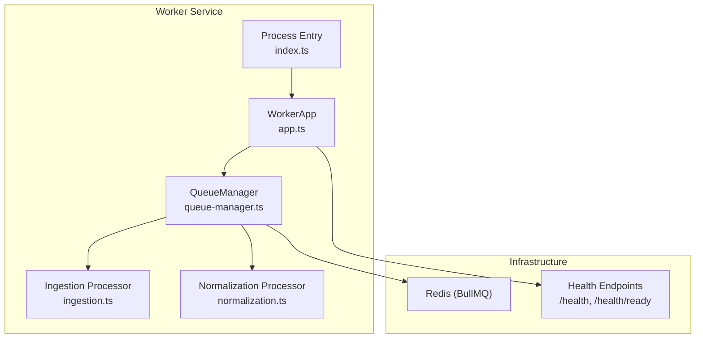
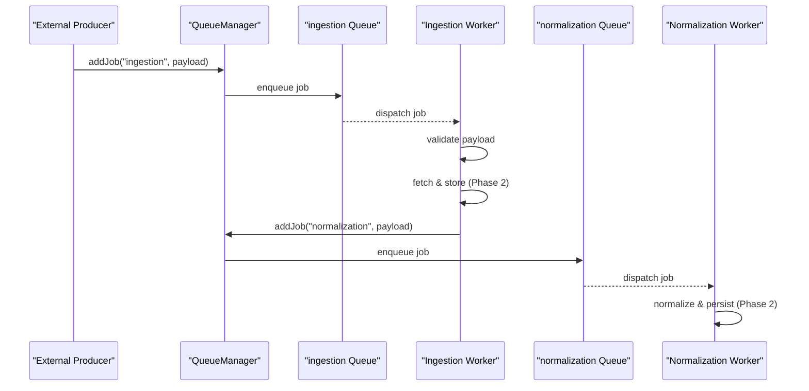
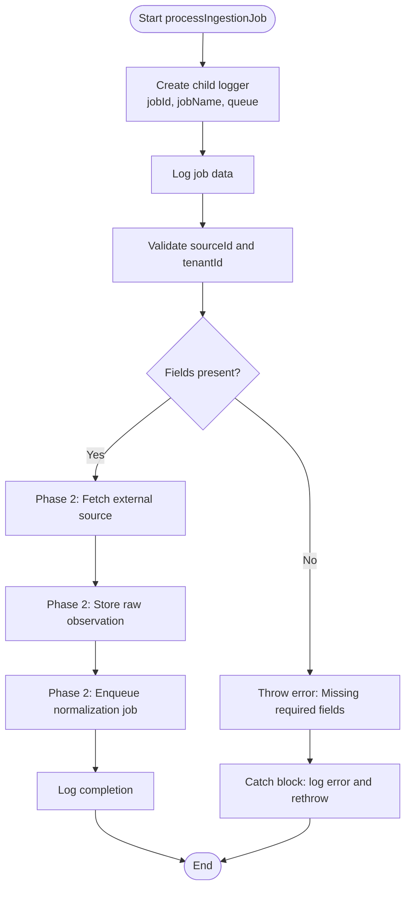
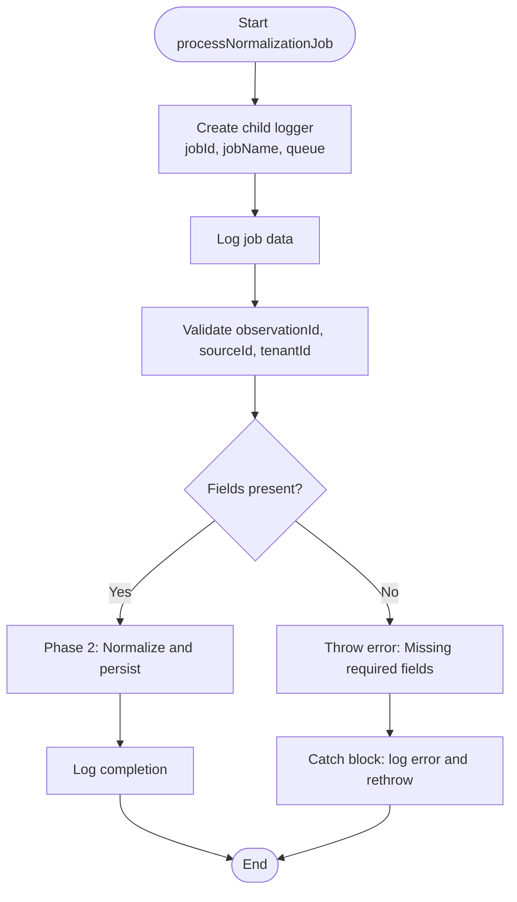
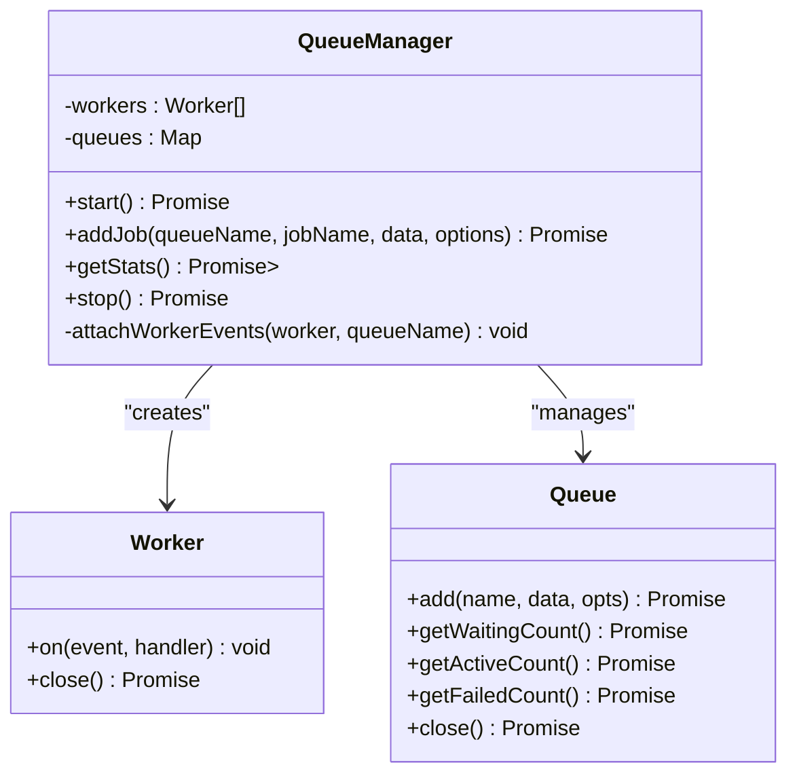
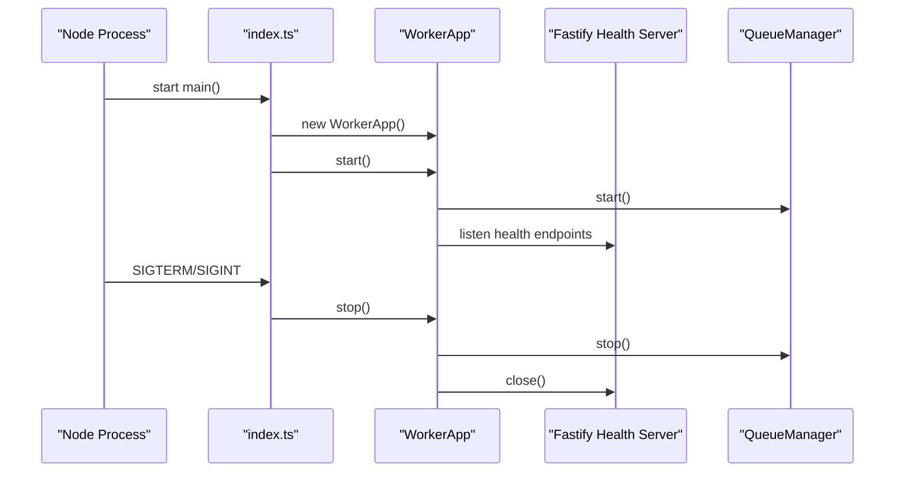
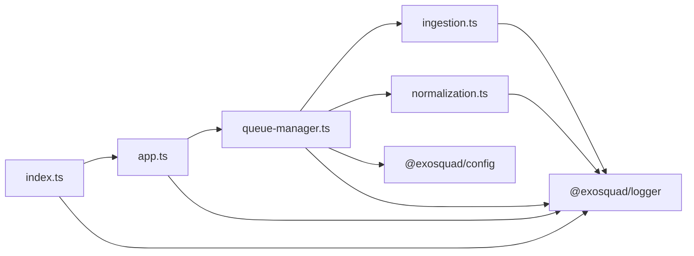

# Job Processors

<cite>
**Referenced Files in This Document**
- [ingestion.ts](file://apps/worker/src/processors/ingestion.ts)
- [normalization.ts](file://apps/worker/src/processors/normalization.ts)
- [queue-manager.ts](file://apps/worker/src/queues/queue-manager.ts)
- [app.ts](file://apps/worker/src/app.ts)
- [index.ts](file://apps/worker/src/index.ts)
- [ingestion.test.ts](file://apps/worker/test/unit/ingestion.test.ts)
- [normalization.test.ts](file://apps/worker/test/unit/normalization.test.ts)
- [ARCHITECTURE.md](file://docs/ARCHITECTURE.md)
- [schema.prisma](file://packages/database/prisma/schema.prisma)
</cite>

## Table of Contents
1. [Introduction](#introduction)
2. [Project Structure](#project-structure)
3. [Core Components](#core-components)
4. [Architecture Overview](#architecture-overview)
5. [Detailed Component Analysis](#detailed-component-analysis)
6. [Dependency Analysis](#dependency-analysis)
7. [Performance Considerations](#performance-considerations)
8. [Troubleshooting Guide](#troubleshooting-guide)
9. [Conclusion](#conclusion)
10. [Appendices](#appendices)

## Introduction
This document explains the job processor implementations for the EXOSQUAD worker service. It focuses on:
- The ingestion processor, which is responsible for processing external data sources and preparing raw observations.
- The normalization processor, which standardizes data formats, applies business rules, and prepares canonical records for downstream consumption.
- Processor signatures, input/output schemas, error handling strategies, logging patterns, testing approaches, debugging techniques, scaling considerations, performance optimization, and failure recovery mechanisms.

The current implementation provides a robust foundation with validation, structured logging, queue management, and unit tests. Actual fetching, parsing, persistence, and normalization logic are marked as Phase 2 work.

## Project Structure
The worker application is organized around queues and processors:
- `apps/worker/src/processors` contains job handlers.
- `apps/worker/src/queues` manages BullMQ queues and workers.
- `apps/worker/src/app.ts` starts the worker and exposes health endpoints.
- `apps/worker/src/index.ts` handles process lifecycle and graceful shutdown.
- `apps/worker/test/unit` contains unit tests for processors.
- `docs/ARCHITECTURE.md` describes system architecture, queue strategy, observability, and deployment.
- `packages/database/prisma/schema.prisma` defines the persistent job model used by the platform.

**Diagram sources**
- [index.ts:1-22](file://apps/worker/src/index.ts#L1-L22)
- [app.ts:1-60](file://apps/worker/src/app.ts#L1-L60)
- [queue-manager.ts:1-165](file://apps/worker/src/queues/queue-manager.ts#L1-L165)
- [ingestion.ts:1-55](file://apps/worker/src/processors/ingestion.ts#L1-L55)
- [normalization.ts:1-58](file://apps/worker/src/processors/normalization.ts#L1-L58)

**Section sources**
- [ARCHITECTURE.md:43-65](file://docs/ARCHITECTURE.md#L43-L65)
- [ARCHITECTURE.md:95-112](file://docs/ARCHITECTURE.md#L95-L112)

## Core Components
- Ingestion Processor: Validates job payloads, logs structured context, and serves as the entry point for future external source fetching and observation storage.
- Normalization Processor: Validates normalized job payloads, logs structured context, and serves as the entry point for schema mapping, entity resolution, and canonical record creation.
- Queue Manager: Manages BullMQ queues and workers, configures concurrency and rate limiting, enqueues jobs with retry/backoff policies, and exposes health statistics.
- Worker Application: Starts queues/workers, exposes health endpoints, and coordinates graceful shutdown.
- Process Entry: Handles SIGTERM/SIGINT signals, initializes the worker app, and logs fatal startup errors.

Key responsibilities:
- Validation: Both processors enforce required fields early to fail fast.
- Logging: Structured child loggers bind jobId, jobName, and queue context.
- Error Handling: Errors are logged and rethrown so BullMQ can handle retries and dead-lettering.
- Observability: Queue manager attaches completion/failure/error events and logs durations and attempts.

**Section sources**
- [ingestion.ts:11-54](file://apps/worker/src/processors/ingestion.ts#L11-L54)
- [normalization.ts:15-57](file://apps/worker/src/processors/normalization.ts#L15-L57)
- [queue-manager.ts:19-98](file://apps/worker/src/queues/queue-manager.ts#L19-L98)
- [app.ts:10-60](file://apps/worker/src/app.ts#L10-L60)
- [index.ts:4-22](file://apps/worker/src/index.ts#L4-L22)

## Architecture Overview
The worker service runs two dedicated BullMQ queues:
- ingestion: Fetches data from external sources and stores raw observations.
- normalization: Transforms raw observations into the canonical EXOSQUAD data model.

**Diagram sources**
- [queue-manager.ts:23-54](file://apps/worker/src/queues/queue-manager.ts#L23-L54)
- [queue-manager.ts:65-98](file://apps/worker/src/queues/queue-manager.ts#L65-L98)
- [ingestion.ts:11-54](file://apps/worker/src/processors/ingestion.ts#L11-L54)
- [normalization.ts:15-57](file://apps/worker/src/processors/normalization.ts#L15-L57)

**Section sources**
- [ARCHITECTURE.md:95-112](file://docs/ARCHITECTURE.md#L95-L112)

## Detailed Component Analysis

### Ingestion Processor
Role:
- Validate incoming job data.
- Prepare for external source fetching and raw observation storage.
- Enqueue normalization job after successful ingestion.

Processor signature:
- Function: `processIngestionJob(job)`
- Input: BullMQ `Job` object with `data.sourceId`, `data.tenantId`.
- Output: Resolves when validation passes; throws on missing fields or processing errors.

Input schema:
- Required fields:
  - `sourceId`: string identifier for the external source.
  - `tenantId`: string identifier for multi-tenant isolation.

Processing flow:
1. Create child logger bound to jobId, jobName, and queue.
2. Log job data for traceability.
3. Validate required fields; throw if missing.
4. Placeholder for updating job status and fetching/storing data (Phase 2).
5. Placeholder for enqueuing normalization job (Phase 2).
6. Catch block logs error details and rethrows.

Error handling:
- Missing required fields cause immediate rejection.
- Processing errors are logged with structured context and rethrown for BullMQ retry/dead-letter behavior.

Logging pattern:
- Uses structured child logger with contextual metadata.
- Logs both success and failure paths with relevant identifiers.

**Diagram sources**
- [ingestion.ts:11-54](file://apps/worker/src/processors/ingestion.ts#L11-L54)

**Section sources**
- [ingestion.ts:11-54](file://apps/worker/src/processors/ingestion.ts#L11-L54)

### Normalization Processor
Role:
- Validate incoming job data referencing an observation.
- Prepare for schema mapping, entity extraction, identity matching, confidence scoring, and evidence chain creation.

Processor signature:
- Function: `processNormalizationJob(job)`
- Input: BullMQ `Job` object with `data.observationId`, `data.sourceId`, `data.tenantId`.
- Output: Resolves when validation passes; throws on missing fields or processing errors.

Input schema:
- Required fields:
  - `observationId`: string identifier for the raw observation.
  - `sourceId`: string identifier for the original source.
  - `tenantId`: string identifier for multi-tenant isolation.

Processing flow:
1. Create child logger bound to jobId, jobName, and queue.
2. Log job data for traceability.
3. Validate required fields; throw if missing.
4. Placeholder for normalization pipeline steps (Phase 2).
5. Catch block logs error details and rethrows.

Error handling:
- Missing required fields cause immediate rejection.
- Processing errors are logged with structured context and rethrown for BullMQ retry/dead-letter behavior.

Logging pattern:
- Uses structured child logger with contextual metadata.
- Logs both success and failure paths with relevant identifiers.

**Diagram sources**
- [normalization.ts:15-57](file://apps/worker/src/processors/normalization.ts#L15-L57)

**Section sources**
- [normalization.ts:15-57](file://apps/worker/src/processors/normalization.ts#L15-L57)

### Queue Manager
Responsibilities:
- Create and manage BullMQ queues (`ingestion`, `normalization`).
- Configure workers with concurrency and rate limiting.
- Enqueue jobs with priority, attempts, backoff, delay, and idempotency keys.
- Provide health statistics for readiness checks.
- Attach worker event listeners for completion, failure, and error logging.

Key behaviors:
- Connection options sourced from configuration.
- Default retry policy: exponential backoff with jitter.
- Cleanup policies: remove completed jobs after threshold, remove failed jobs after threshold.
- Graceful stop: close workers and queues.

**Diagram sources**
- [queue-manager.ts:19-165](file://apps/worker/src/queues/queue-manager.ts#L19-L165)

**Section sources**
- [queue-manager.ts:19-165](file://apps/worker/src/queues/queue-manager.ts#L19-L165)

### Worker Application and Process Lifecycle
- WorkerApp initializes QueueManager and Fastify health server.
- Health endpoints:
  - `/health`: liveness probe returning service status.
  - `/health/ready`: readiness probe checking queue connectivity and reporting queue stats.
- Process index handles SIGTERM/SIGINT for graceful shutdown and logs fatal startup errors.

**Diagram sources**
- [index.ts:4-22](file://apps/worker/src/index.ts#L4-L22)
- [app.ts:10-60](file://apps/worker/src/app.ts#L10-L60)

**Section sources**
- [app.ts:10-60](file://apps/worker/src/app.ts#L10-L60)
- [index.ts:4-22](file://apps/worker/src/index.ts#L4-L22)

## Dependency Analysis
- Processors depend on BullMQ `Job` type and structured logging via `createChildLogger`.
- QueueManager depends on configuration for Redis connection and worker concurrency.
- WorkerApp depends on QueueManager and Fastify for health endpoints.
- Process index depends on WorkerApp and structured logging for lifecycle management.

**Diagram sources**
- [ingestion.ts:1-55](file://apps/worker/src/processors/ingestion.ts#L1-L55)
- [normalization.ts:1-58](file://apps/worker/src/processors/normalization.ts#L1-L58)
- [queue-manager.ts:1-165](file://apps/worker/src/queues/queue-manager.ts#L1-L165)
- [app.ts:1-60](file://apps/worker/src/app.ts#L1-L60)
- [index.ts:1-22](file://apps/worker/src/index.ts#L1-L22)

**Section sources**
- [queue-manager.ts:1-165](file://apps/worker/src/queues/queue-manager.ts#L1-L165)
- [app.ts:1-60](file://apps/worker/src/app.ts#L1-L60)
- [index.ts:1-22](file://apps/worker/src/index.ts#L1-L22)

## Performance Considerations
- Concurrency: Workers use configurable concurrency to scale throughput based on workload characteristics.
- Rate Limiting: Ingestion worker includes a limiter to cap external API calls (e.g., 50 jobs per minute).
- Retry and Backoff: Jobs default to exponential backoff with jitter and configurable max attempts.
- Cleanup Policies: Completed and failed jobs are removed after thresholds to prevent queue bloat.
- Health Monitoring: Readiness endpoint aggregates queue stats to detect degraded states quickly.

Recommendations:
- Tune concurrency per queue based on CPU/memory profiles and external API constraints.
- Adjust backoff delays and max attempts according to upstream reliability.
- Monitor queue depths and failure rates; alert on sustained degradation.
- Use idempotency keys for producers to avoid duplicate processing during retries.

[No sources needed since this section provides general guidance]

## Troubleshooting Guide
Common issues and diagnostics:
- Missing required fields:
  - Ingestion: Ensure `sourceId` and `tenantId` are present.
  - Normalization: Ensure `observationId`, `sourceId`, and `tenantId` are present.
- Queue connectivity:
  - Check Redis host, port, and password configuration.
  - Inspect readiness endpoint for queue status and error flags.
- Job failures:
  - Review structured logs for error messages and attempt counts.
  - Verify retry/backoff settings and dead-letter queue behavior.
- Performance bottlenecks:
  - Monitor active/waiting/failed counts.
  - Adjust concurrency and rate limits accordingly.

Debugging techniques:
- Use structured logs with jobId, queue, and duration to trace job lifecycles.
- Leverage unit tests to validate validation logic and error paths.
- Simulate producer payloads to verify processor acceptance criteria.

**Section sources**
- [ingestion.ts:20-28](file://apps/worker/src/processors/ingestion.ts#L20-L28)
- [normalization.ts:24-34](file://apps/worker/src/processors/normalization.ts#L24-L34)
- [queue-manager.ts:141-163](file://apps/worker/src/queues/queue-manager.ts#L141-L163)
- [app.ts:26-38](file://apps/worker/src/app.ts#L26-L38)

## Conclusion
The EXOSQUAD worker service provides a solid foundation for asynchronous data processing through dedicated ingestion and normalization queues. Processors implement strict validation, structured logging, and consistent error handling. Queue management offers robust retry/backoff policies, rate limiting, and health monitoring. While actual fetching, parsing, and normalization logic are deferred to Phase 2, the current design ensures extensibility, observability, and operational safety.

[No sources needed since this section summarizes without analyzing specific files]

## Appendices

### Processor Signatures and Schemas
- Ingestion Processor
  - Signature: `processIngestionJob(job): Promise<void>`
  - Input schema: `{ sourceId: string, tenantId: string }`
  - Output: Resolves on success; throws on validation or processing errors.
- Normalization Processor
  - Signature: `processNormalizationJob(job): Promise<void>`
  - Input schema: `{ observationId: string, sourceId: string, tenantId: string }`
  - Output: Resolves on success; throws on validation or processing errors.

**Section sources**
- [ingestion.ts:11-28](file://apps/worker/src/processors/ingestion.ts#L11-L28)
- [normalization.ts:15-34](file://apps/worker/src/processors/normalization.ts#L15-L34)

### Testing Approaches
- Unit tests validate:
  - Rejection of invalid payloads.
  - Successful processing of valid payloads.
- Mocked BullMQ `Job` objects provide minimal structure for test execution.

**Section sources**
- [ingestion.test.ts:17-47](file://apps/worker/test/unit/ingestion.test.ts#L17-L47)
- [normalization.test.ts:17-55](file://apps/worker/test/unit/normalization.test.ts#L17-L55)

### Persistence Model
- Job model includes fields for queue, type, payload, status, priority, attempts, result, error, timestamps, and tenant association.
- Indexed columns optimize queries by queue/status and tenant.

**Section sources**
- [schema.prisma:220-244](file://packages/database/prisma/schema.prisma#L220-L244)