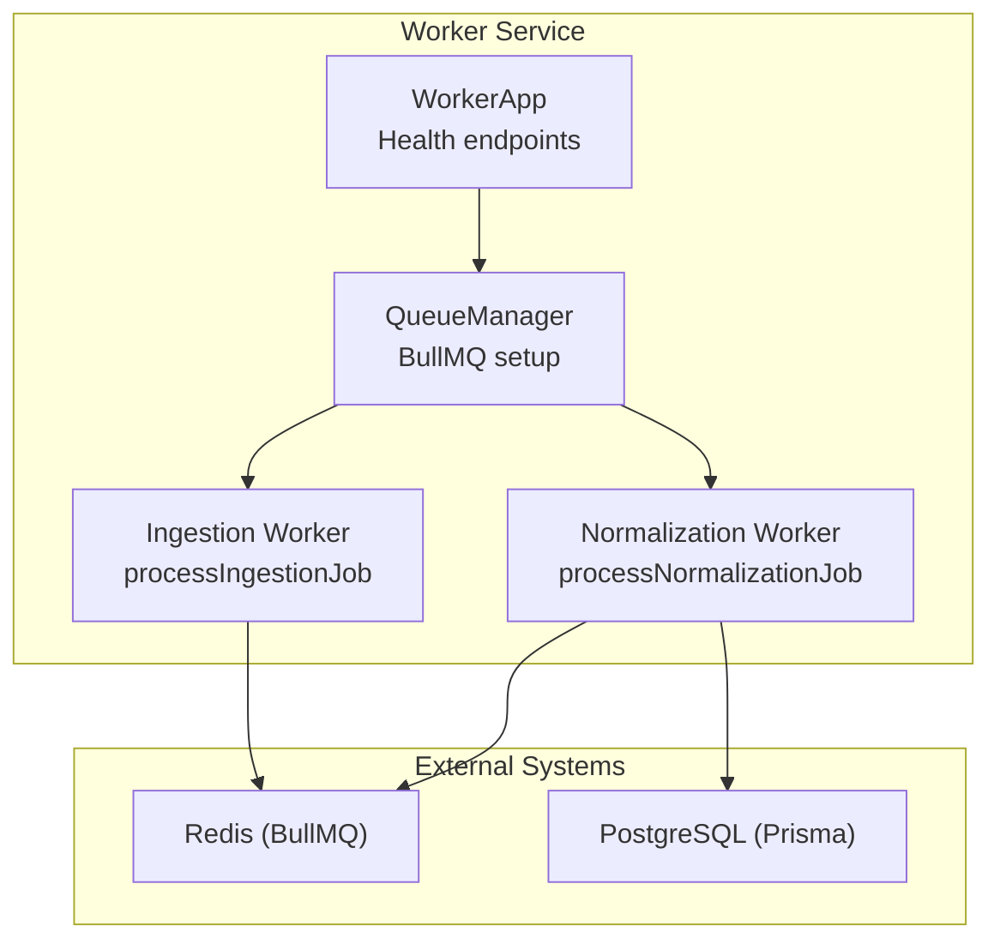
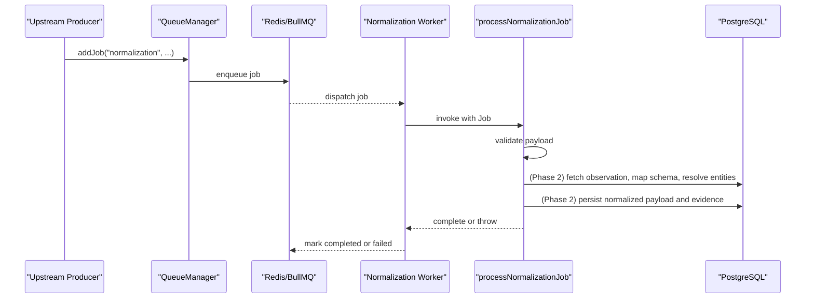
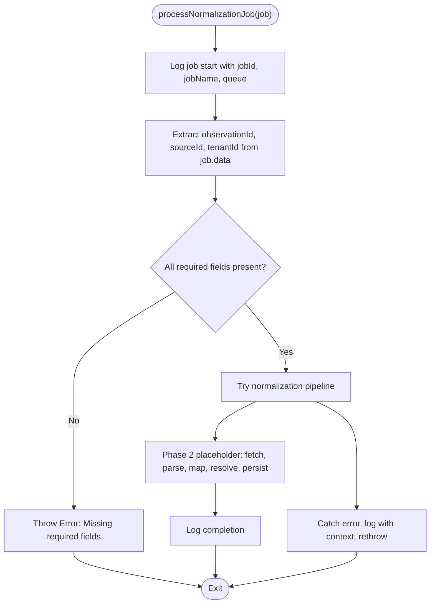
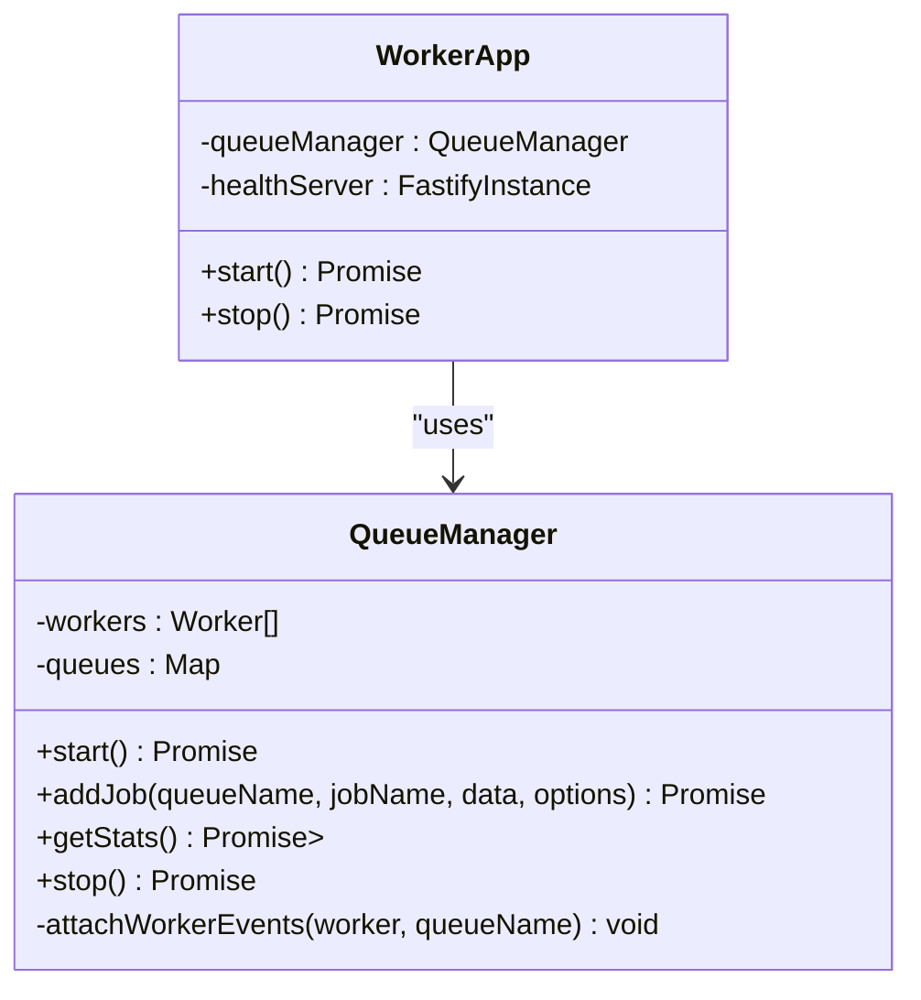
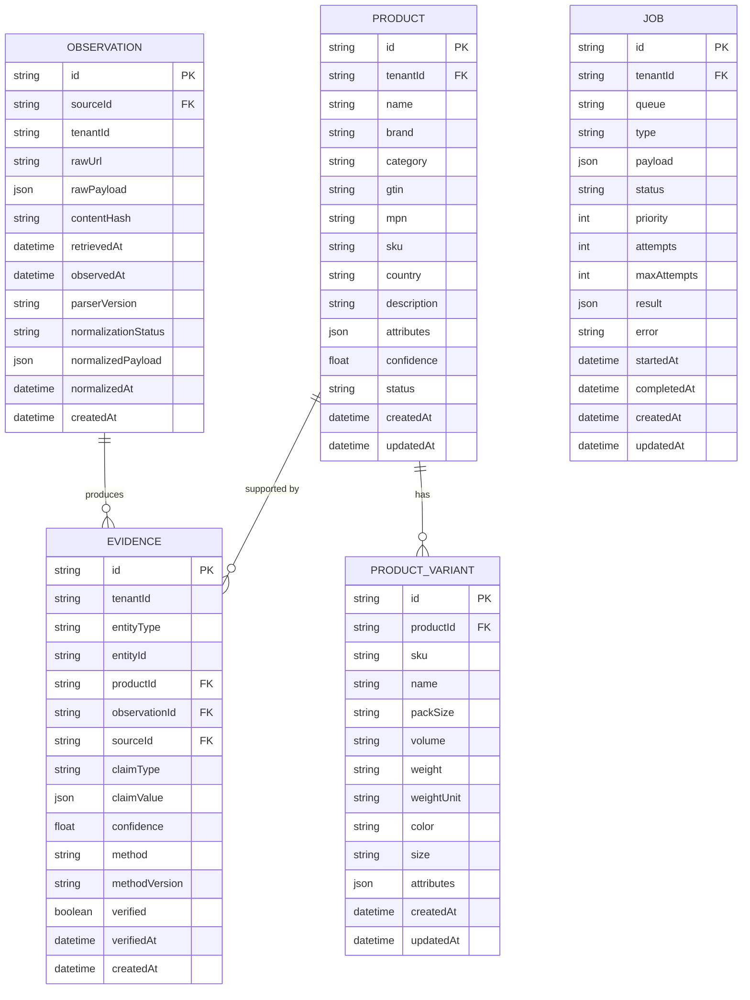
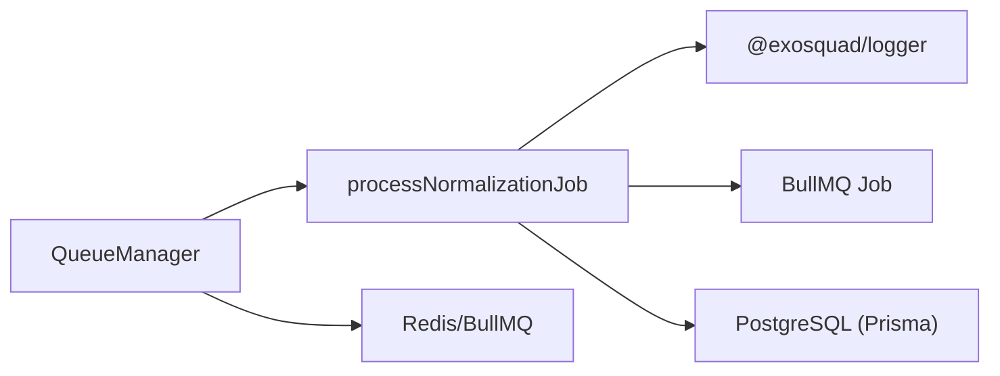

# Normalization Processor

<cite>
**Referenced Files in This Document**
- [normalization.ts](file://apps/worker/src/processors/normalization.ts)
- [queue-manager.ts](file://apps/worker/src/queues/queue-manager.ts)
- [app.ts](file://apps/worker/src/app.ts)
- [index.ts](file://apps/worker/src/index.ts)
- [ingestion.ts](file://apps/worker/src/processors/ingestion.ts)
- [schema.prisma](file://packages/database/prisma/schema.prisma)
- [ARCHITECTURE.md](file://docs/ARCHITECTURE.md)
- [config index.ts](file://packages/config/src/index.ts)
- [normalization.test.ts](file://apps/worker/test/unit/normalization.test.ts)
</cite>

## Table of Contents
1. [Introduction](#introduction)
2. [Project Structure](#project-structure)
3. [Core Components](#core-components)
4. [Architecture Overview](#architecture-overview)
5. [Detailed Component Analysis](#detailed-component-analysis)
6. [Dependency Analysis](#dependency-analysis)
7. [Performance Considerations](#performance-considerations)
8. [Troubleshooting Guide](#troubleshooting-guide)
9. [Conclusion](#conclusion)
10. [Appendices](#appendices)

## Introduction
This document explains the normalization job processor within the EXOSQUAD data pipeline. The processor is responsible for transforming raw observations into a standardized, canonical model that downstream components can consume reliably. In the current codebase, the normalization processor is scaffolded and validated but its core transformation logic is marked for Phase 2 implementation. It validates incoming job payloads, logs structured context, and integrates with BullMQ queues managed by the worker application.

The broader pipeline follows:
- Real sources → Ingestion → Raw Observations → Normalization → Entity Resolution → Product Graph → Analysis → Opportunity

Normalization bridges the gap between heterogeneous source formats and the canonical product intelligence model.

## Project Structure
The normalization processor lives in the worker service alongside ingestion processing and queue orchestration. The worker exposes health endpoints and manages BullMQ workers for both ingestion and normalization queues.

**Diagram sources**
- [app.ts:10-53](file://apps/worker/src/app.ts#L10-L53)
- [queue-manager.ts:19-60](file://apps/worker/src/queues/queue-manager.ts#L19-L60)
- [index.ts:4-22](file://apps/worker/src/index.ts#L4-L22)

**Section sources**
- [app.ts:1-61](file://apps/worker/src/app.ts#L1-L61)
- [queue-manager.ts:1-166](file://apps/worker/src/queues/queue-manager.ts#L1-L166)
- [index.ts:1-22](file://apps/worker/src/index.ts#L1-L22)

## Core Components
- Normalization Processor: Validates job payload, logs execution context, and provides an extension point for Phase 2 normalization logic.
- Queue Manager: Creates and configures BullMQ queues and workers; wires processNormalizationJob to the normalization queue.
- Worker Application: Starts queue processors and exposes health endpoints for liveness/readiness checks.
- Database Schema: Defines Observation, Product, ProductVariant, Evidence, and Job models used by the pipeline.

Key responsibilities:
- Input validation for normalization jobs
- Structured logging per job
- Integration with BullMQ for reliable processing
- Preparation for future schema mapping, entity resolution, confidence scoring, and evidence creation

**Section sources**
- [normalization.ts:1-58](file://apps/worker/src/processors/normalization.ts#L1-L58)
- [queue-manager.ts:40-54](file://apps/worker/src/queues/queue-manager.ts#L40-L54)
- [app.ts:41-53](file://apps/worker/src/app.ts#L41-L53)
- [schema.prisma:108-131](file://packages/database/prisma/schema.prisma#L108-L131)

## Architecture Overview
The normalization processor is invoked by the BullMQ worker bound to the normalization queue. Jobs are enqueued by upstream processes (e.g., ingestion), processed by the worker, and expected to update normalized data and observation status.

**Diagram sources**
- [queue-manager.ts:65-98](file://apps/worker/src/queues/queue-manager.ts#L65-L98)
- [queue-manager.ts:44-54](file://apps/worker/src/queues/queue-manager.ts#L44-L54)
- [normalization.ts:15-57](file://apps/worker/src/processors/normalization.ts#L15-L57)
- [schema.prisma:108-131](file://packages/database/prisma/schema.prisma#L108-L131)

## Detailed Component Analysis

### Normalization Processor
Responsibilities:
- Validate required fields: observationId, sourceId, tenantId
- Create child logger with job context
- Provide stubbed completion path and error handling
- Prepare for Phase 2 steps: fetch raw observation, apply source-specific parser, map to canonical schema, run entity resolution, create/update products, create evidence records, update observation status

Input schema (job.data):
- observationId: string (required)
- sourceId: string (required)
- tenantId: string (required)

Output behavior:
- On success: completes without returning a value
- On failure: throws an error after logging

Validation rules:
- All three identifiers must be present; otherwise, an error is thrown

Error handling:
- Wraps processing in try/catch
- Logs errors with full context
- Re-throws to allow BullMQ retry/failure semantics

**Diagram sources**
- [normalization.ts:15-57](file://apps/worker/src/processors/normalization.ts#L15-L57)

**Section sources**
- [normalization.ts:1-58](file://apps/worker/src/processors/normalization.ts#L1-L58)

### Queue Manager
Responsibilities:
- Configure BullMQ connection using environment variables
- Create and manage queues: ingestion and normalization
- Attach dedicated workers with concurrency settings
- Provide methods to add jobs, get stats, and stop workers
- Attach event listeners for completed, failed, and worker errors

Normalization queue configuration:
- Queue name: normalization
- Worker handler: processNormalizationJob
- Concurrency: configurable via WORKER_CONCURRENCY

Job defaults:
- Attempts: 3
- Backoff: exponential with base delay
- RemoveOnComplete and RemoveOnFail counts configured

**Diagram sources**
- [queue-manager.ts:19-166](file://apps/worker/src/queues/queue-manager.ts#L19-L166)
- [app.ts:10-53](file://apps/worker/src/app.ts#L10-L53)

**Section sources**
- [queue-manager.ts:1-166](file://apps/worker/src/queues/queue-manager.ts#L1-L166)

### Worker Application
Responsibilities:
- Instantiate QueueManager
- Expose /health and /health/ready endpoints
- Start queue processors and health server on a separate port
- Graceful shutdown

Readiness probe:
- Aggregates queue statistics
- Returns 200 if all queues healthy, 503 if degraded

**Section sources**
- [app.ts:1-61](file://apps/worker/src/app.ts#L1-L61)

### Data Model and Canonical Format
Observation model:
- Immutable record of raw data from sources
- Fields include sourceId, tenantId, rawUrl, rawPayload, contentHash, timestamps, parserVersion, normalizationStatus, normalizedPayload, normalizedAt

Product and variant models:
- Product identity includes brand, category, gtin, mpn, sku, country, description, attributes, confidence, status
- ProductVariant captures SKU-level details like pack size, volume, weight, color, size, attributes

Evidence model:
- Provenance chain linking conclusions to sources
- Includes entityType, entityId, productId, observationId, claimType, claimValue, confidence, method, verified flags

Job persistence:
- Tracks async job execution with queue, type, payload, status, attempts, result, error, timestamps

**Diagram sources**
- [schema.prisma:108-244](file://packages/database/prisma/schema.prisma#L108-L244)

**Section sources**
- [schema.prisma:108-244](file://packages/database/prisma/schema.prisma#L108-L244)

### Transformation Rules and Business Logic (Planned)
Per the processor comments and architecture documentation, Phase 2 will implement:
- Schema mapping from various source formats
- Entity extraction and resolution
- Product identity matching across brand, SKU, GTIN, MPN
- Confidence scoring for resolutions
- Evidence chain creation linking normalized outputs back to raw observations

These rules align with data principles:
- Immutability of observations
- Distinction among brand, product, SKU, variant, pack size, volume, weight, country, barcode/GTIN
- Separation of authentic products from unknown/generic alternatives and counterfeit evidence

**Section sources**
- [normalization.ts:4-14](file://apps/worker/src/processors/normalization.ts#L4-L14)
- [ARCHITECTURE.md:13-20](file://docs/ARCHITECTURE.md#L13-L20)
- [AGENTS.md:158-174](file://AGENTS.md#L158-L174)

### Data Validation Patterns
- Required field validation for normalization jobs: observationId, sourceId, tenantId
- Environment configuration validation via Zod ensures safe runtime values for worker concurrency and other settings

**Section sources**
- [normalization.ts:24-34](file://apps/worker/src/processors/normalization.ts#L24-L34)
- [config index.ts:19-34](file://packages/config/src/index.ts#L19-L34)

### Error Handling Mechanisms
- Processor-level try/catch with structured logging and rethrow
- Queue manager attaches worker events for completed, failed, and error states
- Health readiness endpoint reflects queue health status

**Section sources**
- [normalization.ts:36-57](file://apps/worker/src/processors/normalization.ts#L36-L57)
- [queue-manager.ts:141-164](file://apps/worker/src/queues/queue-manager.ts#L141-L164)
- [app.ts:26-38](file://apps/worker/src/app.ts#L26-L38)

## Dependency Analysis
The normalization processor depends on:
- BullMQ Job type for input structure
- Logger child creation for contextual logs
- QueueManager for queue lifecycle and job dispatch
- Database models for persisted state updates during Phase 2

**Diagram sources**
- [normalization.ts:1-2](file://apps/worker/src/processors/normalization.ts#L1-L2)
- [queue-manager.ts:44-54](file://apps/worker/src/queues/queue-manager.ts#L44-L54)

**Section sources**
- [normalization.ts:1-58](file://apps/worker/src/processors/normalization.ts#L1-L58)
- [queue-manager.ts:1-166](file://apps/worker/src/queues/queue-manager.ts#L1-L166)

## Performance Considerations
- Concurrency: Normalization worker concurrency is configurable via WORKER_CONCURRENCY. Tune based on CPU and I/O characteristics.
- Rate limiting: Ingestion queue uses a limiter; normalization queue currently has no explicit limiter. Consider adding rate limits if downstream services require throttling.
- Retry strategy: Default exponential backoff with jitter and max attempts applies to all jobs.
- Resource isolation: Separate worker process allows independent scaling from the API server.
- Observability: Structured logs include jobId, queue, duration, aiding performance analysis.

Recommendations:
- Monitor queue metrics (waiting, active, failed) via /health/ready
- Adjust WORKER_CONCURRENCY based on observed throughput and latency
- Add rate limiting to normalization queue if needed
- Profile database writes during Phase 2 normalization to optimize batch operations

[No sources needed since this section provides general guidance]

## Troubleshooting Guide
Common issues and diagnostics:
- Missing required fields: Ensure job.data includes observationId, sourceId, tenantId. Tests cover rejection scenarios.
- Worker not processing: Verify QueueManager.start() is called and Redis connectivity is healthy. Check /health/ready for queue statuses.
- High failure rates: Inspect worker failed events and logs for stack traces and context.
- Slow normalization: Review concurrency settings and database performance; consider batching and indexing strategies aligned with schema indexes.

Debugging techniques:
- Use structured logs with jobId and queue to trace job lifecycle
- Leverage health endpoints to detect degraded states
- Validate environment configuration at startup to avoid misconfiguration

**Section sources**
- [normalization.test.ts:17-56](file://apps/worker/test/unit/normalization.test.ts#L17-L56)
- [queue-manager.ts:141-164](file://apps/worker/src/queues/queue-manager.ts#L141-L164)
- [app.ts:26-38](file://apps/worker/src/app.ts#L26-L38)

## Conclusion
The normalization processor establishes a robust foundation for transforming raw observations into a canonical model. While the core transformation logic is deferred to Phase 2, the current implementation provides essential scaffolding: strict input validation, structured logging, integration with BullMQ, and clear extension points for schema mapping, entity resolution, confidence scoring, and evidence creation. With proper tuning of concurrency and observability, the worker can scale effectively as the normalization pipeline matures.

[No sources needed since this section summarizes without analyzing specific files]

## Appendices

### Testing Approaches for Normalization Logic
- Unit tests verify rejection when required fields are missing and successful completion for valid payloads
- Mock BullMQ Job objects are used to isolate processor logic
- Future tests should assert normalization outcomes, including mapped schemas, resolved entities, confidence scores, and evidence records

**Section sources**
- [normalization.test.ts:1-57](file://apps/worker/test/unit/normalization.test.ts#L1-L57)

### Configuration Reference
- WORKER_CONCURRENCY: Controls parallelism for workers
- REDIS_HOST, REDIS_PORT, REDIS_PASSWORD: BullMQ connection parameters
- PORT: Base port for API; worker health runs on PORT + 1

**Section sources**
- [config index.ts:19-34](file://packages/config/src/index.ts#L19-L34)
- [queue-manager.ts:8-13](file://apps/worker/src/queues/queue-manager.ts#L8-L13)
- [app.ts:46-47](file://apps/worker/src/app.ts#L46-L47)