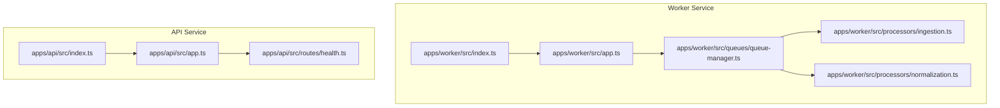
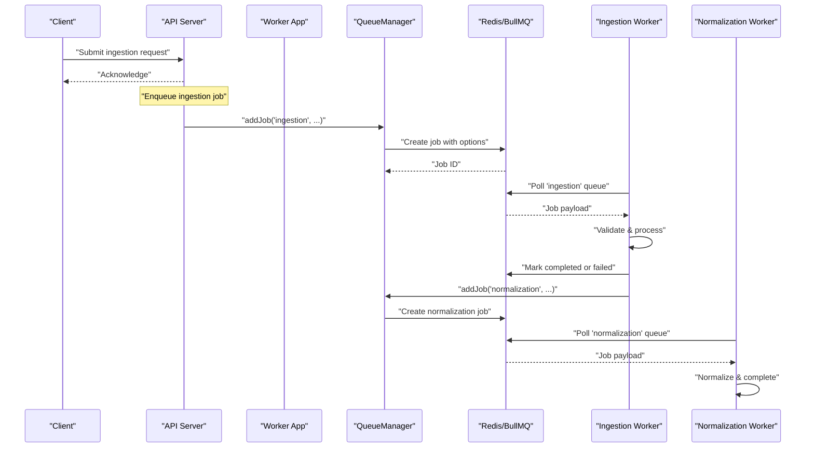
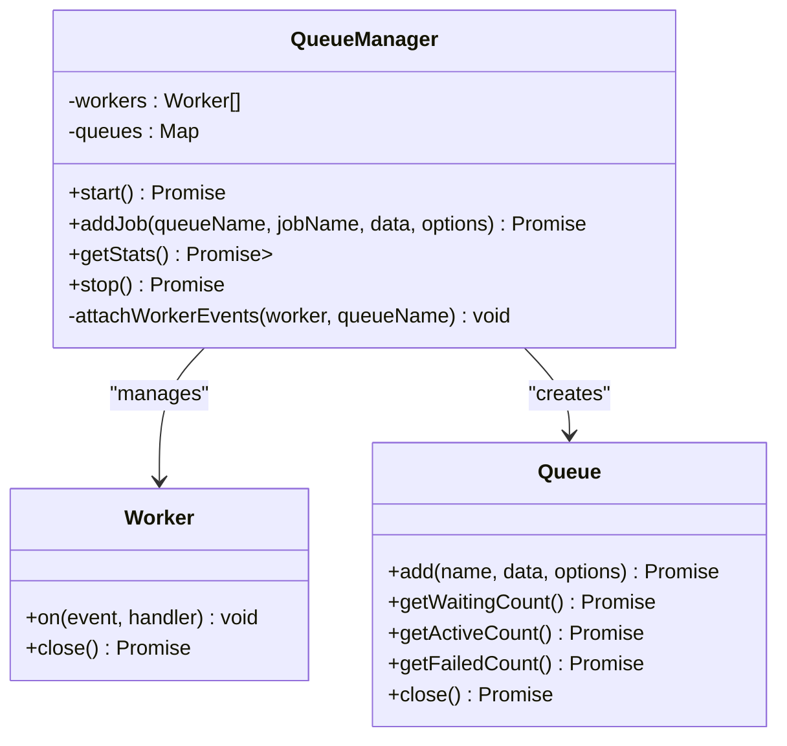
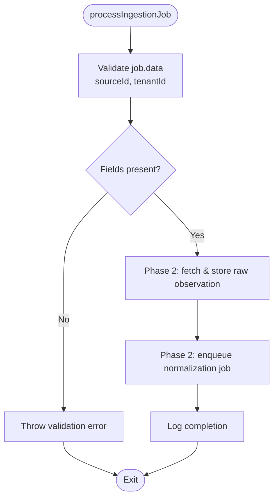
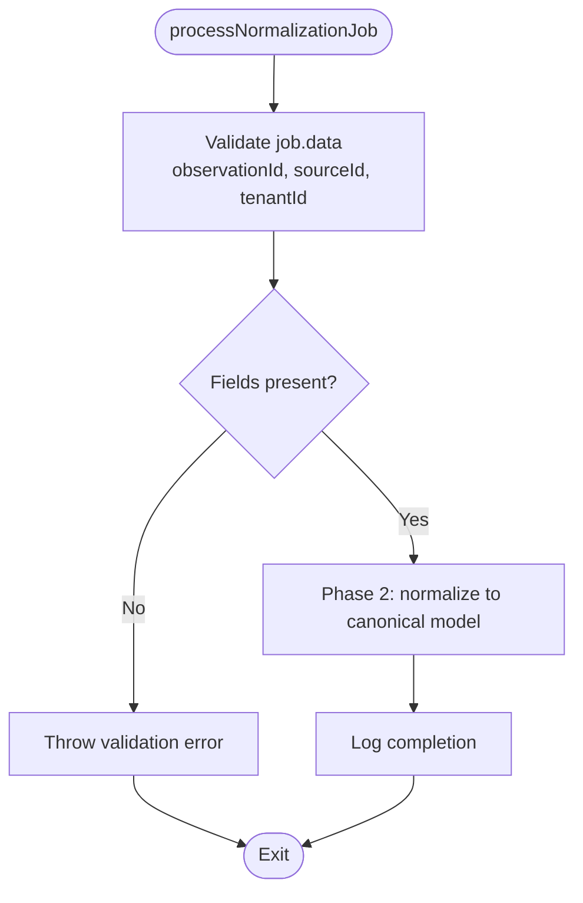
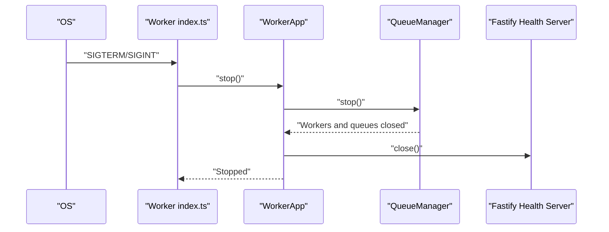
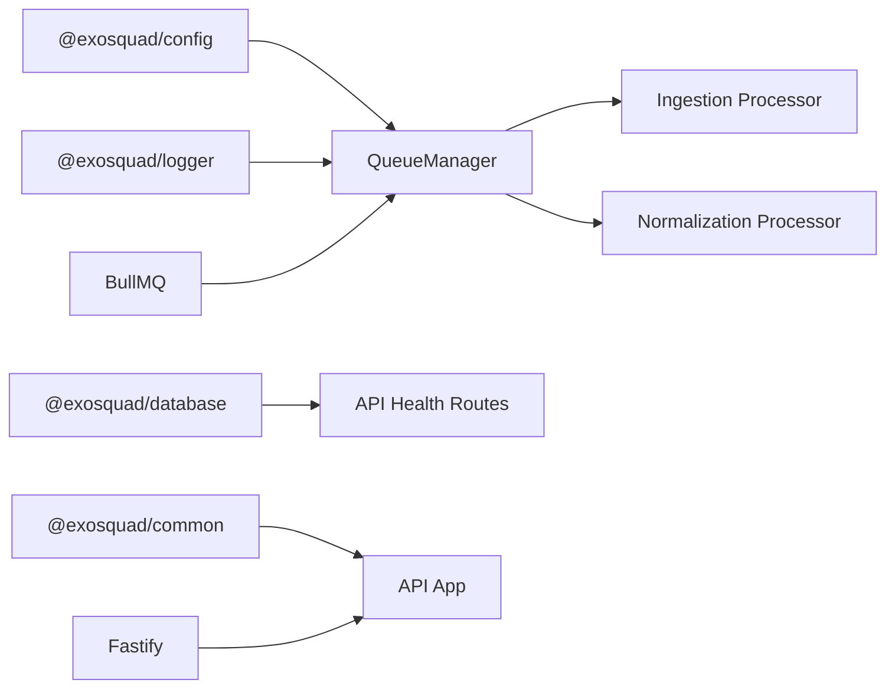

# Queue Management

<cite>
**Referenced Files in This Document**
- [queue-manager.ts](file://apps/worker/src/queues/queue-manager.ts)
- [ingestion.ts](file://apps/worker/src/processors/ingestion.ts)
- [normalization.ts](file://apps/worker/src/processors/normalization.ts)
- [app.ts (Worker)](file://apps/worker/src/app.ts)
- [index.ts (Worker)](file://apps/worker/src/index.ts)
- [health.ts](file://apps/api/src/routes/health.ts)
- [app.ts (API)](file://apps/api/src/app.ts)
- [index.ts (API)](file://apps/api/src/index.ts)
- [ARCHITECTURE.md](file://docs/ARCHITECTURE.md)
</cite>

## Table of Contents
1. [Introduction](#introduction)
2. [Project Structure](#project-structure)
3. [Core Components](#core-components)
4. [Architecture Overview](#architecture-overview)
5. [Detailed Component Analysis](#detailed-component-analysis)
6. [Dependency Analysis](#dependency-analysis)
7. [Performance Considerations](#performance-considerations)
8. [Troubleshooting Guide](#troubleshooting-guide)
9. [Conclusion](#conclusion)

## Introduction
This document explains the BullMQ-based queue management system used by the EXOSQUAD worker service. It covers the QueueManager class, Redis connection configuration, queue lifecycle management, ingestion and normalization queues, worker initialization with concurrency and rate limiting, job options such as priority, retry policies, and backoff strategies, queue statistics for health checks, graceful shutdown procedures, Redis connection options, error handling patterns, and performance tuning parameters.

The worker runs two queues:
- Ingestion: fetches data from external sources and stores raw observations.
- Normalization: transforms raw observations into a canonical model.

The API server provides health endpoints that check database connectivity; the worker exposes its own health endpoint that includes queue statistics.

**Section sources**
- [ARCHITECTURE.md:95-112](file://docs/ARCHITECTURE.md#L95-L112)
- [ARCHITECTURE.md:185-192](file://docs/ARCHITECTURE.md#L185-L192)

## Project Structure
The queue-related code is primarily located under apps/worker, with supporting health routes under apps/api. The worker application initializes Fastify for health checks and manages BullMQ queues and workers through QueueManager.

**Diagram sources**
- [index.ts (Worker):1-23](file://apps/worker/src/index.ts#L1-L23)
- [app.ts (Worker):1-61](file://apps/worker/src/app.ts#L1-L61)
- [queue-manager.ts:1-166](file://apps/worker/src/queues/queue-manager.ts#L1-L166)
- [ingestion.ts:1-55](file://apps/worker/src/processors/ingestion.ts#L1-L55)
- [normalization.ts:1-58](file://apps/worker/src/processors/normalization.ts#L1-L58)
- [index.ts (API):1-23](file://apps/api/src/index.ts#L1-L23)
- [app.ts (API):1-96](file://apps/api/src/app.ts#L1-L96)
- [health.ts:1-48](file://apps/api/src/routes/health.ts#L1-L48)

**Section sources**
- [index.ts (Worker):1-23](file://apps/worker/src/index.ts#L1-L23)
- [app.ts (Worker):1-61](file://apps/worker/src/app.ts#L1-L61)
- [queue-manager.ts:1-166](file://apps/worker/src/queues/queue-manager.ts#L1-L166)
- [index.ts (API):1-23](file://apps/api/src/index.ts#L1-L23)
- [app.ts (API):1-96](file://apps/api/src/app.ts#L1-L96)
- [health.ts:1-48](file://apps/api/src/routes/health.ts#L1-L48)

## Core Components
- QueueManager: Central orchestrator for creating and managing BullMQ queues and workers, adding jobs, collecting stats, and shutting down gracefully.
- Ingestion Processor: Validates job data and prepares the foundation for fetching and storing raw observations.
- Normalization Processor: Validates job data and prepares the foundation for transforming raw observations into the canonical model.
- WorkerApp: Bootstraps QueueManager, starts a minimal Fastify server for health checks, and coordinates startup/shutdown.
- API Health Routes: Provide liveness and readiness probes for the API service.

Key responsibilities:
- Connection configuration shared across all queues and workers.
- Queue creation and worker initialization with concurrency and optional rate limiting.
- Job enqueueing with priority, attempts, backoff, delay, idempotency keys, and cleanup policies.
- Queue statistics aggregation for health checks.
- Graceful shutdown via process signals.

**Section sources**
- [queue-manager.ts:1-166](file://apps/worker/src/queues/queue-manager.ts#L1-L166)
- [ingestion.ts:1-55](file://apps/worker/src/processors/ingestion.ts#L1-L55)
- [normalization.ts:1-58](file://apps/worker/src/processors/normalization.ts#L1-L58)
- [app.ts (Worker):1-61](file://apps/worker/src/app.ts#L1-L61)
- [health.ts:1-48](file://apps/api/src/routes/health.ts#L1-L48)

## Architecture Overview
The worker service uses BullMQ to manage asynchronous processing. QueueManager creates two queues (ingestion and normalization), each backed by a dedicated Worker. The ingestion worker applies a rate limiter to cap throughput. Jobs are enqueued with resilience options (attempts, backoff, cleanup). The worker’s health endpoint reports queue metrics.

**Diagram sources**
- [queue-manager.ts:23-98](file://apps/worker/src/queues/queue-manager.ts#L23-L98)
- [ingestion.ts:11-54](file://apps/worker/src/processors/ingestion.ts#L11-L54)
- [normalization.ts:15-57](file://apps/worker/src/processors/normalization.ts#L15-L57)

## Detailed Component Analysis

### QueueManager Class
QueueManager encapsulates:
- Shared Redis connection options.
- Creation of ingestion and normalization queues.
- Worker initialization with concurrency and optional rate limiting.
- Job enqueueing with configurable options.
- Aggregation of queue statistics for health checks.
- Event listeners for job completion, failure, and worker errors.
- Graceful shutdown of workers and queues.

Key behaviors:
- Connection configuration: host, port, password, and maxRetriesPerRequest set to null as required by BullMQ.
- Ingestion worker: concurrency from config, rate limiter capped at 50 jobs per minute.
- Normalization worker: concurrency from config, no explicit rate limiter.
- addJob: supports priority, attempts, backoff, delay, jobId, and cleanup policies for completed/failed jobs.
- getStats: returns status and counts for waiting, active, and failed jobs per queue.
- stop: closes all workers and queues.

**Diagram sources**
- [queue-manager.ts:19-165](file://apps/worker/src/queues/queue-manager.ts#L19-L165)

**Section sources**
- [queue-manager.ts:7-13](file://apps/worker/src/queues/queue-manager.ts#L7-L13)
- [queue-manager.ts:23-60](file://apps/worker/src/queues/queue-manager.ts#L23-L60)
- [queue-manager.ts:65-98](file://apps/worker/src/queues/queue-manager.ts#L65-L98)
- [queue-manager.ts:103-125](file://apps/worker/src/queues/queue-manager.ts#L103-L125)
- [queue-manager.ts:127-139](file://apps/worker/src/queues/queue-manager.ts#L127-L139)
- [queue-manager.ts:141-164](file://apps/worker/src/queues/queue-manager.ts#L141-L164)

### Ingestion Processor
Responsibilities:
- Validate required fields sourceId and tenantId.
- Placeholder for Phase 2 implementation: fetch data, store raw observation, enqueue normalization job.
- Structured logging with child logger bound to job context.
- Error propagation to trigger retries based on job options.

**Diagram sources**
- [ingestion.ts:11-54](file://apps/worker/src/processors/ingestion.ts#L11-L54)

**Section sources**
- [ingestion.ts:1-55](file://apps/worker/src/processors/ingestion.ts#L1-L55)

### Normalization Processor
Responsibilities:
- Validate required fields observationId, sourceId, tenantId.
- Placeholder for Phase 2 implementation: transform raw observations into canonical model.
- Structured logging with child logger bound to job context.
- Error propagation to trigger retries based on job options.

**Diagram sources**
- [normalization.ts:15-57](file://apps/worker/src/processors/normalization.ts#L15-L57)

**Section sources**
- [normalization.ts:1-58](file://apps/worker/src/processors/normalization.ts#L1-L58)

### Worker Application and Lifecycle
WorkerApp:
- Initializes QueueManager.
- Starts a minimal Fastify server exposing /health and /health/ready.
- Reads queue stats to determine readiness.
- Coordinates startup and shutdown.

Graceful shutdown:
- Process signals SIGTERM/SIGINT trigger app.stop(), which stops QueueManager and closes the health server.

**Diagram sources**
- [index.ts (Worker):1-23](file://apps/worker/src/index.ts#L1-L23)
- [app.ts (Worker):14-59](file://apps/worker/src/app.ts#L14-L59)
- [queue-manager.ts:127-139](file://apps/worker/src/queues/queue-manager.ts#L127-L139)

**Section sources**
- [app.ts (Worker):10-39](file://apps/worker/src/app.ts#L10-L39)
- [app.ts (Worker):41-59](file://apps/worker/src/app.ts#L41-L59)
- [index.ts (Worker):4-22](file://apps/worker/src/index.ts#L4-L22)

### API Health Endpoints
The API service exposes:
- GET /health: liveness probe returning service status.
- GET /health/ready: readiness probe checking database connectivity and reporting latency.

These endpoints complement the worker’s health endpoints and help orchestrate deployment readiness.

**Section sources**
- [health.ts:9-47](file://apps/api/src/routes/health.ts#L9-L47)
- [app.ts (API):34-37](file://apps/api/src/app.ts#L34-L37)

## Dependency Analysis
The worker depends on:
- @exosquad/config for environment variables (e.g., REDIS_HOST, REDIS_PORT, REDIS_PASSWORD, WORKER_CONCURRENCY, PORT).
- @exosquad/logger for structured logging.
- BullMQ for queue and worker management.

The API depends on:
- @exosquad/database for Prisma client.
- @exosquad/common for error types.
- Fastify plugins for request tracking, auth, rate limiting, and security headers.

**Diagram sources**
- [queue-manager.ts:1-5](file://apps/worker/src/queues/queue-manager.ts#L1-L5)
- [app.ts (API):1-10](file://apps/api/src/app.ts#L1-L10)
- [health.ts:1-3](file://apps/api/src/routes/health.ts#L1-L3)

**Section sources**
- [queue-manager.ts:1-5](file://apps/worker/src/queues/queue-manager.ts#L1-L5)
- [app.ts (API):1-10](file://apps/api/src/app.ts#L1-L10)
- [health.ts:1-3](file://apps/api/src/routes/health.ts#L1-L3)

## Performance Considerations
- Concurrency: Both ingestion and normalization workers use WORKER_CONCURRENCY from configuration. Tune this value based on CPU, memory, and downstream service capacity.
- Rate Limiting: The ingestion worker applies a limiter of 50 jobs per minute to control throughput and protect external services. Adjust as needed.
- Cleanup Policies: Completed jobs are retained up to 1000 entries; failed jobs up to 5000 entries. These thresholds balance observability and storage usage.
- Backoff Strategy: Default exponential backoff with a base delay of 1000ms. Customize per job to match upstream service behavior.
- Idempotency: Use jobId to ensure idempotent operations and prevent duplicate processing.
- Observability: Structured logs include queue, jobId, duration, and error details. Monitor these to detect bottlenecks and failures.

[No sources needed since this section provides general guidance]

## Troubleshooting Guide
Common issues and resolutions:
- Unknown queue name when adding jobs: Ensure queueName matches one of the managed queues ("ingestion", "normalization").
- Missing required fields in job data: Validate payloads before enqueueing; ingestion requires sourceId and tenantId; normalization requires observationId, sourceId, and tenantId.
- Redis connectivity problems: Verify REDIS_HOST, REDIS_PORT, and REDIS_PASSWORD; confirm Redis is reachable and credentials are correct.
- Worker not processing jobs: Check worker concurrency settings and rate limits; verify queue backlog and failed job counts via health endpoint.
- Graceful shutdown delays: Ensure long-running jobs complete within expected timeframes; monitor worker close events.

Operational checks:
- Worker readiness: GET /health/ready on the worker service returns queue stats; any non-ok status indicates degraded health.
- API readiness: GET /health/ready on the API service checks database connectivity and reports latency.

Error handling patterns:
- Workers log completion, failure, and error events with contextual metadata.
- API server centralizes error handling, distinguishing validation errors, known application errors, and unexpected errors.

**Section sources**
- [queue-manager.ts:65-98](file://apps/worker/src/queues/queue-manager.ts#L65-L98)
- [queue-manager.ts:103-125](file://apps/worker/src/queues/queue-manager.ts#L103-L125)
- [queue-manager.ts:141-164](file://apps/worker/src/queues/queue-manager.ts#L141-L164)
- [app.ts (Worker):26-38](file://apps/worker/src/app.ts#L26-L38)
- [health.ts:19-47](file://apps/api/src/routes/health.ts#L19-L47)
- [app.ts (API):39-71](file://apps/api/src/app.ts#L39-L71)

## Conclusion
The BullMQ-based queue management system in EXOSQUAD provides a robust foundation for asynchronous processing. QueueManager centralizes queue and worker lifecycle management, while ingestion and normalization processors establish clear validation and extensibility points for future pipeline phases. Configuration-driven concurrency and rate limiting enable scalable operation, and structured logging plus health endpoints support reliable monitoring and troubleshooting. With idempotency, retry policies, and backoff strategies, the system ensures resilient job processing and graceful shutdowns.

[No sources needed since this section summarizes without analyzing specific files]