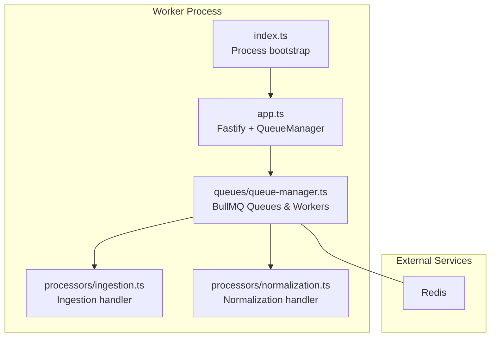
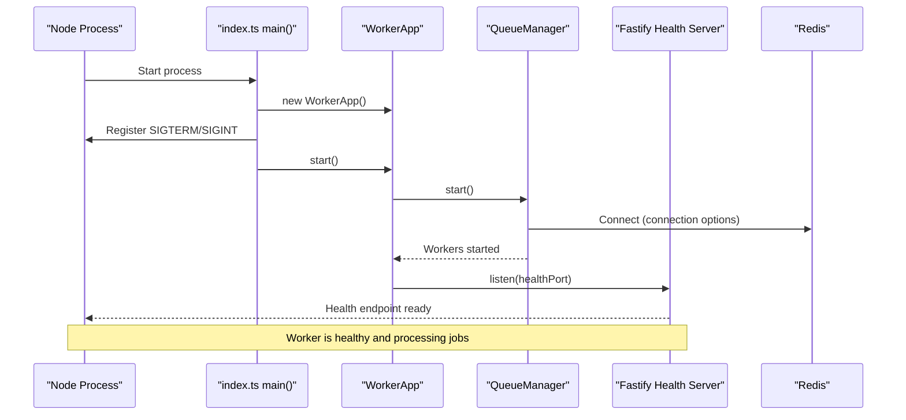
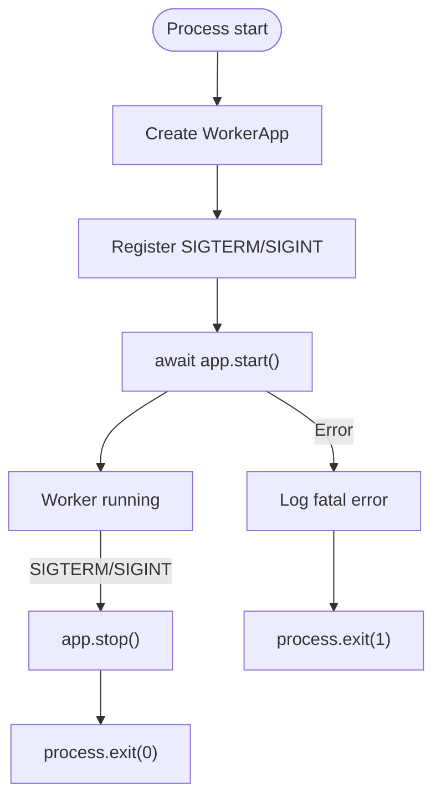
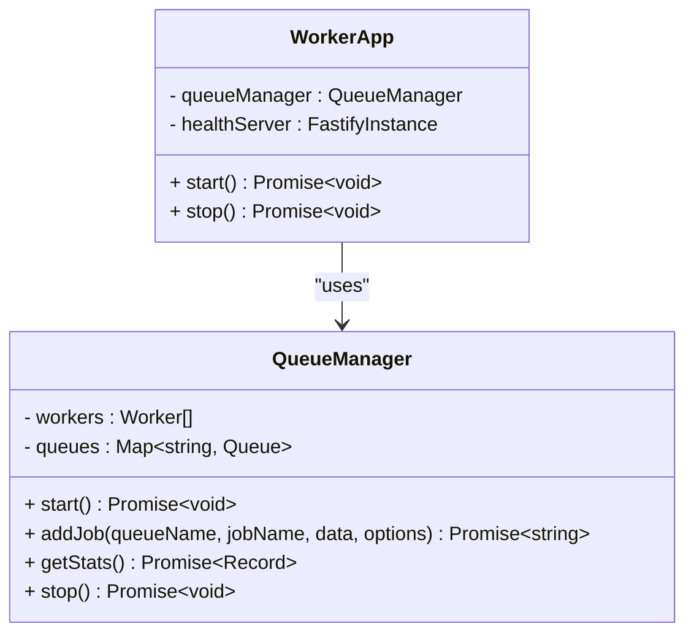
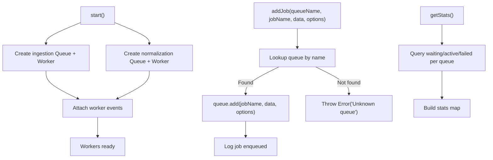
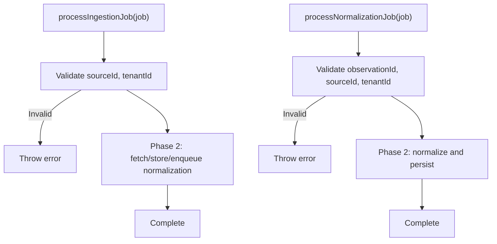
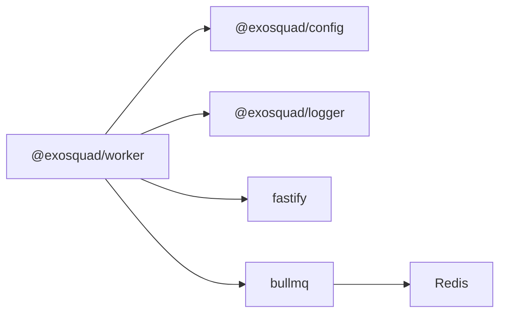
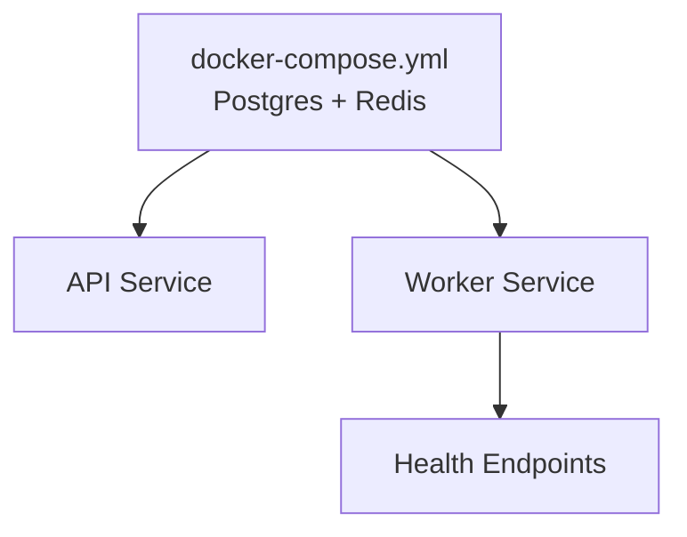

# Worker Orchestration

<cite>
**Referenced Files in This Document**
- [apps/worker/src/index.ts](file://apps/worker/src/index.ts)
- [apps/worker/src/app.ts](file://apps/worker/src/app.ts)
- [apps/worker/src/queues/queue-manager.ts](file://apps/worker/src/queues/queue-manager.ts)
- [apps/worker/src/processors/ingestion.ts](file://apps/worker/src/processors/ingestion.ts)
- [apps/worker/src/processors/normalization.ts](file://apps/worker/src/processors/normalization.ts)
- [apps/worker/package.json](file://apps/worker/package.json)
- [docker-compose.yml](file://docker-compose.yml)
- [packages/config/src/index.ts](file://packages/config/src/index.ts)
- [docs/ARCHITECTURE.md](file://docs/ARCHITECTURE.md)
</cite>

## Table of Contents
1. [Introduction](#introduction)
2. [Project Structure](#project-structure)
3. [Core Components](#core-components)
4. [Architecture Overview](#architecture-overview)
5. [Detailed Component Analysis](#detailed-component-analysis)
6. [Dependency Analysis](#dependency-analysis)
7. [Performance Considerations](#performance-considerations)
8. [Troubleshooting Guide](#troubleshooting-guide)
9. [Conclusion](#conclusion)
10. [Appendices](#appendices)

## Introduction
This document explains the worker service orchestration and lifecycle management for the EXOSQUAD project. It covers how the Fastify application is initialized within the worker context, process initialization, dependency injection patterns, startup sequence, queue manager integration, graceful shutdown, health checks, signal handling, scaling strategies, resource management, inter-process communication, and production deployment considerations.

The worker runs background jobs using BullMQ against Redis and exposes a minimal Fastify HTTP server for health checks on a separate port derived from the API configuration.

## Project Structure
The worker application is implemented under apps/worker with clear separation between entrypoint, application bootstrap, queue orchestration, and job processors:

- Entry point: initializes the worker app, registers OS signals, and starts the process.
- Application layer: constructs dependencies (QueueManager), creates a Fastify health server, and coordinates start/stop.
- Queue orchestration: manages BullMQ queues and workers, adds jobs, collects stats, and handles lifecycle.
- Job processors: define ingestion and normalization job handlers with structured logging.

**Diagram sources**
- [apps/worker/src/index.ts:4-16](file://apps/worker/src/index.ts#L4-L16)
- [apps/worker/src/app.ts:10-59](file://apps/worker/src/app.ts#L10-L59)
- [apps/worker/src/queues/queue-manager.ts:19-60](file://apps/worker/src/queues/queue-manager.ts#L19-L60)
- [apps/worker/src/processors/ingestion.ts:11-54](file://apps/worker/src/processors/ingestion.ts#L11-L54)
- [apps/worker/src/processors/normalization.ts:15-57](file://apps/worker/src/processors/normalization.ts#L15-L57)

**Section sources**
- [apps/worker/src/index.ts:1-23](file://apps/worker/src/index.ts#L1-L23)
- [apps/worker/src/app.ts:1-61](file://apps/worker/src/app.ts#L1-L61)
- [apps/worker/src/queues/queue-manager.ts:1-166](file://apps/worker/src/queues/queue-manager.ts#L1-L166)
- [apps/worker/src/processors/ingestion.ts:1-55](file://apps/worker/src/processors/ingestion.ts#L1-L55)
- [apps/worker/src/processors/normalization.ts:1-58](file://apps/worker/src/processors/normalization.ts#L1-L58)

## Core Components
- WorkerApp: orchestrates QueueManager and a lightweight Fastify server for health endpoints.
- QueueManager: encapsulates BullMQ Queue and Worker instances, job enqueueing, statistics, and lifecycle.
- Processors: ingestion and normalization handlers that validate inputs and perform domain work.

Key responsibilities:
- Dependency injection: WorkerApp constructs QueueManager; QueueManager depends on shared BullMQ connection options sourced from config.
- Health surface: /health returns basic status; /health/ready aggregates queue stats to reflect readiness.
- Lifecycle: start() initializes queues/workers then listens on a health port; stop() closes workers and queues.

**Section sources**
- [apps/worker/src/app.ts:10-59](file://apps/worker/src/app.ts#L10-L59)
- [apps/worker/src/queues/queue-manager.ts:19-139](file://apps/worker/src/queues/queue-manager.ts#L19-L139)

## Architecture Overview
The worker process bootstraps a Node.js process, sets up signal handlers, and starts the WorkerApp. WorkerApp initializes QueueManager and a Fastify server. QueueManager connects to Redis via BullMQ and spins up dedicated workers per queue. The Fastify server exposes health endpoints on a port derived from the API configuration.

**Diagram sources**
- [apps/worker/src/index.ts:4-16](file://apps/worker/src/index.ts#L4-L16)
- [apps/worker/src/app.ts:41-52](file://apps/worker/src/app.ts#L41-L52)
- [apps/worker/src/queues/queue-manager.ts:23-59](file://apps/worker/src/queues/queue-manager.ts#L23-L59)

## Detailed Component Analysis

### Process Bootstrap and Signal Handling
- The entrypoint instantiates WorkerApp, registers SIGTERM and SIGINT handlers, and calls start().
- On shutdown signals, it logs the received signal, invokes app.stop(), and exits cleanly.
- Fatal startup errors are logged and cause exit code 1.

**Diagram sources**
- [apps/worker/src/index.ts:4-22](file://apps/worker/src/index.ts#L4-L22)

**Section sources**
- [apps/worker/src/index.ts:1-23](file://apps/worker/src/index.ts#L1-L23)

### WorkerApp: Fastify Setup and Lifecycle
- Constructs QueueManager and a Fastify instance with internal logger disabled.
- Registers two routes:
  - GET /health: returns static status and service metadata.
  - GET /health/ready: aggregates queue stats and returns 200 when all queues are ok, otherwise 503 with degraded status.
- start():
  - Starts QueueManager (initializes queues and workers).
  - Listens on healthPort = config.PORT + 1, bound to 0.0.0.0.
- stop():
  - Stops QueueManager (closes workers and queues).
  - Closes Fastify server.

**Diagram sources**
- [apps/worker/src/app.ts:10-59](file://apps/worker/src/app.ts#L10-L59)
- [apps/worker/src/queues/queue-manager.ts:19-139](file://apps/worker/src/queues/queue-manager.ts#L19-L139)

**Section sources**
- [apps/worker/src/app.ts:1-61](file://apps/worker/src/app.ts#L1-L61)

### QueueManager: BullMQ Integration
- Connection:
  - Uses shared BullMQ connection options sourced from config (host, port, password).
- Queues and Workers:
  - Creates Queue and Worker for ingestion and normalization.
  - Ingestion worker includes a rate limiter (max 50 jobs per minute).
  - Concurrency is configured via WORKER_CONCURRENCY.
- Job Enqueueing:
  - addJob enqueues with default retry/backoff policies and retention settings.
- Statistics:
  - getStats queries waiting, active, failed counts per queue and marks status ok or error.
- Lifecycle:
  - start() initializes queues/workers and logs counts.
  - stop() closes workers and queues.
- Observability:
  - Attaches completed, failed, and error events to log job durations and failures.

**Diagram sources**
- [apps/worker/src/queues/queue-manager.ts:23-98](file://apps/worker/src/queues/queue-manager.ts#L23-L98)
- [apps/worker/src/queues/queue-manager.ts:103-139](file://apps/worker/src/queues/queue-manager.ts#L103-L139)

**Section sources**
- [apps/worker/src/queues/queue-manager.ts:1-166](file://apps/worker/src/queues/queue-manager.ts#L1-L166)

### Job Processors: Validation and Extensibility
- Ingestion processor:
  - Validates required fields sourceId and tenantId.
  - Logs structured job context.
  - Placeholder for Phase 2 fetching, storage, and downstream normalization job.
- Normalization processor:
  - Validates observationId, sourceId, tenantId.
  - Placeholder for schema mapping, entity resolution, and canonical model creation.

Both processors use child loggers scoped to jobId, jobName, and queue for traceable observability.

**Diagram sources**
- [apps/worker/src/processors/ingestion.ts:11-54](file://apps/worker/src/processors/ingestion.ts#L11-L54)
- [apps/worker/src/processors/normalization.ts:15-57](file://apps/worker/src/processors/normalization.ts#L15-L57)

**Section sources**
- [apps/worker/src/processors/ingestion.ts:1-55](file://apps/worker/src/processors/ingestion.ts#L1-L55)
- [apps/worker/src/processors/normalization.ts:1-58](file://apps/worker/src/processors/normalization.ts#L1-L58)

## Dependency Analysis
- External services:
  - Redis: BullMQ uses ioredis-backed connections defined by config.REDIS_HOST, config.REDIS_PORT, config.REDIS_PASSWORD.
- Internal packages:
  - @exosquad/config: provides validated environment variables including REDIS_* and WORKER_CONCURRENCY.
  - @exosquad/logger: provides logger and child logger utilities.
- Frameworks:
  - Fastify: used for health endpoints only.
  - BullMQ: used for job queues and workers.

**Diagram sources**
- [apps/worker/package.json:15-22](file://apps/worker/package.json#L15-L22)
- [packages/config/src/index.ts:15-33](file://packages/config/src/index.ts#L15-L33)
- [apps/worker/src/queues/queue-manager.ts:1-13](file://apps/worker/src/queues/queue-manager.ts#L1-L13)

**Section sources**
- [apps/worker/package.json:1-30](file://apps/worker/package.json#L1-L30)
- [packages/config/src/index.ts:15-33](file://packages/config/src/index.ts#L15-L33)
- [apps/worker/src/queues/queue-manager.ts:1-13](file://apps/worker/src/queues/queue-manager.ts#L1-L13)

## Performance Considerations
- Concurrency control:
  - WORKER_CONCURRENCY controls parallelism per worker type. Tune based on CPU/memory profiles and Redis capacity.
- Rate limiting:
  - Ingestion worker applies a limiter of max 50 jobs per minute to avoid overwhelming external systems.
- Retention and cleanup:
  - Jobs are removed after completion/failure thresholds to prevent unbounded growth in Redis.
- Health check overhead:
  - /health/ready performs concurrent queue stats queries; ensure monitoring intervals are reasonable to avoid excessive load.

Operational recommendations:
- Monitor queue depths (waiting/active/failed) and latency metrics.
- Scale horizontally by running multiple worker processes behind a container orchestrator rather than increasing concurrency indefinitely.
- Right-size Redis resources and network bandwidth for expected throughput.

[No sources needed since this section provides general guidance]

## Troubleshooting Guide
Common issues and diagnostics:
- Startup failure:
  - Check logs for fatal errors during process initialization.
  - Verify Redis connectivity and credentials from config.
- Degraded readiness:
  - /health/ready returns 503 if any queue reports an error status. Inspect queue stats to identify failing queues.
- Job failures:
  - Review worker event logs for failed jobs, attempts made, and error details.
  - Validate job payloads for missing required fields.
- Graceful shutdown:
  - Ensure SIGTERM/SIGINT handlers are present and app.stop() completes without hanging.

Actionable steps:
- Validate environment variables for REDIS_HOST, REDIS_PORT, REDIS_PASSWORD, and WORKER_CONCURRENCY.
- Confirm ports: API port from config and health port at config.PORT + 1 must be available.
- Inspect Redis connectivity and permissions.

**Section sources**
- [apps/worker/src/index.ts:19-22](file://apps/worker/src/index.ts#L19-L22)
- [apps/worker/src/app.ts:26-38](file://apps/worker/src/app.ts#L26-L38)
- [apps/worker/src/queues/queue-manager.ts:141-164](file://apps/worker/src/queues/queue-manager.ts#L141-L164)

## Conclusion
The worker service follows a clean separation of concerns: a minimal Fastify server for health checks, a QueueManager for BullMQ orchestration, and typed job processors with structured logging. Lifecycle management is explicit through start/stop methods, and process-level signals trigger graceful shutdown. Scaling is achieved by horizontal replication of worker processes, while concurrency and rate limits provide vertical controls. Production deployments should rely on managed Redis, validated environment variables, and robust monitoring around health endpoints and queue metrics.

[No sources needed since this section summarizes without analyzing specific files]

## Appendices

### Deployment Configuration and Operational Notes
- Local development:
  - Infrastructure: PostgreSQL and Redis containers are provided via docker-compose.
  - Run API and worker separately using workspace scripts.
- Production:
  - Container-based deployment with separate API and worker processes.
  - Use managed PostgreSQL and Redis.
  - Validate environment variables at startup and implement zero-downtime deployments.

**Diagram sources**
- [docker-compose.yml:8-39](file://docker-compose.yml#L8-L39)
- [docs/ARCHITECTURE.md:212-240](file://docs/ARCHITECTURE.md#L212-L240)

**Section sources**
- [docker-compose.yml:1-44](file://docker-compose.yml#L1-L44)
- [docs/ARCHITECTURE.md:212-240](file://docs/ARCHITECTURE.md#L212-L240)