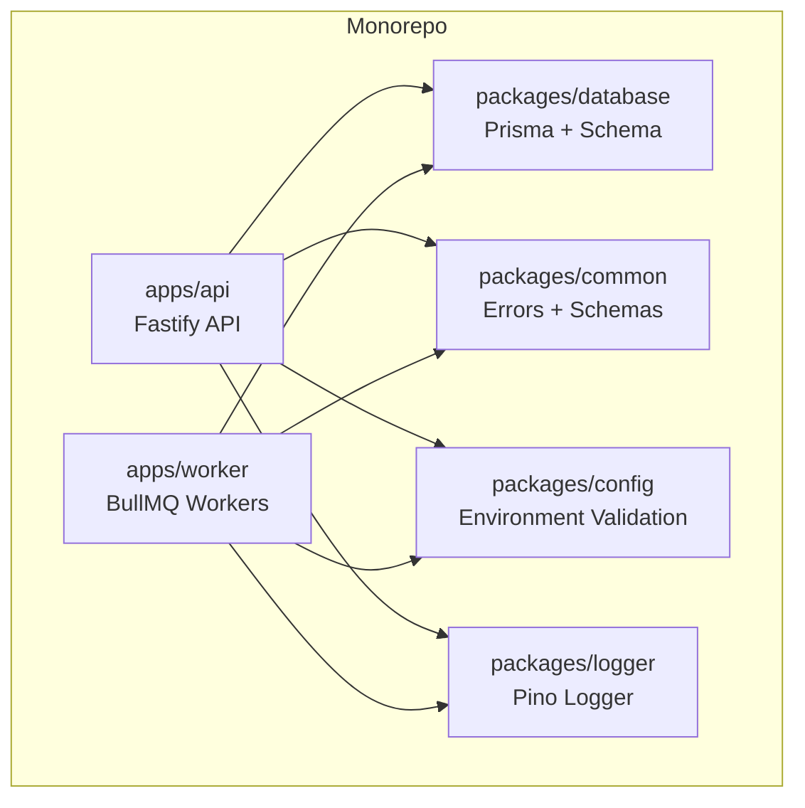
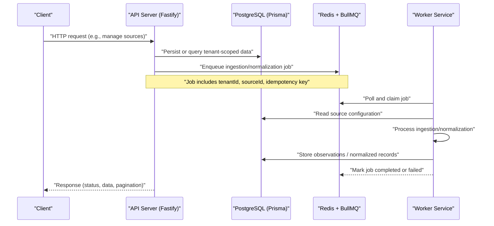
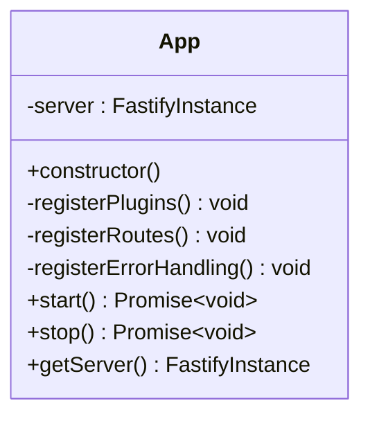
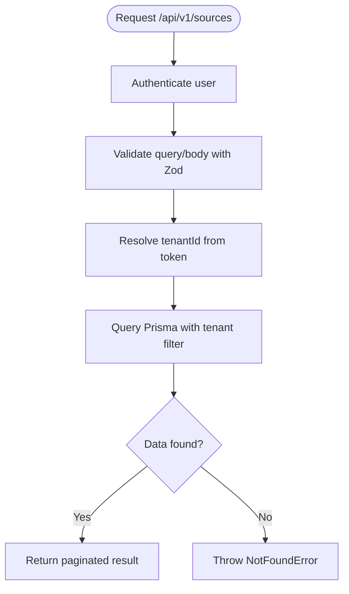
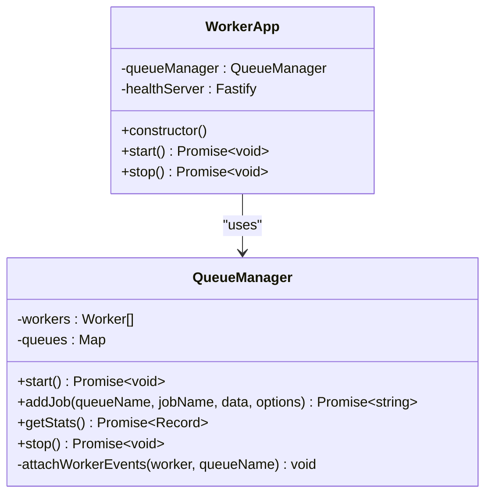
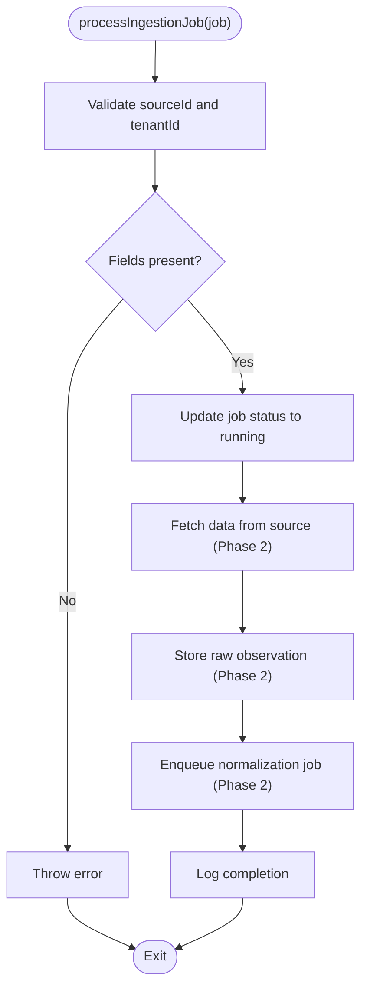
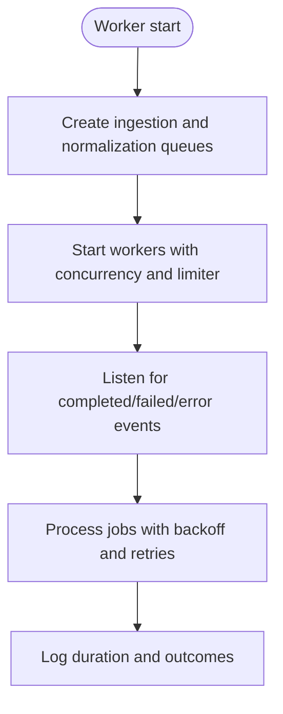
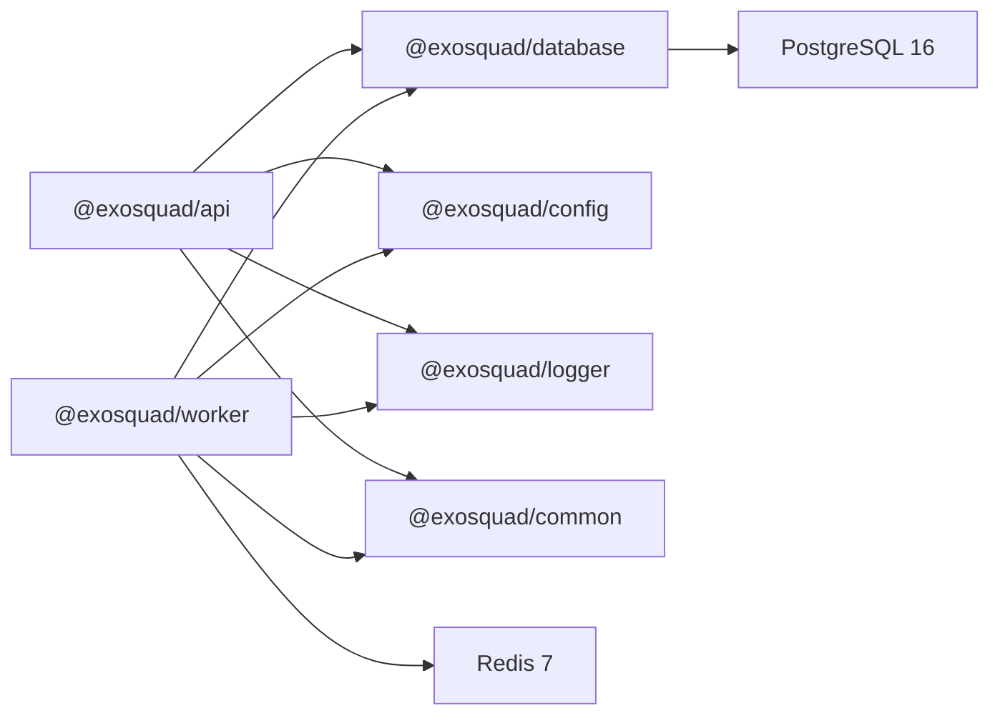

# Project Overview

<cite>
**Referenced Files in This Document**
- [package.json](file://package.json)
- [apps/api/package.json](file://apps/api/package.json)
- [apps/worker/package.json](file://apps/worker/package.json)
- [docs/ARCHITECTURE.md](file://docs/ARCHITECTURE.md)
- [docker-compose.yml](file://docker-compose.yml)
- [apps/api/src/app.ts](file://apps/api/src/app.ts)
- [apps/worker/src/app.ts](file://apps/worker/src/app.ts)
- [apps/api/src/routes/sources.ts](file://apps/api/src/routes/sources.ts)
- [apps/worker/src/queues/queue-manager.ts](file://apps/worker/src/queues/queue-manager.ts)
- [apps/worker/src/processors/ingestion.ts](file://apps/worker/src/processors/ingestion.ts)
</cite>

## Table of Contents
1. [Introduction](#introduction)
2. [Project Structure](#project-structure)
3. [Core Components](#core-components)
4. [Architecture Overview](#architecture-overview)
5. [Detailed Component Analysis](#detailed-component-analysis)
6. [Dependency Analysis](#dependency-analysis)
7. [Performance Considerations](#performance-considerations)
8. [Troubleshooting Guide](#troubleshooting-guide)
9. [Conclusion](#conclusion)

## Introduction
Exosquad is a multi-tenant SaaS platform that provides foreign-product intelligence and supply network capabilities for Bangladesh. It ingests data from real external sources, normalizes it into a canonical model, resolves product entities, and delivers actionable insights around supply, demand, authenticity, logistics, landed cost, and reseller decision-making. The system follows a pipeline architecture where deterministic calculations remain deterministic and AI serves as an interface and reasoning layer over the infrastructure. External data is never fabricated.

The project’s purpose is to make cross-border product discovery, sourcing, and verification practical for Bangladeshi businesses by turning fragmented external signals into reliable, auditable intelligence.

**Section sources**
- [docs/ARCHITECTURE.md:1-20](file://docs/ARCHITECTURE.md#L1-L20)

## Project Structure
Exosquad is a TypeScript monorepo managed with pnpm and Turborepo. It contains two primary applications and shared packages:

- apps/api: Fastify HTTP API server handling authentication, authorization, rate limiting, request tracking, and domain routes such as source management.
- apps/worker: BullMQ-based worker service running ingestion and normalization job processors with a minimal health endpoint.
- packages/common, config, database, logger: Shared libraries for error types, validation schemas, Prisma client and migrations, environment configuration, and structured logging.

**Diagram sources**
- [package.json:1-33](file://package.json#L1-L33)
- [apps/api/package.json:1-37](file://apps/api/package.json#L1-L37)
- [apps/worker/package.json:1-30](file://apps/worker/package.json#L1-L30)

**Section sources**
- [package.json:1-33](file://package.json#L1-L33)
- [apps/api/package.json:1-37](file://apps/api/package.json#L1-L37)
- [apps/worker/package.json:1-30](file://apps/worker/package.json#L1-L30)

## Core Components
- API Server (Fastify): Handles all client requests, enforces authentication and authorization, applies rate limits and security headers, tracks requests with correlation IDs, and exposes domain routes such as source management.
- Worker Service (BullMQ): Runs asynchronous jobs for ingestion and normalization, with independent scaling and graceful shutdown.
- Database Layer (PostgreSQL + Prisma): Multi-tenant schema with tenant isolation, append-only observations, and entity resolution foundations.
- Queue Layer (Redis + BullMQ): Reliable job processing with retries, backoff, dead-letter queue, idempotency keys, and structured logging.
- Shared Libraries: Common errors and schemas, environment validation, and Pino-based structured logging.

Key technology stack:
- Language: TypeScript (strict)
- Runtime: Node.js ≥20
- API: Fastify v5
- Database: PostgreSQL 16
- ORM: Prisma
- Queue: BullMQ + Redis 7
- Auth: jose (JWT)
- Validation: Zod
- Logging: Pino
- Testing: Vitest
- Dev tooling: pnpm + Turborepo, Docker Compose

**Section sources**
- [docs/ARCHITECTURE.md:24-40](file://docs/ARCHITECTURE.md#L24-L40)
- [docs/ARCHITECTURE.md:43-65](file://docs/ARCHITECTURE.md#L43-L65)
- [docs/ARCHITECTURE.md:68-93](file://docs/ARCHITECTURE.md#L68-L93)
- [docs/ARCHITECTURE.md:95-112](file://docs/ARCHITECTURE.md#L95-L112)

## Architecture Overview
Exosquad separates stateless API requests from long-running background work. The API validates input, authenticates users, persists configuration, and enqueues jobs. The worker consumes jobs from Redis-backed queues, processes them, and updates the database. Health endpoints expose liveness and readiness for both services.

**Diagram sources**
- [apps/api/src/app.ts:12-37](file://apps/api/src/app.ts#L12-L37)
- [apps/worker/src/app.ts:10-53](file://apps/worker/src/app.ts#L10-L53)
- [apps/worker/src/queues/queue-manager.ts:19-60](file://apps/worker/src/queues/queue-manager.ts#L19-L60)

## Detailed Component Analysis

### API Server
The API server initializes a Fastify instance, registers plugins for request tracking, authentication, rate limiting, and security headers, mounts route groups, and defines a centralized error handler. It listens on a configurable port and exposes health routes.

Key responsibilities:
- Plugin registration for cross-cutting concerns
- Route mounting under versioned prefixes
- Centralized error handling with typed responses
- Graceful start/stop lifecycle

**Diagram sources**
- [apps/api/src/app.ts:12-95](file://apps/api/src/app.ts#L12-L95)

**Section sources**
- [apps/api/src/app.ts:12-95](file://apps/api/src/app.ts#L12-L95)

### Source Management Routes
Source routes demonstrate authenticated access, tenant scoping, schema validation via Zod, pagination, and CRUD operations against Prisma-managed tables. They illustrate how business data is isolated per tenant and validated at runtime.

Highlights:
- Authentication pre-handler ensures protected access
- Tenant isolation using user context
- Zod schemas for input validation
- Pagination helpers for list endpoints
- Soft delete pattern for disabling sources

**Diagram sources**
- [apps/api/src/routes/sources.ts:28-117](file://apps/api/src/routes/sources.ts#L28-L117)

**Section sources**
- [apps/api/src/routes/sources.ts:1-118](file://apps/api/src/routes/sources.ts#L1-L118)

### Worker Service
The worker service starts BullMQ workers for ingestion and normalization, exposes a minimal health endpoint, and manages graceful shutdown. It connects to Redis using configured credentials and logs structured metrics for job completion and failures.

Highlights:
- Separate health server on a dedicated port
- Queue statistics exposed for readiness checks
- Concurrency and rate limiting per queue
- Structured logging with child loggers

**Diagram sources**
- [apps/worker/src/app.ts:10-60](file://apps/worker/src/app.ts#L10-L60)
- [apps/worker/src/queues/queue-manager.ts:19-165](file://apps/worker/src/queues/queue-manager.ts#L19-L165)

**Section sources**
- [apps/worker/src/app.ts:10-60](file://apps/worker/src/app.ts#L10-L60)
- [apps/worker/src/queues/queue-manager.ts:1-166](file://apps/worker/src/queues/queue-manager.ts#L1-L166)

### Ingestion Job Processor
The ingestion processor establishes the job lifecycle: validate inputs, update status, fetch data (placeholder), store raw observations (placeholder), and enqueue normalization (placeholder). It uses structured child logging bound to jobId, jobName, and queue name.

**Diagram sources**
- [apps/worker/src/processors/ingestion.ts:11-54](file://apps/worker/src/processors/ingestion.ts#L11-L54)

**Section sources**
- [apps/worker/src/processors/ingestion.ts:1-55](file://apps/worker/src/processors/ingestion.ts#L1-L55)

### Multi-Tenant SaaS Capabilities
Every table includes a tenant identifier, and queries are filtered by tenant to enforce isolation at both application and database levels. The API routes consistently derive tenant context from authenticated requests, ensuring strict separation between tenants’ data.

Key aspects:
- Tenant-scoped queries across all resources
- JWT tokens include tenant identifiers
- Audit trails and evidence chains support compliance and provenance

**Section sources**
- [docs/ARCHITECTURE.md:70-93](file://docs/ARCHITECTURE.md#L70-L93)
- [apps/api/src/routes/sources.ts:34-79](file://apps/api/src/routes/sources.ts#L34-L79)

### Asynchronous Job Processing Pipeline
The queue strategy defines separate queues for ingestion and normalization, with concurrency controls, rate limiting, exponential backoff, max attempts, dead-letter queue, idempotency keys, and structured logging. The worker attaches event listeners for completion, failure, and error events.

**Diagram sources**
- [apps/worker/src/queues/queue-manager.ts:23-60](file://apps/worker/src/queues/queue-manager.ts#L23-L60)
- [apps/worker/src/queues/queue-manager.ts:141-164](file://apps/worker/src/queues/queue-manager.ts#L141-L164)

**Section sources**
- [docs/ARCHITECTURE.md:95-112](file://docs/ARCHITECTURE.md#L95-L112)
- [apps/worker/src/queues/queue-manager.ts:1-166](file://apps/worker/src/queues/queue-manager.ts#L1-L166)

### Scalability Features
- Independent scaling of API and worker services
- Redis-backed queues enable horizontal scaling of workers
- Concurrency and rate limiting protect downstream systems
- Graceful shutdown ensures in-flight jobs complete before termination
- Health endpoints provide liveness and readiness for orchestration platforms

**Section sources**
- [docs/ARCHITECTURE.md:43-58](file://docs/ARCHITECTURE.md#L43-L58)
- [apps/worker/src/app.ts:41-53](file://apps/worker/src/app.ts#L41-L53)

### Business Value Proposition and Target Use Cases
Exosquad targets supply chain intelligence in Bangladesh by:
- Discovering foreign products and suppliers through real external sources
- Normalizing heterogeneous data into a canonical model for consistent analysis
- Resolving product identities across brands, SKUs, GTINs, and variants
- Providing authenticity analysis and landed-cost insights
- Supporting resellers with actionable opportunity intelligence

This enables importers, distributors, and resellers to make informed sourcing decisions, reduce risk, and optimize margins.

**Section sources**
- [docs/ARCHITECTURE.md:1-20](file://docs/ARCHITECTURE.md#L1-L20)
- [docs/ARCHITECTURE.md:70-93](file://docs/ARCHITECTURE.md#L70-L93)

## Dependency Analysis
The API depends on shared packages for configuration, logging, common types, and the database client. The worker depends on BullMQ and Redis for job processing, plus the same shared packages. Local development relies on Docker Compose to run PostgreSQL and Redis.

**Diagram sources**
- [apps/api/package.json:15-29](file://apps/api/package.json#L15-L29)
- [apps/worker/package.json:15-23](file://apps/worker/package.json#L15-L23)
- [docker-compose.yml:8-39](file://docker-compose.yml#L8-L39)

**Section sources**
- [apps/api/package.json:15-29](file://apps/api/package.json#L15-L29)
- [apps/worker/package.json:15-23](file://apps/worker/package.json#L15-L23)
- [docker-compose.yml:1-44](file://docker-compose.yml#L1-L44)

## Performance Considerations
- Fastify provides high-performance HTTP handling with plugin architecture and schema validation.
- BullMQ with Redis offers reliable, scalable job processing with built-in retry and rate-limiting strategies.
- PostgreSQL 16 supports JSONB for flexible payloads while maintaining ACID guarantees.
- Structured logging with Pino reduces overhead and improves observability.
- Request timeouts and trust proxy settings help balance responsiveness and resilience behind proxies.

[No sources needed since this section provides general guidance]

## Troubleshooting Guide
Common operational checks:
- API health: verify process liveness and dependency reachability
- Worker health: check queue connectivity and queue stats for degraded states
- Job failures: inspect structured logs for jobId, queue, attempts, and error details
- Rate limiting: confirm per-IP limits and response headers when encountering 429s
- Authentication: ensure JWT tokens contain required claims and are within expiration

Operational references:
- Health endpoints for API and worker
- Queue statistics for readiness probes
- Structured logging conventions for distributed tracing

**Section sources**
- [docs/ARCHITECTURE.md:173-192](file://docs/ARCHITECTURE.md#L173-L192)
- [apps/worker/src/app.ts:20-38](file://apps/worker/src/app.ts#L20-L38)
- [apps/worker/src/queues/queue-manager.ts:100-125](file://apps/worker/src/queues/queue-manager.ts#L100-L125)

## Conclusion
Exosquad provides a robust, multi-tenant SaaS foundation for foreign-product intelligence and supply network operations in Bangladesh. Its microservices architecture separates API and worker responsibilities, leveraging Fastify, BullMQ, Prisma, and TypeScript to deliver secure, scalable, and observable systems. The asynchronous job pipeline ensures resilient ingestion and normalization of external data, enabling actionable supply chain insights for Bangladeshi businesses.

[No sources needed since this section summarizes without analyzing specific files]