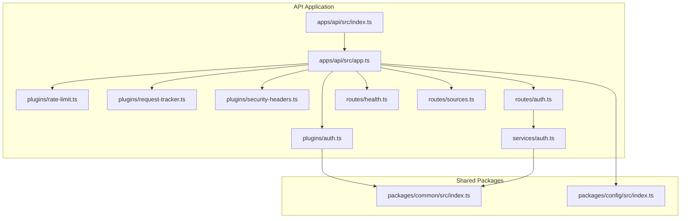
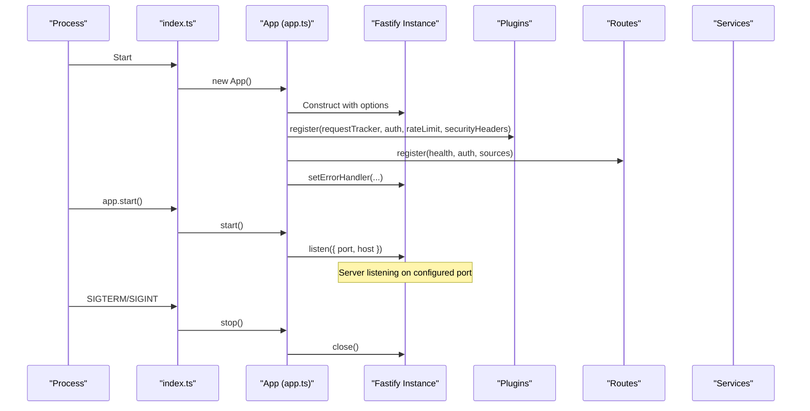
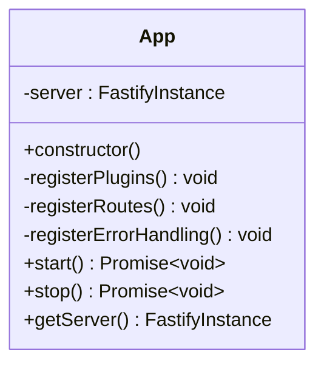
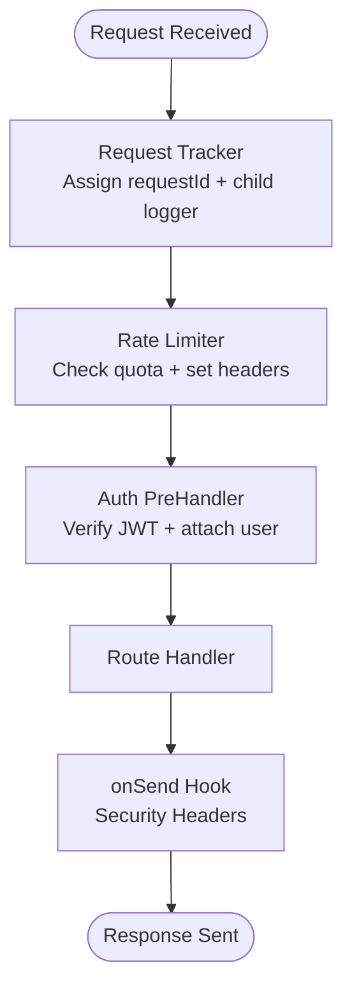
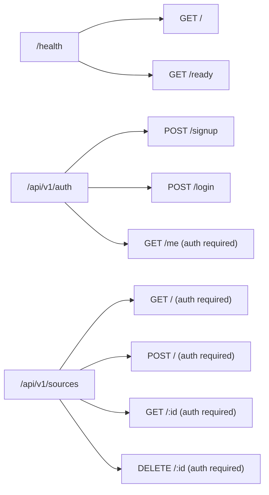
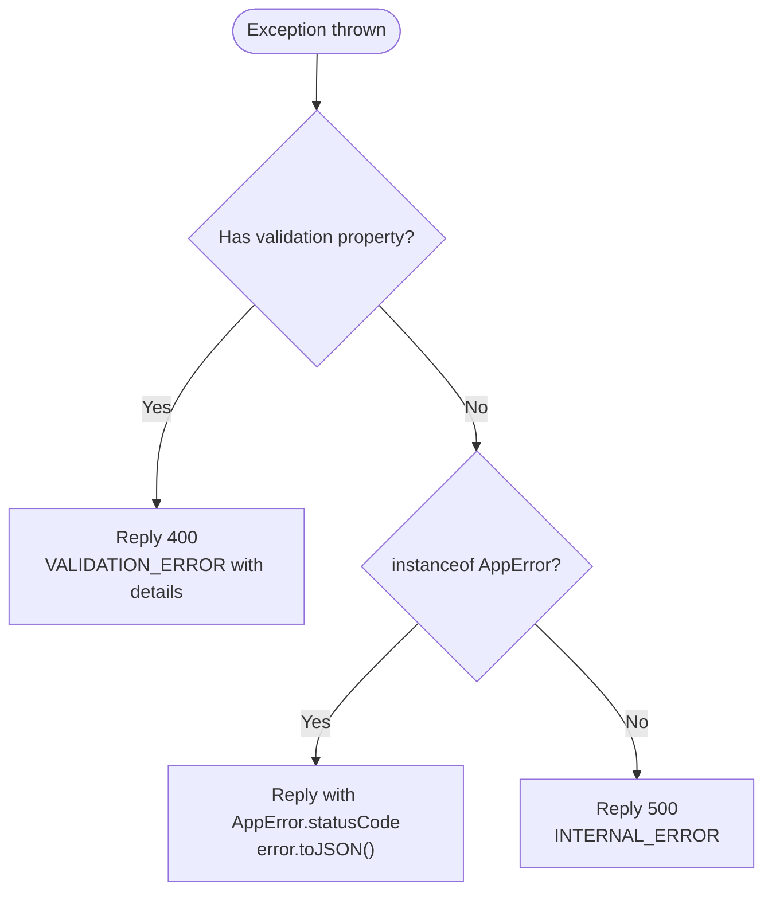
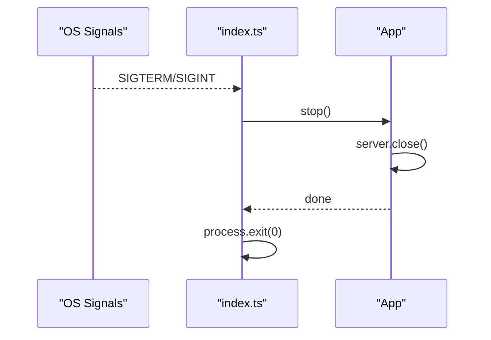
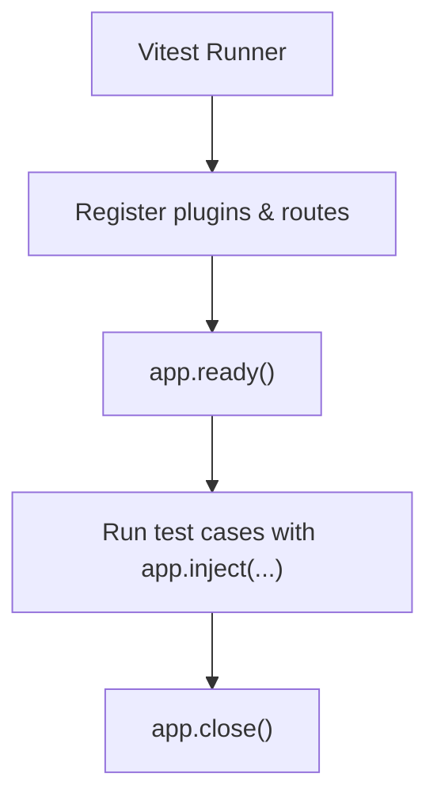
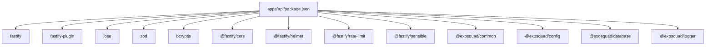

# API Service

<cite>
**Referenced Files in This Document**
- [app.ts](file://apps/api/src/app.ts)
- [index.ts](file://apps/api/src/index.ts)
- [auth.ts](file://apps/api/src/plugins/auth.ts)
- [rate-limit.ts](file://apps/api/src/plugins/rate-limit.ts)
- [request-tracker.ts](file://apps/api/src/plugins/request-tracker.ts)
- [security-headers.ts](file://apps/api/src/plugins/security-headers.ts)
- [auth.ts](file://apps/api/src/routes/auth.ts)
- [health.ts](file://apps/api/src/routes/health.ts)
- [sources.ts](file://apps/api/src/routes/sources.ts)
- [auth.ts](file://apps/api/src/services/auth.ts)
- [package.json](file://apps/api/package.json)
- [index.ts](file://packages/common/src/index.ts)
- [index.ts](file://packages/config/src/index.ts)
- [auth.test.ts](file://apps/api/test/integration/auth.test.ts)
- [health.test.ts](file://apps/api/test/integration/health.test.ts)
- [vitest.config.integration.ts](file://apps/api/vitest.config.integration.ts)
</cite>

## Table of Contents
1. [Introduction](#introduction)
2. [Project Structure](#project-structure)
3. [Core Components](#core-components)
4. [Architecture Overview](#architecture-overview)
5. [Detailed Component Analysis](#detailed-component-analysis)
6. [Dependency Analysis](#dependency-analysis)
7. [Performance Considerations](#performance-considerations)
8. [Troubleshooting Guide](#troubleshooting-guide)
9. [Conclusion](#conclusion)
10. [Appendices](#appendices)

## Introduction
This document explains the Exosquad API service implementation built on Fastify. It covers application bootstrap, server configuration (including request timeout and proxy settings), the App class architecture, plugin registration lifecycle, route organization, error handling strategy with custom AppError types, environment configuration, port binding, graceful shutdown, testing patterns, and production deployment considerations.

## Project Structure
The API is a Fastify application organized by features:
- Application entrypoint and lifecycle management
- Plugins for cross-cutting concerns (authentication, rate limiting, request tracking, security headers)
- Routes grouped by domain (auth, health, sources)
- Services encapsulating business logic (auth)
- Shared packages for common errors/types and validated environment configuration

**Diagram sources**
- [index.ts:1-23](file://apps/api/src/index.ts#L1-L23)
- [app.ts:1-96](file://apps/api/src/app.ts#L1-L96)
- [auth.ts:1-101](file://apps/api/src/plugins/auth.ts#L1-L101)
- [rate-limit.ts:1-62](file://apps/api/src/plugins/rate-limit.ts#L1-L62)
- [request-tracker.ts:1-43](file://apps/api/src/plugins/request-tracker.ts#L1-L43)
- [security-headers.ts:1-31](file://apps/api/src/plugins/security-headers.ts#L1-L31)
- [auth.ts:1-68](file://apps/api/src/routes/auth.ts#L1-L68)
- [health.ts:1-48](file://apps/api/src/routes/health.ts#L1-L48)
- [sources.ts:1-118](file://apps/api/src/routes/sources.ts#L1-L118)
- [auth.ts:1-190](file://apps/api/src/services/auth.ts#L1-L190)
- [index.ts:1-143](file://packages/common/src/index.ts#L1-L143)
- [index.ts:1-56](file://packages/config/src/index.ts#L1-L56)

**Section sources**
- [index.ts:1-23](file://apps/api/src/index.ts#L1-L23)
- [app.ts:1-96](file://apps/api/src/app.ts#L1-L96)
- [package.json:1-37](file://apps/api/package.json#L1-L37)

## Core Components
- App class: Bootstraps Fastify, registers plugins and routes, configures global error handling, exposes start/stop methods, and provides access to the underlying instance for tests.
- Plugins:
  - Authentication: JWT verification and preHandler decorator.
  - Rate limiting: In-memory per-IP limiter with standard headers.
  - Request tracker: Unique request ID and child logger injection.
  - Security headers: Standard response headers and HSTS in production.
- Routes:
  - Auth: Signup, login, and authenticated profile retrieval.
  - Health: Liveness and readiness probes including DB connectivity check.
  - Sources: CRUD operations with tenant scoping and pagination.
- Services:
  - AuthService: User/tenant management, password hashing, token issuance, and profile retrieval.
- Shared packages:
  - Common: Error hierarchy and shared validation schemas/types.
  - Config: Environment validation and typed configuration.

**Section sources**
- [app.ts:12-95](file://apps/api/src/app.ts#L12-L95)
- [auth.ts:1-101](file://apps/api/src/plugins/auth.ts#L1-L101)
- [rate-limit.ts:1-62](file://apps/api/src/plugins/rate-limit.ts#L1-L62)
- [request-tracker.ts:1-43](file://apps/api/src/plugins/request-tracker.ts#L1-L43)
- [security-headers.ts:1-31](file://apps/api/src/plugins/security-headers.ts#L1-L31)
- [auth.ts:1-68](file://apps/api/src/routes/auth.ts#L1-L68)
- [health.ts:1-48](file://apps/api/src/routes/health.ts#L1-L48)
- [sources.ts:1-118](file://apps/api/src/routes/sources.ts#L1-L118)
- [auth.ts:1-190](file://apps/api/src/services/auth.ts#L1-L190)
- [index.ts:1-143](file://packages/common/src/index.ts#L1-L143)
- [index.ts:1-56](file://packages/config/src/index.ts#L1-L56)

## Architecture Overview
The API follows a layered structure:
- Entry point initializes App and handles process signals for graceful shutdown.
- App constructs Fastify with explicit server options (logger disabled, requestTimeout, trustProxy).
- Plugin layer adds cross-cutting behavior via hooks and decorators.
- Route handlers validate input, delegate to services, and return standardized responses.
- Global error handler normalizes validation errors, known AppError subclasses, and unknown errors.

**Diagram sources**
- [index.ts:4-22](file://apps/api/src/index.ts#L4-L22)
- [app.ts:15-89](file://apps/api/src/app.ts#L15-L89)

## Detailed Component Analysis

### App Class and Bootstrap
Responsibilities:
- Create Fastify instance with:
  - Logger disabled (uses external logger)
  - Request timeout set to 30 seconds
  - Proxy trust enabled
- Register plugins and routes
- Install global error handler
- Provide start/stop lifecycle methods
- Expose Fastify instance for testing

Key behaviors:
- Plugin registration order ensures request tracking runs before authentication and rate limiting.
- Routes are mounted under prefixes for clear namespace separation.
- Error handler differentiates between Fastify schema validation errors, known AppError subclasses, and unexpected errors.

**Diagram sources**
- [app.ts:12-95](file://apps/api/src/app.ts#L12-L95)

**Section sources**
- [app.ts:15-25](file://apps/api/src/app.ts#L15-L25)
- [app.ts:27-37](file://apps/api/src/app.ts#L27-L37)
- [app.ts:39-71](file://apps/api/src/app.ts#L39-L71)
- [app.ts:73-95](file://apps/api/src/app.ts#L73-L95)

### Plugin Registration Lifecycle
Order and purpose:
- Request tracker: Assigns requestId and injects child logger into each request.
- Authentication: Adds authenticate preHandler and user context to requests.
- Rate limiting: Enforces per-IP request limits and sets rate limit headers.
- Security headers: Applies security-related headers to all responses.

Lifecycle highlights:
- onRequest hooks run early; onSend hooks run late.
- The authentication plugin uses fastify-plugin to expose a global decorate method.

**Diagram sources**
- [request-tracker.ts:9-28](file://apps/api/src/plugins/request-tracker.ts#L9-L28)
- [rate-limit.ts:28-60](file://apps/api/src/plugins/rate-limit.ts#L28-L60)
- [auth.ts:70-93](file://apps/api/src/plugins/auth.ts#L70-L93)
- [security-headers.ts:7-30](file://apps/api/src/plugins/security-headers.ts#L7-L30)

**Section sources**
- [request-tracker.ts:1-43](file://apps/api/src/plugins/request-tracker.ts#L1-L43)
- [auth.ts:1-101](file://apps/api/src/plugins/auth.ts#L1-L101)
- [rate-limit.ts:1-62](file://apps/api/src/plugins/rate-limit.ts#L1-L62)
- [security-headers.ts:1-31](file://apps/api/src/plugins/security-headers.ts#L1-L31)

### Route Organization
- Health routes:
  - GET /health: Liveness probe returning status and timestamp.
  - GET /health/ready: Readiness probe checking database connectivity and reporting overall status.
- Auth routes:
  - POST /api/v1/auth/signup: Validates input, creates tenant and user, returns token.
  - POST /api/v1/auth/login: Authenticates user and returns token.
  - GET /api/v1/auth/me: Requires authentication; returns user profile.
- Sources routes:
  - All endpoints require authentication via a group-level preHandler.
  - Provides paginated listing, creation, retrieval, and soft deletion (status update).

**Diagram sources**
- [health.ts:9-47](file://apps/api/src/routes/health.ts#L9-L47)
- [auth.ts:23-67](file://apps/api/src/routes/auth.ts#L23-L67)
- [sources.ts:28-117](file://apps/api/src/routes/sources.ts#L28-L117)

**Section sources**
- [health.ts:1-48](file://apps/api/src/routes/health.ts#L1-L48)
- [auth.ts:1-68](file://apps/api/src/routes/auth.ts#L1-L68)
- [sources.ts:1-118](file://apps/api/src/routes/sources.ts#L1-L118)

### Error Handling Strategy
Global error handler behavior:
- Fastify schema validation errors: Respond with 400 and a structured VALIDATION_ERROR payload including details.
- Known AppError subclasses: Respond with the error’s statusCode and JSON representation from toJSON().
- Unknown errors: Respond with 500 and INTERNAL_ERROR without leaking internals.

AppError hierarchy:
- Base AppError includes statusCode, code, optional context, and toJSON().
- Specialized errors include NotFoundError, UnauthorizedError, ForbiddenError, ConflictError, ValidationError, RateLimitError, SourceError.

**Diagram sources**
- [app.ts:39-71](file://apps/api/src/app.ts#L39-L71)
- [index.ts:11-40](file://packages/common/src/index.ts#L11-L40)
- [index.ts:42-93](file://packages/common/src/index.ts#L42-L93)

**Section sources**
- [app.ts:39-71](file://apps/api/src/app.ts#L39-L71)
- [index.ts:11-93](file://packages/common/src/index.ts#L11-L93)

### Service Startup and Graceful Shutdown
Startup:
- index.ts instantiates App, attaches SIGTERM and SIGINT listeners, then calls app.start().
- app.start() listens on the configured PORT bound to 0.0.0.0 and logs startup.

Shutdown:
- On SIGTERM or SIGINT, index.ts invokes app.stop(), which closes the Fastify server and logs completion.

**Diagram sources**
- [index.ts:4-22](file://apps/api/src/index.ts#L4-L22)
- [app.ts:73-89](file://apps/api/src/app.ts#L73-L89)

**Section sources**
- [index.ts:4-22](file://apps/api/src/index.ts#L4-L22)
- [app.ts:73-89](file://apps/api/src/app.ts#L73-L89)

### Testing Patterns
Integration tests:
- Auth routes test validates input shape and enforces authentication on protected endpoints.
- Health routes test verifies liveness and readiness endpoints.
- Tests use Fastify’s inject helper to simulate HTTP requests against registered routes.

Configuration:
- Integration tests use a dedicated Vitest config with longer timeouts and node environment.

**Diagram sources**
- [auth.test.ts:1-49](file://apps/api/test/integration/auth.test.ts#L1-L49)
- [health.test.ts:1-45](file://apps/api/test/integration/health.test.ts#L1-L45)
- [vitest.config.integration.ts:1-11](file://apps/api/vitest.config.integration.ts#L1-L11)

**Section sources**
- [auth.test.ts:1-49](file://apps/api/test/integration/auth.test.ts#L1-L49)
- [health.test.ts:1-45](file://apps/api/test/integration/health.test.ts#L1-L45)
- [vitest.config.integration.ts:1-11](file://apps/api/vitest.config.integration.ts#L1-L11)

## Dependency Analysis
External dependencies relevant to API runtime:
- Fastify core and plugin system
- @fastify/cors, @fastify/helmet, @fastify/rate-limit, @fastify/sensible (declared)
- jose for JWT operations
- zod for schema validation
- bcryptjs for password hashing
- Workspace packages: @exosquad/common, @exosquad/config, @exosquad/database, @exosquad/logger

**Diagram sources**
- [package.json:15-29](file://apps/api/package.json#L15-L29)

**Section sources**
- [package.json:1-37](file://apps/api/package.json#L1-L37)

## Performance Considerations
- Request timeout: Set to 30 seconds at the Fastify level to prevent long-running requests from hanging indefinitely.
- Rate limiting: In-memory limiter is simple but not horizontally scalable; replace with Redis-backed solution in production.
- Logging: Use child loggers per request for efficient correlation and reduced overhead.
- Security headers: Apply minimal headers in development; enable HSTS in production.
- Database queries: Use pagination and selective fields to reduce payload size and improve throughput.

[No sources needed since this section provides general guidance]

## Troubleshooting Guide
Common issues and resolutions:
- Validation errors: Ensure request payloads conform to Zod schemas used in routes; check error details in the response body.
- Authentication failures: Verify Authorization header format (Bearer <token>) and that the token is signed with the configured secret and algorithm.
- Rate limiting: If receiving 429 responses, back off according to retry-after header or adjust limits in the rate-limit plugin.
- Health checks: If readiness reports degraded, verify database connectivity and credentials.

Operational tips:
- Inspect logs for unhandled errors and validation failures.
- Use the /health endpoint for liveness and /health/ready for dependency checks.
- For local development, ensure environment variables meet the config schema requirements.

**Section sources**
- [app.ts:39-71](file://apps/api/src/app.ts#L39-L71)
- [rate-limit.ts:28-60](file://apps/api/src/plugins/rate-limit.ts#L28-L60)
- [health.ts:9-47](file://apps/api/src/routes/health.ts#L9-L47)
- [index.ts:11-56](file://packages/config/src/index.ts#L11-L56)

## Conclusion
The Exosquad API service is a well-structured Fastify application with clear separation of concerns across plugins, routes, and services. It employs robust error handling, typed configuration, and comprehensive testing patterns. With explicit server configuration, graceful shutdown, and standardized error responses, it is ready for production deployment with additional hardening such as Redis-backed rate limiting and proper CSP configuration.

[No sources needed since this section summarizes without analyzing specific files]

## Appendices

### Environment Configuration and Port Binding
- Environment variables are validated at startup using a strict schema. Required values include DATABASE_URL, JWT_SECRET, and others. Defaults are provided where applicable.
- The API binds to 0.0.0.0 on the configured PORT.

**Section sources**
- [index.ts:10-34](file://packages/config/src/index.ts#L10-L34)
- [app.ts:73-84](file://apps/api/src/app.ts#L73-L84)

### Production Deployment Considerations
- Replace in-memory rate limiter with a distributed store (e.g., Redis) for horizontal scaling.
- Configure Content Security Policy based on frontend requirements.
- Enable HSTS only in production environments.
- Ensure JWT_SECRET meets minimum length and complexity requirements.
- Use container orchestration to handle SIGTERM gracefully and scale replicas.

**Section sources**
- [rate-limit.ts:1-62](file://apps/api/src/plugins/rate-limit.ts#L1-L62)
- [security-headers.ts:10-27](file://apps/api/src/plugins/security-headers.ts#L10-L27)
- [index.ts:27-30](file://packages/config/src/index.ts#L27-L30)