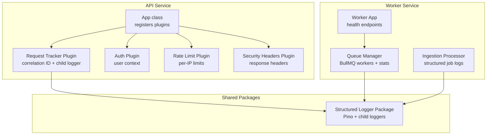
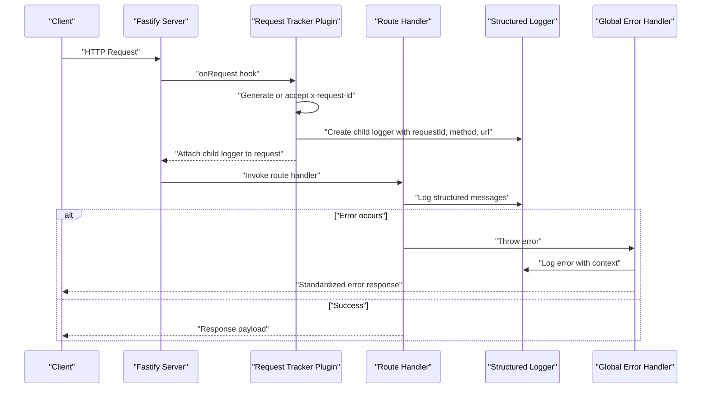
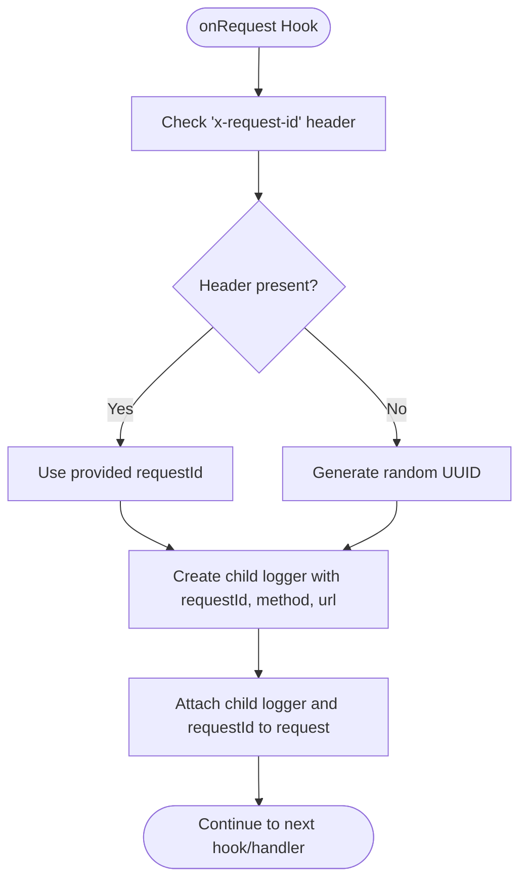
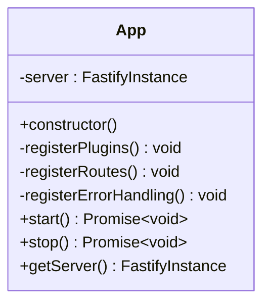
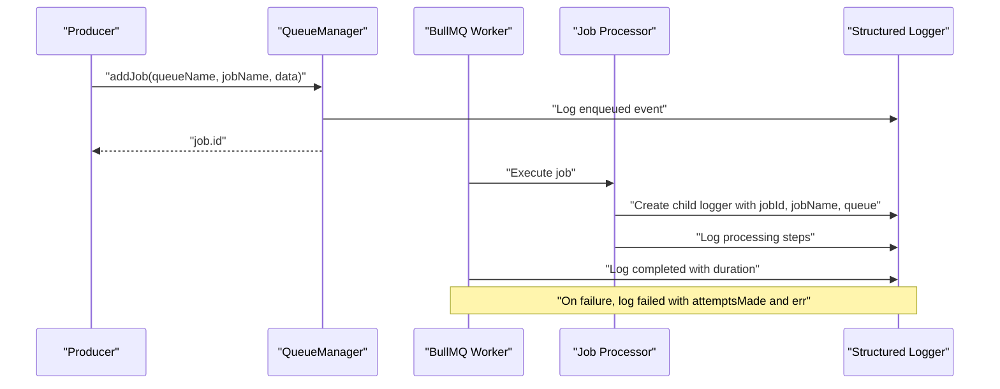
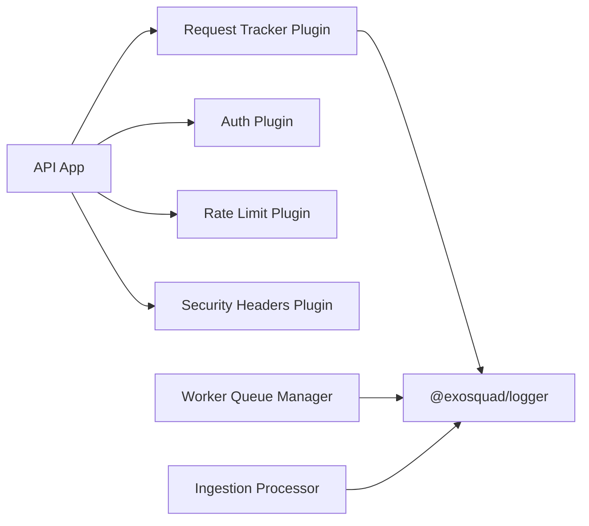

# Request Tracking System

<cite>
**Referenced Files in This Document**
- [request-tracker.ts](file://apps/api/src/plugins/request-tracker.ts)
- [app.ts (API)](file://apps/api/src/app.ts)
- [index.ts (logger package)](file://packages/logger/src/index.ts)
- [auth.ts](file://apps/api/src/plugins/auth.ts)
- [rate-limit.ts](file://apps/api/src/plugins/rate-limit.ts)
- [security-headers.ts](file://apps/api/src/plugins/security-headers.ts)
- [queue-manager.ts](file://apps/worker/src/queues/queue-manager.ts)
- [ingestion.ts](file://apps/worker/src/processors/ingestion.ts)
- [app.ts (Worker)](file://apps/worker/src/app.ts)
</cite>

## Table of Contents
1. [Introduction](#introduction)
2. [Project Structure](#project-structure)
3. [Core Components](#core-components)
4. [Architecture Overview](#architecture-overview)
5. [Detailed Component Analysis](#detailed-component-analysis)
6. [Dependency Analysis](#dependency-analysis)
7. [Performance Considerations](#performance-considerations)
8. [Troubleshooting Guide](#troubleshooting-guide)
9. [Conclusion](#conclusion)
10. [Appendices](#appendices)

## Introduction
This document explains the request tracking system in Exosquad. It covers how a unique correlation identifier is generated, how logging context is propagated through Fastify hooks and structured loggers, and where performance-related observability exists today. It also provides guidance for adding custom tracking data, analyzing request flows across API and worker services, and troubleshooting performance issues.

The current implementation focuses on:
- Correlation ID generation and propagation via an HTTP header.
- Structured logging with child loggers bound to request context.
- Basic error handling that logs contextual information.
- Worker job observability with structured logs and duration metrics.

## Project Structure
The request tracking logic lives primarily in the API application’s plugin layer and integrates with a shared logger package. The worker service exposes health endpoints and emits structured logs for queue operations.

**Diagram sources**
- [app.ts (API):12-32](file://apps/api/src/app.ts#L12-L32)
- [request-tracker.ts:9-42](file://apps/api/src/plugins/request-tracker.ts#L9-L42)
- [index.ts (logger package):12-41](file://packages/logger/src/index.ts#L12-L41)
- [queue-manager.ts:19-59](file://apps/worker/src/queues/queue-manager.ts#L19-L59)
- [ingestion.ts:11-18](file://apps/worker/src/processors/ingestion.ts#L11-L18)
- [app.ts (Worker):14-38](file://apps/worker/src/app.ts#L14-L38)

**Section sources**
- [app.ts (API):12-32](file://apps/api/src/app.ts#L12-L32)
- [request-tracker.ts:9-42](file://apps/api/src/plugins/request-tracker.ts#L9-L42)
- [index.ts (logger package):12-41](file://packages/logger/src/index.ts#L12-L41)
- [queue-manager.ts:19-59](file://apps/worker/src/queues/queue-manager.ts#L19-L59)
- [ingestion.ts:11-18](file://apps/worker/src/processors/ingestion.ts#L11-L18)
- [app.ts (Worker):14-38](file://apps/worker/src/app.ts#L14-L38)

## Core Components
- Request tracker plugin: Generates or accepts a correlation ID, attaches a child logger to each request, and stores the ID on the request object.
- Structured logger package: Provides a Pino-based logger and a helper to create child loggers with bound fields such as requestId, method, and url.
- API application: Registers the request tracker and other plugins, configures error handling, and starts/stops the server.
- Worker queue manager: Manages BullMQ queues and workers, emitting structured logs for job lifecycle events and durations.
- Ingestion processor: Creates a child logger per job and validates job payloads.

Key responsibilities:
- Correlation ID generation and propagation.
- Contextual structured logging across request boundaries.
- Error logging with request context.
- Job-level observability in the worker.

**Section sources**
- [request-tracker.ts:9-42](file://apps/api/src/plugins/request-tracker.ts#L9-L42)
- [index.ts (logger package):12-41](file://packages/logger/src/index.ts#L12-L41)
- [app.ts (API):39-70](file://apps/api/src/app.ts#L39-L70)
- [queue-manager.ts:141-163](file://apps/worker/src/queues/queue-manager.ts#L141-L163)
- [ingestion.ts:11-18](file://apps/worker/src/processors/ingestion.ts#L11-L18)

## Architecture Overview
The request lifecycle begins when Fastify receives an HTTP request. The request tracker plugin runs before route handlers, assigns a correlation ID, and binds a child logger to the request. Route handlers and downstream code use this logger to emit structured logs. Errors are caught by the global error handler, which logs contextual details and returns standardized responses.

**Diagram sources**
- [request-tracker.ts:12-28](file://apps/api/src/plugins/request-tracker.ts#L12-L28)
- [app.ts (API):39-70](file://apps/api/src/app.ts#L39-L70)
- [index.ts (logger package):37-41](file://packages/logger/src/index.ts#L37-L41)

## Detailed Component Analysis

### Request Tracker Plugin
Responsibilities:
- Determine the correlation ID from the incoming header or generate one.
- Create a child logger bound to request metadata.
- Attach the child logger and correlation ID to the request object.
- Provide an onSend hook that normalizes payload types.

Behavioral notes:
- If the upstream provides x-request-id, it is reused; otherwise, a UUID is generated.
- The child logger includes requestId, method, and url.
- The onSend hook ensures payload is a string before continuing.

**Diagram sources**
- [request-tracker.ts:12-28](file://apps/api/src/plugins/request-tracker.ts#L12-L28)

**Section sources**
- [request-tracker.ts:9-42](file://apps/api/src/plugins/request-tracker.ts#L9-L42)

### Structured Logger Package
Responsibilities:
- Initialize Pino with environment-driven log level and base fields.
- Provide a helper to create child loggers with bound context.
- Serialize errors using Pino’s standard serializer.

Usage patterns:
- Application-level logger for startup/shutdown events.
- Child loggers for request-scoped and job-scoped logs.

**Section sources**
- [index.ts (logger package):12-41](file://packages/logger/src/index.ts#L12-L41)

### API Application
Responsibilities:
- Register plugins including request tracker, auth, rate limit, and security headers.
- Configure global error handling that logs validation errors, known application errors, and unknown errors with request context.
- Start and stop the server while emitting structured logs.

Error handling highlights:
- Validation errors return 400 with structured error details.
- Known application errors return their status code and JSON representation.
- Unknown errors return 500 with a safe message.

**Diagram sources**
- [app.ts (API):12-95](file://apps/api/src/app.ts#L12-L95)

**Section sources**
- [app.ts (API):12-95](file://apps/api/src/app.ts#L12-L95)

### Auth Plugin
Responsibilities:
- Validate Bearer tokens and attach user context to requests.
- Provide an authenticate preHandler decorator for protected routes.

Integration with tracking:
- Auth runs after request tracker, so authenticated routes can access both requestId and user context in logs.

**Section sources**
- [auth.ts:70-93](file://apps/api/src/plugins/auth.ts#L70-L93)

### Rate Limit Plugin
Responsibilities:
- Enforce per-IP request limits using an in-memory store.
- Set rate limit headers and respond with 429 when exceeded.

Integration with tracking:
- Runs in onRequest hook; if rate limited, subsequent handlers do not execute.
- Logs should include requestId when available.

**Section sources**
- [rate-limit.ts:28-60](file://apps/api/src/plugins/rate-limit.ts#L28-L60)

### Security Headers Plugin
Responsibilities:
- Add security-related headers to every response.
- Conditionally set HSTS in production.

Integration with tracking:
- Runs in onSend hook; does not interfere with request tracking.

**Section sources**
- [security-headers.ts:7-29](file://apps/api/src/plugins/security-headers.ts#L7-L29)

### Worker Queue Manager
Responsibilities:
- Manage BullMQ queues and workers for ingestion and normalization.
- Emit structured logs for job completion and failure, including duration.
- Provide health statistics for readiness checks.

Observability:
- Completed jobs log queue, jobId, and computed duration.
- Failed jobs log queue, jobId, attemptsMade, and error.

**Diagram sources**
- [queue-manager.ts:65-98](file://apps/worker/src/queues/queue-manager.ts#L65-L98)
- [queue-manager.ts:141-163](file://apps/worker/src/queues/queue-manager.ts#L141-L163)
- [ingestion.ts:11-18](file://apps/worker/src/processors/ingestion.ts#L11-L18)

**Section sources**
- [queue-manager.ts:19-59](file://apps/worker/src/queues/queue-manager.ts#L19-L59)
- [queue-manager.ts:65-98](file://apps/worker/src/queues/queue-manager.ts#L65-L98)
- [queue-manager.ts:141-163](file://apps/worker/src/queues/queue-manager.ts#L141-L163)
- [ingestion.ts:11-18](file://apps/worker/src/processors/ingestion.ts#L11-L18)

### Worker Application
Responsibilities:
- Start queue processors and expose minimal health endpoints.
- Return readiness status based on queue statistics.

**Section sources**
- [app.ts (Worker):14-53](file://apps/worker/src/app.ts#L14-L53)

## Dependency Analysis
The request tracking system has clear boundaries:
- The API app depends on the request tracker plugin and other plugins.
- The request tracker depends on the logger package for child loggers.
- The worker depends on the logger package for structured logs and on BullMQ for job processing.

**Diagram sources**
- [app.ts (API):27-32](file://apps/api/src/app.ts#L27-L32)
- [request-tracker.ts:1-3](file://apps/api/src/plugins/request-tracker.ts#L1-L3)
- [index.ts (logger package):12-41](file://packages/logger/src/index.ts#L12-L41)
- [queue-manager.ts:1-5](file://apps/worker/src/queues/queue-manager.ts#L1-L5)
- [ingestion.ts:1-3](file://apps/worker/src/processors/ingestion.ts#L1-L3)

**Section sources**
- [app.ts (API):27-32](file://apps/api/src/app.ts#L27-L32)
- [request-tracker.ts:1-3](file://apps/api/src/plugins/request-tracker.ts#L1-L3)
- [index.ts (logger package):12-41](file://packages/logger/src/index.ts#L12-L41)
- [queue-manager.ts:1-5](file://apps/worker/src/queues/queue-manager.ts#L1-L5)
- [ingestion.ts:1-3](file://apps/worker/src/processors/ingestion.ts#L1-L3)

## Performance Considerations
Current observability:
- Request correlation IDs enable tracing individual requests across logs.
- Worker job completion logs include duration, allowing basic latency analysis.
- Health endpoints provide service and queue status.

Areas for improvement:
- Add explicit request duration metrics in the API (e.g., response time per route).
- Propagate correlation IDs into worker jobs to link API requests to downstream processing.
- Introduce structured metrics (counters, histograms) for request rates, latencies, and error rates.
- Centralize performance instrumentation to avoid overhead in hot paths.

[No sources needed since this section provides general guidance]

## Troubleshooting Guide
Common issues and diagnostics:
- Missing correlation ID:
  - Verify whether x-request-id is being passed by upstream. If absent, the plugin generates one.
  - Ensure child logger bindings include requestId in all logs.
- High error rates:
  - Inspect global error handler logs for validation errors, known application errors, and unhandled exceptions.
  - Check rate limiting responses and headers to identify throttling.
- Slow requests:
  - Correlate requestId across logs to find slow segments.
  - For worker jobs, check job duration logs and failure reasons.

Actionable steps:
- Search logs by requestId to reconstruct the full request flow.
- Validate that authentication succeeds before route handlers run.
- Review queue health endpoints to detect degraded worker states.

**Section sources**
- [request-tracker.ts:12-28](file://apps/api/src/plugins/request-tracker.ts#L12-L28)
- [app.ts (API):39-70](file://apps/api/src/app.ts#L39-L70)
- [rate-limit.ts:44-58](file://apps/api/src/plugins/rate-limit.ts#L44-L58)
- [queue-manager.ts:141-163](file://apps/worker/src/queues/queue-manager.ts#L141-L163)

## Conclusion
Exosquad’s request tracking system centers on a simple but effective pattern: assign a correlation ID early, bind a child logger to the request, and propagate context throughout the application. The API uses Fastify hooks to ensure consistent logging and error handling, while the worker emits structured logs with job-level metrics. To strengthen observability, consider adding explicit request duration metrics, propagating correlation IDs into jobs, and centralizing performance instrumentation.

[No sources needed since this section summarizes without analyzing specific files]

## Appendices

### Adding Custom Tracking Data
Guidelines:
- Extend the child logger bindings with additional fields such as tenantId, userId, or feature flags.
- Ensure sensitive data is sanitized before logging.
- Keep log payloads small and focused on actionable context.

Where to apply:
- After the request tracker creates the child logger, add any domain-specific fields before passing the logger to route handlers.
- In worker processors, extend child logger bindings with job-specific metadata.

**Section sources**
- [request-tracker.ts:17-25](file://apps/api/src/plugins/request-tracker.ts#L17-L25)
- [ingestion.ts:11-18](file://apps/worker/src/processors/ingestion.ts#L11-L18)

### Analyzing Request Flows
Steps:
- Extract requestId from logs to trace a single request end-to-end.
- Correlate API logs with worker logs by propagating requestId into job payloads.
- Use health endpoints to confirm service and queue status during incidents.

**Section sources**
- [request-tracker.ts:12-28](file://apps/api/src/plugins/request-tracker.ts#L12-L28)
- [queue-manager.ts:100-125](file://apps/worker/src/queues/queue-manager.ts#L100-L125)
- [app.ts (Worker):26-38](file://apps/worker/src/app.ts#L26-L38)

### Debugging Performance Issues
Recommendations:
- Identify slow routes by correlating requestId with response times once request duration metrics are added.
- Investigate worker job durations and failure reasons from structured logs.
- Monitor rate limiting and security headers to rule out client-side throttling or misconfiguration.

**Section sources**
- [queue-manager.ts:141-163](file://apps/worker/src/queues/queue-manager.ts#L141-L163)
- [rate-limit.ts:44-58](file://apps/api/src/plugins/rate-limit.ts#L44-L58)
- [security-headers.ts:10-29](file://apps/api/src/plugins/security-headers.ts#L10-L29)