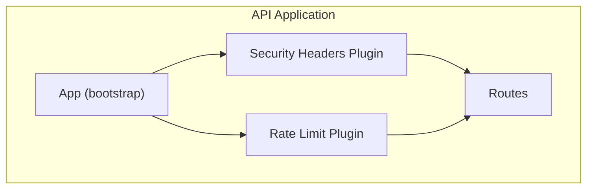
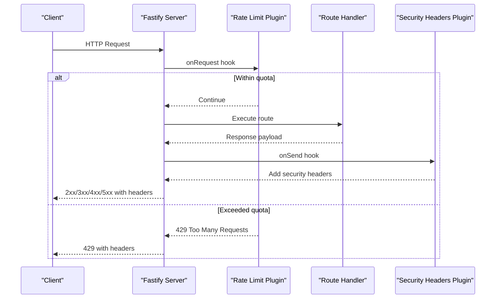
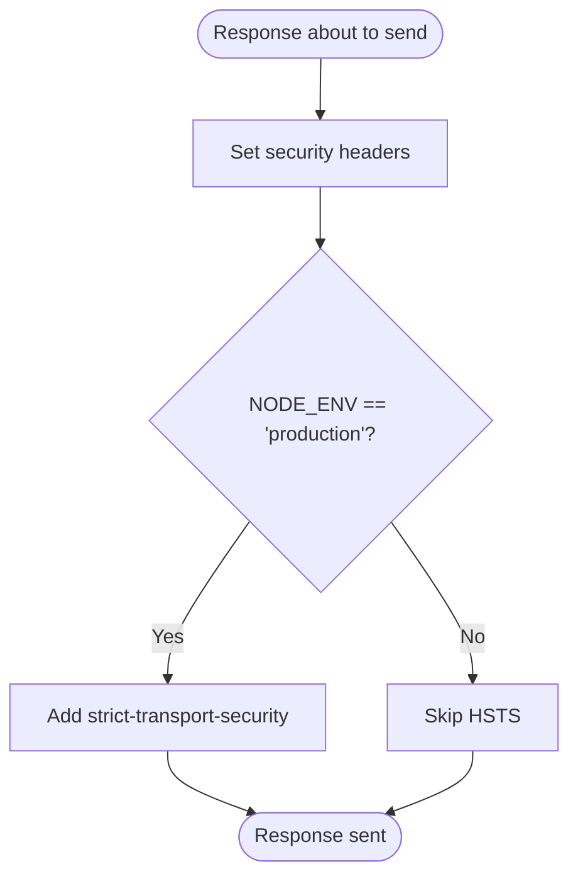
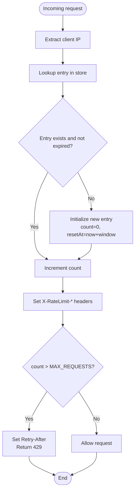
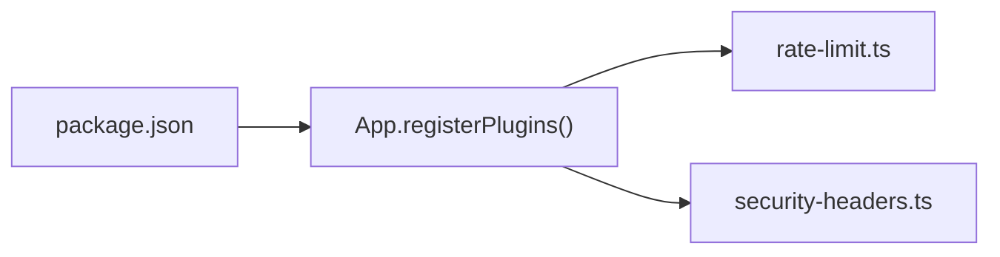

# Security Plugins

<cite>
**Referenced Files in This Document**
- [security-headers.ts](file://apps/api/src/plugins/security-headers.ts)
- [rate-limit.ts](file://apps/api/src/plugins/rate-limit.ts)
- [app.ts](file://apps/api/src/app.ts)
- [package.json](file://apps/api/package.json)
</cite>

## Table of Contents
1. [Introduction](#introduction)
2. [Project Structure](#project-structure)
3. [Core Components](#core-components)
4. [Architecture Overview](#architecture-overview)
5. [Detailed Component Analysis](#detailed-component-analysis)
6. [Dependency Analysis](#dependency-analysis)
7. [Performance Considerations](#performance-considerations)
8. [Troubleshooting Guide](#troubleshooting-guide)
9. [Conclusion](#conclusion)

## Introduction
This document explains Exosquad’s security plugins and middleware for the API application. It focuses on:
- The security headers plugin that adds HTTP security headers to every response.
- The rate limiting plugin that enforces per-IP request quotas with configurable thresholds and informative response behavior.

It also covers configuration, customization options, performance implications, best practices, bypass scenarios, and monitoring approaches.

## Project Structure
The security-related code lives under the API application’s plugins directory and is registered during application bootstrap.

**Diagram sources**
- [app.ts:27-31](file://apps/api/src/app.ts#L27-L31)
- [security-headers.ts:7-29](file://apps/api/src/plugins/security-headers.ts#L7-L29)
- [rate-limit.ts:28-60](file://apps/api/src/plugins/rate-limit.ts#L28-L60)

**Section sources**
- [app.ts:1-31](file://apps/api/src/app.ts#L1-L31)

## Core Components
- Security Headers Plugin: Adds standard security headers to all responses via an onSend hook. In production, it enables HSTS.
- Rate Limit Plugin: Enforces a per-IP sliding window rate limit using an in-memory store, sets informative rate limit headers, and returns 429 when exceeded.

Key responsibilities:
- Security Headers Plugin:
  - Set x-content-type-options, x-frame-options, referrer-policy, permissions-policy.
  - Disable legacy x-xss-protection in favor of CSP.
  - Enable strict-transport-security in production.
- Rate Limit Plugin:
  - Track requests per IP within a fixed time window.
  - Provide X-RateLimit-* headers and Retry-After on throttling.
  - Return 429 Too Many Requests when limits are exceeded.

**Section sources**
- [security-headers.ts:1-30](file://apps/api/src/plugins/security-headers.ts#L1-L30)
- [rate-limit.ts:1-61](file://apps/api/src/plugins/rate-limit.ts#L1-L61)

## Architecture Overview
The Fastify server registers both plugins early in the lifecycle. The order matters:
- Request enters the server.
- Rate limit runs first (onRequest), potentially rejecting the request immediately.
- If allowed, route handlers execute.
- Security headers are added last (onSend) before sending the response.

**Diagram sources**
- [app.ts:27-31](file://apps/api/src/app.ts#L27-L31)
- [rate-limit.ts:28-60](file://apps/api/src/plugins/rate-limit.ts#L28-L60)
- [security-headers.ts:10-29](file://apps/api/src/plugins/security-headers.ts#L10-L29)

## Detailed Component Analysis

### Security Headers Plugin
Purpose:
- Harden responses by setting widely adopted security headers.
- Conditionally enable HSTS in production.

Behavior:
- Always sets:
  - x-content-type-options: nosniff
  - x-frame-options: DENY
  - x-xss-protection: 0 (delegating to CSP)
  - referrer-policy: strict-origin-when-cross-origin
  - permissions-policy: camera=(), microphone=(), geolocation()
- Production-only:
  - strict-transport-security: max-age=31536000; includeSubDomains

Customization options:
- Environment-based toggles:
  - NODE_ENV controls whether HSTS is enabled.
- Extensibility:
  - Add Content-Security-Policy header based on frontend requirements.
  - Adjust permissions-policy directives to match feature needs.
  - Integrate Helmet via @fastify/helmet if centralized header management is preferred.

Configuration examples:
- Enable HSTS in production by ensuring NODE_ENV equals production at runtime.
- To add CSP, extend the onSend hook to set Content-Security-Policy tailored to your frontend assets and APIs.

Performance implications:
- Minimal overhead: only header assignments in onSend.
- Avoid heavy computations in hooks.

Best practices:
- Define a CSP aligned with your frontend resources and inline script policies.
- Use permissions-policy to restrict sensitive browser features.
- Ensure reverse proxies or CDNs do not override these headers unintentionally.

Bypass scenarios:
- If another plugin or handler overrides headers after this hook, verify hook ordering.
- If trustProxy is misconfigured, client IPs may be incorrect, affecting downstream protections like rate limiting.

Monitoring approaches:
- Log missing or overridden security headers in error handling paths.
- Instrument metrics for header presence across endpoints.

**Diagram sources**
- [security-headers.ts:10-29](file://apps/api/src/plugins/security-headers.ts#L10-L29)

**Section sources**
- [security-headers.ts:1-30](file://apps/api/src/plugins/security-headers.ts#L1-L30)

### Rate Limit Plugin
Purpose:
- Protect endpoints from abuse by enforcing per-IP request quotas.
- Provide clients with clear feedback via rate limit headers.

Behavior:
- Tracks requests per IP using an in-memory Map.
- Window duration and maximum requests are constants in the module.
- Sets:
  - x-ratelimit-limit
  - x-ratelimit-remaining
  - x-ratelimit-reset
- On exceeding the limit:
  - Sets retry-after
  - Returns 429 with a structured error body.

Configurable thresholds:
- WINDOW_MS: window duration in milliseconds.
- MAX_REQUESTS: maximum requests allowed per window per IP.

IP-based tracking:
- Uses request.ip as the key.
- Requires trustProxy to be true so that the real client IP is resolved correctly behind proxies.

Response behavior:
- Normal responses include rate limit headers.
- Throttled responses return 429 with a JSON error object containing code and message.

Cleanup:
- Periodic cleanup removes expired entries to prevent unbounded memory growth.
- Cleanup interval does not block process exit.

Customization options:
- Tune WINDOW_MS and MAX_REQUESTS to balance throughput and protection.
- Replace in-memory store with Redis-backed implementation for multi-instance deployments.
- Integrate @fastify/rate-limit for advanced strategies (e.g., sliding windows, storage backends).

Performance implications:
- In-memory Map operations are O(1) average.
- Periodic cleanup runs once per minute and deletes expired keys.
- For high QPS, consider Redis-backed rate limiting to avoid per-process state and improve scalability.

Best practices:
- Keep trustProxy enabled when running behind load balancers or ingress controllers.
- Monitor 429 rates and adjust thresholds accordingly.
- Combine with WAF rules for bot mitigation.

Bypass scenarios:
- Shared IPs (NAT, corporate proxies) can cause legitimate users to share quotas.
- Misconfigured trustProxy can result in incorrect IP resolution.
- Multiple processes without shared storage will have independent counters.

Monitoring approaches:
- Track 429 counts and top offending IPs.
- Export rate limit metrics (limit, remaining, reset) for dashboards.
- Alert on spikes in throttle rates.

**Diagram sources**
- [rate-limit.ts:28-60](file://apps/api/src/plugins/rate-limit.ts#L28-L60)

**Section sources**
- [rate-limit.ts:1-61](file://apps/api/src/plugins/rate-limit.ts#L1-L61)

## Dependency Analysis
- App registration:
  - The App class registers both plugins in a specific order: rate limit before security headers.
- External dependencies:
  - package.json includes @fastify/rate-limit and @fastify/helmet as available dependencies, though the current implementation uses custom plugins.

**Diagram sources**
- [app.ts:27-31](file://apps/api/src/app.ts#L27-L31)
- [package.json:15-29](file://apps/api/package.json#L15-L29)

**Section sources**
- [app.ts:27-31](file://apps/api/src/app.ts#L27-L31)
- [package.json:15-29](file://apps/api/package.json#L15-L29)

## Performance Considerations
- Security Headers Plugin:
  - Negligible overhead due to simple header assignments.
- Rate Limit Plugin:
  - In-memory Map provides fast lookups and updates.
  - Periodic cleanup prevents memory leaks but introduces a small CPU cost.
  - For multi-instance deployments, replace with Redis-backed rate limiting to ensure consistent enforcement and lower per-process memory usage.
- Hook ordering:
  - Place expensive logic after rate limiting to avoid unnecessary processing for throttled requests.

[No sources needed since this section provides general guidance]

## Troubleshooting Guide
Common issues and resolutions:
- Clients report missing security headers:
  - Verify that the security headers plugin is registered and runs on onSend.
  - Ensure no later middleware overwrites headers.
- HSTS not applied:
  - Confirm NODE_ENV is set to production at runtime.
- Incorrect client IPs causing false throttling:
  - Ensure trustProxy is enabled in Fastify configuration.
  - Validate proxy headers (X-Forwarded-For) are trusted.
- High 429 rates:
  - Review WINDOW_MS and MAX_REQUESTS settings.
  - Investigate shared IPs from NATs or proxies.
  - Consider switching to a distributed rate limiter.

Operational checks:
- Inspect response headers for X-RateLimit-* and security headers.
- Monitor logs for validation errors and unhandled exceptions.
- Track 429 status codes and top offending IPs.

**Section sources**
- [app.ts:15-24](file://apps/api/src/app.ts#L15-L24)
- [security-headers.ts:21-27](file://apps/api/src/plugins/security-headers.ts#L21-L27)
- [rate-limit.ts:31-58](file://apps/api/src/plugins/rate-limit.ts#L31-L58)

## Conclusion
Exosquad’s security plugins provide essential hardening and abuse prevention:
- The security headers plugin ensures baseline HTTP security posture and enables HSTS in production.
- The rate limiting plugin offers immediate per-IP protection with informative headers and standardized throttling responses.

For production readiness:
- Implement a robust Content-Security-Policy tailored to your frontend.
- Migrate to a Redis-backed rate limiter for horizontal scaling.
- Continuously monitor header presence, 429 rates, and IP reputation to maintain security and availability.

[No sources needed since this section summarizes without analyzing specific files]