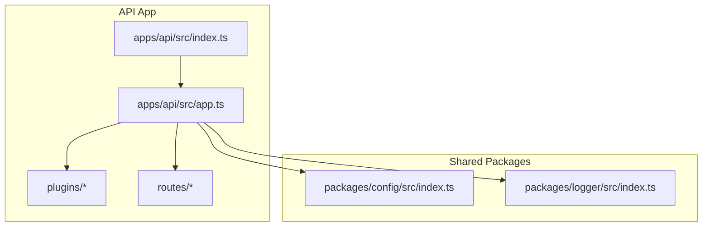
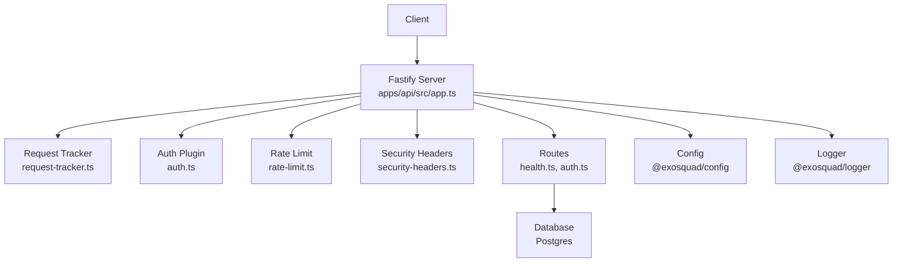
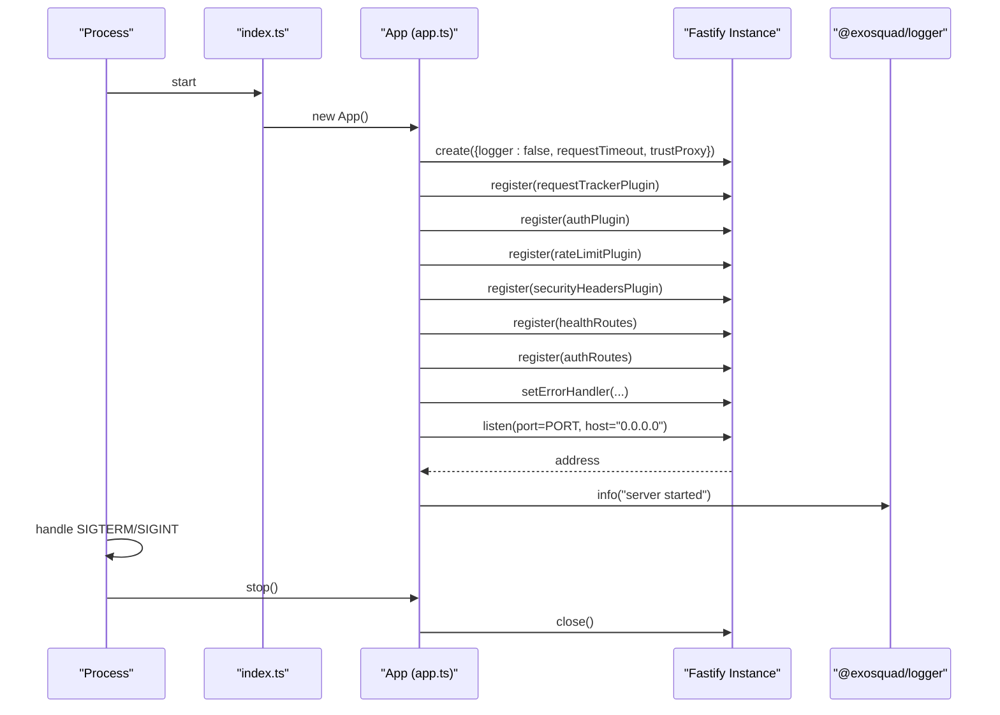
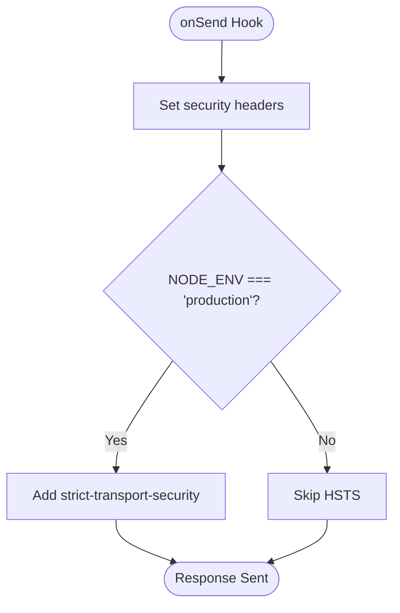
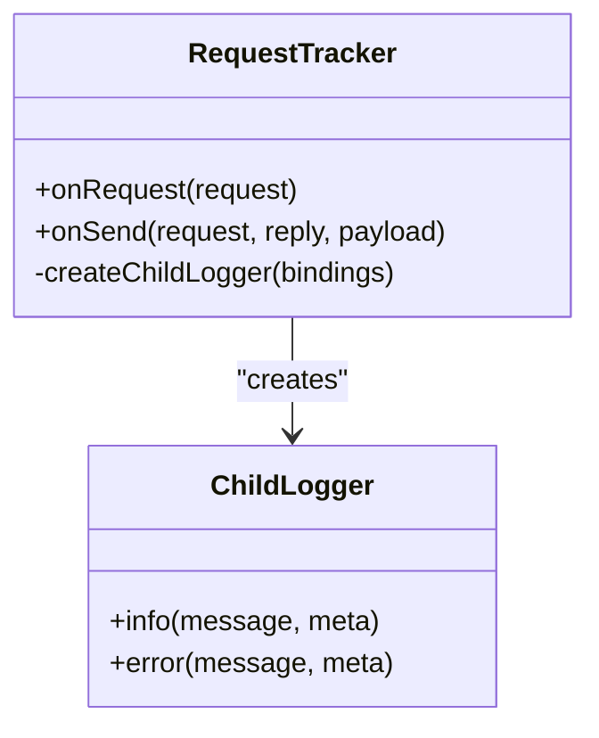
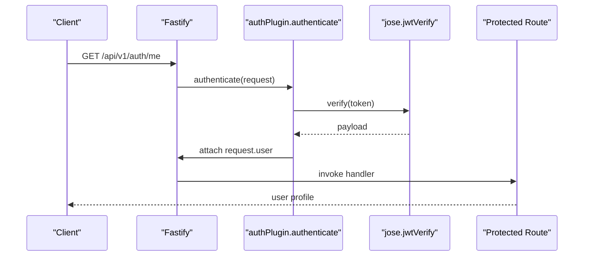
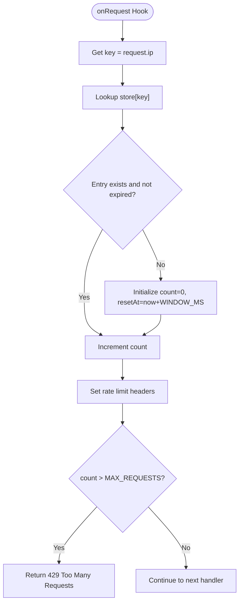
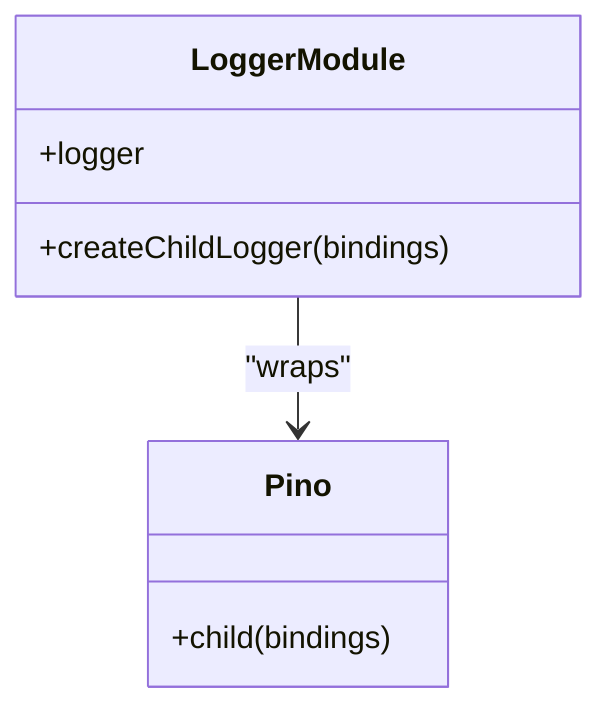
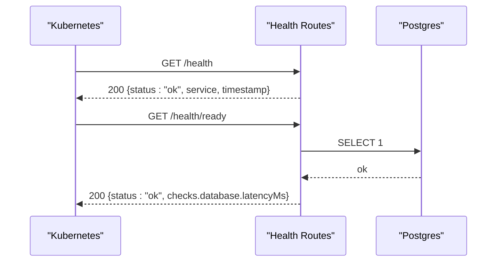
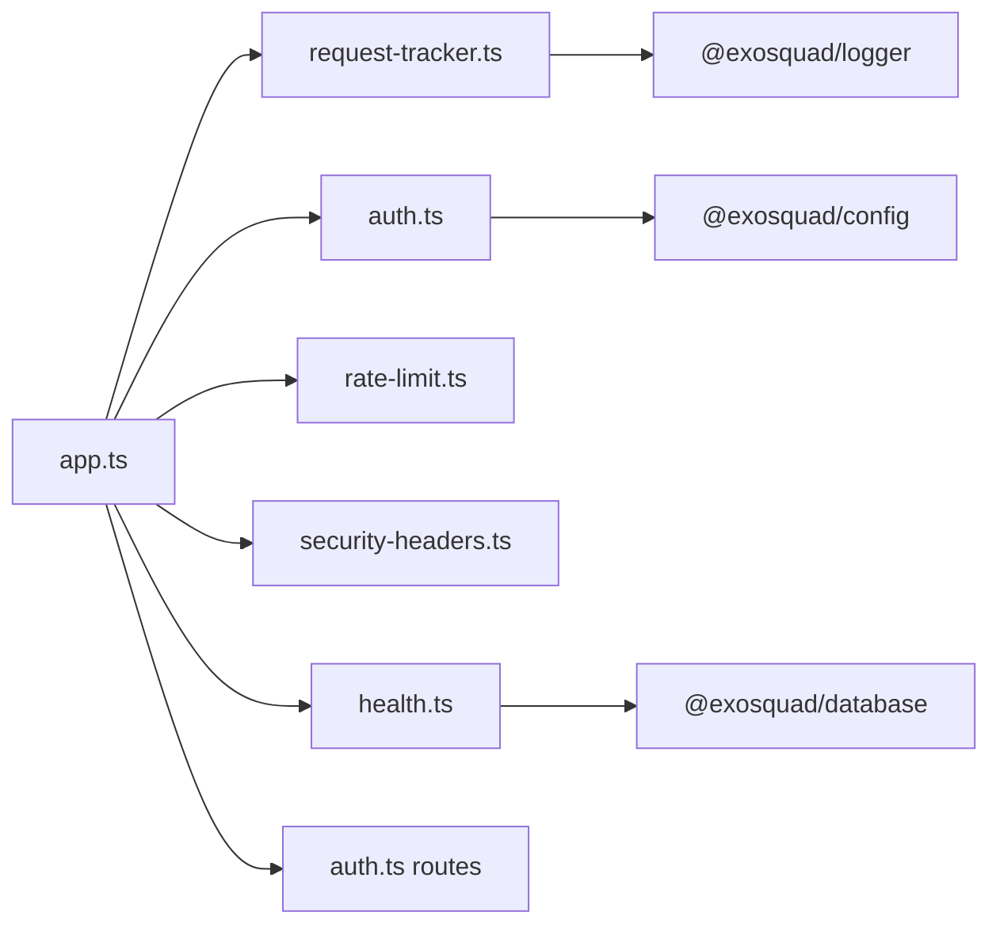

# Service Components

<cite>
**Referenced Files in This Document**
- [apps/api/src/app.ts](file://apps/api/src/app.ts)
- [apps/api/src/index.ts](file://apps/api/src/index.ts)
- [apps/api/src/plugins/security-headers.ts](file://apps/api/src/plugins/security-headers.ts)
- [apps/api/src/plugins/request-tracker.ts](file://apps/api/src/plugins/request-tracker.ts)
- [apps/api/src/plugins/auth.ts](file://apps/api/src/plugins/auth.ts)
- [apps/api/src/plugins/rate-limit.ts](file://apps/api/src/plugins/rate-limit.ts)
- [apps/api/src/routes/health.ts](file://apps/api/src/routes/health.ts)
- [apps/api/src/routes/auth.ts](file://apps/api/src/routes/auth.ts)
- [packages/config/src/index.ts](file://packages/config/src/index.ts)
- [packages/logger/src/index.ts](file://packages/logger/src/index.ts)
- [docker-compose.yml](file://docker-compose.yml)
</cite>

## Table of Contents
1. [Introduction](#introduction)
2. [Project Structure](#project-structure)
3. [Core Components](#core-components)
4. [Architecture Overview](#architecture-overview)
5. [Detailed Component Analysis](#detailed-component-analysis)
6. [Dependency Analysis](#dependency-analysis)
7. [Performance Considerations](#performance-considerations)
8. [Troubleshooting Guide](#troubleshooting-guide)
9. [Conclusion](#conclusion)
10. [Appendices](#appendices)

## Introduction
This document explains Exosquad’s API service components and infrastructure with a focus on Fastify application bootstrap, plugin registration, middleware composition, security headers, request tracking, logging integration, configuration and environment management, deployment considerations, monitoring and health checks, and operational guidance. It also provides practical examples for adding new plugins, extending functionality, and implementing custom middleware.

## Project Structure
The API service is implemented as a Fastify application under apps/api. The entry point initializes the process, registers lifecycle hooks, and starts the server. Application logic is organized into:
- Plugins: reusable cross-cutting concerns (security headers, request tracking, authentication, rate limiting).
- Routes: feature endpoints grouped by domain (health, auth).
- Services: business logic modules (auth service).
- Configuration and logging are provided via shared packages (@exosquad/config and @exosquad/logger).

**Diagram sources**
- [apps/api/src/index.ts:1-23](file://apps/api/src/index.ts#L1-L23)
- [apps/api/src/app.ts:1-96](file://apps/api/src/app.ts#L1-L96)
- [packages/config/src/index.ts:1-56](file://packages/config/src/index.ts#L1-L56)
- [packages/logger/src/index.ts:1-43](file://packages/logger/src/index.ts#L1-L43)

**Section sources**
- [apps/api/src/index.ts:1-23](file://apps/api/src/index.ts#L1-L23)
- [apps/api/src/app.ts:1-96](file://apps/api/src/app.ts#L1-L96)

## Core Components
- Fastify bootstrap and lifecycle:
  - Server instance creation with custom logger disabled and timeouts configured.
  - Plugin registration order defines middleware composition.
  - Route registration with prefixes for modular route groups.
  - Global error handler normalizes validation errors, known application errors, and unknown errors.
  - Start and stop methods manage listening and graceful shutdown.
- Security headers plugin:
  - Adds standard security headers to every response using an onSend hook.
  - Enables HSTS only in production based on environment.
- Request tracking plugin:
  - Assigns a unique request ID from header or generated UUID.
  - Creates a child logger bound to request context and attaches it to the request object.
- Authentication plugin:
  - Provides a global authenticate preHandler that validates Bearer JWT tokens.
  - Extends FastifyRequest with user context containing userId, tenantId, and role.
  - Uses jose for HS256 verification and signing.
- Rate limiting plugin:
  - In-memory per-IP rate limiter with windowed counters and cleanup interval.
  - Emits standard rate limit headers and returns 429 when exceeded.
- Health routes:
  - Liveness endpoint always returns success if the process is alive.
  - Readiness endpoint probes database connectivity and reports overall status.

**Section sources**
- [apps/api/src/app.ts:12-96](file://apps/api/src/app.ts#L12-L96)
- [apps/api/src/plugins/security-headers.ts:1-31](file://apps/api/src/plugins/security-headers.ts#L1-L31)
- [apps/api/src/plugins/request-tracker.ts:1-43](file://apps/api/src/plugins/request-tracker.ts#L1-L43)
- [apps/api/src/plugins/auth.ts:1-101](file://apps/api/src/plugins/auth.ts#L1-L101)
- [apps/api/src/plugins/rate-limit.ts:1-62](file://apps/api/src/plugins/rate-limit.ts#L1-L62)
- [apps/api/src/routes/health.ts:1-48](file://apps/api/src/routes/health.ts#L1-L48)

## Architecture Overview
The API follows a layered architecture where Fastify acts as the HTTP layer, plugins provide cross-cutting behavior, and routes implement domain features. Shared packages encapsulate configuration and logging.

**Diagram sources**
- [apps/api/src/app.ts:12-37](file://apps/api/src/app.ts#L12-L37)
- [apps/api/src/plugins/request-tracker.ts:1-43](file://apps/api/src/plugins/request-tracker.ts#L1-L43)
- [apps/api/src/plugins/auth.ts:1-101](file://apps/api/src/plugins/auth.ts#L1-L101)
- [apps/api/src/plugins/rate-limit.ts:1-62](file://apps/api/src/plugins/rate-limit.ts#L1-L62)
- [apps/api/src/plugins/security-headers.ts:1-31](file://apps/api/src/plugins/security-headers.ts#L1-L31)
- [apps/api/src/routes/health.ts:1-48](file://apps/api/src/routes/health.ts#L1-L48)
- [packages/config/src/index.ts:1-56](file://packages/config/src/index.ts#L1-L56)
- [packages/logger/src/index.ts:1-43](file://packages/logger/src/index.ts#L1-L43)

## Detailed Component Analysis

### Fastify Bootstrap and Lifecycle
- Server initialization:
  - Disables built-in logger to use Pino via @exosquad/logger.
  - Sets requestTimeout and trustProxy for reverse proxy environments.
- Plugin registration:
  - Registers request tracker, auth, rate limit, and security headers in a defined order.
- Route registration:
  - Mounts health routes under /health and auth routes under /api/v1/auth.
- Error handling:
  - Normalizes Fastify validation errors to a structured response.
  - Handles AppError instances with appropriate status codes.
  - Returns a safe internal error for unhandled exceptions.
- Startup and shutdown:
  - Starts listening on configured port and host.
  - Gracefully closes server on SIGTERM/SIGINT.

**Diagram sources**
- [apps/api/src/index.ts:4-22](file://apps/api/src/index.ts#L4-L22)
- [apps/api/src/app.ts:15-89](file://apps/api/src/app.ts#L15-L89)

**Section sources**
- [apps/api/src/app.ts:15-89](file://apps/api/src/app.ts#L15-L89)
- [apps/api/src/index.ts:4-22](file://apps/api/src/index.ts#L4-L22)

### Security Headers Plugin
- Adds standard security headers on every response via onSend hook:
  - x-content-type-options, x-frame-options, x-xss-protection, referrer-policy, permissions-policy.
  - strict-transport-security enabled only when NODE_ENV equals production.
- Designed to be applied globally without route-specific configuration.

**Diagram sources**
- [apps/api/src/plugins/security-headers.ts:7-30](file://apps/api/src/plugins/security-headers.ts#L7-L30)

**Section sources**
- [apps/api/src/plugins/security-headers.ts:1-31](file://apps/api/src/plugins/security-headers.ts#L1-L31)

### Request Tracking System
- Generates or reuses a request ID:
  - Prefers x-request-id header; otherwise generates a UUID.
- Creates a child logger bound to request context:
  - Includes requestId, method, and url.
- Attaches child logger and requestId to the request object for downstream usage.
- Ensures payload processing in onSend hook maintains request context.

**Diagram sources**
- [apps/api/src/plugins/request-tracker.ts:9-41](file://apps/api/src/plugins/request-tracker.ts#L9-L41)
- [packages/logger/src/index.ts:33-41](file://packages/logger/src/index.ts#L33-L41)

**Section sources**
- [apps/api/src/plugins/request-tracker.ts:1-43](file://apps/api/src/plugins/request-tracker.ts#L1-L43)
- [packages/logger/src/index.ts:1-43](file://packages/logger/src/index.ts#L1-L43)

### Authentication Plugin
- Validates Bearer JWT tokens using jose with HS256 algorithm.
- Extracts userId, tenantId, and role from token payload.
- Throws UnauthorizedError for missing/invalid tokens.
- Decorates FastifyRequest.user with authenticated user context.
- Provides a global authenticate preHandler for protected routes.

**Diagram sources**
- [apps/api/src/plugins/auth.ts:24-63](file://apps/api/src/plugins/auth.ts#L24-L63)
- [apps/api/src/plugins/auth.ts:70-101](file://apps/api/src/plugins/auth.ts#L70-L101)
- [apps/api/src/routes/auth.ts:54-66](file://apps/api/src/routes/auth.ts#L54-L66)

**Section sources**
- [apps/api/src/plugins/auth.ts:1-101](file://apps/api/src/plugins/auth.ts#L1-L101)
- [apps/api/src/routes/auth.ts:1-68](file://apps/api/src/routes/auth.ts#L1-L68)

### Rate Limiting Plugin
- Maintains an in-memory Map keyed by client IP with count and resetAt timestamp.
- Periodically cleans expired entries to prevent memory growth.
- Enforces a per-minute window with a maximum request threshold.
- Sets standard rate limit headers and responds with 429 when exceeded.

**Diagram sources**
- [apps/api/src/plugins/rate-limit.ts:8-61](file://apps/api/src/plugins/rate-limit.ts#L8-L61)

**Section sources**
- [apps/api/src/plugins/rate-limit.ts:1-62](file://apps/api/src/plugins/rate-limit.ts#L1-L62)

### Logging Integration
- Uses Pino for structured JSON logging.
- Non-production uses pino-pretty for readable console output.
- Base service name set to "exosquad".
- createChildLogger binds contextual fields like requestId, method, url.

**Diagram sources**
- [packages/logger/src/index.ts:10-41](file://packages/logger/src/index.ts#L10-L41)

**Section sources**
- [packages/logger/src/index.ts:1-43](file://packages/logger/src/index.ts#L1-L43)

### Health Checks and Monitoring
- Liveness probe (/health):
  - Always returns 200 with service metadata and timestamp.
- Readiness probe (/health/ready):
  - Probes database connectivity via Prisma query.
  - Aggregates dependency statuses and latency metrics.
  - Returns 200 when healthy, 503 when degraded.

**Diagram sources**
- [apps/api/src/routes/health.ts:9-46](file://apps/api/src/routes/health.ts#L9-L46)

**Section sources**
- [apps/api/src/routes/health.ts:1-48](file://apps/api/src/routes/health.ts#L1-L48)

## Dependency Analysis
- Internal dependencies:
  - App depends on plugins and routes.
  - Plugins depend on shared packages for config and logger.
  - Routes may depend on services and database package.
- External dependencies:
  - Fastify core and ecosystem plugins.
  - jose for JWT operations.
  - Zod for schema validation.
  - Pino for logging.

**Diagram sources**
- [apps/api/src/app.ts:1-11](file://apps/api/src/app.ts#L1-L11)
- [apps/api/src/plugins/auth.ts:1-6](file://apps/api/src/plugins/auth.ts#L1-L6)
- [apps/api/src/plugins/request-tracker.ts:1-4](file://apps/api/src/plugins/request-tracker.ts#L1-L4)
- [apps/api/src/routes/health.ts:1-3](file://apps/api/src/routes/health.ts#L1-L3)

**Section sources**
- [apps/api/src/app.ts:1-11](file://apps/api/src/app.ts#L1-L11)

## Performance Considerations
- Request timeout:
  - Set to 30 seconds to balance responsiveness and long-running operations.
- Trust proxy:
  - Enabled to correctly resolve client IPs behind reverse proxies.
- Rate limiting:
  - In-memory store is simple but not horizontally scalable; consider Redis-backed implementation for multi-instance deployments.
- Cleanup interval:
  - Background cleanup prevents unbounded growth of rate limit state.
- Logging:
  - Structured JSON logs enable efficient aggregation and analysis in production.
- Database readiness check:
  - Minimal overhead; consider caching recent results to reduce load during frequent probes.

[No sources needed since this section provides general guidance]

## Troubleshooting Guide
- Validation errors:
  - Fastify returns 400 with structured error details; inspect validation array for field-level issues.
- Authentication failures:
  - Missing or malformed Authorization header leads to UnauthorizedError; ensure Bearer token format and validity.
- Rate limiting:
  - 429 responses include retry-after header; back off according to the suggested delay.
- Health checks:
  - If /health/ready returns 503, investigate database connectivity and credentials.
- Environment configuration:
  - Missing or invalid environment variables cause startup failure; validate required values such as DATABASE_URL, JWT_SECRET, PORT, LOG_LEVEL.

**Section sources**
- [apps/api/src/app.ts:39-70](file://apps/api/src/app.ts#L39-L70)
- [apps/api/src/plugins/auth.ts:70-101](file://apps/api/src/plugins/auth.ts#L70-L101)
- [apps/api/src/plugins/rate-limit.ts:28-61](file://apps/api/src/plugins/rate-limit.ts#L28-L61)
- [apps/api/src/routes/health.ts:19-46](file://apps/api/src/routes/health.ts#L19-L46)
- [packages/config/src/index.ts:10-53](file://packages/config/src/index.ts#L10-L53)

## Conclusion
Exosquad’s API service leverages Fastify’s plugin system to compose cross-cutting concerns cleanly. Security headers, request tracking, authentication, and rate limiting are implemented as modular plugins. Centralized configuration and logging improve reliability and observability. Health endpoints support liveness and readiness probes for robust deployment. For scaling and resilience, consider replacing in-memory rate limiting with a distributed store and expanding health checks to additional dependencies.

[No sources needed since this section summarizes without analyzing specific files]

## Appendices

### Service Configuration Options and Environment Variables
- Required and optional environment variables:
  - DATABASE_URL: Database connection string.
  - REDIS_HOST, REDIS_PORT, REDIS_PASSWORD: Redis configuration.
  - NODE_ENV: Environment mode (development, production, test).
  - PORT: Server listening port.
  - LOG_LEVEL: Pino log level.
  - JWT_SECRET: Secret for HS256 JWT verification/signing.
  - JWT_EXPIRES_IN: Token expiration duration.
  - WORKER_CONCURRENCY: Worker concurrency setting.
- Validation:
  - All variables are validated at startup; invalid configuration aborts the process.

**Section sources**
- [packages/config/src/index.ts:10-53](file://packages/config/src/index.ts#L10-L53)

### Deployment Considerations
- Docker Compose:
  - Postgres and Redis services are provisioned with healthchecks and persistent volumes.
- Production hardening:
  - Ensure HSTS is enabled via environment-based logic.
  - Use managed secrets for JWT_SECRET and database credentials.
  - Configure reverse proxy to forward X-Forwarded-* headers appropriately.

**Section sources**
- [docker-compose.yml:8-44](file://docker-compose.yml#L8-L44)
- [apps/api/src/plugins/security-headers.ts:22-27](file://apps/api/src/plugins/security-headers.ts#L22-L27)

### Adding New Plugins
- Steps:
  - Create a new plugin file under apps/api/src/plugins.
  - Export an async function that accepts FastifyInstance.
  - Register the plugin in App.registerPlugins.
  - Use server.addHook for middleware-like behavior or server.decorate for global utilities.
- Example pattern:
  - Define plugin function, add onRequest/onSend hooks, and optionally decorate request/response objects.

**Section sources**
- [apps/api/src/app.ts:27-32](file://apps/api/src/app.ts#L27-L32)
- [apps/api/src/plugins/security-headers.ts:7-30](file://apps/api/src/plugins/security-headers.ts#L7-L30)
- [apps/api/src/plugins/request-tracker.ts:9-41](file://apps/api/src/plugins/request-tracker.ts#L9-L41)

### Extending Existing Functionality
- Authentication:
  - Extend verifyToken/signToken to support additional algorithms or claims.
  - Add role-based authorization by checking request.user.role in route handlers.
- Rate limiting:
  - Replace in-memory store with Redis-backed implementation for horizontal scaling.
  - Expose configurable windows and thresholds via configuration.

**Section sources**
- [apps/api/src/plugins/auth.ts:24-63](file://apps/api/src/plugins/auth.ts#L24-L63)
- [apps/api/src/plugins/rate-limit.ts:1-62](file://apps/api/src/plugins/rate-limit.ts#L1-L62)

### Implementing Custom Middleware
- Use Fastify hooks:
  - onRequest for early processing (e.g., parsing, validation).
  - onSend for response modification (e.g., headers, metrics).
- Attach context:
  - Use createChildLogger to bind request-scoped data.
  - Decorate request/response objects for downstream access.

**Section sources**
- [apps/api/src/plugins/request-tracker.ts:12-27](file://apps/api/src/plugins/request-tracker.ts#L12-L27)
- [packages/logger/src/index.ts:33-41](file://packages/logger/src/index.ts#L33-L41)