# Worker Service

<cite>
**Referenced Files in This Document**
- [index.ts](file://apps/worker/src/index.ts)
- [app.ts](file://apps/worker/src/app.ts)
- [queue-manager.ts](file://apps/worker/src/queues/queue-manager.ts)
- [ingestion.ts](file://apps/worker/src/processors/ingestion.ts)
- [normalization.ts](file://apps/worker/src/processors/normalization.ts)
- [scheduler.ts](file://apps/worker/src/scheduler/scheduler.ts)
- [http-connector.ts](file://packages/connector/src/http-connector.ts)
- [index.ts](file://packages/connector/src/index.ts)
- [package.json](file://apps/worker/package.json)
- [ARCHITECTURE.md](file://docs/ARCHITECTURE.md)
</cite>

## Update Summary
**Changes Made**
- Updated ingestion processor to integrate with the new connector package for production-grade HTTP requests
- Added comprehensive connector integration documentation including authentication, pagination, retry logic, and circuit breaker patterns
- Enhanced test coverage documentation reflecting 114 passing tests across connector and worker components
- Updated architecture diagrams to reflect the connector package integration
- Added detailed sections on connector configuration, error handling, and monitoring strategies

## Table of Contents
1. [Introduction](#introduction)
2. [Project Structure](#project-structure)
3. [Core Components](#core-components)
4. [Architecture Overview](#architecture-overview)
5. [Detailed Component Analysis](#detailed-component-analysis)
6. [Connector Integration](#connector-integration)
7. [Dependency Analysis](#dependency-analysis)
8. [Performance Considerations](#performance-considerations)
9. [Troubleshooting Guide](#troubleshooting-guide)
10. [Conclusion](#conclusion)

## Introduction
This document explains the Exosquad worker service architecture with a focus on background job processing, queue initialization, and worker lifecycle management. The worker now integrates with the new connector package for production-grade HTTP operations, providing enhanced resilience through circuit breakers, rate limiting, and retry mechanisms. It covers BullMQ integration, job consumer configuration, graceful shutdown procedures, health monitoring, scaling considerations, memory management, error recovery, and operational monitoring strategies for long-running processes.

The worker runs asynchronous pipelines for ingestion and normalization, backed by BullMQ and Redis. The ingestion process now leverages the connector package for secure, resilient HTTP communication with external sources, while exposing a minimal HTTP server for liveness and readiness checks.

## Project Structure
The worker application is implemented under `apps/worker`. The entry point initializes the worker application, registers signal handlers for graceful shutdown, and starts the process. The application class wires up queues, workers, scheduler, and the health endpoint. Queue management encapsulates BullMQ connection options, queue creation, worker lifecycle, job submission helpers, statistics collection, and event logging. Job processors implement ingestion (now using the connector package) and normalization phases.

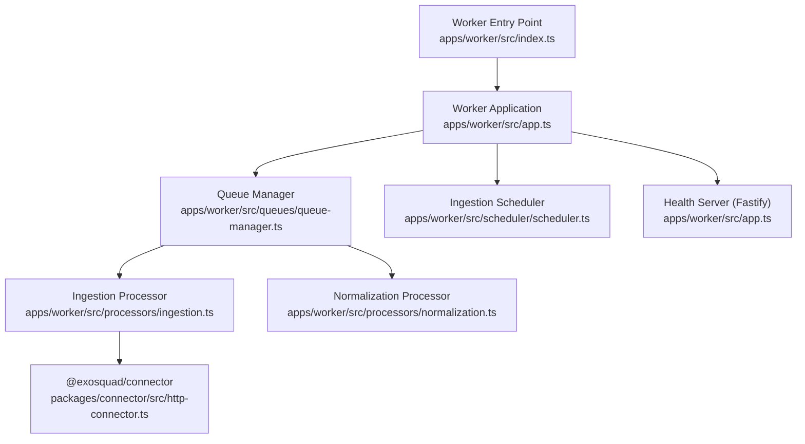

**Diagram sources**
- [index.ts:4-16](file://apps/worker/src/index.ts#L4-L16)
- [app.ts:10-59](file://apps/worker/src/app.ts#L10-L59)
- [queue-manager.ts:19-59](file://apps/worker/src/queues/queue-manager.ts#L19-L59)
- [ingestion.ts:19-35](file://apps/worker/src/processors/ingestion.ts#L19-L35)
- [http-connector.ts:74-86](file://packages/connector/src/http-connector.ts#L74-L86)

**Section sources**
- [index.ts:1-23](file://apps/worker/src/index.ts#L1-L23)
- [app.ts:1-68](file://apps/worker/src/app.ts#L1-L68)
- [queue-manager.ts:1-166](file://apps/worker/src/queues/queue-manager.ts#L1-L166)
- [ingestion.ts:1-530](file://apps/worker/src/processors/ingestion.ts#L1-L530)
- [normalization.ts:1-58](file://apps/worker/src/processors/normalization.ts#L1-L58)
- [scheduler.ts:1-164](file://apps/worker/src/scheduler/scheduler.ts#L1-L164)
- [ARCHITECTURE.md:53-58](file://docs/ARCHITECTURE.md#L53-L58)

## Core Components
- Worker entry point: Initializes the worker app, handles SIGTERM/SIGINT, and ensures clean exit.
- Worker application: Starts queue workers, scheduler, and a Fastify-based health server; coordinates start/stop lifecycle.
- Queue manager: Manages BullMQ connections, queue instances, worker instances, job submission, stats, and event logging.
- Ingestion processor: Now uses the connector package for production-grade HTTP operations with full resilience stack.
- Normalization processor: Validates input, logs context, and provides a stubbed pipeline placeholder for future implementation.
- Ingestion scheduler: Periodically scans active sources and enqueues ingestion jobs based on cron expressions.

Key responsibilities:
- Background job processing via BullMQ workers.
- Queue initialization with shared Redis connection options.
- Production-grade HTTP operations via connector package integration.
- Graceful shutdown through worker, scheduler, and queue cleanup.
- Health endpoints for liveness and readiness.

**Section sources**
- [index.ts:4-16](file://apps/worker/src/index.ts#L4-L16)
- [app.ts:10-68](file://apps/worker/src/app.ts#L10-L68)
- [queue-manager.ts:19-166](file://apps/worker/src/queues/queue-manager.ts#L19-L166)
- [ingestion.ts:19-35](file://apps/worker/src/processors/ingestion.ts#L19-L35)
- [normalization.ts:15-57](file://apps/worker/src/processors/normalization.ts#L15-L57)
- [scheduler.ts:26-73](file://apps/worker/src/scheduler/scheduler.ts#L26-L73)

## Architecture Overview
The worker service integrates with BullMQ to consume jobs from two queues: ingestion and normalization. A dedicated worker instance is created per queue with concurrency and optional rate limiting configured. The ingestion processor now leverages the connector package for resilient HTTP operations, while the application also exposes a small Fastify server for health checks.

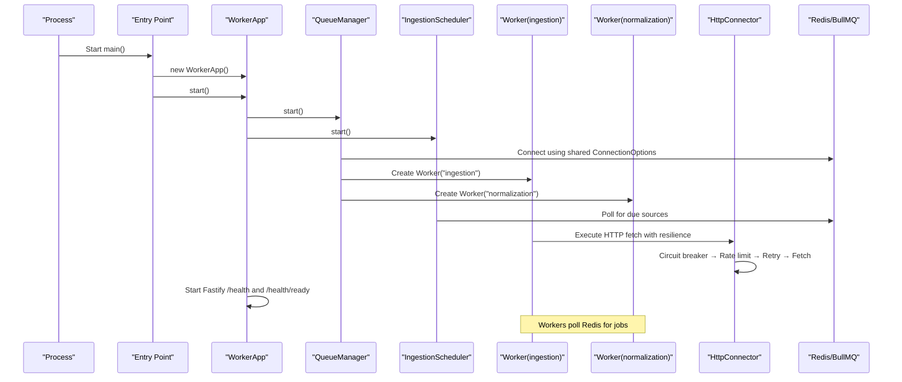

**Diagram sources**
- [index.ts:4-16](file://apps/worker/src/index.ts#L4-L16)
- [app.ts:44-59](file://apps/worker/src/app.ts#L44-L59)
- [queue-manager.ts:8-13](file://apps/worker/src/queues/queue-manager.ts#L8-L13)
- [queue-manager.ts:23-59](file://apps/worker/src/queues/queue-manager.ts#L23-L59)
- [scheduler.ts:34-58](file://apps/worker/src/scheduler/scheduler.ts#L34-L58)
- [http-connector.ts:94-184](file://packages/connector/src/http-connector.ts#L94-L184)

## Detailed Component Analysis

### Worker Lifecycle Management
The worker lifecycle is orchestrated by the entry point and the worker application:
- On startup, the entry point creates the worker app, attaches SIGTERM and SIGINT handlers, and calls start().
- The worker app starts all queue workers, the ingestion scheduler, and then listens on a health port derived from the configured API port plus one.
- On shutdown, the worker app stops the scheduler, queue workers, and closes the health server before exiting.

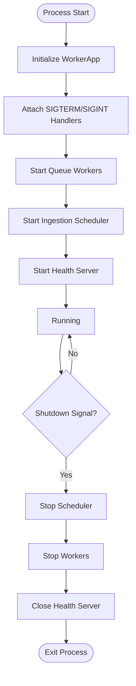

**Diagram sources**
- [index.ts:4-16](file://apps/worker/src/index.ts#L4-L16)
- [app.ts:44-68](file://apps/worker/src/app.ts#L44-L68)

**Section sources**
- [index.ts:4-16](file://apps/worker/src/index.ts#L4-L16)
- [app.ts:44-68](file://apps/worker/src/app.ts#L44-L68)

### BullMQ Connection and Queue Initialization
BullMQ connection options are centralized and reused across queues and workers. The queue manager creates:
- An ingestion queue and worker with a rate limiter allowing up to 50 jobs per minute.
- A normalization queue and worker without an explicit rate limiter.
Both workers use the same shared connection configuration.

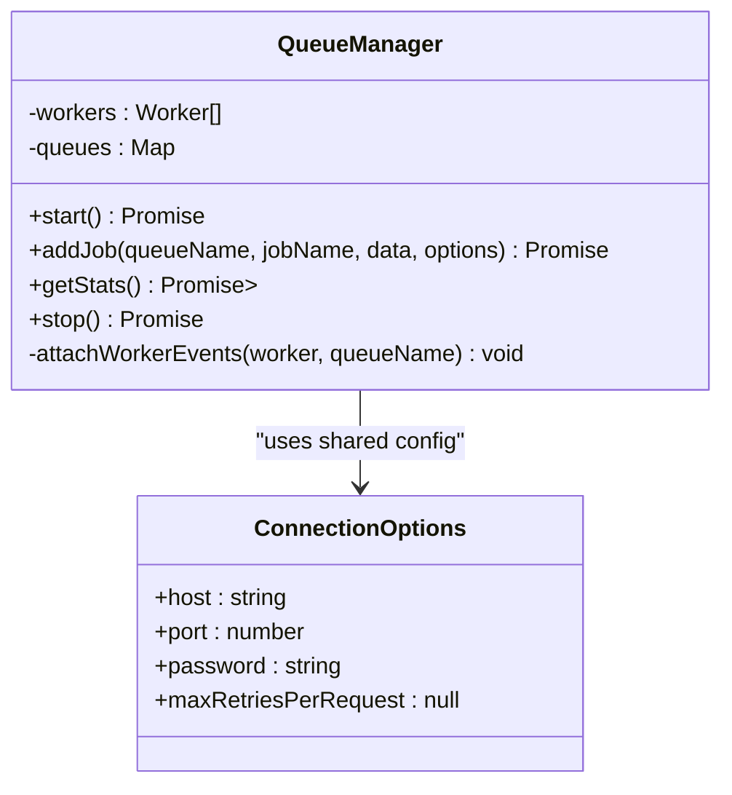

**Diagram sources**
- [queue-manager.ts:8-13](file://apps/worker/src/queues/queue-manager.ts#L8-L13)
- [queue-manager.ts:19-59](file://apps/worker/src/queues/queue-manager.ts#L19-L59)

**Section sources**
- [queue-manager.ts:8-13](file://apps/worker/src/queues/queue-manager.ts#L8-L13)
- [queue-manager.ts:23-59](file://apps/worker/src/queues/queue-manager.ts#L23-L59)

### Job Consumer Configuration
Each worker is configured with:
- Concurrency settings sourced from configuration.
- Optional rate limiting (applied to ingestion).
- Event listeners for completion, failure, and worker-level errors.

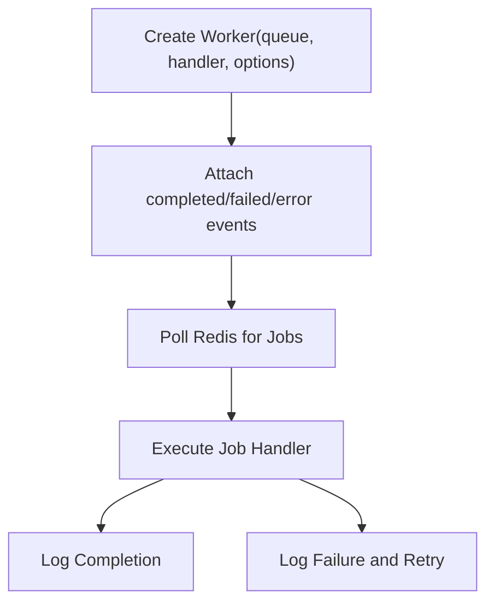

**Diagram sources**
- [queue-manager.ts:28-38](file://apps/worker/src/queues/queue-manager.ts#L28-L38)
- [queue-manager.ts:44-54](file://apps/worker/src/queues/queue-manager.ts#L44-L54)
- [queue-manager.ts:141-164](file://apps/worker/src/queues/queue-manager.ts#L141-L164)

**Section sources**
- [queue-manager.ts:28-38](file://apps/worker/src/queues/queue-manager.ts#L28-L38)
- [queue-manager.ts:44-54](file://apps/worker/src/queues/queue-manager.ts#L44-L54)
- [queue-manager.ts:141-164](file://apps/worker/src/queues/queue-manager.ts#L141-L164)

### Graceful Shutdown Procedures
Graceful shutdown is handled at the process level and delegated to the worker application:
- SIGTERM and SIGINT trigger a shutdown routine that logs the received signal, stops the worker app, and exits cleanly.
- The worker app stops the scheduler, all queue workers, and closes the health server.

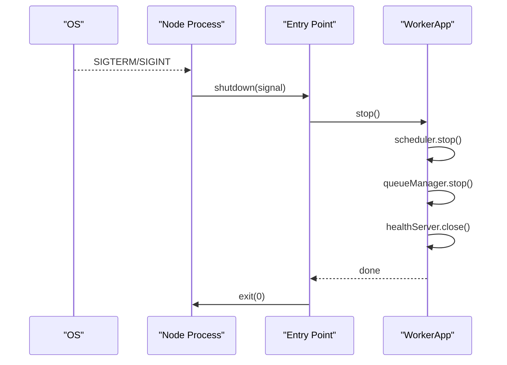

**Diagram sources**
- [index.ts:7-14](file://apps/worker/src/index.ts#L7-L14)
- [app.ts:61-68](file://apps/worker/src/app.ts#L61-L68)
- [queue-manager.ts:127-139](file://apps/worker/src/queues/queue-manager.ts#L127-L139)

**Section sources**
- [index.ts:7-14](file://apps/worker/src/index.ts#L7-L14)
- [app.ts:61-68](file://apps/worker/src/app.ts#L61-L68)
- [queue-manager.ts:127-139](file://apps/worker/src/queues/queue-manager.ts#L127-L139)

### Health Monitoring
The worker exposes two health endpoints:
- Liveness: returns a simple status indicating the process is running.
- Readiness: aggregates queue statistics and returns a degraded status if any queue reports an error.

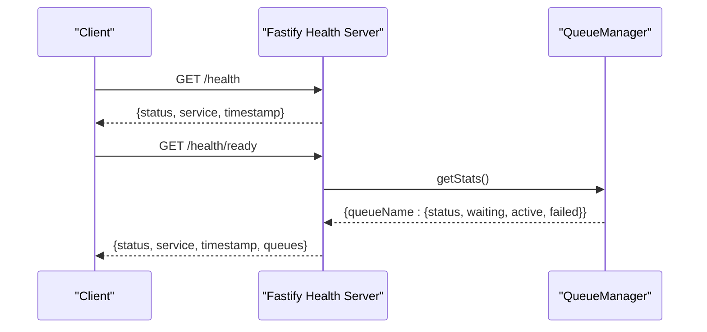

**Diagram sources**
- [app.ts:23-41](file://apps/worker/src/app.ts#L23-L41)
- [queue-manager.ts:103-125](file://apps/worker/src/queues/queue-manager.ts#L103-L125)

**Section sources**
- [app.ts:23-41](file://apps/worker/src/app.ts#L23-L41)
- [queue-manager.ts:103-125](file://apps/worker/src/queues/queue-manager.ts#L103-L125)

### Job Processing Logic
- Ingestion processor: Now uses the connector package for production-grade HTTP operations with full resilience stack including circuit breaker, rate limiting, retry logic, and content hashing for deduplication.
- Normalization processor: Validates input, logs context, and provides a stubbed pipeline placeholder for future implementation.

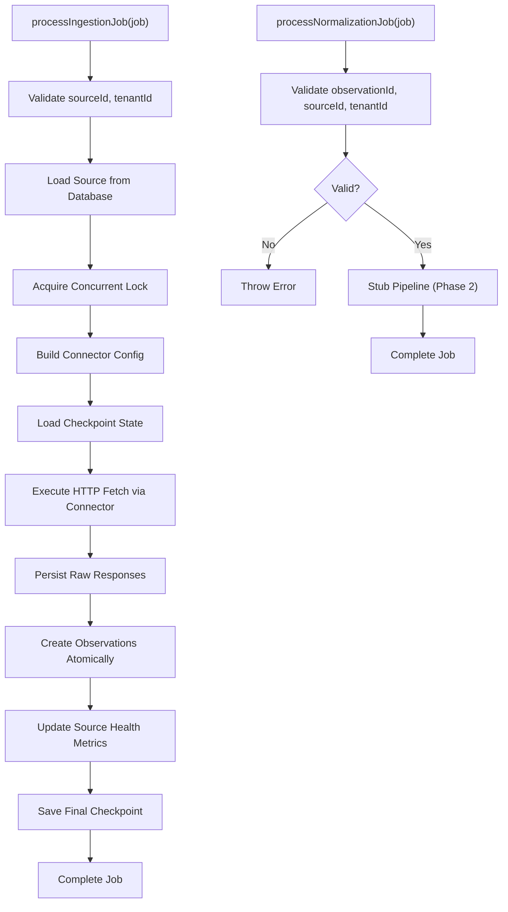

**Diagram sources**
- [ingestion.ts:124-447](file://apps/worker/src/processors/ingestion.ts#L124-L447)
- [normalization.ts:15-57](file://apps/worker/src/processors/normalization.ts#L15-L57)

**Section sources**
- [ingestion.ts:124-447](file://apps/worker/src/processors/ingestion.ts#L124-L447)
- [normalization.ts:15-57](file://apps/worker/src/processors/normalization.ts#L15-L57)

### Worker Startup Example
To start the worker:
- Ensure Redis is reachable with the configured host, port, and password.
- Run the worker process; it will initialize queues, create workers, start the scheduler, and expose the health server.
- Verify liveness and readiness via the health endpoints.

Operational notes:
- The health server listens on a port derived from the configured API port plus one.
- The worker uses structured logging for observability.
- The ingestion scheduler polls every 60 seconds for sources due for ingestion.

**Section sources**
- [index.ts:4-16](file://apps/worker/src/index.ts#L4-L16)
- [app.ts:44-59](file://apps/worker/src/app.ts#L44-L59)
- [queue-manager.ts:8-13](file://apps/worker/src/queues/queue-manager.ts#L8-L13)
- [scheduler.ts:20-58](file://apps/worker/src/scheduler/scheduler.ts#L20-L58)

## Connector Integration
The worker now integrates with the @exosquad/connector package for production-grade HTTP operations. The connector provides a comprehensive resilience stack including authentication, pagination, retry logic, rate limiting, circuit breaking, and content hashing.

### Connector Features
- **Authentication**: Supports multiple auth strategies (none, api_key, bearer, basic, oauth2)
- **Pagination**: Handles various pagination strategies (page, offset, cursor, link)
- **Retry Logic**: Exponential backoff with jitter and configurable retry policies
- **Rate Limiting**: Token-bucket rate limiting per source with adaptive response header parsing
- **Circuit Breaker**: Per-source circuit breaker with configurable thresholds
- **Content Hashing**: SHA-256 hashing for deduplication and integrity verification
- **SSRF Protection**: Outbound URL validation to prevent server-side request forgery
- **Checkpoint/Resume**: Incremental checkpointing for resumable ingestion

### Connector Configuration
The ingestion processor builds connector configurations from source database records:

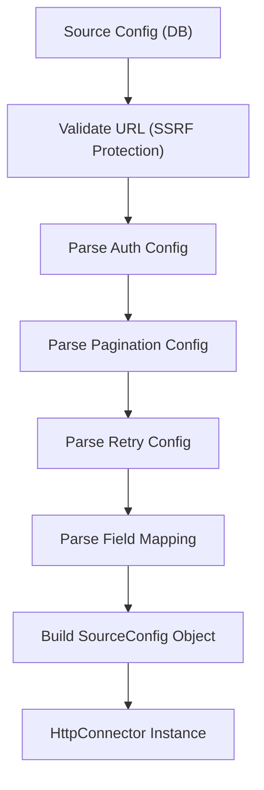

**Diagram sources**
- [ingestion.ts:455-511](file://apps/worker/src/processors/ingestion.ts#L455-L511)
- [http-connector.ts:74-86](file://packages/connector/src/http-connector.ts#L74-L86)

### Resilience Stack Flow
The connector implements a layered resilience approach:

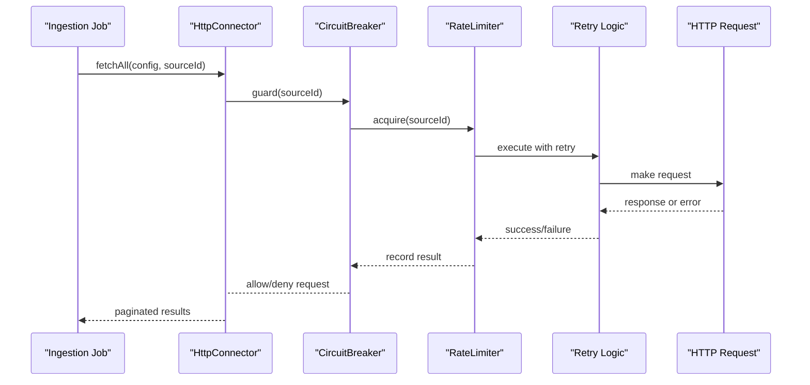

**Diagram sources**
- [http-connector.ts:94-184](file://packages/connector/src/http-connector.ts#L94-L184)
- [http-connector.ts:193-393](file://packages/connector/src/http-connector.ts#L193-L393)

### Test Coverage
The connector package includes comprehensive test coverage with 114 passing tests covering:
- Authentication strategies and token handling
- Pagination strategies and state management
- Retry logic with exponential backoff
- Rate limiting and adaptive throttling
- Circuit breaker functionality
- Content hashing and deduplication
- SSRF protection and URL validation
- Error handling and response parsing

**Section sources**
- [ingestion.ts:19-35](file://apps/worker/src/processors/ingestion.ts#L19-L35)
- [ingestion.ts:455-511](file://apps/worker/src/processors/ingestion.ts#L455-L511)
- [http-connector.ts:74-86](file://packages/connector/src/http-connector.ts#L74-L86)
- [http-connector.ts:94-393](file://packages/connector/src/http-connector.ts#L94-L393)
- [package.json:14-23](file://apps/worker/package.json#L14-L23)

## Dependency Analysis
The worker depends on:
- BullMQ for queue and worker management.
- Redis for persistent job storage and coordination.
- Fastify for the health server.
- Shared packages for configuration and logging.
- @exosquad/connector for production-grade HTTP operations.

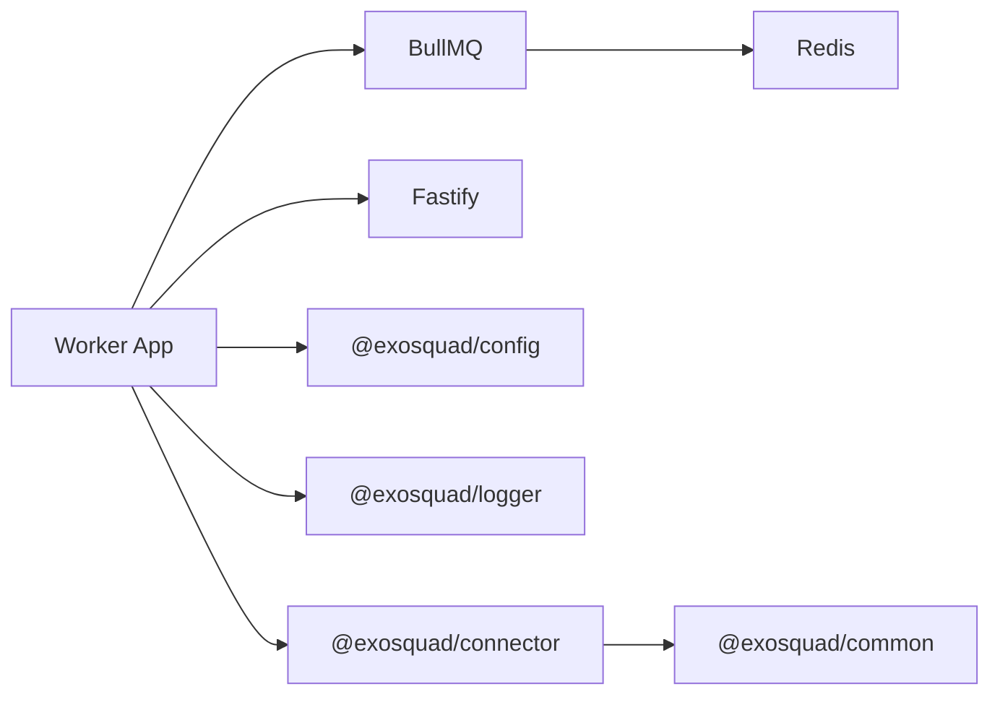

**Diagram sources**
- [queue-manager.ts:1-5](file://apps/worker/src/queues/queue-manager.ts#L1-L5)
- [app.ts:1-5](file://apps/worker/src/app.ts#L1-L5)
- [ingestion.ts:17-32](file://apps/worker/src/processors/ingestion.ts#L17-L32)

**Section sources**
- [queue-manager.ts:1-5](file://apps/worker/src/queues/queue-manager.ts#L1-L5)
- [app.ts:1-5](file://apps/worker/src/app.ts#L1-L5)
- [ingestion.ts:17-32](file://apps/worker/src/processors/ingestion.ts#L17-L32)

## Performance Considerations
- Concurrency tuning: Adjust worker concurrency based on CPU and I/O characteristics. The ingestion worker includes a rate limiter to cap throughput.
- Rate limiting: Use rate limiters to protect downstream systems and maintain stable throughput.
- Backoff and retries: Configure exponential backoff and max attempts to handle transient failures gracefully.
- Memory management:
  - Avoid retaining large payloads in memory; stream or chunk data where possible.
  - Monitor heap usage and set appropriate Node.js memory limits.
  - Clean up references after job completion to prevent leaks.
- Scaling:
  - Scale horizontally by running multiple worker processes per queue.
  - Use container orchestration to auto-scale based on queue depth and latency metrics.
- Observability:
  - Track queue metrics (waiting, active, failed) via readiness endpoint.
  - Correlate logs with jobId and queue name for end-to-end tracing.
- Connector optimization:
  - Leverage circuit breaker to prevent cascading failures.
  - Use content hashing for efficient deduplication.
  - Implement incremental checkpointing for resumable operations.

[No sources needed since this section provides general guidance]

## Troubleshooting Guide
Common issues and resolutions:
- Redis connectivity failures:
  - Verify host, port, and password configuration.
  - Check network policies and firewall rules.
- High failure rates:
  - Inspect job payload validation errors.
  - Review retry/backoff settings and adjust as needed.
- Slow processing:
  - Tune concurrency and rate limits.
  - Profile external dependencies and optimize I/O operations.
- Graceful shutdown not completing:
  - Ensure no long-running tasks block worker close.
  - Confirm health server closure completes.
- Connector-related issues:
  - Check circuit breaker status for failing sources.
  - Verify rate limit headers and adaptive throttling.
  - Validate outbound URLs for SSRF protection.
  - Monitor retry attempts and backoff delays.

Monitoring strategies:
- Use structured logs to track job lifecycle and durations.
- Periodically scrape readiness endpoint to detect degraded states.
- Alert on sustained high failure counts or queue backlogs.
- Monitor connector metrics including circuit breaker state, rate limit utilization, and retry statistics.

**Section sources**
- [queue-manager.ts:141-164](file://apps/worker/src/queues/queue-manager.ts#L141-L164)
- [app.ts:23-41](file://apps/worker/src/app.ts#L23-L41)
- [http-connector.ts:569-633](file://packages/connector/src/http-connector.ts#L569-L633)

## Conclusion
The Exosquad worker service provides a robust foundation for background job processing using BullMQ and Redis, now enhanced with the connector package for production-grade HTTP operations. The integration brings comprehensive resilience features including circuit breakers, rate limiting, retry logic, and content hashing. The worker manages queue initialization, worker lifecycle, scheduler operations, and graceful shutdown while exposing health endpoints for monitoring. With configurable concurrency, rate limiting, structured logging, and the connector's advanced features, the worker is well-positioned for horizontal scaling and operational reliability. Future phases will implement actual normalization logic, building on the current infrastructure and connector integration.

[No sources needed since this section summarizes without analyzing specific files]