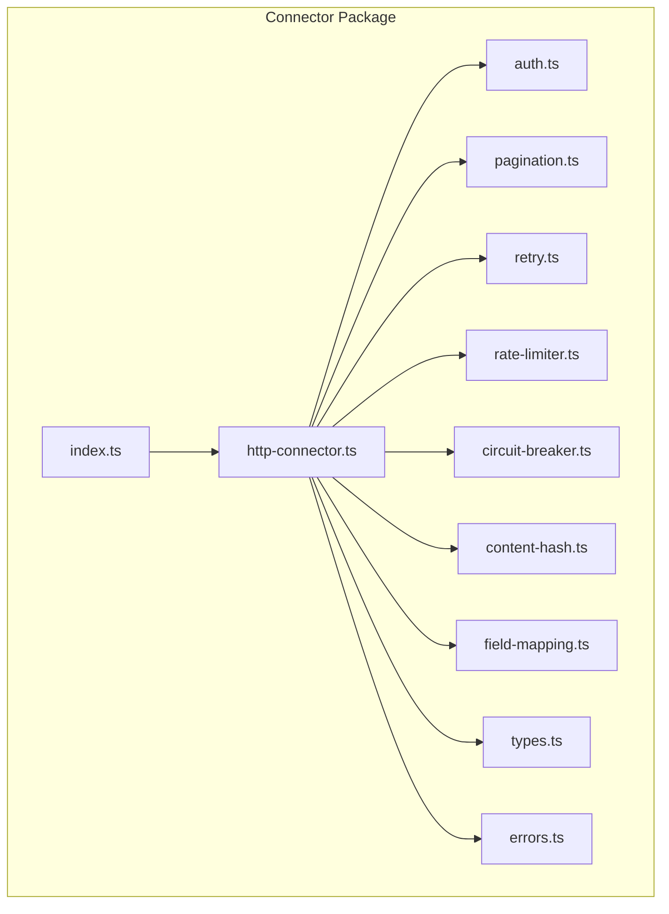
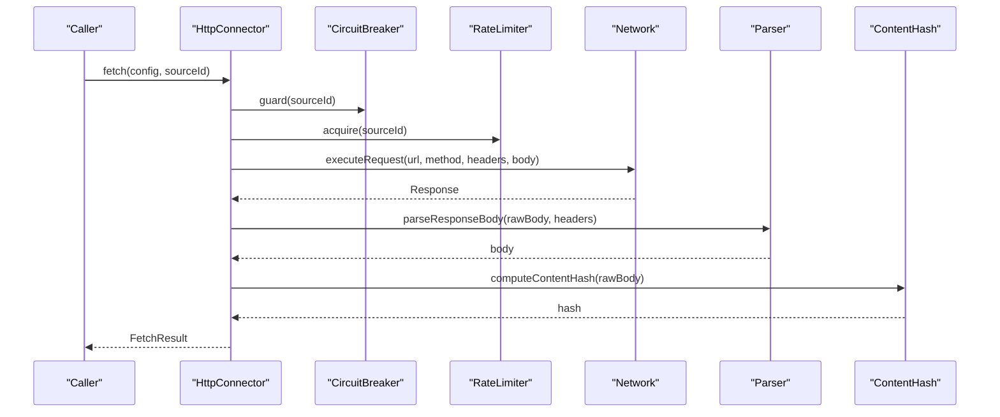
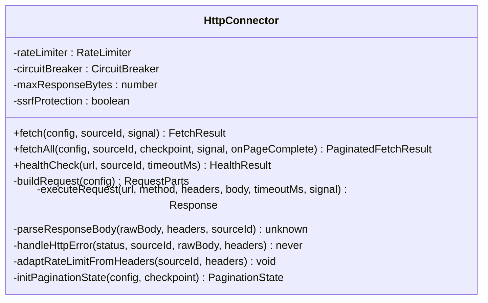
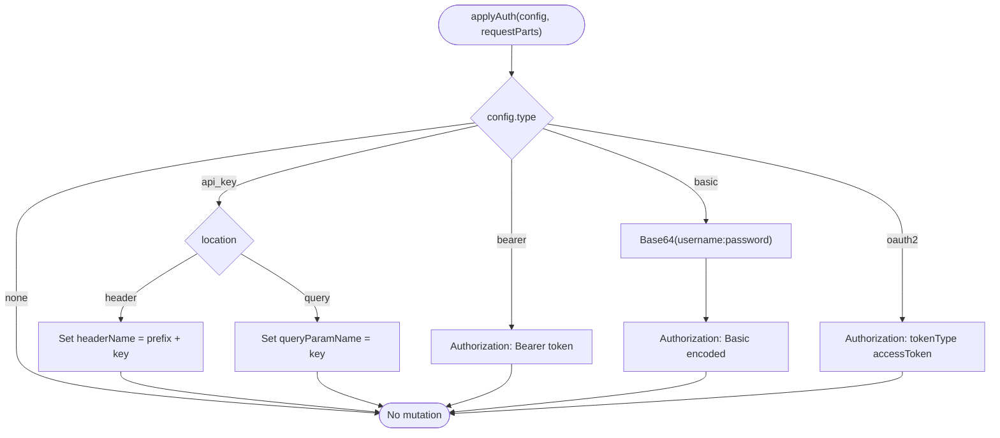
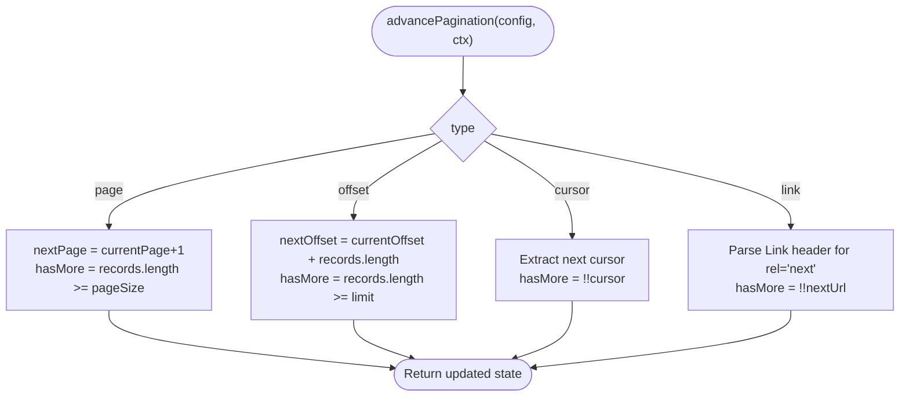
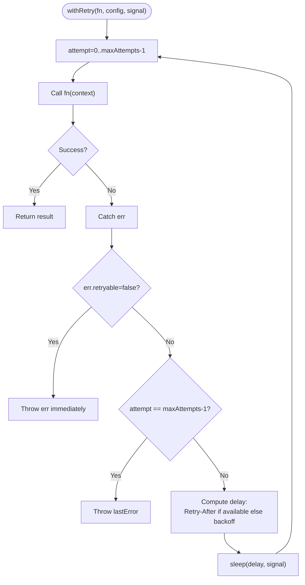
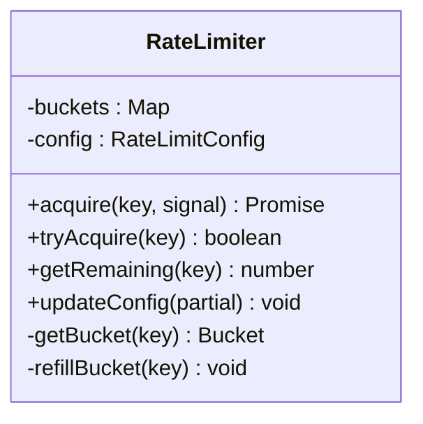
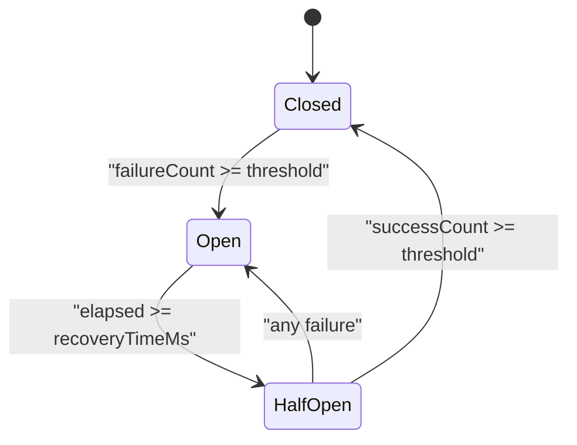
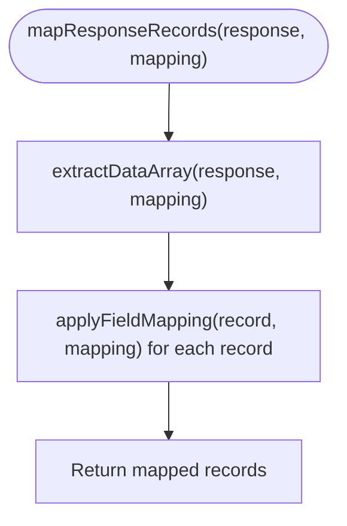
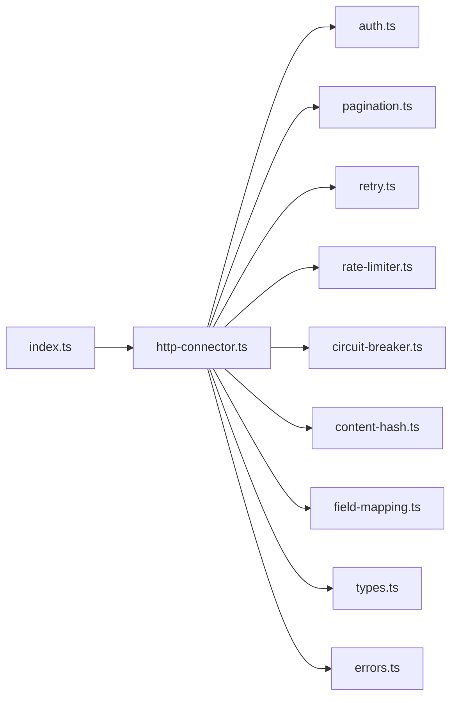

# Connector Package

<cite>
**Referenced Files in This Document**
- [package.json](file://packages/connector/package.json)
- [index.ts](file://packages/connector/src/index.ts)
- [http-connector.ts](file://packages/connector/src/http-connector.ts)
- [types.ts](file://packages/connector/src/types.ts)
- [auth.ts](file://packages/connector/src/auth.ts)
- [pagination.ts](file://packages/connector/src/pagination.ts)
- [retry.ts](file://packages/connector/src/retry.ts)
- [rate-limiter.ts](file://packages/connector/src/rate-limiter.ts)
- [circuit-breaker.ts](file://packages/connector/src/circuit-breaker.ts)
- [content-hash.ts](file://packages/connector/src/content-hash.ts)
- [field-mapping.ts](file://packages/connector/src/field-mapping.ts)
- [errors.ts](file://packages/connector/src/errors.ts)
</cite>

## Table of Contents
1. [Introduction](#introduction)
2. [Project Structure](#project-structure)
3. [Core Components](#core-components)
4. [Architecture Overview](#architecture-overview)
5. [Detailed Component Analysis](#detailed-component-analysis)
6. [Dependency Analysis](#dependency-analysis)
7. [Performance Considerations](#performance-considerations)
8. [Troubleshooting Guide](#troubleshooting-guide)
9. [Conclusion](#conclusion)

## Introduction
The Connector package provides a production-grade, provider-agnostic HTTP connector for ingesting data from external APIs. It centralizes authentication, pagination, retry/backoff, rate limiting, circuit breaking, content hashing, field mapping, and SSRF protection. The package is designed to be reused by the API server and worker services to fetch, normalize, and persist observations from arbitrary sources.

## Project Structure
The package exposes a single public entry point that re-exports core classes, utilities, schemas, and types. Internally, it composes several focused modules:

- Public API: index.ts
- Core engine: http-connector.ts
- Shared types and utilities: types.ts
- Authentication strategies: auth.ts
- Pagination strategies: pagination.ts
- Retry with backoff: retry.ts
- Token-bucket rate limiter: rate-limiter.ts
- Circuit breaker: circuit-breaker.ts
- Content hashing: content-hash.ts
- Field mapping: field-mapping.ts
- Error hierarchy: errors.ts

**Diagram sources**
- [index.ts:8-82](file://packages/connector/src/index.ts#L8-L82)
- [http-connector.ts:17-45](file://packages/connector/src/http-connector.ts#L17-L45)

**Section sources**
- [package.json:1-24](file://packages/connector/package.json#L1-L24)
- [index.ts:1-83](file://packages/connector/src/index.ts#L1-L83)

## Core Components
- HttpConnector: Orchestrates fetching, resilience (circuit breaker, rate limiter), retries, parsing, hashing, and pagination.
- Auth: Applies multiple authentication strategies to outgoing requests.
- Pagination: Supports page, offset, cursor, and link-based strategies with state advancement.
- Retry: Exponential backoff with jitter, respecting Retry-After and status codes.
- Rate Limiter: Per-source token bucket with configurable windows.
- Circuit Breaker: Per-source state machine to prevent cascading failures.
- Content Hash: Deterministic hashing for deduplication and provenance.
- Field Mapping: Maps arbitrary external payloads into canonical records.
- Errors: Typed error hierarchy with retryability and context.

**Section sources**
- [http-connector.ts:58-86](file://packages/connector/src/http-connector.ts#L58-L86)
- [auth.ts:11-51](file://packages/connector/src/auth.ts#L11-L51)
- [pagination.ts:9-47](file://packages/connector/src/pagination.ts#L9-L47)
- [retry.ts:11-31](file://packages/connector/src/retry.ts#L11-L31)
- [rate-limiter.ts:12-27](file://packages/connector/src/rate-limiter.ts#L12-L27)
- [circuit-breaker.ts:15-27](file://packages/connector/src/circuit-breaker.ts#L15-L27)
- [content-hash.ts:7-24](file://packages/connector/src/content-hash.ts#L7-L24)
- [field-mapping.ts:10-27](file://packages/connector/src/field-mapping.ts#L10-L27)
- [errors.ts:7-108](file://packages/connector/src/errors.ts#L7-L108)

## Architecture Overview
The connector composes multiple resilience layers around a single HTTP call:

**Diagram sources**
- [http-connector.ts:94-184](file://packages/connector/src/http-connector.ts#L94-L184)
- [circuit-breaker.ts:49-75](file://packages/connector/src/circuit-breaker.ts#L49-L75)
- [rate-limiter.ts:29-79](file://packages/connector/src/rate-limiter.ts#L29-L79)
- [content-hash.ts:7-15](file://packages/connector/src/content-hash.ts#L7-L15)

## Detailed Component Analysis

### HttpConnector
Responsibilities:
- Build requests with auth and query parameters.
- Enforce SSRF protection on outbound URLs.
- Execute HTTP calls with timeouts and response size limits.
- Parse responses and handle HTTP error semantics.
- Integrate rate limiting, circuit breaking, and retry.
- Compute content hashes and sanitize request metadata.
- Provide paginated fetch-all with checkpointing and loop detection.

Key behaviors:
- Default timeout, max pages, and response size limits are enforced.
- Rate limit adaptation from response headers is supported.
- Checkpoint/resume supports last cursor/page/offset and total processed count.

**Diagram sources**
- [http-connector.ts:74-86](file://packages/connector/src/http-connector.ts#L74-L86)
- [http-connector.ts:94-184](file://packages/connector/src/http-connector.ts#L94-L184)
- [http-connector.ts:193-393](file://packages/connector/src/http-connector.ts#L193-L393)
- [http-connector.ts:444-468](file://packages/connector/src/http-connector.ts#L444-L468)
- [http-connector.ts:472-531](file://packages/connector/src/http-connector.ts#L472-L531)
- [http-connector.ts:535-565](file://packages/connector/src/http-connector.ts#L535-L565)
- [http-connector.ts:569-633](file://packages/connector/src/http-connector.ts#L569-L633)
- [http-connector.ts:637-648](file://packages/connector/src/http-connector.ts#L637-L648)
- [http-connector.ts:652-678](file://packages/connector/src/http-connector.ts#L652-L678)

**Section sources**
- [http-connector.ts:49-86](file://packages/connector/src/http-connector.ts#L49-L86)
- [http-connector.ts:94-184](file://packages/connector/src/http-connector.ts#L94-L184)
- [http-connector.ts:193-393](file://packages/connector/src/http-connector.ts#L193-L393)
- [http-connector.ts:401-430](file://packages/connector/src/http-connector.ts#L401-L430)
- [http-connector.ts:444-678](file://packages/connector/src/http-connector.ts#L444-L678)

### Authentication Strategies
Supports:
- none
- api_key (header or query)
- bearer
- basic
- oauth2

Validation:
- Zod schemas per strategy and discriminated union for config validation.

Mutation:
- applyAuth mutates RequestParts (url, headers, queryParams).

**Diagram sources**
- [auth.ts:65-99](file://packages/connector/src/auth.ts#L65-L99)

**Section sources**
- [auth.ts:11-51](file://packages/connector/src/auth.ts#L11-L51)
- [auth.ts:55-59](file://packages/connector/src/auth.ts#L55-L59)
- [auth.ts:65-99](file://packages/connector/src/auth.ts#L65-L99)
- [auth.ts:104-112](file://packages/connector/src/auth.ts#L104-L112)

### Pagination Strategies
Strategies:
- page: increment page number; stop when fewer than pageSize returned.
- offset: increment offset by records length; stop when fewer than limit returned.
- cursor: extract next cursor from response; stop when absent.
- link: parse Link header for next URL; stop when absent.

State management:
- advancePagination computes hasMore and updates state.
- applyPaginationParams injects query params for non-link strategies.
- Loop detection via seen cursors during fetchAll.

**Diagram sources**
- [pagination.ts:76-136](file://packages/connector/src/pagination.ts#L76-L136)
- [pagination.ts:141-172](file://packages/connector/src/pagination.ts#L141-L172)
- [pagination.ts:201-210](file://packages/connector/src/pagination.ts#L201-L210)

**Section sources**
- [pagination.ts:9-47](file://packages/connector/src/pagination.ts#L9-L47)
- [pagination.ts:49-57](file://packages/connector/src/pagination.ts#L49-L57)
- [pagination.ts:76-136](file://packages/connector/src/pagination.ts#L76-L136)
- [pagination.ts:141-172](file://packages/connector/src/pagination.ts#L141-L172)
- [pagination.ts:201-219](file://packages/connector/src/pagination.ts#L201-L219)

### Retry with Backoff
Features:
- Exponential backoff with configurable multiplier and jitter.
- Respects Retry-After from upstream (seconds or HTTP-date).
- Status-code based retryability and explicit ConnectorError.retryable flag.

**Diagram sources**
- [retry.ts:39-48](file://packages/connector/src/retry.ts#L39-L48)
- [retry.ts:80-132](file://packages/connector/src/retry.ts#L80-L132)

**Section sources**
- [retry.ts:11-31](file://packages/connector/src/retry.ts#L11-L31)
- [retry.ts:39-48](file://packages/connector/src/retry.ts#L39-L48)
- [retry.ts:80-132](file://packages/connector/src/retry.ts#L80-L132)
- [retry.ts:137-140](file://packages/connector/src/retry.ts#L137-L140)

### Rate Limiter
- Token-bucket algorithm per key (sourceId).
- Configurable window and maxRequests.
- Async acquire with AbortSignal support.
- Utility to parse common rate-limit headers.

**Diagram sources**
- [rate-limiter.ts:21-27](file://packages/connector/src/rate-limiter.ts#L21-L27)
- [rate-limiter.ts:29-79](file://packages/connector/src/rate-limiter.ts#L29-L79)
- [rate-limiter.ts:113-132](file://packages/connector/src/rate-limiter.ts#L113-L132)

**Section sources**
- [rate-limiter.ts:12-27](file://packages/connector/src/rate-limiter.ts#L12-L27)
- [rate-limiter.ts:29-79](file://packages/connector/src/rate-limiter.ts#L29-L79)
- [rate-limiter.ts:81-132](file://packages/connector/src/rate-limiter.ts#L81-L132)
- [rate-limiter.ts:139-181](file://packages/connector/src/rate-limiter.ts#L139-L181)

### Circuit Breaker
- States: closed → open → half_open.
- Monitors failure thresholds and recovery time.
- Tracks success threshold to close after recovery.

**Diagram sources**
- [circuit-breaker.ts:15-27](file://packages/connector/src/circuit-breaker.ts#L15-L27)
- [circuit-breaker.ts:49-75](file://packages/connector/src/circuit-breaker.ts#L49-L75)
- [circuit-breaker.ts:80-127](file://packages/connector/src/circuit-breaker.ts#L80-L127)

**Section sources**
- [circuit-breaker.ts:15-27](file://packages/connector/src/circuit-breaker.ts#L15-L27)
- [circuit-breaker.ts:41-47](file://packages/connector/src/circuit-breaker.ts#L41-L47)
- [circuit-breaker.ts:49-75](file://packages/connector/src/circuit-breaker.ts#L49-L75)
- [circuit-breaker.ts:80-127](file://packages/connector/src/circuit-breaker.ts#L80-L127)
- [circuit-breaker.ts:132-167](file://packages/connector/src/circuit-breaker.ts#L132-L167)

### Content Hashing
- SHA-256 hashing for raw strings/buffers.
- Deterministic JSON hashing with sorted keys.

**Section sources**
- [content-hash.ts:7-24](file://packages/connector/src/content-hash.ts#L7-L24)

### Field Mapping
- Dot-notation path extraction with array indexing support.
- Optional defaults, type coercion, and required fields.
- Data array extraction and record mapping.

**Diagram sources**
- [field-mapping.ts:99-125](file://packages/connector/src/field-mapping.ts#L99-L125)
- [field-mapping.ts:59-94](file://packages/connector/src/field-mapping.ts#L59-L94)

**Section sources**
- [field-mapping.ts:10-27](file://packages/connector/src/field-mapping.ts#L10-L27)
- [field-mapping.ts:34-54](file://packages/connector/src/field-mapping.ts#L34-L54)
- [field-mapping.ts:59-94](file://packages/connector/src/field-mapping.ts#L59-L94)
- [field-mapping.ts:99-125](file://packages/connector/src/field-mapping.ts#L99-L125)
- [field-mapping.ts:129-153](file://packages/connector/src/field-mapping.ts#L129-L153)
- [field-mapping.ts:158-162](file://packages/connector/src/field-mapping.ts#L158-L162)

### Types and Utilities
- SourceConfig aggregates all connector configuration.
- FetchResult and PaginatedFetchResult model outcomes.
- CheckpointState enables resumable ingestion.
- Utilities: sanitizeRequestHeaders, flattenHeaders, extractResponseDataArray, buildUrl, validateOutboundUrl, parseRetryAfterHeader.

**Section sources**
- [types.ts:12-32](file://packages/connector/src/types.ts#L12-L32)
- [types.ts:34-74](file://packages/connector/src/types.ts#L34-L74)
- [types.ts:78-101](file://packages/connector/src/types.ts#L78-L101)
- [types.ts:107-123](file://packages/connector/src/types.ts#L107-L123)
- [types.ts:131-155](file://packages/connector/src/types.ts#L131-L155)
- [types.ts:166-187](file://packages/connector/src/types.ts#L166-L187)
- [types.ts:213-249](file://packages/connector/src/types.ts#L213-L249)

### Error Hierarchy
- Base ConnectorError extends AppError with retryable flag and optional sourceId.
- Specialized errors: TimeoutError, RateLimitExceededError, AuthenticationError, CircuitOpenError, SchemaValidationError, MalformedResponseError.

**Section sources**
- [errors.ts:7-26](file://packages/connector/src/errors.ts#L7-L26)
- [errors.ts:28-39](file://packages/connector/src/errors.ts#L28-L39)
- [errors.ts:41-55](file://packages/connector/src/errors.ts#L41-L55)
- [errors.ts:57-67](file://packages/connector/src/errors.ts#L57-L67)
- [errors.ts:69-80](file://packages/connector/src/errors.ts#L69-L80)
- [errors.ts:82-96](file://packages/connector/src/errors.ts#L82-L96)
- [errors.ts:98-108](file://packages/connector/src/errors.ts#L98-L108)

## Dependency Analysis
Internal dependencies:
- http-connector.ts depends on auth, pagination, retry, rate-limiter, circuit-breaker, content-hash, types, and errors.
- index.ts re-exports from http-connector and other modules for a clean public API.

External dependencies:
- @exosquad/logger for structured logging.
- zod for schema validation.
- node:crypto for hashing.

**Diagram sources**
- [index.ts:8-82](file://packages/connector/src/index.ts#L8-L82)
- [http-connector.ts:17-45](file://packages/connector/src/http-connector.ts#L17-L45)

**Section sources**
- [index.ts:8-82](file://packages/connector/src/index.ts#L8-L82)
- [http-connector.ts:17-45](file://packages/connector/src/http-connector.ts#L17-L45)

## Performance Considerations
- Timeouts: All network calls enforce configurable timeouts to avoid hanging.
- Response size limits: Prevent memory pressure from oversized payloads.
- Max pages: Paginated fetches cap at a safe maximum to prevent infinite loops.
- Concurrency: Rate limiter controls throughput per source; consider scaling workers horizontally.
- Logging: Structured logs include latency and content hash prefixes for observability without exposing secrets.

[No sources needed since this section provides general guidance]

## Troubleshooting Guide
Common issues and resolutions:
- Authentication failures (401/403): Verify auth strategy and credentials; check Authorization header construction.
- Rate limiting (429): Inspect Retry-After header; adjust rate limit config or throttle downstream consumers.
- Server errors (5xx): Expect automatic retries with backoff; monitor circuit breaker state for repeated failures.
- Malformed responses: Ensure content-type handling and JSON parsing expectations match upstream.
- SSRF protection: Validate outbound URLs; ensure they are not internal/private endpoints.
- Pagination loops: Monitor repeated cursor warnings; verify next-cursor logic and Link header parsing.

Operational tips:
- Use healthCheck to probe endpoint reachability before heavy ingestion.
- Persist checkpoints to resume paginated ingestion after restarts.
- Inspect sanitized request headers in logs to debug auth/header issues without leaking secrets.

**Section sources**
- [http-connector.ts:569-633](file://packages/connector/src/http-connector.ts#L569-L633)
- [http-connector.ts:325-336](file://packages/connector/src/http-connector.ts#L325-L336)
- [types.ts:213-249](file://packages/connector/src/types.ts#L213-L249)

## Conclusion
The Connector package delivers a robust, extensible foundation for integrating with diverse external APIs. By centralizing authentication, pagination, retry/backoff, rate limiting, circuit breaking, hashing, and field mapping, it enables reliable ingestion pipelines with strong safety guarantees and clear observability. Consumers can configure sources declaratively and rely on the connector to handle resilience, security, and normalization concerns.