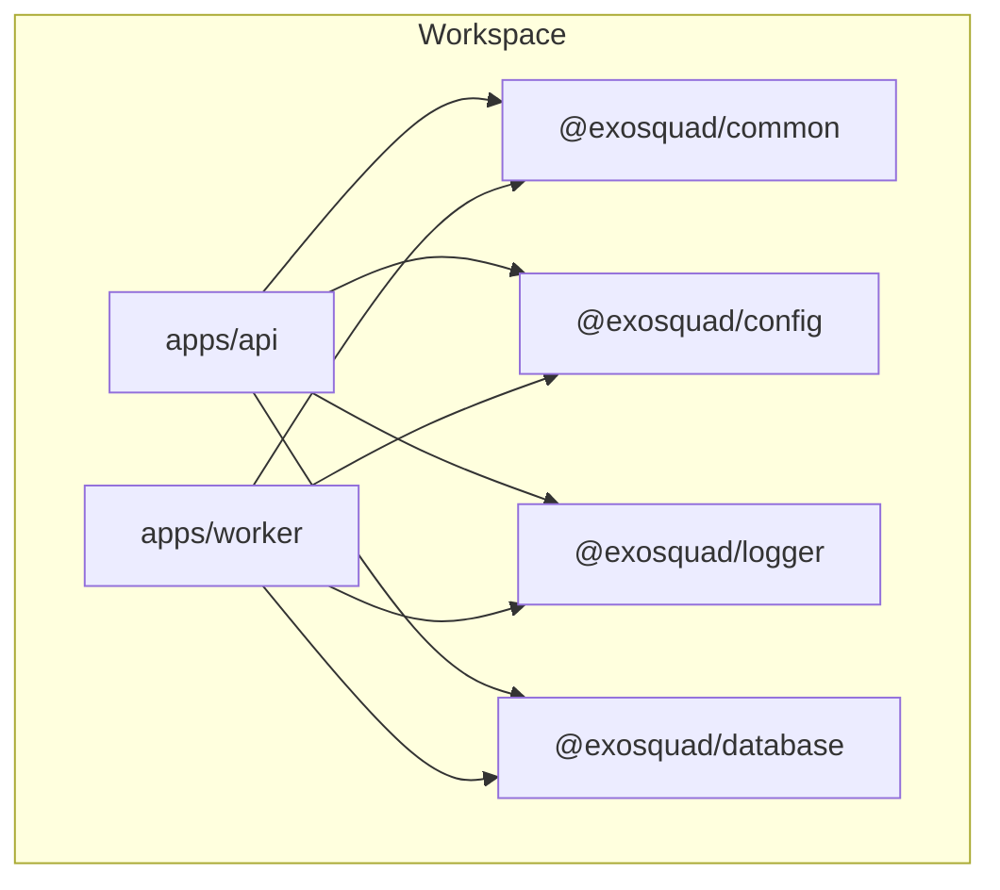
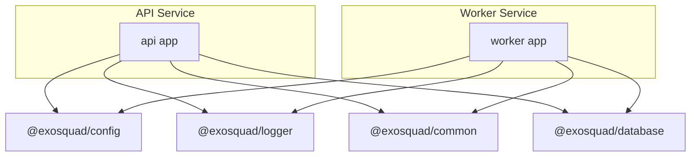
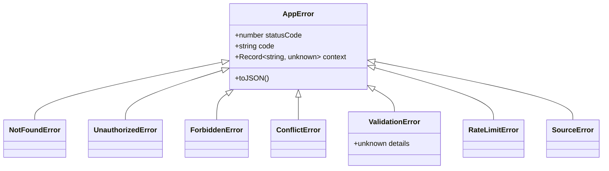
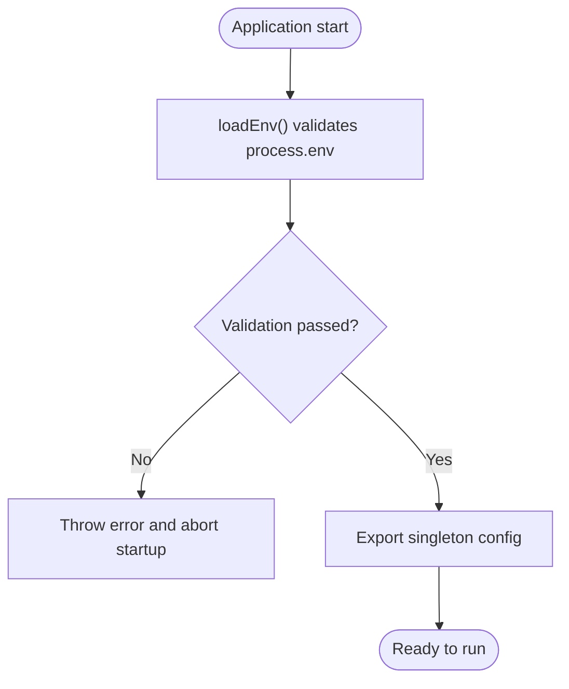
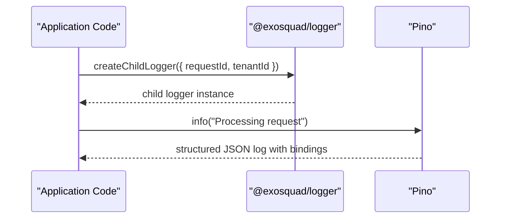
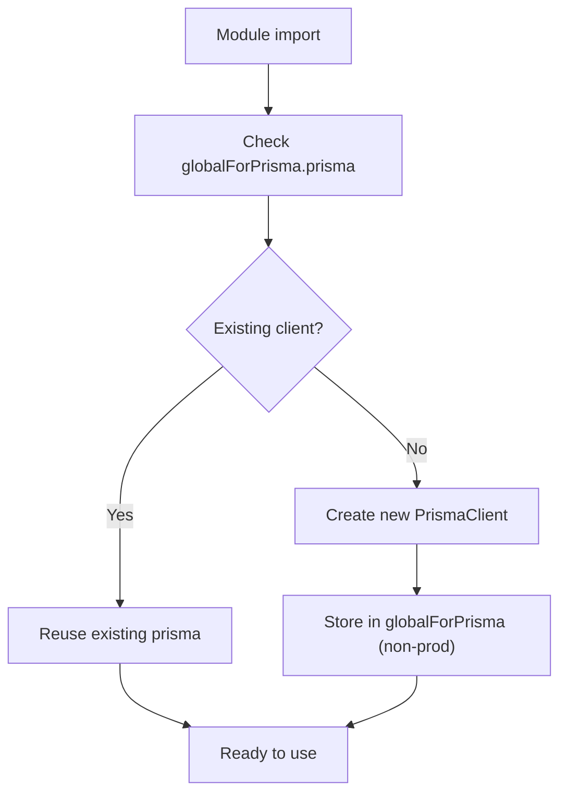
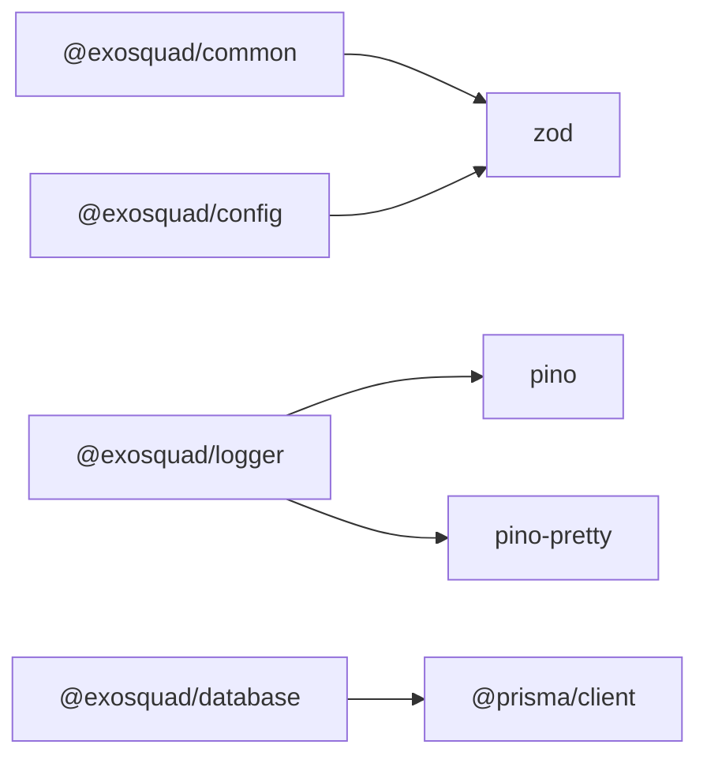

# Shared Libraries

<cite>
**Referenced Files in This Document**
- [package.json](file://package.json)
- [pnpm-workspace.yaml](file://pnpm-workspace.yaml)
- [packages/common/src/index.ts](file://packages/common/src/index.ts)
- [packages/common/package.json](file://packages/common/package.json)
- [packages/config/src/index.ts](file://packages/config/src/index.ts)
- [packages/config/package.json](file://packages/config/package.json)
- [packages/logger/src/index.ts](file://packages/logger/src/index.ts)
- [packages/logger/package.json](file://packages/logger/package.json)
- [packages/database/src/index.ts](file://packages/database/src/index.ts)
- [packages/database/package.json](file://packages/database/package.json)
</cite>

## Table of Contents
1. [Introduction](#introduction)
2. [Project Structure](#project-structure)
3. [Core Components](#core-components)
4. [Architecture Overview](#architecture-overview)
5. [Detailed Component Analysis](#detailed-component-analysis)
6. [Dependency Analysis](#dependency-analysis)
7. [Performance Considerations](#performance-considerations)
8. [Troubleshooting Guide](#troubleshooting-guide)
9. [Conclusion](#conclusion)
10. [Appendices](#appendices)

## Introduction
This document describes Exosquad’s shared libraries and reusable packages that power the API and worker applications. It focuses on:
- Common utilities: shared types, error hierarchy, validation schemas, and helper interfaces.
- Configuration management: environment variable validation and typed configuration access.
- Structured logging: Pino-based JSON logging with child loggers for contextual fields.
- Database client: Prisma client singleton and test-safe factory.

It also provides usage examples, API references, integration guidelines, versioning strategies, dependency management notes, and contribution guidelines for shared code.

## Project Structure
The repository is a pnpm workspace containing apps and shared packages under packages/. The shared libraries are:
- @exosquad/common: shared types, errors, and validation schemas.
- @exosquad/config: environment validation and typed config access.
- @exosquad/logger: structured logging via Pino.
- @exosquad/database: Prisma client singleton and helpers.

**Diagram sources**
- [pnpm-workspace.yaml:1-4](file://pnpm-workspace.yaml#L1-L4)

**Section sources**
- [pnpm-workspace.yaml:1-4](file://pnpm-workspace.yaml#L1-L4)
- [package.json:1-33](file://package.json#L1-L33)

## Core Components
- @exosquad/common: Provides a consistent error hierarchy (AppError and domain-specific errors), Zod-based validation schemas (pagination, sorting, id params), and shared TypeScript types (PaginatedResult, AuthenticatedRequest, HealthStatus).
- @exosquad/config: Validates all environment variables at startup using Zod, exposes a typed Env interface and a loadEnv function, and exports a singleton config object.
- @exosquad/logger: Initializes Pino with appropriate serializers and base context; supports child loggers bound to request-level or tenant-level context.
- @exosquad/database: Exposes a singleton PrismaClient instance and a createTestClient factory for isolated testing.

**Section sources**
- [packages/common/src/index.ts:1-143](file://packages/common/src/index.ts#L1-L143)
- [packages/config/src/index.ts:1-57](file://packages/config/src/index.ts#L1-L57)
- [packages/logger/src/index.ts:1-44](file://packages/logger/src/index.ts#L1-L44)
- [packages/database/src/index.ts:1-38](file://packages/database/src/index.ts#L1-L38)

## Architecture Overview
The shared libraries form a cohesive foundation used by both API and Worker services. Configuration is validated early, logging is centralized, common types and errors ensure consistency across services, and database access is standardized through Prisma.

**Diagram sources**
- [packages/config/src/index.ts:1-57](file://packages/config/src/index.ts#L1-L57)
- [packages/logger/src/index.ts:1-44](file://packages/logger/src/index.ts#L1-L44)
- [packages/common/src/index.ts:1-143](file://packages/common/src/index.ts#L1-L143)
- [packages/database/src/index.ts:1-38](file://packages/database/src/index.ts#L1-L38)

## Detailed Component Analysis

### @exosquad/common — Shared Types, Errors, and Validation
Responsibilities:
- Error hierarchy: Base AppError with typed statusCode, code, and optional context; domain-specific errors like NotFoundError, UnauthorizedError, ForbiddenError, ConflictError, ValidationError, RateLimitError, SourceError.
- Validation schemas: paginationSchema, sortSchema, idParamSchema using Zod.
- Shared types: PaginationParams, SortParams, PaginatedResult<T>, AuthenticatedRequest, HealthStatus.

Usage examples:
- Throw NotFoundError when a resource is missing; catch and map to HTTP 404 responses.
- Validate incoming query parameters using paginationSchema and sortSchema to enforce safe defaults and constraints.
- Return PaginatedResult<T> from list endpoints to standardize response shape.

API reference highlights:
- Exported classes: AppError, NotFoundError, UnauthorizedError, ForbiddenError, ConflictError, ValidationError, RateLimitError, SourceError.
- Exported schemas: paginationSchema, sortSchema, idParamSchema.
- Exported types: PaginationParams, SortParams, PaginatedResult<T>, AuthenticatedRequest, HealthStatus.

Integration guidelines:
- Centralize error handling in application layers to convert domain errors into consistent HTTP responses.
- Use Zod schemas for input validation at route boundaries.
- Adopt PaginatedResult<T> for all paginated endpoints.

**Diagram sources**
- [packages/common/src/index.ts:11-93](file://packages/common/src/index.ts#L11-L93)

**Section sources**
- [packages/common/src/index.ts:1-143](file://packages/common/src/index.ts#L1-L143)
- [packages/common/package.json:1-19](file://packages/common/package.json#L1-L19)

### @exosquad/config — Environment Validation and Typed Config
Responsibilities:
- Define a strict schema for required and optional environment variables.
- Provide loadEnv() to validate process.env at startup and throw on invalid configuration.
- Export a singleton config object for convenient access throughout the application.

Environment variables:
- DATABASE_URL: Required URL for the database connection.
- REDIS_HOST, REDIS_PORT, REDIS_PASSWORD: Redis connection settings.
- NODE_ENV: Application environment enum.
- PORT: Server port number.
- LOG_LEVEL: Logging verbosity level.
- JWT_SECRET, JWT_EXPIRES_IN: Authentication secrets and token expiry.
- WORKER_CONCURRENCY: Background job concurrency setting.

Usage examples:
- Import config at application entry points to ensure environment is validated before starting servers.
- Access typed values like config.PORT or config.JWT_SECRET instead of reading process.env directly.

Integration guidelines:
- Fail fast on startup if any required environment variable is missing or invalid.
- Keep sensitive values out of source control; use secure secret management systems.

**Diagram sources**
- [packages/config/src/index.ts:38-56](file://packages/config/src/index.ts#L38-L56)

**Section sources**
- [packages/config/src/index.ts:1-57](file://packages/config/src/index.ts#L1-L57)
- [packages/config/package.json:1-19](file://packages/config/package.json#L1-L19)

### @exosquad/logger — Structured Logging with Pino
Responsibilities:
- Initialize Pino logger with appropriate serializers and base service context.
- Support pretty printing in non-production environments.
- Provide createChildLogger(bindings) to attach contextual fields (e.g., requestId, tenantId) to subsequent logs.

Log formatting:
- Production: newline-delimited JSON suitable for aggregation pipelines.
- Development: human-readable colored output via pino-pretty.

Usage examples:
- Use the default logger for general application events.
- Create child loggers per request or tenant to enrich logs with correlation IDs.

Integration guidelines:
- Bind request-scoped identifiers (requestId, userId, tenantId) to child loggers at middleware boundaries.
- Avoid logging sensitive data; rely on serializers to safely format errors.

**Diagram sources**
- [packages/logger/src/index.ts:10-41](file://packages/logger/src/index.ts#L10-L41)

**Section sources**
- [packages/logger/src/index.ts:1-44](file://packages/logger/src/index.ts#L1-L44)
- [packages/logger/package.json:1-20](file://packages/logger/package.json#L1-L20)

### @exosquad/database — Prisma Client Singleton and Test Factory
Responsibilities:
- Export PrismaClient and Prisma types for type-safe database access.
- Provide a singleton prisma instance to avoid multiple connections.
- Offer createTestClient(url) for tests requiring isolated connections.

Usage examples:
- Import prisma from @exosquad/database to perform queries and mutations.
- In tests, instantiate createTestClient with a temporary datasource URL.

Integration guidelines:
- Ensure DATABASE_URL is configured via @exosquad/config before initializing database operations.
- Use createTestClient in unit/integration tests to isolate state between runs.

**Diagram sources**
- [packages/database/src/index.ts:11-29](file://packages/database/src/index.ts#L11-L29)

**Section sources**
- [packages/database/src/index.ts:1-38](file://packages/database/src/index.ts#L1-L38)
- [packages/database/package.json:1-25](file://packages/database/package.json#L1-L25)

## Dependency Analysis
Shared libraries have minimal coupling and clear responsibilities:
- @exosquad/common depends only on zod for validation.
- @exosquad/config depends only on zod for environment validation.
- @exosquad/logger depends on pino and pino-pretty.
- @exosquad/database depends on @prisma/client.

**Diagram sources**
- [packages/common/package.json:12-14](file://packages/common/package.json#L12-L14)
- [packages/config/package.json:12-14](file://packages/config/package.json#L12-L14)
- [packages/logger/package.json:12-15](file://packages/logger/package.json#L12-L15)
- [packages/database/package.json:17-19](file://packages/database/package.json#L17-L19)

**Section sources**
- [packages/common/package.json:1-19](file://packages/common/package.json#L1-L19)
- [packages/config/package.json:1-19](file://packages/config/package.json#L1-L19)
- [packages/logger/package.json:1-20](file://packages/logger/package.json#L1-L20)
- [packages/database/package.json:1-25](file://packages/database/package.json#L1-L25)

## Performance Considerations
- Logging: Prefer child loggers to avoid repeated binding overhead; keep log levels appropriate for environments (info/debug in dev, warn/error in prod).
- Configuration: Validate once at startup; avoid re-parsing environment variables.
- Database: Reuse the singleton prisma client; use createTestClient only in tests to prevent connection leaks.
- Validation: Use Zod schemas consistently to reduce runtime errors and improve performance by failing fast on invalid inputs.

[No sources needed since this section provides general guidance]

## Troubleshooting Guide
Common issues and resolutions:
- Missing or invalid environment variables:
  - Symptom: Startup throws an error indicating invalid environment configuration.
  - Resolution: Ensure all required variables (e.g., DATABASE_URL, JWT_SECRET) are present and valid.
- Incorrect log verbosity:
  - Symptom: Too much or too little logging.
  - Resolution: Set LOG_LEVEL appropriately; verify NODE_ENV for transport behavior.
- Multiple database connections:
  - Symptom: Connection pool exhaustion or unexpected behavior.
  - Resolution: Use the exported singleton prisma; avoid creating new clients outside tests.
- Validation failures:
  - Symptom: Requests rejected due to invalid parameters.
  - Resolution: Align client payloads with paginationSchema, sortSchema, and idParamSchema.

**Section sources**
- [packages/config/src/index.ts:42-53](file://packages/config/src/index.ts#L42-L53)
- [packages/logger/src/index.ts:10-31](file://packages/logger/src/index.ts#L10-L31)
- [packages/database/src/index.ts:20-29](file://packages/database/src/index.ts#L20-L29)
- [packages/common/src/index.ts:99-111](file://packages/common/src/index.ts#L99-L111)

## Conclusion
Exosquad’s shared libraries provide a robust foundation for consistent error handling, validated configuration, structured logging, and standardized database access. By adopting these packages across API and worker services, teams can maintain uniformity, improve observability, and reduce duplication.

[No sources needed since this section summarizes without analyzing specific files]

## Appendices

### Usage Examples and Integration Guidelines
- Common:
  - Throw domain-specific errors (e.g., NotFoundError) to standardize error responses.
  - Validate inputs using Zod schemas (paginationSchema, sortSchema, idParamSchema).
  - Return PaginatedResult<T> for list endpoints.
- Config:
  - Import config at application entry points; fail fast on invalid environment.
  - Reference typed values (config.PORT, config.LOG_LEVEL) instead of process.env.
- Logger:
  - Use createChildLogger to bind request-level context (requestId, tenantId).
  - Rely on Pino serializers for safe error formatting.
- Database:
  - Use prisma singleton for production; use createTestClient in tests.

[No sources needed since this section provides general guidance]

### Versioning Strategies and Dependency Management
- Workspace setup:
  - pnpm workspace manages packages/* and apps/*.
  - Root package.json defines scripts for build, test, lint, and typecheck across the monorepo.
- Package versions:
  - Each package declares its own version and dependencies in package.json.
  - Shared libraries are currently marked private within the workspace.
- Recommended practices:
  - Align major versions of shared libraries across apps to minimize breaking changes.
  - Pin critical transitive dependencies where necessary to ensure reproducible builds.
  - Use root devDependencies for tooling (TypeScript, ESLint, Vitest) to keep versions consistent.

**Section sources**
- [pnpm-workspace.yaml:1-4](file://pnpm-workspace.yaml#L1-L4)
- [package.json:1-33](file://package.json#L1-L33)
- [packages/common/package.json:1-19](file://packages/common/package.json#L1-L19)
- [packages/config/package.json:1-19](file://packages/config/package.json#L1-L19)
- [packages/logger/package.json:1-20](file://packages/logger/package.json#L1-L20)
- [packages/database/package.json:1-25](file://packages/database/package.json#L1-L25)

### Contribution Guidelines for Shared Code
- Add new shared types and errors to @exosquad/common to ensure consistency.
- Extend environment validation in @exosquad/config with Zod rules; update documentation accordingly.
- Enhance logging patterns in @exosquad/logger by adding useful child logger bindings.
- Update Prisma schema and migrations in @exosquad/database; regenerate client types.
- Run type checks and tests across the workspace before submitting changes.

[No sources needed since this section provides general guidance]