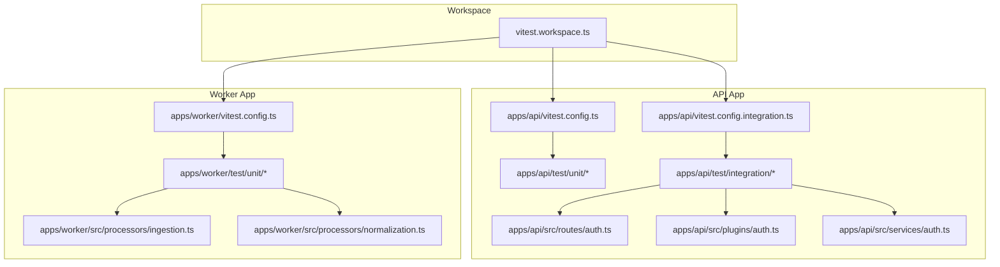
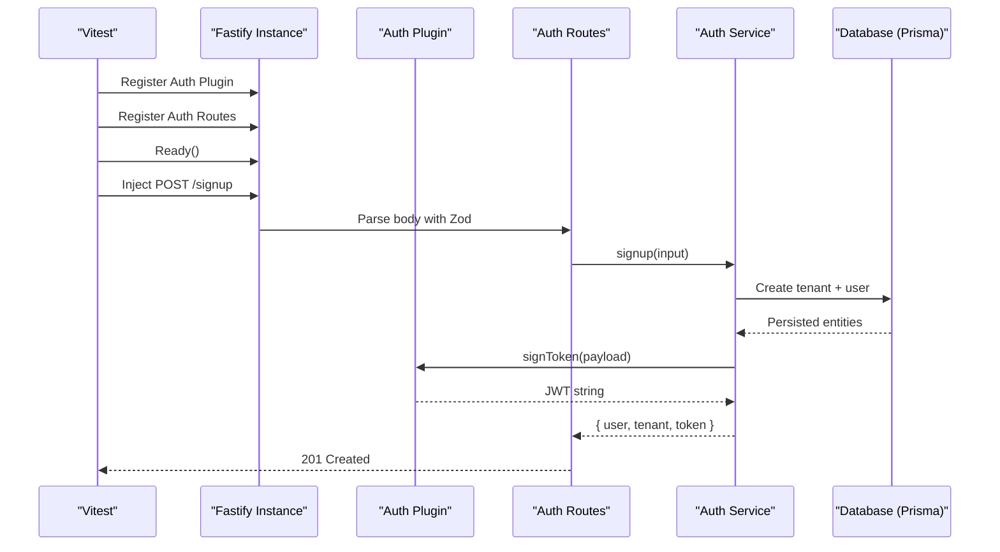
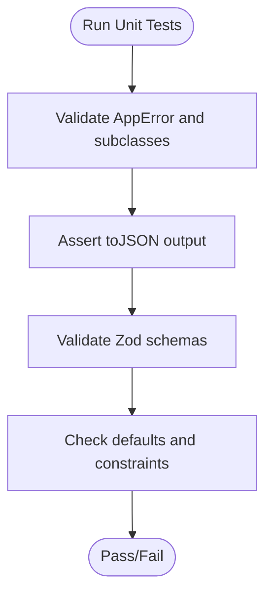
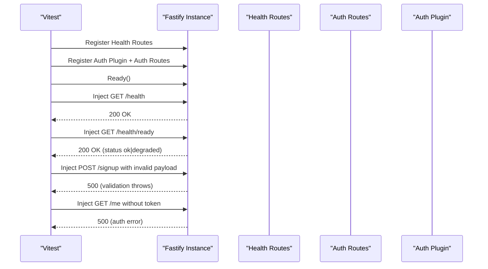
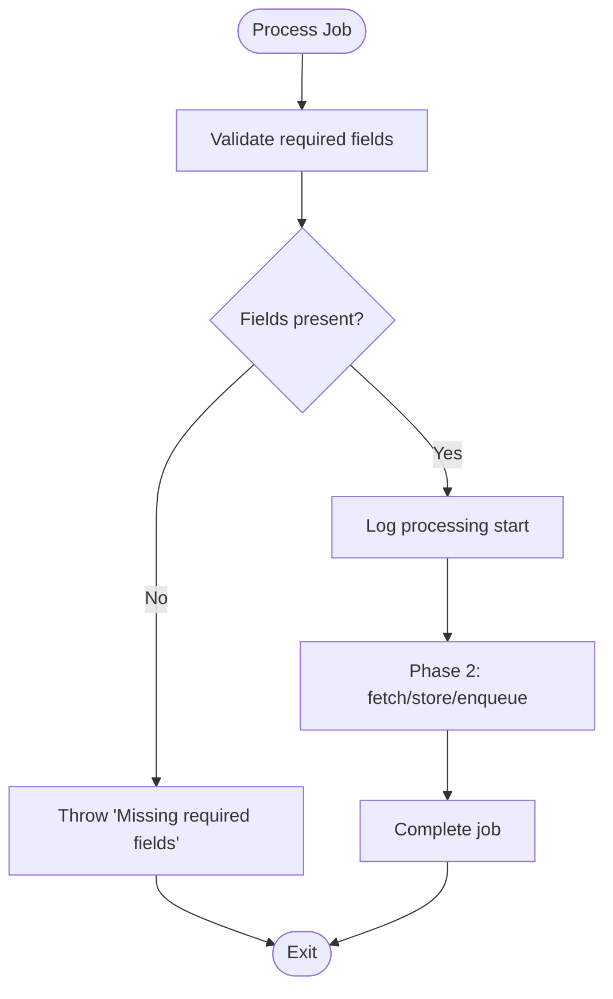
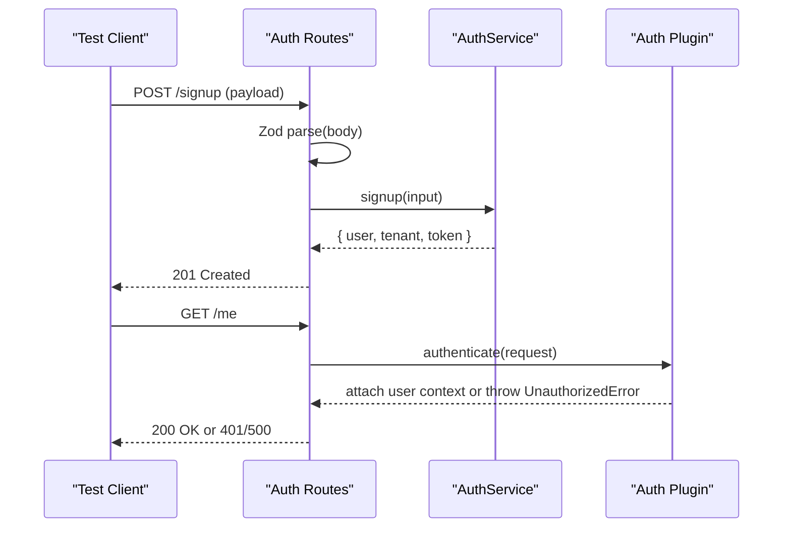
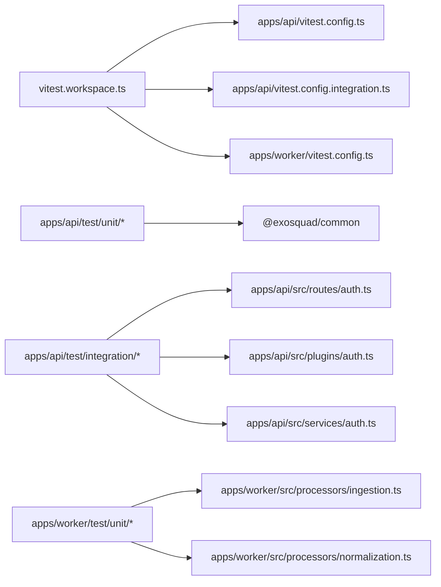

# Testing Strategy

<cite>
**Referenced Files in This Document**
- [vitest.workspace.ts](file://vitest.workspace.ts)
- [apps/api/vitest.config.ts](file://apps/api/vitest.config.ts)
- [apps/api/vitest.config.integration.ts](file://apps/api/vitest.config.integration.ts)
- [apps/worker/vitest.config.ts](file://apps/worker/vitest.config.ts)
- [apps/api/test/integration/auth.test.ts](file://apps/api/test/integration/auth.test.ts)
- [apps/api/test/integration/health.test.ts](file://apps/api/test/integration/health.test.ts)
- [apps/api/test/unit/errors.test.ts](file://apps/api/test/unit/errors.test.ts)
- [apps/api/test/unit/validation.test.ts](file://apps/api/test/unit/validation.test.ts)
- [apps/worker/test/unit/ingestion.test.ts](file://apps/worker/test/unit/ingestion.test.ts)
- [apps/worker/test/unit/normalization.test.ts](file://apps/worker/test/unit/normalization.test.ts)
- [apps/api/src/routes/auth.ts](file://apps/api/src/routes/auth.ts)
- [apps/api/src/plugins/auth.ts](file://apps/api/src/plugins/auth.ts)
- [apps/api/src/services/auth.ts](file://apps/api/src/services/auth.ts)
- [apps/worker/src/processors/ingestion.ts](file://apps/worker/src/processors/ingestion.ts)
- [apps/worker/src/processors/normalization.ts](file://apps/worker/src/processors/normalization.ts)
- [packages/common/package.json](file://packages/common/package.json)
</cite>

## Table of Contents
1. [Introduction](#introduction)
2. [Project Structure](#project-structure)
3. [Core Components](#core-components)
4. [Architecture Overview](#architecture-overview)
5. [Detailed Component Analysis](#detailed-component-analysis)
6. [Dependency Analysis](#dependency-analysis)
7. [Performance Considerations](#performance-considerations)
8. [Troubleshooting Guide](#troubleshooting-guide)
9. [Conclusion](#conclusion)

## Introduction
This document explains Exosquad’s testing strategy using Vitest across the API and Worker applications. It covers unit testing for individual components and functions, integration testing for API endpoints, patterns for mocking external dependencies, test data management, environment setup, and guidance for CI/CD integration. It also includes examples for authentication flows, job processing, error scenarios, coverage requirements, performance considerations, and debugging techniques.

## Project Structure
Exosquad uses a monorepo with separate apps (api, worker) and shared packages. Tests are organized per app:
- Unit tests under each app’s test/unit directory
- Integration tests under apps/api/test/integration
- A workspace-level Vitest configuration defines global defaults and coverage settings
- Per-app Vitest configs scope include paths and timeouts

**Diagram sources**
- [vitest.workspace.ts:1-21](file://vitest.workspace.ts#L1-L21)
- [apps/api/vitest.config.ts:1-10](file://apps/api/vitest.config.ts#L1-L10)
- [apps/api/vitest.config.integration.ts:1-11](file://apps/api/vitest.config.integration.ts#L1-L11)
- [apps/worker/vitest.config.ts:1-10](file://apps/worker/vitest.config.ts#L1-L10)
- [apps/api/test/integration/auth.test.ts:1-49](file://apps/api/test/integration/auth.test.ts#L1-L49)
- [apps/api/test/integration/health.test.ts:1-45](file://apps/api/test/integration/health.test.ts#L1-L45)
- [apps/api/test/unit/errors.test.ts:1-140](file://apps/api/test/unit/errors.test.ts#L1-L140)
- [apps/api/test/unit/validation.test.ts:1-54](file://apps/api/test/unit/validation.test.ts#L1-L54)
- [apps/worker/test/unit/ingestion.test.ts:1-49](file://apps/worker/test/unit/ingestion.test.ts#L1-L49)
- [apps/worker/test/unit/normalization.test.ts:1-57](file://apps/worker/test/unit/normalization.test.ts#L1-L57)
- [apps/api/src/routes/auth.ts:1-68](file://apps/api/src/routes/auth.ts#L1-L68)
- [apps/api/src/plugins/auth.ts:1-101](file://apps/api/src/plugins/auth.ts#L1-L101)
- [apps/api/src/services/auth.ts:1-190](file://apps/api/src/services/auth.ts#L1-L190)
- [apps/worker/src/processors/ingestion.ts:1-55](file://apps/worker/src/processors/ingestion.ts#L1-L55)
- [apps/worker/src/processors/normalization.ts:1-58](file://apps/worker/src/processors/normalization.ts#L1-L58)

**Section sources**
- [vitest.workspace.ts:1-21](file://vitest.workspace.ts#L1-L21)
- [apps/api/vitest.config.ts:1-10](file://apps/api/vitest.config.ts#L1-L10)
- [apps/api/vitest.config.integration.ts:1-11](file://apps/api/vitest.config.integration.ts#L1-L11)
- [apps/worker/vitest.config.ts:1-10](file://apps/worker/vitest.config.ts#L1-L10)

## Core Components
- Test runner and workspace: Vitest is configured at the workspace level to enable globals, Node environment, and coverage reporting.
- API unit tests: Validate shared Zod schemas and application error classes from the common package.
- API integration tests: Spin up Fastify instances, register plugins and routes, and assert HTTP responses.
- Worker unit tests: Validate job processors’ input validation and expected behavior using mock BullMQ jobs.

Key responsibilities:
- Validation layer: Zod schemas ensure request payloads conform to expected structures.
- Error layer: Centralized error types provide consistent status codes and messages.
- Authentication layer: JWT verification and signing via jose; Fastify plugin provides preHandler-based auth guard.
- Job processing: Ingestion and normalization processors validate inputs and log progress.

**Section sources**
- [apps/api/test/unit/errors.test.ts:1-140](file://apps/api/test/unit/errors.test.ts#L1-L140)
- [apps/api/test/unit/validation.test.ts:1-54](file://apps/api/test/unit/validation.test.ts#L1-L54)
- [apps/api/test/integration/auth.test.ts:1-49](file://apps/api/test/integration/auth.test.ts#L1-L49)
- [apps/api/test/integration/health.test.ts:1-45](file://apps/api/test/integration/health.test.ts#L1-L45)
- [apps/worker/test/unit/ingestion.test.ts:1-49](file://apps/worker/test/unit/ingestion.test.ts#L1-L49)
- [apps/worker/test/unit/normalization.test.ts:1-57](file://apps/worker/test/unit/normalization.test.ts#L1-L57)

## Architecture Overview
The testing architecture aligns with the runtime architecture:
- API integration tests use Fastify’s inject client to simulate HTTP requests against registered routes and plugins.
- Worker unit tests construct minimal BullMQ Job objects to exercise processor logic without a real queue.
- Shared utilities (Zod schemas, error classes) live in the common package and are tested independently.

**Diagram sources**
- [apps/api/test/integration/auth.test.ts:1-49](file://apps/api/test/integration/auth.test.ts#L1-L49)
- [apps/api/src/routes/auth.ts:1-68](file://apps/api/src/routes/auth.ts#L1-L68)
- [apps/api/src/plugins/auth.ts:1-101](file://apps/api/src/plugins/auth.ts#L1-L101)
- [apps/api/src/services/auth.ts:1-190](file://apps/api/src/services/auth.ts#L1-L190)

## Detailed Component Analysis

### API Unit Tests: Errors and Validation
- Error classes: Tests verify default and custom values, JSON serialization, inheritance, and specific error subclasses (not found, unauthorized, forbidden, conflict, validation, rate limit, source).
- Validation schemas: Tests cover pagination, sorting, and ID parameter parsing, including defaults, boundary checks, and invalid inputs.

**Diagram sources**
- [apps/api/test/unit/errors.test.ts:1-140](file://apps/api/test/unit/errors.test.ts#L1-L140)
- [apps/api/test/unit/validation.test.ts:1-54](file://apps/api/test/unit/validation.test.ts#L1-L54)

**Section sources**
- [apps/api/test/unit/errors.test.ts:1-140](file://apps/api/test/unit/errors.test.ts#L1-L140)
- [apps/api/test/unit/validation.test.ts:1-54](file://apps/api/test/unit/validation.test.ts#L1-L54)
- [packages/common/package.json:1-19](file://packages/common/package.json#L1-L19)

### API Integration Tests: Health and Auth
- Health endpoints: Assert service status and dependency readiness.
- Auth endpoints: Validate input errors and authentication requirements by injecting HTTP requests into a Fastify instance with the auth plugin and routes registered.

**Diagram sources**
- [apps/api/test/integration/health.test.ts:1-45](file://apps/api/test/integration/health.test.ts#L1-L45)
- [apps/api/test/integration/auth.test.ts:1-49](file://apps/api/test/integration/auth.test.ts#L1-L49)
- [apps/api/src/routes/auth.ts:1-68](file://apps/api/src/routes/auth.ts#L1-L68)
- [apps/api/src/plugins/auth.ts:1-101](file://apps/api/src/plugins/auth.ts#L1-L101)

**Section sources**
- [apps/api/test/integration/health.test.ts:1-45](file://apps/api/test/integration/health.test.ts#L1-L45)
- [apps/api/test/integration/auth.test.ts:1-49](file://apps/api/test/integration/auth.test.ts#L1-L49)

### Worker Unit Tests: Ingestion and Normalization
- Ingestion processor: Validates required fields (sourceId, tenantId), rejects missing or empty data, and completes successfully when valid.
- Normalization processor: Validates required fields (observationId, sourceId, tenantId), rejects missing combinations, and completes successfully when valid.

**Diagram sources**
- [apps/worker/src/processors/ingestion.ts:1-55](file://apps/worker/src/processors/ingestion.ts#L1-L55)
- [apps/worker/src/processors/normalization.ts:1-58](file://apps/worker/src/processors/normalization.ts#L1-L58)
- [apps/worker/test/unit/ingestion.test.ts:1-49](file://apps/worker/test/unit/ingestion.test.ts#L1-L49)
- [apps/worker/test/unit/normalization.test.ts:1-57](file://apps/worker/test/unit/normalization.test.ts#L1-L57)

**Section sources**
- [apps/worker/test/unit/ingestion.test.ts:1-49](file://apps/worker/test/unit/ingestion.test.ts#L1-L49)
- [apps/worker/test/unit/normalization.test.ts:1-57](file://apps/worker/test/unit/normalization.test.ts#L1-L57)
- [apps/worker/src/processors/ingestion.ts:1-55](file://apps/worker/src/processors/ingestion.ts#L1-L55)
- [apps/worker/src/processors/normalization.ts:1-58](file://apps/worker/src/processors/normalization.ts#L1-L58)

### Authentication Flow Testing
- Route-level validation: Zod schemas enforce email, password length, and tenant slug format before calling the service.
- Service-level logic: AuthService handles tenant/user creation, password hashing, and JWT issuance.
- Plugin-level auth guard: The auth plugin verifies Bearer tokens and attaches user context to requests.

**Diagram sources**
- [apps/api/src/routes/auth.ts:1-68](file://apps/api/src/routes/auth.ts#L1-L68)
- [apps/api/src/services/auth.ts:1-190](file://apps/api/src/services/auth.ts#L1-L190)
- [apps/api/src/plugins/auth.ts:1-101](file://apps/api/src/plugins/auth.ts#L1-L101)
- [apps/api/test/integration/auth.test.ts:1-49](file://apps/api/test/integration/auth.test.ts#L1-L49)

**Section sources**
- [apps/api/src/routes/auth.ts:1-68](file://apps/api/src/routes/auth.ts#L1-L68)
- [apps/api/src/services/auth.ts:1-190](file://apps/api/src/services/auth.ts#L1-L190)
- [apps/api/src/plugins/auth.ts:1-101](file://apps/api/src/plugins/auth.ts#L1-L101)
- [apps/api/test/integration/auth.test.ts:1-49](file://apps/api/test/integration/auth.test.ts#L1-L49)

### Test Data Management
- Mock jobs: Worker tests create minimal BullMQ Job objects with required fields to exercise processors.
- Schema fixtures: Validation tests pass both valid and invalid payloads to confirm schema behavior and defaults.
- Error fixtures: Error tests instantiate various error types with different parameters to assert status codes, codes, and serialized shapes.

Best practices:
- Keep fixtures close to the test file they exercise.
- Use small, focused fixtures that represent one scenario at a time.
- Avoid coupling fixtures to implementation details; prefer stable domain attributes (e.g., tenantId, sourceId).

**Section sources**
- [apps/worker/test/unit/ingestion.test.ts:1-49](file://apps/worker/test/unit/ingestion.test.ts#L1-L49)
- [apps/worker/test/unit/normalization.test.ts:1-57](file://apps/worker/test/unit/normalization.test.ts#L1-L57)
- [apps/api/test/unit/validation.test.ts:1-54](file://apps/api/test/unit/validation.test.ts#L1-L54)
- [apps/api/test/unit/errors.test.ts:1-140](file://apps/api/test/unit/errors.test.ts#L1-L140)

### Test Environment Setup
- Workspace config: Enables globals, Node environment, and coverage reporters (text, json, html) with v8 provider.
- API unit config: Includes only unit tests under apps/api/test/unit.
- API integration config: Includes only integration tests under apps/api/test/integration and sets a longer timeout.
- Worker unit config: Includes only unit tests under apps/worker/test/unit.

Execution tips:
- Run all tests via the workspace config.
- Run API unit tests with the API-specific config.
- Run API integration tests with the integration-specific config.
- Run Worker unit tests with the Worker-specific config.

**Section sources**
- [vitest.workspace.ts:1-21](file://vitest.workspace.ts#L1-L21)
- [apps/api/vitest.config.ts:1-10](file://apps/api/vitest.config.ts#L1-L10)
- [apps/api/vitest.config.integration.ts:1-11](file://apps/api/vitest.config.integration.ts#L1-L11)
- [apps/worker/vitest.config.ts:1-10](file://apps/worker/vitest.config.ts#L1-L10)

### External Service Mocking Patterns
- Database interactions: The auth service uses Prisma directly. For unit tests, consider mocking prisma methods to avoid real database calls.
- External HTTP services: The ingestion processor stubs out fetching; when implementing Phase 2, mock HTTP clients to isolate network failures and latency.
- Queue operations: The normalization processor will enqueue downstream jobs; mock queue manager methods to assert enqueues without a real broker.

Guidelines:
- Prefer function/method mocks over full module replacements where possible.
- Reset mocks between tests to prevent state leakage.
- Verify not only success paths but also failure paths (timeouts, partial responses).

[No sources needed since this section provides general guidance]

### CI/CD Integration
Recommended steps:
- Install dependencies and build shared packages before running tests.
- Run unit tests first for fast feedback.
- Run integration tests with appropriate timeouts and isolated environments.
- Generate coverage reports and upload artifacts.
- Fail the pipeline if coverage thresholds are not met.

Example commands:
- Build shared packages: pnpm --filter @exosquad/common build
- Run API unit tests: pnpm --filter api test
- Run API integration tests: pnpm --filter api test:integration
- Run Worker unit tests: pnpm --filter worker test
- Generate coverage: vitest run --coverage

[No sources needed since this section provides general guidance]

## Dependency Analysis
The following diagram shows how tests depend on application code and shared packages.

**Diagram sources**
- [vitest.workspace.ts:1-21](file://vitest.workspace.ts#L1-L21)
- [apps/api/vitest.config.ts:1-10](file://apps/api/vitest.config.ts#L1-L10)
- [apps/api/vitest.config.integration.ts:1-11](file://apps/api/vitest.config.integration.ts#L1-L11)
- [apps/worker/vitest.config.ts:1-10](file://apps/worker/vitest.config.ts#L1-L10)
- [apps/api/test/unit/errors.test.ts:1-140](file://apps/api/test/unit/errors.test.ts#L1-L140)
- [apps/api/test/unit/validation.test.ts:1-54](file://apps/api/test/unit/validation.test.ts#L1-L54)
- [apps/api/test/integration/auth.test.ts:1-49](file://apps/api/test/integration/auth.test.ts#L1-L49)
- [apps/api/test/integration/health.test.ts:1-45](file://apps/api/test/integration/health.test.ts#L1-L45)
- [apps/worker/test/unit/ingestion.test.ts:1-49](file://apps/worker/test/unit/ingestion.test.ts#L1-L49)
- [apps/worker/test/unit/normalization.test.ts:1-57](file://apps/worker/test/unit/normalization.test.ts#L1-L57)
- [apps/api/src/routes/auth.ts:1-68](file://apps/api/src/routes/auth.ts#L1-L68)
- [apps/api/src/plugins/auth.ts:1-101](file://apps/api/src/plugins/auth.ts#L1-L101)
- [apps/api/src/services/auth.ts:1-190](file://apps/api/src/services/auth.ts#L1-L190)
- [apps/worker/src/processors/ingestion.ts:1-55](file://apps/worker/src/processors/ingestion.ts#L1-L55)
- [apps/worker/src/processors/normalization.ts:1-58](file://apps/worker/src/processors/normalization.ts#L1-L58)

**Section sources**
- [vitest.workspace.ts:1-21](file://vitest.workspace.ts#L1-L21)
- [apps/api/vitest.config.ts:1-10](file://apps/api/vitest.config.ts#L1-L10)
- [apps/api/vitest.config.integration.ts:1-11](file://apps/api/vitest.config.integration.ts#L1-L11)
- [apps/worker/vitest.config.ts:1-10](file://apps/worker/vitest.config.ts#L1-L10)

## Performance Considerations
- Keep unit tests fast and deterministic; avoid I/O and network calls.
- Use mocks for expensive operations (bcrypt hashing, DB queries, HTTP calls).
- For integration tests, set appropriate timeouts and minimize startup overhead.
- Consider parallelizing independent test suites (unit vs integration) in CI.
- Monitor coverage collection overhead; exclude non-test files and generated code.

[No sources needed since this section provides general guidance]

## Troubleshooting Guide
Common issues and resolutions:
- Missing required fields in jobs: Ensure test fixtures include all required keys (e.g., sourceId, tenantId, observationId).
- Validation errors: Confirm payloads match Zod schemas; check defaults and allowed ranges.
- Authentication failures: Provide a valid Bearer token in protected route tests; verify token signing/verification configuration.
- Slow integration tests: Increase testTimeout selectively; isolate heavy setup in beforeAll hooks.
- Coverage gaps: Add tests for edge cases and error branches; ensure mocks do not bypass production logic.

Debugging techniques:
- Use Vitest’s watch mode to iterate quickly on failing tests.
- Print structured logs from processors to understand job lifecycle.
- Isolate failing tests by running them individually with their config.
- Inspect response payloads and status codes in integration tests.

**Section sources**
- [apps/worker/test/unit/ingestion.test.ts:1-49](file://apps/worker/test/unit/ingestion.test.ts#L1-L49)
- [apps/worker/test/unit/normalization.test.ts:1-57](file://apps/worker/test/unit/normalization.test.ts#L1-L57)
- [apps/api/test/unit/validation.test.ts:1-54](file://apps/api/test/unit/validation.test.ts#L1-L54)
- [apps/api/test/integration/auth.test.ts:1-49](file://apps/api/test/integration/auth.test.ts#L1-L49)

## Conclusion
Exosquad’s testing strategy leverages Vitest for both unit and integration testing across the API and Worker apps. Unit tests focus on validation and error handling, while integration tests validate endpoint behavior with Fastify and the auth plugin. Worker tests ensure robust job validation and logging. With clear configuration boundaries, targeted mocks, and structured fixtures, the suite remains maintainable and scalable. Extending coverage to database and external service layers, adding performance tests, and integrating these workflows into CI will further strengthen reliability and delivery velocity.